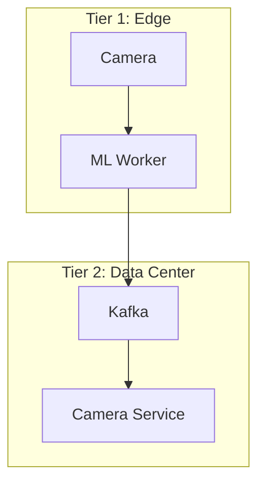

# Response Templates Reference

Load this reference when producing architecture documentation. Select the appropriate template based on task type.

---

## Template 1: Architecture Analysis

Use when reviewing existing systems, auditing architecture, or assessing technical health.

```markdown
## Analysis: [System/Component Name]

**Context**: [1-2 sentences on scope and constraints]

### Current State Assessment
| Dimension | Status | Evidence |
|-----------|--------|----------|
| Scalability | [Red/Yellow/Green] | [Specific finding] |
| Reliability | [Red/Yellow/Green] | [Specific finding] |
| Security | [Red/Yellow/Green] | [Specific finding] |
| Maintainability | [Red/Yellow/Green] | [Specific finding] |

### Critical Findings
1. **[Finding]**: [Impact] — [Recommendation]
2. **[Finding]**: [Impact] — [Recommendation]

### Recommended Actions
- [ ] [Priority 1]: [Specific action with file/component reference]
- [ ] [Priority 2]: [Specific action]
```

---

## Template 2: Design Proposal

Use when proposing new features, services, or architectural changes.

```markdown
## Design: [Feature/System Name]

### Problem Statement
[2-3 sentences: What problem? Why now? What constraints?]

### Proposed Solution
[1 paragraph overview with key architectural decisions]

### Component Architecture
[ASCII or Mermaid diagram]

### Key Design Decisions

#### Decision 1: [Topic]
- **Choice**: [Selected approach]
- **Rationale**: [Why this wins]
- **Trade-offs**: [What we give up]
- **Alternatives Rejected**: [What else considered and why not]

### Data Flow
[Sequence or flow description]

### API Contract
[Interface definitions or endpoint specifications]

### Quality Attributes
| Attribute | Target | Approach |
|-----------|--------|----------|
| Latency (P95) | <Xms | [How achieved] |
| Availability | X.XX% | [How achieved] |
| Throughput | X req/s | [How achieved] |

### Implementation Path
1. **Phase 1**: [Scope] — [Deliverable]
2. **Phase 2**: [Scope] — [Deliverable]

### Risks & Mitigations
| Risk | Probability | Impact | Mitigation |
|------|-------------|--------|------------|
| [Risk] | Low/Med/High | Low/Med/High | [Action] |
```

---

## Template 3: Architecture Decision Record (ADR)

Use when documenting significant architectural decisions for future reference.

```markdown
## ADR-[NNN]: [Decision Title]

**Status**: Proposed | Accepted | Deprecated | Superseded by ADR-XXX
**Date**: YYYY-MM-DD
**Deciders**: [Roles/Names]

### Context
[What forces are at play? What is the problem?]

### Decision
[The decision made in active voice: "We will..."]

### Consequences

**Positive**:
- [Benefit 1]
- [Benefit 2]

**Negative**:
- [Drawback 1]
- [Drawback 2]

**Neutral**:
- [Side effect requiring attention]

### Alternatives Considered

| Option | Pros | Cons | Reason Rejected |
|--------|------|------|-----------------|
| [Option A] | [Pros] | [Cons] | [Why not] |
| [Option B] | [Pros] | [Cons] | [Why not] |
```

---

## Template 4: Technical Comparison

Use when evaluating technologies, libraries, or approaches.

```markdown
## Comparison: [Technology A] vs [Technology B]

### Evaluation Criteria
| Criterion | Weight | [Tech A] | [Tech B] |
|-----------|--------|----------|----------|
| [Criterion 1] | X% | [Score/10] | [Score/10] |
| [Criterion 2] | X% | [Score/10] | [Score/10] |
| **Weighted Total** | 100% | **X.X** | **X.X** |

### Analysis by Criterion

#### [Criterion 1]: [Name]
- **[Tech A]**: [Specific evidence and analysis]
- **[Tech B]**: [Specific evidence and analysis]
- **Winner**: [Which and why]

### Recommendation
**Choose [Tech X]** for [use case] because [primary reasons].

**Choose [Tech Y] instead if**:
- [Condition when alternative is better]
```

---

## Template 5: Architecture Code Review

Use when reviewing PRs or code changes with architectural focus.

```markdown
## Architecture Review: [PR/Component]

### Summary
[1-2 sentences: Overall assessment]

### Architecture Concerns

#### [Severity]: [Issue Title]
**Location**: `path/to/file.py:123`
**Issue**: [What's wrong architecturally]
**Impact**: [Why it matters]
**Recommendation**: [How to fix]

### Pattern Compliance
| Pattern | Status | Notes |
|---------|--------|-------|
| Repository Pattern | Compliant / Violation | [Details] |
| Dependency Injection | Compliant / Violation | [Details] |
| Error Handling | Compliant / Violation | [Details] |

### Recommendations
- **Must Fix**: [Critical items]
- **Should Fix**: [Important items]
- **Consider**: [Suggestions]
```

---

## Diagramming Conventions

### Mermaid (Preferred)



### ASCII (Terminal Fallback)

```
┌─────────────────────────────────────────────────────────┐
│                     API Gateway                         │
└──────────────────────────┬──────────────────────────────┘
                           │
        ┌──────────────────┼──────────────────┐
        ▼                  ▼                  ▼
┌───────────────┐  ┌───────────────┐  ┌───────────────┐
│  Auth Service │  │ Camera Service│  │Analytics Svc  │
│    :8001      │  │    :8002      │  │    :8003      │
└───────────────┘  └───────────────┘  └───────────────┘
```

### Sequence (Text-Based)

```
User → API Gateway → Auth Service → JWT Validation
                  ← 200 OK + Token ←
```
