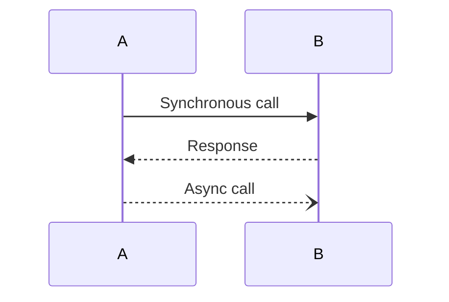
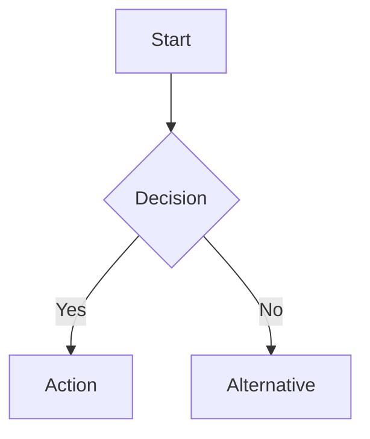
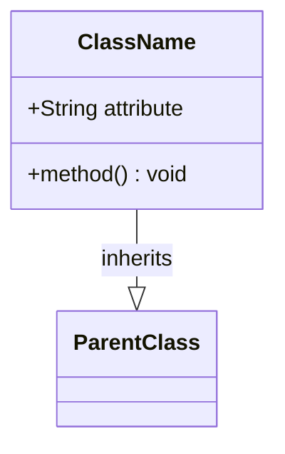

# Generate Diagram Skill

Create Mermaid diagrams from textual descriptions for architecture, flows, and data models.

## Quick Start

Use this skill when:
- User requests diagram creation (`/generate-diagram`)
- Documenting architecture in notes
- Visualizing workflows or data relationships

**Example**:
```
User: "Create a sequence diagram for user login flow"

AI generates:
sequenceDiagram
    actor User
    User->>Frontend: Enter credentials
    Frontend->>API: POST /auth/login
    API->>Database: Validate credentials
    Database-->>API: User record
    API-->>Frontend: JWT tokens
    Frontend-->>User: Redirect to dashboard
```

## Workflow

1. **Parse Description**
   - Identify diagram type from keywords:
     - Sequence: "flow", "interaction", "steps"
     - Class: "data model", "schema", "entities"
     - Flowchart: "decision", "process", "workflow"
     - ER: "relationships", "database", "tables"
     - Gantt: "timeline", "schedule", "milestones"

2. **Extract Entities and Relationships**
   - Identify actors/components/classes
   - Parse actions/dependencies/associations
   - Detect flow direction and decision points

3. **Generate Mermaid Syntax**
   - Use correct Mermaid diagram type
   - Format with proper indentation
   - Add labels and annotations
   - Include style customizations if requested

4. **Validate Output**
   - Check Mermaid syntax validity
   - Ensure diagram renders correctly
   - Add confidence tag based on completeness

## Output Format

```json
{
  "diagram_type": "sequence",
  "mermaid_code": "sequenceDiagram\n    actor User\n    ...",
  "confidence": "RECOMMENDED",
  "rationale": "Clear sequence flow with all actors and interactions specified",
  "preview_url": "/api/diagrams/preview?code=...",
  "suggestions": [
    "Add error handling paths",
    "Include retry logic in diagram"
  ]
}
```

## Examples

### Example 1: Sequence Diagram
**Input**:
```
Create a sequence diagram showing how a user creates an issue:
- User enters issue details in form
- Frontend validates input
- API creates issue in database
- AI context agent analyzes issue
- Frontend shows success message
```

**Output**:
```json
{
  "diagram_type": "sequence",
  "mermaid_code": "sequenceDiagram\n    actor User\n    participant Frontend\n    participant API\n    participant Database\n    participant AIAgent\n    \n    User->>Frontend: Enter issue details\n    Frontend->>Frontend: Validate input\n    Frontend->>API: POST /issues\n    API->>Database: INSERT issue\n    Database-->>API: issue_id\n    API->>AIAgent: Analyze issue context\n    AIAgent-->>API: Context data\n    API-->>Frontend: Issue created\n    Frontend-->>User: Show success message",
  "confidence": "RECOMMENDED"
}
```

### Example 2: Class Diagram
**Input**:
```
Data model for issues:
- Issue has id, title, description, priority
- Issue belongs to Project
- Issue can have many Comments
- User can be assigned to Issue
```

**Output**:
```json
{
  "diagram_type": "classDiagram",
  "mermaid_code": "classDiagram\n    class Issue {\n        +UUID id\n        +String title\n        +String description\n        +String priority\n        +UUID project_id\n        +UUID assignee_id\n    }\n    class Project {\n        +UUID id\n        +String name\n    }\n    class Comment {\n        +UUID id\n        +UUID issue_id\n        +String content\n    }\n    class User {\n        +UUID id\n        +String email\n        +String name\n    }\n    \n    Issue \"*\" --> \"1\" Project : belongs to\n    Issue \"1\" --> \"*\" Comment : has many\n    Issue \"*\" --> \"0..1\" User : assigned to",
  "confidence": "RECOMMENDED"
}
```

### Example 3: Flowchart
**Input**:
```
Approval workflow:
- AI suggests action
- If auto-execute, run immediately
- If requires approval, create approval request
- User approves or rejects
- If approved, execute action
- If rejected, notify user
```

**Output**:
```json
{
  "diagram_type": "flowchart",
  "mermaid_code": "flowchart TD\n    A[AI suggests action] --> B{Action type?}\n    B -->|Auto-execute| C[Run immediately]\n    B -->|Requires approval| D[Create approval request]\n    D --> E{User decision?}\n    E -->|Approved| F[Execute action]\n    E -->|Rejected| G[Notify user]\n    C --> H[Return result]\n    F --> H\n    G --> H",
  "confidence": "RECOMMENDED"
}
```

### Example 4: Entity Relationship Diagram
**Input**:
```
Database schema:
- Workspace has many Projects
- Project has many Issues
- Issue has many Comments
- User belongs to many Workspaces (workspace_members join table)
```

**Output**:
```json
{
  "diagram_type": "erDiagram",
  "mermaid_code": "erDiagram\n    WORKSPACE ||--o{ PROJECT : contains\n    PROJECT ||--o{ ISSUE : contains\n    ISSUE ||--o{ COMMENT : has\n    WORKSPACE ||--o{ WORKSPACE_MEMBER : has\n    USER ||--o{ WORKSPACE_MEMBER : joins\n    \n    WORKSPACE {\n        uuid id PK\n        string name\n        string slug\n    }\n    PROJECT {\n        uuid id PK\n        uuid workspace_id FK\n        string name\n    }\n    ISSUE {\n        uuid id PK\n        uuid project_id FK\n        string title\n        string priority\n    }\n    COMMENT {\n        uuid id PK\n        uuid issue_id FK\n        text content\n    }",
  "confidence": "RECOMMENDED"
}
```

### Example 5: Gantt Chart
**Input**:
```
Project timeline:
- Week 1-2: Database schema design
- Week 2-4: API development (starts after schema)
- Week 3-5: Frontend development (can overlap with API)
- Week 5-6: Integration testing
```

**Output**:
```json
{
  "diagram_type": "gantt",
  "mermaid_code": "gantt\n    title Project Timeline\n    dateFormat  YYYY-MM-DD\n    section Backend\n    Database schema    :done, db, 2024-01-01, 2w\n    API development    :active, api, after db, 3w\n    section Frontend\n    Frontend dev       :frontend, 2024-01-15, 3w\n    section Testing\n    Integration tests  :testing, after api, 2w",
  "confidence": "RECOMMENDED"
}
```

## Supported Diagram Types

| Type | Mermaid Syntax | Use Case |
|------|----------------|----------|
| **Sequence** | `sequenceDiagram` | API flows, interactions |
| **Class** | `classDiagram` | Data models, OOP structure |
| **Flowchart** | `flowchart TD/LR` | Decision trees, workflows |
| **ER Diagram** | `erDiagram` | Database schemas |
| **Gantt** | `gantt` | Project timelines |
| **State** | `stateDiagram-v2` | State machines |
| **Git Graph** | `gitGraph` | Git branching strategies |

## Mermaid Syntax Reference

### Sequence Diagram


### Flowchart


### Class Diagram


## Integration Points

- **DiagramGeneratorAgent**: Primary agent implementing this workflow
- **MCP Tools**: No tools required (pure text generation)
- **Validation**: Mermaid syntax validator in frontend
- **Storage**: Diagrams stored as note blocks (type: "diagram")

## References

- Design Decision: DD-012 (Multi-format diagrams)
- Design Decision: DD-048 (Confidence Tagging)
- Agent: `backend/src/pilot_space/ai/agents/diagram_generator_agent.py`
- Mermaid Docs: https://mermaid.js.org/
