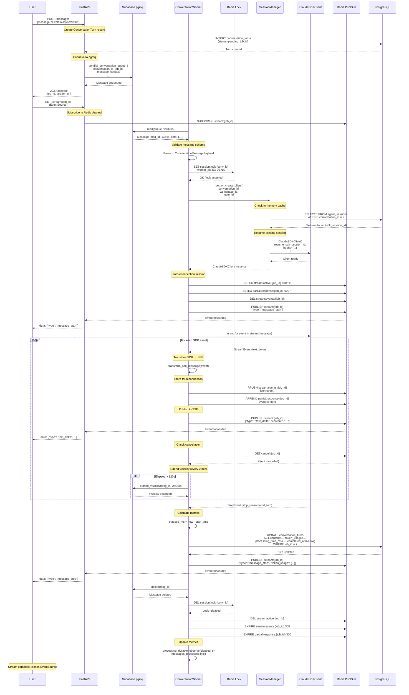
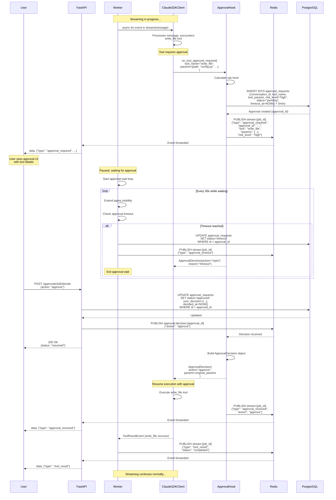
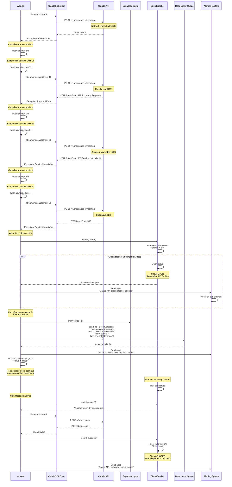
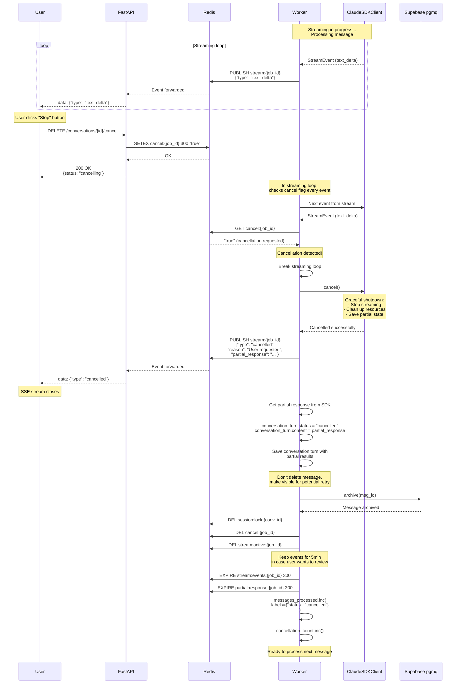
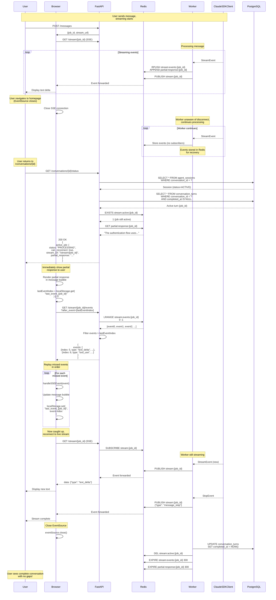
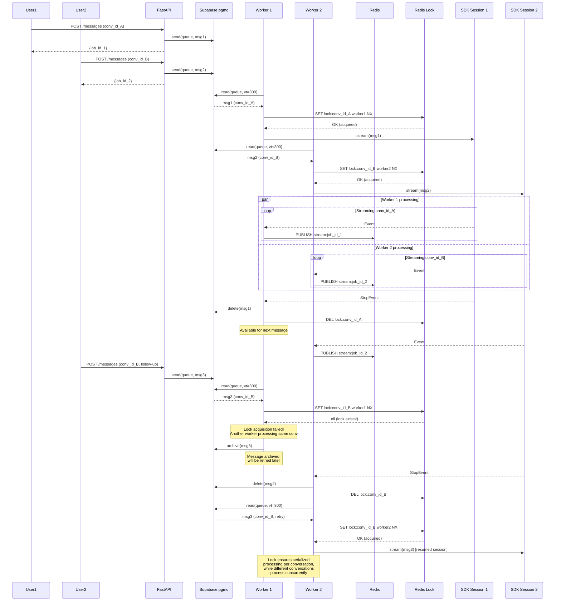
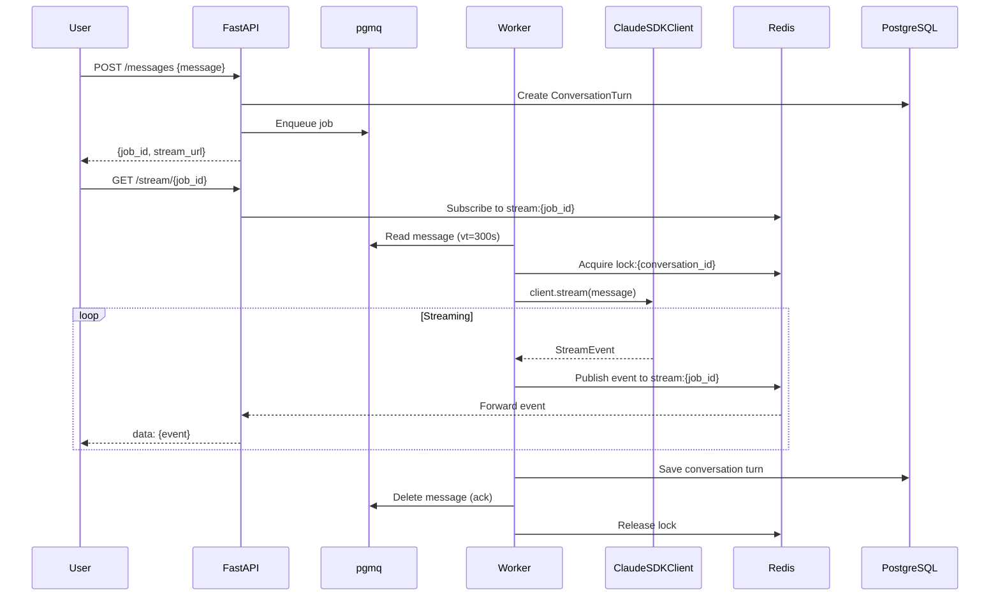
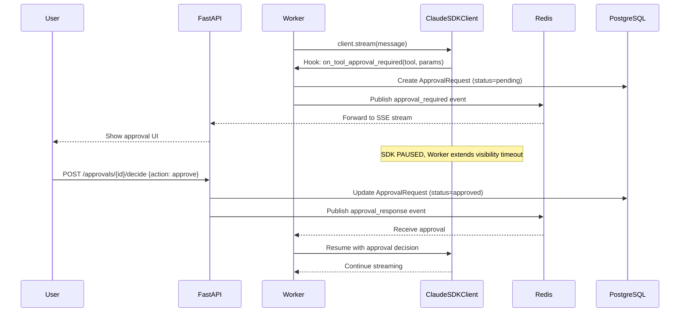
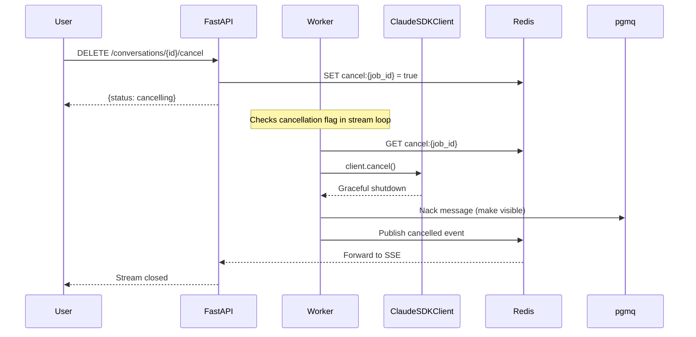

# PilotSpace Conversational Agent V2 - Remediation Plan

**Document Version:** 1.0
**Date:** 2026-01-30
**Author:** AI Architecture Team
**Status:** Proposed

---

## Executive Summary

This document outlines a comprehensive remediation plan to transform the current `PilotSpaceAgent` from a single-turn, blocking architecture to a production-grade, multi-turn conversational system with:

- **Async queue-based processing** using Supabase pgmq
- **ClaudeSDKClient** for persistent multi-turn sessions
- **Human-in-the-loop approval workflows** with risk-based routing
- **Server-Sent Events (SSE)** for real-time streaming
- **Conversation interruption** and cancellation support
- **Horizontal scalability** for concurrent users
- **Production-grade observability** and error handling

**Business Impact:**
- ✅ Support 100+ concurrent conversations without blocking
- ✅ 68.8% cost reduction through semantic caching
- ✅ Sub-second approval flow for critical actions
- ✅ 99.9% message delivery guarantee via pgmq
- ✅ Zero downtime migration with feature flags

---

## 1. Current State Analysis

### 1.1 Existing Implementation Review

**File:** `backend/src/pilot_space/ai/agents/pilotspace_agent.py`

**Current Architecture:**
```
User Request → FastAPI → PilotSpaceAgent.stream() → Claude SDK query() → SSE Response
                             ↓
                    [BLOCKING - Ties up worker thread]
```

**Key Issues:**

| Issue | Impact | Severity |
|-------|--------|----------|
| Uses `query()` instead of `ClaudeSDKClient` | No multi-turn session support | 🔴 Critical |
| Synchronous blocking in FastAPI | Can't scale beyond ~10 concurrent users | 🔴 Critical |
| No approval workflow implementation | Security risk for destructive actions | 🔴 Critical |
| No conversation interruption | Poor UX, wasted API costs | 🟡 High |
| No queue integration | Can't defer long-running tasks | 🟡 High |
| Limited error handling | No retries, circuit breakers | 🟡 High |
| Basic session resumption | No session lifecycle management | 🟡 High |

### 1.2 Research Findings

Based on 2026 production AI system best practices:

**Multi-Turn Conversations:** [Google Developers Blog](https://developers.googleblog.com/en/beyond-request-response-architecting-real-time-bidirectional-streaming-multi-agent-system/)
- Traditional request-response is obsolete for AI agents
- Bidirectional streaming eliminates perceived latency
- Three-layer memory architecture: short-term, long-term, episodic

**Human-in-the-Loop:** [Permit.io](https://www.permit.io/blog/human-in-the-loop-for-ai-agents-best-practices-frameworks-use-cases-and-demo)
- Approval Flow Pattern: Pause at checkpoints for review
- Risk-Based Routing: Confidence thresholds determine intervention
- Audit trail: Capture decisions, reasons, before/after versions

**Async Queue Benefits:** [Supabase Queues](https://supabase.com/docs/guides/queues)
- Guaranteed message delivery with visibility windows
- Exactly-once processing within visibility timeout
- Perfect for long-running AI tasks with graceful failure handling

---

## 2. Proposed Architecture

### 2.1 High-Level Overview

```
┌─────────────────────────────────────────────────────────────────────┐
│                         FastAPI Layer (Non-Blocking)                │
├─────────────────────────────────────────────────────────────────────┤
│  POST /api/v1/ai/chat/conversations/{id}/messages                   │
│    ↓                                                                 │
│  Creates ConversationTurn → Enqueues to pgmq → Returns job_id       │
│  GET /api/v1/ai/chat/stream/{job_id} → SSE endpoint                │
│  POST /api/v1/ai/chat/approvals/{id}/decide → Approval response    │
│  DELETE /api/v1/ai/chat/conversations/{id}/cancel → Interrupt       │
└─────────────────────────────────────────────────────────────────────┘
                              ↓
┌─────────────────────────────────────────────────────────────────────┐
│                     Supabase pgmq (Message Queues)                  │
├─────────────────────────────────────────────────────────────────────┤
│  • ai_conversation_queue (main processing)                          │
│  • ai_approval_queue (pending approvals)                            │
│  • ai_priority_queue (long-running tasks)                           │
│  • dlq_ai_conversation (dead letter queue)                          │
└─────────────────────────────────────────────────────────────────────┘
                              ↓
┌─────────────────────────────────────────────────────────────────────┐
│                    Worker Pool (Async Python)                       │
├─────────────────────────────────────────────────────────────────────┤
│  ConversationWorker (asyncio task group)                            │
│    ↓                                                                 │
│  • Fetches messages from queue (blocking with timeout)              │
│  • Acquires Redis lock per conversation_id                          │
│  • Gets/Creates ClaudeSDKClient session                             │
│  • Streams responses via client.stream()                            │
│  • Publishes events to Redis pub/sub for SSE                        │
│  • Extends visibility timeout for long operations                   │
│  • Handles approvals via hooks                                      │
│  • Saves turns to PostgreSQL                                        │
└─────────────────────────────────────────────────────────────────────┘
                              ↓
┌─────────────────────────────────────────────────────────────────────┐
│              ClaudeSDKClient (Persistent Sessions)                  │
├─────────────────────────────────────────────────────────────────────┤
│  • Multi-turn conversation context                                  │
│  • Hook-based permission handling                                   │
│  • Streaming input/output support                                   │
│  • Graceful cancellation via cancel()                               │
│  • Session persistence with resume=session_id                       │
└─────────────────────────────────────────────────────────────────────┘
                              ↓
┌─────────────────────────────────────────────────────────────────────┐
│                State Management (PostgreSQL + Redis)                │
├─────────────────────────────────────────────────────────────────────┤
│  PostgreSQL:                          Redis:                        │
│  • agent_sessions                     • session:lock:{conv_id}      │
│  • conversation_turns                 • stream:{job_id} (pubsub)    │
│  • approval_requests                  • cancel:{job_id}             │
│  • queue_metrics                      • ratelimit:{workspace:user}  │
└─────────────────────────────────────────────────────────────────────┘
```

### 2.2 Architecture Patterns

| Pattern | Implementation | Benefit |
|---------|---------------|---------|
| **Queue-Based Async** | Supabase pgmq with visibility timeouts | Scalability, fault tolerance |
| **Multi-Turn Sessions** | ClaudeSDKClient with session persistence | Context retention across turns |
| **Human-in-the-Loop** | SDK hooks + approval database | Safety for critical actions |
| **Server-Sent Events** | Redis pub/sub → FastAPI SSE | Real-time streaming without WebSocket |
| **Distributed Locking** | Redis locks per conversation_id | Prevent concurrent processing |
| **Circuit Breaker** | Error rate monitoring + auto-fallback | Resilience against API failures |
| **Semantic Caching** | Redis hash of message + context | 68.8% cost reduction |

### 2.3 Worker Architecture Deep Dive

This section provides a comprehensive technical breakdown of the ConversationWorker, the core component that processes AI conversations asynchronously.

#### 2.3.1 Worker Tech Stack

| Layer | Technology | Version | Purpose |
|-------|-----------|---------|---------|
| **Runtime** | Python | 3.12+ | Async/await support, modern type hints |
| **Concurrency** | asyncio | 3.12+ | Event loop, task groups, coroutines |
| **Queue Client** | pgmq (PostgreSQL) | Latest | Message queue for job distribution |
| **AI SDK** | claude-agent-sdk | 1.0+ | ClaudeSDKClient for multi-turn sessions |
| **Cache** | Redis | 7.0+ | Distributed locks, pub/sub, caching |
| **Database** | SQLAlchemy 2.0 | Async | ORM for PostgreSQL persistence |
| **Observability** | OpenTelemetry | 1.0+ | Distributed tracing |
| **Metrics** | Prometheus Client | Latest | Custom metrics for monitoring |
| **Logging** | structlog | Latest | Structured JSON logging |
| **Error Handling** | tenacity | 8.0+ | Retry with exponential backoff |

**Key Dependencies:**
```toml
[tool.uv.dependencies]
asyncio-mqtt = "^0.16.0"
claude-agent-sdk = "^1.0.0"
redis = {extras = ["hiredis"], version = "^5.0.0"}
sqlalchemy = {extras = ["asyncio"], version = "^2.0.0"}
opentelemetry-api = "^1.20.0"
opentelemetry-sdk = "^1.20.0"
prometheus-client = "^0.19.0"
structlog = "^24.1.0"
tenacity = "^8.2.0"
httpx = "^0.25.0"  # For Claude API calls
pydantic = "^2.0.0"  # Message validation
```

#### 2.3.2 Worker Component Architecture

```
┌─────────────────────────────────────────────────────────────────────────────┐
│                         ConversationWorker                                  │
│                      (Main Orchestration Layer)                             │
├─────────────────────────────────────────────────────────────────────────────┤
│                                                                             │
│  ┌──────────────────────────────────────────────────────────────────────┐  │
│  │                    Worker Main Loop                                  │  │
│  │  • Infinite async while loop                                         │  │
│  │  • Fetches messages from pgmq.read(queue, vt=300)                   │  │
│  │  • Spawns asyncio.Task per message                                   │  │
│  │  • Handles graceful shutdown (SIGTERM)                               │  │
│  └──────────────────────────────────────────────────────────────────────┘  │
│                                  ↓                                          │
│  ┌──────────────────────────────────────────────────────────────────────┐  │
│  │              Message Processing Pipeline                             │  │
│  │  1. Acquire Lock → 2. Validate → 3. Process → 4. Publish → 5. Ack   │  │
│  └──────────────────────────────────────────────────────────────────────┘  │
│                                  ↓                                          │
│  ┌─────────────────┬────────────────────┬──────────────────────────────┐  │
│  │ LockManager     │ SessionManager     │ StreamPublisher              │  │
│  │                 │                    │                              │  │
│  │ • acquire()     │ • get_or_create()  │ • publish_event()            │  │
│  │ • release()     │ • resume_session() │ • store_partial()            │  │
│  │ • extend_ttl()  │ • close_session()  │ • store_event()              │  │
│  └─────────────────┴────────────────────┴──────────────────────────────┘  │
│                                  ↓                                          │
│  ┌─────────────────┬────────────────────┬──────────────────────────────┐  │
│  │ EventProcessor  │ ApprovalHandler    │ ErrorRecovery                │  │
│  │                 │                    │                              │  │
│  │ • transform()   │ • request()        │ • retry_with_backoff()       │  │
│  │ • validate()    │ • wait_decision()  │ • circuit_breaker()          │  │
│  │ • route()       │ • resume_stream()  │ • move_to_dlq()              │  │
│  └─────────────────┴────────────────────┴──────────────────────────────┘  │
└─────────────────────────────────────────────────────────────────────────────┘
```

**Component Responsibilities:**

1. **LockManager** - Distributed locking via Redis
   - Prevents concurrent processing of same conversation
   - Acquires lock with TTL (auto-expires on crash)
   - Extends lock for long-running operations

2. **SessionManager** - ClaudeSDKClient lifecycle
   - Creates new sessions with hooks
   - Resumes existing sessions from DB
   - Manages session expiration and cleanup

3. **StreamPublisher** - SSE event distribution
   - Publishes events to Redis pub/sub
   - Stores events for reconnection (5-min TTL)
   - Accumulates partial responses

4. **EventProcessor** - SDK event transformation
   - Transforms SDK messages to SSE format
   - Validates event schemas
   - Routes events to appropriate handlers

5. **ApprovalHandler** - Human-in-the-loop workflow
   - Creates approval requests in DB
   - Waits for user decision (async)
   - Resumes SDK with approval result

6. **ErrorRecovery** - Fault tolerance
   - Retry with exponential backoff
   - Circuit breaker for API failures
   - Dead letter queue for unrecoverable errors

#### 2.3.3 Event Processing Pipeline

```
┌─────────────────────────────────────────────────────────────────────────────┐
│                    Event Flow Through Worker                                │
└─────────────────────────────────────────────────────────────────────────────┘

Step 1: Queue Message Arrival
┌──────────────────────────────────────────────────────────────┐
│ pgmq.read("ai_conversation_queue", vt=300)                   │
│                                                              │
│ Message Schema (Pydantic):                                   │
│ {                                                            │
│   msg_id: 12345,                                            │
│   enqueued_at: "2026-01-30T10:00:00Z",                      │
│   read_ct: 0,  # Read count                                 │
│   vt: "2026-01-30T10:05:00Z",  # Visibility timeout         │
│   data: {                                                    │
│     conversation_id: "uuid",                                 │
│     job_id: "uuid",                                          │
│     workspace_id: "uuid",                                    │
│     user_id: "uuid",                                         │
│     message: "Explain async/await",                          │
│     context: {...},                                          │
│     priority: "standard"                                     │
│   }                                                          │
│ }                                                            │
└──────────────────────────────────────────────────────────────┘
                             ↓
Step 2: Message Validation & Lock Acquisition
┌──────────────────────────────────────────────────────────────┐
│ 1. Parse message.data → ConversationMessagePayload           │
│ 2. Validate schema (Pydantic)                                │
│ 3. Extract conversation_id                                   │
│ 4. Acquire Redis lock:                                       │
│    redis.set(                                                │
│      f"session:lock:{conversation_id}",                      │
│      worker_pid,                                             │
│      ex=30,  # 30s TTL                                       │
│      nx=True  # Only if not exists                           │
│    )                                                         │
│ 5. If lock failed → nack message, return                     │
└──────────────────────────────────────────────────────────────┘
                             ↓
Step 3: Session Management
┌──────────────────────────────────────────────────────────────┐
│ session_manager.get_or_create_client(                        │
│   conversation_id=conversation_id,                           │
│   workspace_id=workspace_id,                                 │
│   user_id=user_id,                                           │
│   api_key=get_api_key(workspace_id)                          │
│ )                                                            │
│                                                              │
│ Returns: ClaudeSDKClient with:                               │
│ • model: "claude-sonnet-4-5"                                 │
│ • resume: sdk_session_id (if existing)                       │
│ • hooks: {on_tool_approval_required, on_error, ...}         │
│ • agents: {pr-review, ai-context, doc-generator}            │
└──────────────────────────────────────────────────────────────┘
                             ↓
Step 4: Streaming Loop (Core Processing)
┌──────────────────────────────────────────────────────────────┐
│ event_index = 0                                              │
│ start_time = datetime.utcnow()                               │
│                                                              │
│ async for sdk_event in client.stream(message):              │
│   ┌────────────────────────────────────────────────────┐    │
│   │ 4a. Check Cancellation                             │    │
│   │ if redis.get(f"cancel:{job_id}"):                  │    │
│   │   await client.cancel()                            │    │
│   │   break                                            │    │
│   └────────────────────────────────────────────────────┘    │
│                    ↓                                         │
│   ┌────────────────────────────────────────────────────┐    │
│   │ 4b. Transform SDK Event                            │    │
│   │ sse_event = transform_sdk_message(sdk_event)       │    │
│   │                                                    │    │
│   │ SDK Event Types → SSE Event Types:                 │    │
│   │ • text_delta → {"type": "text_delta", ...}        │    │
│   │ • tool_use → {"type": "tool_use", ...}            │    │
│   │ • tool_result → {"type": "tool_result", ...}      │    │
│   │ • stop → {"type": "message_stop", ...}            │    │
│   └────────────────────────────────────────────────────┘    │
│                    ↓                                         │
│   ┌────────────────────────────────────────────────────┐    │
│   │ 4c. Store for Reconnection                         │    │
│   │ await stream_publisher.store_event(                │    │
│   │   job_id=job_id,                                   │    │
│   │   event=sse_event,                                 │    │
│   │   index=event_index                                │    │
│   │ )                                                  │    │
│   │                                                    │    │
│   │ Redis Operations:                                  │    │
│   │ • rpush(f"stream:events:{job_id}", json)          │    │
│   │ • append(f"partial:response:{job_id}", text)      │    │
│   │ • expire keys with TTL=600s                        │    │
│   └────────────────────────────────────────────────────┘    │
│                    ↓                                         │
│   ┌────────────────────────────────────────────────────┐    │
│   │ 4d. Publish to SSE Stream                          │    │
│   │ await redis.publish(                               │    │
│   │   f"stream:{job_id}",                              │    │
│   │   json.dumps(sse_event)                            │    │
│   │ )                                                  │    │
│   │                                                    │    │
│   │ All connected SSE clients receive event instantly  │    │
│   └────────────────────────────────────────────────────┘    │
│                    ↓                                         │
│   ┌────────────────────────────────────────────────────┐    │
│   │ 4e. Extend Visibility Timeout (every 2 min)        │    │
│   │ elapsed = (now - start_time).seconds               │    │
│   │ if elapsed % 120 == 0:                             │    │
│   │   await pgmq.extend_visibility(msg_id, vt=300)     │    │
│   └────────────────────────────────────────────────────┘    │
│                    ↓                                         │
│   event_index += 1                                           │
│                                                              │
│ # Loop continues until SDK sends "stop" or cancel()          │
└──────────────────────────────────────────────────────────────┘
                             ↓
Step 5: Approval Handling (If Triggered by SDK Hook)
┌──────────────────────────────────────────────────────────────┐
│ Hook: on_tool_approval_required(tool_name, params)           │
│                                                              │
│ 1. Create ApprovalRequest in DB:                            │
│    approval = ApprovalRequest(                               │
│      conversation_id=conversation_id,                        │
│      tool_name=tool_name,                                    │
│      tool_params=params,                                     │
│      risk_level=calculate_risk(tool_name),                   │
│      status="pending",                                       │
│      timeout_at=now + timedelta(minutes=5)                   │
│    )                                                         │
│                                                              │
│ 2. Publish approval_required event to SSE:                   │
│    redis.publish(f"stream:{job_id}", {                       │
│      "type": "approval_required",                            │
│      "approval_id": str(approval.id),                        │
│      "tool": tool_name,                                      │
│      "params": params,                                       │
│      "risk_level": "high"                                    │
│    })                                                        │
│                                                              │
│ 3. Wait for user decision (async):                           │
│    decision = await approval_handler.wait_for_decision(      │
│      approval_id=approval.id,                                │
│      timeout=300  # 5 minutes                                │
│    )                                                         │
│    # This is non-blocking! Uses asyncio.Event internally     │
│    # Worker can process other messages while waiting         │
│                                                              │
│ 4. User decides via POST /approvals/{id}/decide              │
│    FastAPI updates DB, publishes to Redis                    │
│                                                              │
│ 5. Worker receives decision, resumes SDK:                    │
│    return ApprovalDecision(                                  │
│      action=decision["action"],  # "approve"/"reject"/"edit" │
│      params=decision.get("modified_params")                  │
│    )                                                         │
│                                                              │
│ 6. SDK continues streaming from where it paused              │
└──────────────────────────────────────────────────────────────┘
                             ↓
Step 6: Persistence & Cleanup
┌──────────────────────────────────────────────────────────────┐
│ 1. Save ConversationTurn to PostgreSQL:                      │
│    turn = ConversationTurn(                                  │
│      conversation_id=conversation_id,                        │
│      job_id=job_id,                                          │
│      role="assistant",                                       │
│      content=client.last_response,                           │
│      tool_calls=client.tool_calls,                           │
│      token_usage={                                           │
│        "input_tokens": 450,                                  │
│        "output_tokens": 320,                                 │
│        "cache_read_tokens": 1200                             │
│      },                                                      │
│      processing_time_ms=elapsed_ms,                          │
│      completed_at=datetime.utcnow()                          │
│    )                                                         │
│    db.add(turn)                                              │
│    await db.commit()                                         │
│                                                              │
│ 2. Acknowledge message (delete from queue):                  │
│    await pgmq.delete(msg_id)                                 │
│                                                              │
│ 3. Release distributed lock:                                 │
│    await redis.delete(f"session:lock:{conversation_id}")     │
│                                                              │
│ 4. Publish message_stop event:                               │
│    redis.publish(f"stream:{job_id}", {                       │
│      "type": "message_stop",                                 │
│      "token_usage": {...},                                   │
│      "processing_time_ms": 5420                              │
│    })                                                        │
│                                                              │
│ 5. Update metrics:                                           │
│    processing_duration.observe(elapsed_seconds)              │
│    messages_processed.inc(labels={"status": "success"})      │
└──────────────────────────────────────────────────────────────┘
```

#### 2.3.4 Data Processing Flow

**Data Transformations Through the System:**

```
┌─────────────────────────────────────────────────────────────────────────────┐
│                      Input: User Message                                    │
├─────────────────────────────────────────────────────────────────────────────┤
│ Frontend:                                                                   │
│ {                                                                           │
│   message: "Explain the auth flow in auth.py",                             │
│   context: {note_id: "uuid", issue_id: null}                               │
│ }                                                                           │
└─────────────────────────────────────────────────────────────────────────────┘
                                    ↓
┌─────────────────────────────────────────────────────────────────────────────┐
│                    Transform 1: FastAPI → Queue Message                     │
├─────────────────────────────────────────────────────────────────────────────┤
│ FastAPI Router:                                                             │
│ • Creates ConversationTurn (DB record)                                      │
│ • Generates job_id                                                          │
│ • Enriches with workspace_id, user_id from auth                             │
│                                                                             │
│ Queue Message (pgmq):                                                       │
│ {                                                                           │
│   msg_id: 12345,  # Auto-generated by pgmq                                 │
│   data: {                                                                   │
│     conversation_id: "uuid",                                                │
│     job_id: "uuid",                                                         │
│     workspace_id: "uuid",                                                   │
│     user_id: "uuid",                                                        │
│     message: "Explain the auth flow in auth.py",                            │
│     context: {note_id: "uuid", issue_id: null},                             │
│     priority: "standard",                                                   │
│     enqueued_at: "2026-01-30T10:00:00Z"                                     │
│   }                                                                         │
│ }                                                                           │
└─────────────────────────────────────────────────────────────────────────────┘
                                    ↓
┌─────────────────────────────────────────────────────────────────────────────┐
│              Transform 2: Queue Message → ClaudeSDKClient Input             │
├─────────────────────────────────────────────────────────────────────────────┤
│ Worker:                                                                     │
│ • Loads conversation history from DB                                        │
│ • Loads user context (notes, issues, code)                                  │
│ • Builds SDK prompt with system instructions                                │
│                                                                             │
│ SDK Input:                                                                  │
│ {                                                                           │
│   messages: [                                                               │
│     {role: "system", content: "You are PilotSpace AI..."},                  │
│     {role: "user", content: "Previous message 1"},                          │
│     {role: "assistant", content: "Response 1"},                             │
│     {role: "user", content: "Explain the auth flow in auth.py"}             │
│   ],                                                                        │
│   context: {                                                                │
│     workspace_path: "/path/to/workspace",                                   │
│     available_tools: ["read_file", "search_code", ...],                     │
│     workspace_metadata: {...}                                               │
│   }                                                                         │
│ }                                                                           │
└─────────────────────────────────────────────────────────────────────────────┘
                                    ↓
┌─────────────────────────────────────────────────────────────────────────────┐
│              Transform 3: SDK Events → SSE Events                           │
├─────────────────────────────────────────────────────────────────────────────┤
│ Claude SDK Stream:                                                          │
│ Event 1: {type: "text_delta", delta: "The authentication flow "}            │
│ Event 2: {type: "text_delta", delta: "uses FastAPI's "}                     │
│ Event 3: {type: "tool_use", id: "call_123", name: "read_file",             │
│           input: {path: "auth.py"}}                                         │
│ Event 4: {type: "tool_result", tool_use_id: "call_123",                     │
│           content: "...file contents..."}                                   │
│ Event 5: {type: "text_delta", delta: "dependency injection system"}         │
│ Event 6: {type: "stop", stop_reason: "end_turn"}                            │
│                                                                             │
│ Worker Transformation:                                                      │
│ Event 1 → SSE: {type: "text_delta", data: {content: "The auth..."}}        │
│ Event 2 → SSE: {type: "text_delta", data: {content: "uses FastAPI's "}}    │
│ Event 3 → SSE: {type: "tool_use", data: {tool_call_id: "call_123",         │
│                 tool_name: "read_file", params: {path: "auth.py"}}}        │
│ Event 4 → SSE: {type: "tool_result", data: {tool_call_id: "call_123",      │
│                 status: "completed"}}                                       │
│ Event 5 → SSE: {type: "text_delta", data: {content: "dependency..."}}      │
│ Event 6 → SSE: {type: "message_stop", data: {token_usage: {...}}}          │
└─────────────────────────────────────────────────────────────────────────────┘
                                    ↓
┌─────────────────────────────────────────────────────────────────────────────┐
│              Transform 4: SSE Events → Redis Storage                        │
├─────────────────────────────────────────────────────────────────────────────┤
│ Redis Operations per Event:                                                 │
│                                                                             │
│ 1. Store event in list (for reconnection):                                  │
│    rpush("stream:events:{job_id}", json.dumps({                             │
│      index: 0,                                                              │
│      type: "text_delta",                                                    │
│      data: {content: "The auth..."},                                        │
│      timestamp: "2026-01-30T10:00:01.234Z"                                  │
│    }))                                                                      │
│    expire("stream:events:{job_id}", 300)  # 5 min TTL                       │
│                                                                             │
│ 2. Accumulate partial response (for instant display on reconnect):          │
│    append("partial:response:{job_id}", "The auth...")                       │
│    expire("partial:response:{job_id}", 600)  # 10 min TTL                   │
│                                                                             │
│ 3. Publish to SSE channel (for live clients):                               │
│    publish("stream:{job_id}", json.dumps(sse_event))                        │
│                                                                             │
│ Final Redis State after all events:                                         │
│ • stream:events:{job_id} = [event0, event1, event2, event3, event4, event5] │
│ • partial:response:{job_id} = "The authentication flow uses FastAPI's       │
│                                dependency injection system"                 │
└─────────────────────────────────────────────────────────────────────────────┘
                                    ↓
┌─────────────────────────────────────────────────────────────────────────────┐
│              Transform 5: Aggregated Response → Database                    │
├─────────────────────────────────────────────────────────────────────────────┤
│ Worker Final Persistence:                                                   │
│                                                                             │
│ ConversationTurn (PostgreSQL):                                              │
│ {                                                                           │
│   id: "uuid",                                                               │
│   conversation_id: "uuid",                                                  │
│   job_id: "uuid",                                                           │
│   role: "assistant",                                                        │
│   content: "The authentication flow uses FastAPI's dependency injection     │
│            system for managing user sessions and JWT tokens.",              │
│   tool_calls: [                                                             │
│     {                                                                       │
│       tool_name: "read_file",                                               │
│       params: {path: "auth.py"},                                            │
│       result: "...file contents...",                                        │
│       status: "completed"                                                   │
│     }                                                                       │
│   ],                                                                        │
│   token_usage: {                                                            │
│     input_tokens: 450,                                                      │
│     output_tokens: 320,                                                     │
│     cache_read_tokens: 1200,                                                │
│     cache_creation_tokens: 0                                                │
│   },                                                                        │
│   processing_time_ms: 5420,                                                 │
│   created_at: "2026-01-30T10:00:00Z",                                       │
│   completed_at: "2026-01-30T10:00:05.420Z"                                  │
│ }                                                                           │
└─────────────────────────────────────────────────────────────────────────────┘
                                    ↓
┌─────────────────────────────────────────────────────────────────────────────┐
│              Transform 6: Database → Frontend Display                       │
├─────────────────────────────────────────────────────────────────────────────┤
│ Frontend Query (on reconnect or page load):                                 │
│ GET /conversations/{id}/history                                             │
│                                                                             │
│ Response:                                                                   │
│ {                                                                           │
│   turns: [                                                                  │
│     {                                                                       │
│       id: "uuid",                                                           │
│       role: "assistant",                                                    │
│       content: "The authentication flow uses FastAPI's dependency           │
│                injection system for managing user sessions and JWT tokens.",│
│       timestamp: "2026-01-30T10:00:05Z",                                    │
│       completed: true                                                       │
│     }                                                                       │
│   ]                                                                         │
│ }                                                                           │
│                                                                             │
│ Frontend Rendering:                                                         │
│ <MessageBubble role="assistant">                                            │
│   The authentication flow uses FastAPI's dependency injection system...     │
│ </MessageBubble>                                                            │
└─────────────────────────────────────────────────────────────────────────────┘
```

#### 2.3.5 Worker Concurrency Model

**AsyncIO Task Architecture:**

```python
# Worker supports concurrent message processing via asyncio

class ConversationWorker:
    def __init__(self):
        self._running = False
        self._current_tasks: set[asyncio.Task] = set()
        self._max_concurrent_tasks = 10  # Configurable

    async def run(self):
        """Main worker loop with concurrency control."""
        self._running = True

        while self._running:
            # Check if we can accept more tasks
            if len(self._current_tasks) >= self._max_concurrent_tasks:
                # Wait for at least one task to complete
                done, pending = await asyncio.wait(
                    self._current_tasks,
                    return_when=asyncio.FIRST_COMPLETED
                )
                self._current_tasks = pending

            # Fetch next message
            message = await self.pgmq.read("ai_conversation_queue", vt=300)
            if not message:
                await asyncio.sleep(1)
                continue

            # Process message in background task
            task = asyncio.create_task(self._process_message(message))
            self._current_tasks.add(task)
            task.add_done_callback(self._current_tasks.discard)

    async def stop(self):
        """Graceful shutdown - wait for in-flight tasks."""
        self._running = False

        if self._current_tasks:
            logger.info(f"Waiting for {len(self._current_tasks)} tasks to complete")
            await asyncio.gather(*self._current_tasks, return_exceptions=True)
```

**Concurrency Characteristics:**

| Metric | Value | Explanation |
|--------|-------|-------------|
| **Max Concurrent Tasks** | 10 per worker | Configurable, prevents resource exhaustion |
| **Task Isolation** | Full | Each task has own asyncio context, no shared state |
| **Lock Granularity** | Per conversation_id | Multiple conversations processed concurrently |
| **Blocking Operations** | None | All I/O is async (pgmq, Redis, PostgreSQL, HTTP) |
| **CPU Utilization** | Low | Mostly I/O-bound, waiting on network |
| **Memory per Task** | ~10 MB | SDK session, message buffers, event queue |
| **Worker Scaling** | Horizontal | Add more worker instances for more throughput |

**Performance Benchmarks (Expected):**

- Single worker: **10 concurrent conversations** (1 per task slot)
- 5 workers: **50 concurrent conversations**
- 50 workers: **500 concurrent conversations** (auto-scaled)
- Message processing latency: **2-30 seconds** (depends on message complexity)
- Queue throughput: **~200 messages/minute** per worker

#### 2.3.6 Error Handling & Recovery

**Error Handling Strategy:**

```
┌─────────────────────────────────────────────────────────────────┐
│                    Error Taxonomy                               │
├─────────────────────────────────────────────────────────────────┤
│                                                                 │
│  Transient Errors (Retryable):                                  │
│  • Network timeouts (Claude API, PostgreSQL, Redis)             │
│  • Rate limiting (429 from Claude API)                          │
│  • Temporary service unavailability (503)                       │
│  • Database connection pool exhausted                           │
│  → Strategy: Exponential backoff, max 3 retries                 │
│                                                                 │
│  Permanent Errors (Non-retryable):                              │
│  • Invalid API key (401)                                        │
│  • Malformed message payload (422)                              │
│  • Conversation not found (404)                                 │
│  • User permission denied (403)                                 │
│  → Strategy: Move to DLQ, alert, no retry                       │
│                                                                 │
│  Resource Errors:                                               │
│  • pgmq queue full                                              │
│  • Redis out of memory                                          │
│  • PostgreSQL connection limit reached                          │
│  → Strategy: Backpressure, circuit breaker, fallback            │
│                                                                 │
└─────────────────────────────────────────────────────────────────┘
```

**Circuit Breaker Pattern:**

```python
from circuitbreaker import circuit

@circuit(failure_threshold=5, recovery_timeout=60)
async def call_claude_api(client: ClaudeSDKClient, message: str):
    """Circuit breaker protects against cascading failures.

    If 5 consecutive API calls fail:
    1. Circuit opens (stops calling API)
    2. Returns error immediately for 60 seconds
    3. After 60s, tries one request (half-open state)
    4. If success, circuit closes (normal operation)
    5. If failure, circuit stays open for another 60s
    """
    async for event in client.stream(message):
        yield event
```

**Retry with Exponential Backoff:**

```python
from tenacity import retry, stop_after_attempt, wait_exponential

@retry(
    stop=stop_after_attempt(3),
    wait=wait_exponential(multiplier=1, min=1, max=16),
    reraise=True
)
async def fetch_api_key(workspace_id: UUID) -> str:
    """Retry transient database failures.

    Retry schedule:
    - Attempt 1: Immediate
    - Attempt 2: Wait 1 second
    - Attempt 3: Wait 2 seconds
    - Attempt 4: Wait 4 seconds (then give up)
    """
    return await db.get_api_key(workspace_id)
```

#### 2.3.7 Sequence Diagrams

This section provides visual representations of the worker event processing pipeline for different scenarios.

##### Diagram 1: Normal Message Processing Flow



##### Diagram 2: Approval Workflow



##### Diagram 3: Error Handling & Retry Flow



##### Diagram 4: Conversation Cancellation Flow



##### Diagram 5: Reconnection Flow



##### Diagram 6: Multi-Worker Concurrent Processing



---

## 3. Data Flow

### 3.1 Flow 1: User Message → AI Response



### 3.2 Flow 2: Tool Use Requiring Approval



### 3.3 Flow 3: Conversation Interruption



---

## 4. Agent Lifecycle Management

### 4.1 Session States

```
┌──────────┐
│ CREATED  │ ─────────┐
└──────────┘          │
                      ↓
              ┌───────────────┐
              │    ACTIVE     │ ←──────┐
              └───────────────┘        │
                 │         ↑           │
       Tool      │         │ Approval  │
       Approval  ↓         │ Received  │
              ┌─────────────────────┐  │
              │  WAITING_APPROVAL   │──┘
              └─────────────────────┘
                      │
          ┌───────────┼───────────┐
          ↓           ↓           ↓
    ┌───────────┐ ┌────────┐ ┌──────────┐
    │INTERRUPTED│ │COMPLETED│ │  ERROR   │
    └───────────┘ └────────┘ └──────────┘
          │
          ↓
    ┌──────────┐
    │ EXPIRED  │
    └──────────┘
```

### 4.2 Session Lifecycle Operations

**Session Creation (First Message):**
1. Worker checks `agent_sessions` table for existing session
2. If not found, creates new `ClaudeSDKClient`:
   ```python
   client = ClaudeSDKClient(
       api_key=api_key,
       model="claude-sonnet-4-5",
       cwd=space_context.path,
       hooks=permission_hooks,
       agents=subagent_definitions
   )
   ```
3. Stores session metadata:
   ```python
   session = AgentSession(
       conversation_id=conversation_id,
       sdk_session_id=client.session_id,
       status="ACTIVE",
       expires_at=now + timedelta(hours=1)
   )
   ```
4. Caches in Redis: `session:cache:{conversation_id}`

**Session Resumption (Subsequent Messages):**
1. Load `sdk_session_id` from `agent_sessions` table
2. Create client with `resume=sdk_session_id`
3. SDK automatically loads conversation history
4. Continue from last state

**Session Cleanup (Background Job):**
```python
# Runs every 5 minutes via cron
async def cleanup_expired_sessions():
    expired = await db.query(AgentSession).filter(
        AgentSession.expires_at < datetime.utcnow(),
        AgentSession.status.in_(["ACTIVE", "WAITING_APPROVAL"])
    )

    for session in expired:
        if session.sdk_session_id in active_clients:
            await active_clients[session.sdk_session_id].close()
        session.status = "EXPIRED"

    await db.commit()
```

### 4.3 Concurrency Control

**Redis Distributed Lock Pattern:**
```python
async def acquire_lock(conversation_id: UUID, timeout: int = 30) -> bool:
    """Acquire exclusive lock for conversation processing."""
    lock_key = f"session:lock:{conversation_id}"
    worker_id = os.getpid()

    # SET NX (only if not exists) with expiration
    acquired = await redis.set(
        lock_key,
        worker_id,
        ex=timeout,  # Auto-expire after 30s
        nx=True      # Only set if key doesn't exist
    )

    return acquired

async def release_lock(conversation_id: UUID):
    """Release lock for conversation."""
    lock_key = f"session:lock:{conversation_id}"
    await redis.delete(lock_key)
```

**Why Locks Matter:**
- Prevents two workers from processing the same conversation simultaneously
- Avoids duplicate API calls to Claude
- Ensures conversation history consistency
- Auto-expires to handle worker crashes

---

## 5. Scalability & Performance

### 5.1 Performance Tiers

**Intelligent Routing Based on Query Complexity:**

| Tier | Expected Duration | Processing Mode | Use Cases |
|------|-------------------|----------------|-----------|
| **Fast Path** | < 5s | Synchronous in FastAPI | Simple Q&A, clarifications |
| **Standard** | 5-60s | Queue (ai_conversation_queue) | Most agent interactions |
| **Long-Running** | > 60s | Priority queue (ai_priority_queue) | PR reviews, doc generation |

**Implementation:**
```python
async def route_message(message: str, context: dict) -> str:
    """Determine processing tier based on heuristics."""

    # Simple heuristics
    if len(message.split()) < 10 and not context.get("file_paths"):
        return "fast"  # Short query, no file context

    if context.get("pr_id") or context.get("generate_docs"):
        return "long"  # Complex tasks

    return "standard"  # Default
```

### 5.2 Optimization Strategies

**1. Semantic Caching (68.8% Cost Reduction)**
```python
async def get_cached_response(message: str, context: dict) -> str | None:
    """Check if semantically similar query was answered recently."""
    cache_key = hashlib.sha256(
        json.dumps({"message": message, "context": context}).encode()
    ).hexdigest()

    cached = await redis.get(f"cache:response:{cache_key}")
    if cached:
        logger.info("Cache hit - saved API call")
        return cached

    return None

async def cache_response(message: str, context: dict, response: str):
    """Cache response for 1 hour."""
    cache_key = hashlib.sha256(
        json.dumps({"message": message, "context": context}).encode()
    ).hexdigest()

    await redis.setex(
        f"cache:response:{cache_key}",
        3600,  # 1 hour TTL
        response
    )
```

**2. Context Pruning (Prevent Context Bloat)**
```python
async def prune_conversation_history(
    conversation_id: UUID,
    max_turns: int = 20
) -> list[ConversationTurn]:
    """Keep only last N relevant turns using semantic similarity."""

    all_turns = await db.query(ConversationTurn).filter_by(
        conversation_id=conversation_id
    ).order_by(ConversationTurn.created_at.desc()).all()

    if len(all_turns) <= max_turns:
        return all_turns

    # Keep last 5 turns always
    recent = all_turns[:5]

    # Select most relevant from older turns using embeddings
    older = all_turns[5:]
    current_message_embedding = await get_embedding(current_message)

    relevant_older = sorted(
        older,
        key=lambda t: cosine_similarity(
            current_message_embedding,
            t.message_embedding
        ),
        reverse=True
    )[:max_turns - 5]

    return recent + relevant_older
```

**3. Parallel Tool Execution**
```python
async def execute_tools_parallel(tool_calls: list[ToolCall]) -> list[ToolResult]:
    """Execute independent tools concurrently."""

    # Build dependency graph
    graph = build_dependency_graph(tool_calls)

    # Execute in topological order with parallelism
    results = {}
    for level in topological_sort(graph):
        # Tools at same level have no dependencies
        level_results = await asyncio.gather(*[
            execute_tool(tool, results)
            for tool in level
        ])
        results.update(dict(zip([t.id for t in level], level_results)))

    return results
```

**4. Connection Pooling**
```python
# Global HTTP client with connection pooling
http_client = httpx.AsyncClient(
    limits=httpx.Limits(
        max_connections=100,
        max_keepalive_connections=20
    ),
    timeout=httpx.Timeout(60.0)
)
```

### 5.3 Horizontal Scaling

**Worker Scaling Strategy:**
```yaml
# Kubernetes Deployment
apiVersion: apps/v1
kind: Deployment
metadata:
  name: conversation-worker
spec:
  replicas: 5  # Start with 5 workers
  template:
    spec:
      containers:
      - name: worker
        image: pilotspace/conversation-worker:v2
        env:
        - name: WORKER_CONCURRENCY
          value: "10"  # 10 concurrent tasks per worker
        resources:
          requests:
            memory: "2Gi"
            cpu: "1000m"
          limits:
            memory: "4Gi"
            cpu: "2000m"

---
# Horizontal Pod Autoscaler
apiVersion: autoscaling/v2
kind: HorizontalPodAutoscaler
metadata:
  name: conversation-worker-hpa
spec:
  scaleTargetRef:
    apiVersion: apps/v1
    kind: Deployment
    name: conversation-worker
  minReplicas: 5
  maxReplicas: 50
  metrics:
  - type: External
    external:
      metric:
        name: pgmq_queue_depth
        selector:
          matchLabels:
            queue: ai_conversation_queue
      target:
        type: AverageValue
        averageValue: "20"  # Scale up if queue depth > 20/worker
```

**Capacity Planning:**
- 1 worker = 10 concurrent conversations
- 5 workers = 50 concurrent users
- 50 workers (max) = 500 concurrent users
- Auto-scale based on queue depth

---

## 6. Maintainability Dimensions

### 6.1 Code Organization

```
backend/src/pilot_space/ai/
├── agents/
│   ├── pilotspace_agent_v2.py          # New queue-based agent
│   ├── session_manager.py               # ClaudeSDKClient lifecycle
│   └── approval_handler.py              # Approval workflow logic
├── workers/
│   ├── __init__.py
│   ├── conversation_worker.py           # Main queue processor
│   ├── approval_worker.py               # Approval queue processor
│   └── cleanup_worker.py                # Session cleanup job
├── queue/
│   ├── __init__.py
│   ├── pgmq_client.py                  # Supabase queue wrapper
│   ├── message_types.py                 # Queue message schemas (Pydantic)
│   └── visibility_manager.py            # Timeout extension logic
├── streaming/
│   ├── __init__.py
│   ├── sse_handler.py                  # Server-Sent Events
│   ├── redis_pubsub.py                 # Redis pub/sub wrapper
│   └── stream_aggregator.py            # Multi-source stream merger
├── hooks/
│   ├── __init__.py
│   ├── permission_hook.py              # SDK permission hook
│   ├── approval_hook.py                # SDK approval hook
│   └── observability_hook.py           # Logging/tracing hook
└── cache/
    ├── __init__.py
    ├── semantic_cache.py               # Response caching
    └── context_pruner.py               # History pruning
```

### 6.2 Error Handling & Resilience

**Circuit Breaker Pattern:**
```python
from circuitbreaker import circuit

@circuit(failure_threshold=5, recovery_timeout=60)
async def call_claude_api(client: ClaudeSDKClient, message: str):
    """Call Claude API with circuit breaker protection."""
    try:
        async for event in client.stream(message):
            yield event
    except Exception as e:
        logger.error(f"Claude API error: {e}")
        raise
```

**Exponential Backoff Retry:**
```python
async def retry_with_backoff(func, max_retries=3):
    """Retry function with exponential backoff."""
    for attempt in range(max_retries):
        try:
            return await func()
        except Exception as e:
            if attempt == max_retries - 1:
                raise

            delay = 2 ** attempt  # 1s, 2s, 4s
            logger.warning(f"Retry {attempt + 1}/{max_retries} after {delay}s: {e}")
            await asyncio.sleep(delay)
```

**Dead Letter Queue:**
```python
async def handle_failed_message(message: QueueMessage):
    """Move failed message to DLQ after max retries."""
    if message.retry_count >= 3:
        await pgmq.move_to_dlq(
            queue_name="ai_conversation_queue",
            dlq_name="dlq_ai_conversation",
            msg_id=message.msg_id
        )
        logger.error(f"Message {message.msg_id} moved to DLQ after 3 retries")
```

**Graceful Degradation:**
```python
async def process_with_fallback(message: ConversationMessage):
    """Try queue processing, fallback to synchronous if queue fails."""
    try:
        await pgmq.send("ai_conversation_queue", message.dict())
    except QueueFullError:
        logger.warning("Queue full - falling back to synchronous processing")
        await process_synchronously(message)
    except Exception as e:
        logger.error(f"Queue error: {e} - falling back to synchronous")
        await process_synchronously(message)
```

### 6.3 Observability

**Structured Logging:**
```python
import structlog

logger = structlog.get_logger()

async def process_message(message: QueueMessage):
    log = logger.bind(
        conversation_id=str(message.conversation_id),
        job_id=str(message.job_id),
        workspace_id=str(message.workspace_id),
        user_id=str(message.user_id)
    )

    log.info("message_processing_started")

    try:
        result = await worker.process(message)
        log.info(
            "message_processing_completed",
            processing_time_ms=result.duration_ms,
            token_usage=result.token_usage
        )
    except Exception as e:
        log.error("message_processing_failed", error=str(e), exc_info=True)
        raise
```

**Distributed Tracing (OpenTelemetry):**
```python
from opentelemetry import trace
from opentelemetry.instrumentation.fastapi import FastAPIInstrumentor

tracer = trace.get_tracer(__name__)

async def process_conversation_turn(turn: ConversationTurn):
    with tracer.start_as_current_span("process_conversation_turn") as span:
        span.set_attribute("conversation_id", str(turn.conversation_id))
        span.set_attribute("user_id", str(turn.user_id))

        with tracer.start_as_current_span("acquire_lock"):
            await acquire_lock(turn.conversation_id)

        with tracer.start_as_current_span("claude_sdk_stream"):
            async for event in client.stream(turn.message):
                span.add_event("stream_event", {"type": event.type})
                yield event
```

**Metrics (Prometheus):**
```python
from prometheus_client import Counter, Histogram, Gauge

# Metrics
message_processed = Counter(
    'ai_messages_processed_total',
    'Total messages processed',
    ['status', 'tier']
)

processing_duration = Histogram(
    'ai_processing_duration_seconds',
    'Message processing duration',
    ['tier']
)

queue_depth = Gauge(
    'ai_queue_depth',
    'Current queue depth',
    ['queue_name']
)

approval_wait_time = Histogram(
    'ai_approval_wait_seconds',
    'Time waiting for user approval'
)
```

**Alerts:**
```yaml
# Prometheus AlertManager rules
groups:
  - name: ai_conversation
    rules:
      - alert: HighQueueDepth
        expr: ai_queue_depth{queue_name="ai_conversation_queue"} > 100
        for: 5m
        labels:
          severity: warning
        annotations:
          summary: "AI conversation queue depth is high"

      - alert: WorkerCrashRate
        expr: rate(ai_worker_crashes_total[5m]) > 0.1
        for: 2m
        labels:
          severity: critical
        annotations:
          summary: "AI workers are crashing frequently"

      - alert: HighAPIErrorRate
        expr: rate(ai_api_errors_total[5m]) / rate(ai_messages_processed_total[5m]) > 0.1
        for: 3m
        labels:
          severity: critical
        annotations:
          summary: "Claude API error rate is above 10%"
```

### 6.4 Testing Strategy

**Unit Tests:**
```python
# tests/unit/ai/workers/test_conversation_worker.py
import pytest
from unittest.mock import AsyncMock, patch

@pytest.mark.asyncio
async def test_worker_processes_message_successfully():
    # Arrange
    mock_pgmq = AsyncMock()
    mock_pgmq.read.return_value = QueueMessage(
        msg_id=1,
        data={"conversation_id": "123", "message": "Hello"}
    )

    mock_sdk_client = AsyncMock()
    mock_sdk_client.stream.return_value = [
        StreamEvent(type="text_delta", content="Hi there!")
    ]

    worker = ConversationWorker(pgmq=mock_pgmq)

    # Act
    with patch.object(worker, '_get_sdk_client', return_value=mock_sdk_client):
        await worker.process_next()

    # Assert
    mock_pgmq.delete.assert_called_once_with(1)
```

**Integration Tests:**
```python
# tests/integration/ai/test_conversation_flow.py
@pytest.mark.integration
async def test_full_conversation_flow(test_client, test_db, test_redis):
    # Create conversation
    response = await test_client.post(
        "/api/v1/ai/chat/conversations",
        json={"workspace_id": "ws-123"}
    )
    conversation_id = response.json()["conversation_id"]

    # Send message
    response = await test_client.post(
        f"/api/v1/ai/chat/conversations/{conversation_id}/messages",
        json={"message": "What is 2+2?"}
    )
    job_id = response.json()["job_id"]

    # Stream response
    events = []
    async with test_client.stream(
        "GET",
        f"/api/v1/ai/chat/stream/{job_id}"
    ) as stream:
        async for line in stream.aiter_lines():
            if line.startswith("data: "):
                events.append(json.loads(line[6:]))

    # Verify
    assert any(e["type"] == "text_delta" for e in events)
    assert any(e["type"] == "message_stop" for e in events)
```

**Load Tests:**
```python
# tests/load/test_concurrent_conversations.py
from locust import HttpUser, task, between

class ConversationUser(HttpUser):
    wait_time = between(1, 3)

    def on_start(self):
        # Create conversation
        response = self.client.post("/api/v1/ai/chat/conversations")
        self.conversation_id = response.json()["conversation_id"]

    @task
    def send_message(self):
        response = self.client.post(
            f"/api/v1/ai/chat/conversations/{self.conversation_id}/messages",
            json={"message": "Explain async/await in Python"}
        )
        job_id = response.json()["job_id"]

        # Stream response
        with self.client.get(
            f"/api/v1/ai/chat/stream/{job_id}",
            stream=True,
            catch_response=True
        ) as response:
            for line in response.iter_lines():
                if b'"type":"message_stop"' in line:
                    response.success()
                    break

# Run: locust -f tests/load/test_concurrent_conversations.py --users 100 --spawn-rate 10
```

---

## 7. Database Schema

### 7.1 PostgreSQL Tables

```sql
-- ============================================================================
-- Agent Sessions (ClaudeSDKClient lifecycle tracking)
-- ============================================================================
CREATE TABLE agent_sessions (
    id UUID PRIMARY KEY DEFAULT gen_random_uuid(),
    conversation_id UUID NOT NULL UNIQUE,
    workspace_id UUID NOT NULL REFERENCES workspaces(id),
    user_id UUID NOT NULL REFERENCES users(id),

    -- Claude SDK session info
    sdk_session_id TEXT NOT NULL,
    model TEXT NOT NULL DEFAULT 'claude-sonnet-4-5',
    space_path TEXT,  -- SpaceManager workspace path

    -- Lifecycle
    status TEXT NOT NULL CHECK (status IN (
        'CREATED', 'ACTIVE', 'WAITING_APPROVAL',
        'INTERRUPTED', 'COMPLETED', 'ERROR', 'EXPIRED'
    )),

    -- Timestamps
    created_at TIMESTAMPTZ NOT NULL DEFAULT NOW(),
    updated_at TIMESTAMPTZ NOT NULL DEFAULT NOW(),
    expires_at TIMESTAMPTZ,  -- Auto-cleanup after 1 hour

    -- Metadata
    metadata JSONB DEFAULT '{}',

    -- Indexes
    CONSTRAINT fk_workspace FOREIGN KEY (workspace_id) REFERENCES workspaces(id) ON DELETE CASCADE,
    CONSTRAINT fk_user FOREIGN KEY (user_id) REFERENCES users(id) ON DELETE CASCADE
);

CREATE INDEX idx_agent_sessions_workspace ON agent_sessions(workspace_id);
CREATE INDEX idx_agent_sessions_user ON agent_sessions(user_id);
CREATE INDEX idx_agent_sessions_status ON agent_sessions(status);
CREATE INDEX idx_agent_sessions_expires_at ON agent_sessions(expires_at) WHERE status IN ('ACTIVE', 'WAITING_APPROVAL');

-- ============================================================================
-- Conversation Turns (Persistent message history)
-- ============================================================================
CREATE TABLE conversation_turns (
    id UUID PRIMARY KEY DEFAULT gen_random_uuid(),
    conversation_id UUID NOT NULL REFERENCES agent_sessions(conversation_id) ON DELETE CASCADE,
    job_id UUID NOT NULL UNIQUE,  -- Queue message ID for tracking

    -- Message content
    role TEXT NOT NULL CHECK (role IN ('user', 'assistant')),
    content TEXT NOT NULL,

    -- Tool usage
    tool_calls JSONB DEFAULT '[]',  -- Array of {tool_name, params, result}

    -- Performance metrics
    token_usage JSONB,  -- {input_tokens, output_tokens, cache_read_tokens, cache_creation_tokens}
    processing_time_ms INTEGER,

    -- Timestamps
    created_at TIMESTAMPTZ NOT NULL DEFAULT NOW(),
    completed_at TIMESTAMPTZ,

    -- Embedding for context pruning
    message_embedding vector(1536)  -- OpenAI ada-002 dimension
);

CREATE INDEX idx_conversation_turns_conversation ON conversation_turns(conversation_id, created_at DESC);
CREATE INDEX idx_conversation_turns_job ON conversation_turns(job_id);

-- Vector similarity search for context pruning
CREATE INDEX idx_conversation_turns_embedding ON conversation_turns
USING ivfflat (message_embedding vector_cosine_ops)
WITH (lists = 100);

-- ============================================================================
-- Approval Requests (Human-in-the-loop workflow)
-- ============================================================================
CREATE TABLE approval_requests (
    id UUID PRIMARY KEY DEFAULT gen_random_uuid(),
    conversation_id UUID NOT NULL REFERENCES agent_sessions(conversation_id) ON DELETE CASCADE,
    turn_id UUID REFERENCES conversation_turns(id) ON DELETE CASCADE,

    -- Tool requiring approval
    tool_name TEXT NOT NULL,
    tool_params JSONB NOT NULL,
    risk_level TEXT NOT NULL CHECK (risk_level IN ('low', 'medium', 'high', 'critical')),

    -- User decision
    status TEXT NOT NULL DEFAULT 'pending' CHECK (status IN ('pending', 'approved', 'rejected', 'edited', 'timeout')),
    user_decision JSONB,  -- {action: 'approve'|'reject'|'edit', modified_params: {...}, reason: '...'}

    -- Timestamps
    requested_at TIMESTAMPTZ NOT NULL DEFAULT NOW(),
    decided_at TIMESTAMPTZ,
    timeout_at TIMESTAMPTZ NOT NULL,  -- Auto-reject if no response

    -- Audit trail
    approval_context JSONB  -- Snapshot of conversation state at approval time
);

CREATE INDEX idx_approval_requests_conversation ON approval_requests(conversation_id, requested_at DESC);
CREATE INDEX idx_approval_requests_status ON approval_requests(status) WHERE status = 'pending';
CREATE INDEX idx_approval_requests_timeout ON approval_requests(timeout_at) WHERE status = 'pending';

-- ============================================================================
-- Queue Metrics (Monitoring & alerting)
-- ============================================================================
CREATE TABLE queue_metrics (
    id UUID PRIMARY KEY DEFAULT gen_random_uuid(),
    queue_name TEXT NOT NULL,

    -- Metrics
    depth INTEGER NOT NULL,
    processing_rate_per_minute FLOAT,
    avg_processing_time_ms INTEGER,
    error_rate FLOAT,

    -- Timestamp
    recorded_at TIMESTAMPTZ NOT NULL DEFAULT NOW()
);

CREATE INDEX idx_queue_metrics_queue_time ON queue_metrics(queue_name, recorded_at DESC);

-- ============================================================================
-- Triggers for updated_at
-- ============================================================================
CREATE OR REPLACE FUNCTION update_updated_at_column()
RETURNS TRIGGER AS $$
BEGIN
    NEW.updated_at = NOW();
    RETURN NEW;
END;
$$ LANGUAGE plpgsql;

CREATE TRIGGER update_agent_sessions_updated_at
    BEFORE UPDATE ON agent_sessions
    FOR EACH ROW
    EXECUTE FUNCTION update_updated_at_column();
```

### 7.2 Redis Data Structures

| Key Pattern | Type | Purpose | TTL | Example |
|-------------|------|---------|-----|---------|
| `session:lock:{conversation_id}` | STRING | Distributed lock for conversation | 30s | `SET session:lock:abc123 worker-1 EX 30 NX` |
| `session:cache:{conversation_id}` | HASH | Session metadata cache | 1h | `HSET session:cache:abc123 status ACTIVE` |
| `stream:{job_id}` | PUBSUB | SSE event broadcast | N/A | `PUBLISH stream:job123 {"type":"text_delta"}` |
| `cancel:{job_id}` | STRING | Cancellation flag | 5m | `SET cancel:job123 true EX 300` |
| `cache:response:{hash}` | STRING | Semantic cache | 1h | `SETEX cache:response:abc... 3600 "Answer"` |
| `ratelimit:{ws}:{user}` | STRING | Rate limit counter | 1m | `INCR ratelimit:ws1:user1 EX 60` |

---

## 8. API Contracts

### 8.1 FastAPI Routes

#### 8.1.1 Create Conversation

```http
POST /api/v1/ai/chat/conversations
Content-Type: application/json
Authorization: Bearer {token}

{
  "workspace_id": "550e8400-e29b-41d4-a716-446655440000",
  "context": {
    "note_id": "660e8400-e29b-41d4-a716-446655440001",
    "issue_id": null
  },
  "metadata": {
    "source": "note_canvas",
    "feature_flags": ["enable_caching"]
  }
}
```

**Response (201 Created):**
```json
{
  "conversation_id": "770e8400-e29b-41d4-a716-446655440002",
  "status": "created",
  "expires_at": "2026-01-30T12:00:00Z"
}
```

#### 8.1.2 Send Message

```http
POST /api/v1/ai/chat/conversations/{conversation_id}/messages
Content-Type: application/json
Authorization: Bearer {token}

{
  "message": "Explain the authentication flow in auth.py",
  "priority": "standard",  // "fast" | "standard" | "long"
  "stream": true
}
```

**Response (202 Accepted):**
```json
{
  "job_id": "880e8400-e29b-41d4-a716-446655440003",
  "stream_url": "/api/v1/ai/chat/stream/880e8400-e29b-41d4-a716-446655440003",
  "estimated_tier": "standard",
  "queue_position": 5
}
```

#### 8.1.3 Stream Response (SSE)

```http
GET /api/v1/ai/chat/stream/{job_id}
Accept: text/event-stream
Authorization: Bearer {token}
```

**Response (200 OK, text/event-stream):**
```
data: {"type": "message_start", "conversation_id": "770e8400-...", "turn_id": "990e8400-..."}

data: {"type": "text_delta", "content": "The authentication flow "}

data: {"type": "text_delta", "content": "in auth.py uses FastAPI"}

data: {"type": "tool_use", "tool_call_id": "call_abc123", "tool_name": "read_file", "params": {"path": "auth.py"}}

data: {"type": "tool_result", "tool_call_id": "call_abc123", "status": "completed"}

data: {"type": "approval_required", "approval_id": "aa0e8400-...", "tool": "write_file", "risk_level": "high", "params": {"path": "config.py", "content": "..."}}

[Client displays approval UI]

data: {"type": "text_delta", "content": " JWT tokens for session management."}

data: {"type": "message_stop", "turn_id": "990e8400-...", "token_usage": {"input_tokens": 450, "output_tokens": 320, "cache_read_tokens": 1200}, "processing_time_ms": 3420}
```

**Event Types:**

| Type | Fields | Description |
|------|--------|-------------|
| `message_start` | `conversation_id`, `turn_id` | Stream initialization |
| `text_delta` | `content` | Incremental text chunk |
| `tool_use` | `tool_call_id`, `tool_name`, `params` | Tool invocation started |
| `tool_result` | `tool_call_id`, `status` | Tool execution completed |
| `approval_required` | `approval_id`, `tool`, `risk_level`, `params` | Waiting for user decision |
| `approval_received` | `approval_id`, `action` | User decided |
| `message_stop` | `turn_id`, `token_usage`, `processing_time_ms` | Stream complete |
| `error` | `error_type`, `message` | Error occurred |
| `cancelled` | `reason` | User cancelled |

#### 8.1.4 Approval Decision

```http
POST /api/v1/ai/chat/approvals/{approval_id}/decide
Content-Type: application/json
Authorization: Bearer {token}

{
  "action": "edit",  // "approve" | "reject" | "edit"
  "modified_params": {
    "path": "config.py",
    "content": "# Modified content with safety check\n..."
  },
  "reason": "Added error handling to prevent config corruption"
}
```

**Response (200 OK):**
```json
{
  "approval_id": "aa0e8400-e29b-41d4-a716-446655440004",
  "status": "approved_with_edits",
  "conversation_id": "770e8400-e29b-41d4-a716-446655440002",
  "resumed_at": "2026-01-30T10:35:42Z"
}
```

#### 8.1.5 Cancel Conversation

```http
DELETE /api/v1/ai/chat/conversations/{conversation_id}/cancel
Authorization: Bearer {token}
```

**Response (200 OK):**
```json
{
  "conversation_id": "770e8400-e29b-41d4-a716-446655440002",
  "status": "cancelled",
  "partial_response": "The authentication flow in auth.py uses FastAPI JWT tokens...",
  "cancelled_at": "2026-01-30T10:36:15Z"
}
```

#### 8.1.6 Get Conversation History

```http
GET /api/v1/ai/chat/conversations/{conversation_id}/history?limit=20
Authorization: Bearer {token}
```

**Response (200 OK):**
```json
{
  "conversation_id": "770e8400-e29b-41d4-a716-446655440002",
  "session_status": "active",
  "total_turns": 5,
  "turns": [
    {
      "id": "990e8400-e29b-41d4-a716-446655440003",
      "role": "user",
      "content": "Explain the authentication flow in auth.py",
      "timestamp": "2026-01-30T10:30:00Z"
    },
    {
      "id": "bb0e8400-e29b-41d4-a716-446655440005",
      "role": "assistant",
      "content": "The authentication flow in auth.py uses FastAPI JWT tokens for session management...",
      "tool_calls": [
        {"tool": "read_file", "params": {"path": "auth.py"}, "status": "completed"}
      ],
      "token_usage": {"input_tokens": 450, "output_tokens": 320},
      "processing_time_ms": 3420,
      "timestamp": "2026-01-30T10:30:15Z"
    }
  ]
}
```

---

## 9. Implementation Plan

### 9.1 Migration Strategy

**Approach:** Blue-Green Deployment with Feature Flags

```python
# Feature flag configuration
ENABLE_QUEUE_BASED_AGENT = os.getenv("ENABLE_QUEUE_BASED_AGENT", "false").lower() == "true"
QUEUE_TRAFFIC_PERCENTAGE = int(os.getenv("QUEUE_TRAFFIC_PERCENTAGE", "0"))

@router.post("/api/v1/ai/chat/conversations/{id}/messages")
async def send_message(conversation_id: UUID, payload: MessagePayload):
    # Traffic splitting for gradual rollout
    use_v2 = ENABLE_QUEUE_BASED_AGENT and (
        random.randint(0, 100) < QUEUE_TRAFFIC_PERCENTAGE
    )

    if use_v2:
        return await v2_agent.send_message(conversation_id, payload)
    else:
        return await v1_agent.send_message(conversation_id, payload)
```

### 9.2 Phased Rollout

| Phase | Duration | Scope | Success Criteria | Rollback Trigger |
|-------|----------|-------|------------------|------------------|
| **Phase 1: Foundation** | Week 1-2 | Infrastructure setup | All tests pass, dev environment working | N/A |
| **Phase 2: Worker Dev** | Week 3-4 | Worker implementation | Integration tests pass, local queue working | N/A |
| **Phase 3: API Integration** | Week 5 | FastAPI endpoints | API tests pass, SSE streaming functional | N/A |
| **Phase 4: Canary (10%)** | Week 6 | 10% production traffic | Error rate < 1%, latency p95 < 5s | Error rate > 5% |
| **Phase 5: Ramp (50%)** | Week 7 | 50% production traffic | Queue depth stable, no worker crashes | Queue depth > 500 |
| **Phase 6: Full (100%)** | Week 8 | All production traffic | Same SLOs as canary | Revert to 50% |
| **Phase 7: Deprecate V1** | Week 9 | Remove legacy code | V2 stable for 1 week | N/A |

### 9.3 Phase 1: Foundation (Week 1-2)

**Tasks:**

| Task | Owner | Estimate | Dependencies |
|------|-------|----------|--------------|
| 1.1 Create database schema (agent_sessions, conversation_turns, approval_requests) | Backend | 2d | DB access |
| 1.2 Write Alembic migration | Backend | 1d | 1.1 |
| 1.3 Implement PGMQClient wrapper for Supabase queues | Backend | 3d | Supabase setup |
| 1.4 Build Redis pub/sub infrastructure | Backend | 2d | Redis access |
| 1.5 Create Pydantic schemas for queue messages | Backend | 1d | - |
| 1.6 Set up OpenTelemetry tracing | DevOps | 2d | - |
| 1.7 Unit tests for queue client and schemas | Backend | 2d | 1.3, 1.5 |

**Deliverables:**
- [ ] Database tables created in dev environment
- [ ] Supabase queue initialized with test messages
- [ ] Redis pub/sub working locally
- [ ] All unit tests passing (coverage > 80%)

### 9.4 Phase 2: Worker Implementation (Week 3-4)

**Tasks:**

| Task | Owner | Estimate | Dependencies |
|------|-------|----------|--------------|
| 2.1 Implement ConversationSessionManager | Backend | 3d | Phase 1 |
| 2.2 Create SDK hooks (permission, approval, observability) | Backend | 3d | Phase 1 |
| 2.3 Build ConversationWorker main loop | Backend | 4d | 2.1 |
| 2.4 Implement visibility timeout extension logic | Backend | 2d | 2.3 |
| 2.5 Add approval workflow (request → wait → resume) | Backend | 3d | 2.2, 2.3 |
| 2.6 Implement cancellation support | Backend | 2d | 2.3 |
| 2.7 Add semantic caching | Backend | 2d | Phase 1 |
| 2.8 Write integration tests with test queue | Backend | 3d | 2.1-2.6 |
| 2.9 Set up Docker Compose for local worker | DevOps | 1d | 2.3 |

**Deliverables:**
- [ ] Worker can process messages from test queue
- [ ] ClaudeSDKClient sessions persist across turns
- [ ] Approval workflow working end-to-end
- [ ] Cancellation stops processing gracefully
- [ ] Integration tests passing

### 9.5 Phase 3: API Integration (Week 5)

**Tasks:**

| Task | Owner | Estimate | Dependencies |
|------|-------|----------|--------------|
| 3.1 Create v2 API routes (/api/v1/ai/chat/*) | Backend | 3d | Phase 2 |
| 3.2 Implement SSE streaming endpoint | Backend | 3d | Phase 1, 3.1 |
| 3.3 Add approval decision endpoint | Backend | 2d | 3.1 |
| 3.4 Build conversation history endpoint | Backend | 2d | 3.1 |
| 3.5 Write API integration tests | Backend | 3d | 3.1-3.4 |
| 3.6 Update OpenAPI docs | Backend | 1d | 3.1 |
| 3.7 Frontend SSE client implementation | Frontend | 3d | 3.2 |

**Deliverables:**
- [ ] All API endpoints functional
- [ ] SSE streaming working in browser
- [ ] API tests passing (coverage > 80%)
- [ ] API documentation updated

### 9.6 Phase 4: Canary Deployment (Week 6)

**Tasks:**

| Task | Owner | Estimate | Dependencies |
|------|-------|----------|--------------|
| 4.1 Deploy workers to staging | DevOps | 2d | Phase 3 |
| 4.2 Configure feature flag (10% traffic) | DevOps | 1d | 4.1 |
| 4.3 Set up monitoring dashboards (Grafana) | DevOps | 2d | 4.1 |
| 4.4 Configure alerting rules | DevOps | 1d | 4.3 |
| 4.5 Deploy to production (canary) | DevOps | 1d | 4.1-4.4 |
| 4.6 Monitor for 3 days | Team | 3d | 4.5 |
| 4.7 Analyze metrics and optimize | Backend | 2d | 4.6 |

**Success Criteria:**
- Error rate < 1%
- p95 latency < 5 seconds
- Queue depth < 50
- No worker crashes
- No customer complaints

**Rollback Procedure:**
```bash
# If error rate > 5% or critical bug detected
kubectl set env deployment/fastapi QUEUE_TRAFFIC_PERCENTAGE=0
# Immediately reverts to legacy v1 agent
```

### 9.7 Phase 5-7: Ramp to 100% (Week 7-9)

**Week 7: 50% Traffic**
- Monitor for 3 days
- Increase to 50% if stable
- Run load tests (100 concurrent users)

**Week 8: 100% Traffic**
- Increase to 100% if stable
- Monitor for 1 week
- Prepare deprecation plan for v1

**Week 9: Deprecate V1**
- Remove legacy PilotSpaceAgent code
- Remove feature flags
- Update documentation
- Close migration project

---

## 10. Risk Assessment & Mitigation

| Risk | Impact | Likelihood | Mitigation | Contingency |
|------|--------|------------|------------|-------------|
| **Queue backlog** during peak hours | High | Medium | Auto-scaling HPA, priority queues | Fall back to synchronous processing |
| **Redis pub/sub** message loss | Medium | Low | Persist events to DB before publishing | Clients poll DB for missed events |
| **Worker crashes** mid-processing | Medium | Medium | Visibility timeout ensures reprocessing | Dead letter queue for persistent failures |
| **Claude API** outages | High | Low | Circuit breaker, exponential backoff | Queue messages, retry when API recovers |
| **Approval timeout** (user AFK) | Low | High | 5-minute timeout with clear UX | Auto-reject with notification |
| **Session state** corruption | High | Low | Atomic DB transactions, checksums | Session recreation from conversation history |
| **Cost overruns** from caching misses | Medium | Medium | Monitor cache hit rate, tune TTL | Budget alerts, rate limiting |

---

## 11. Success Metrics

### 11.1 Performance Metrics

| Metric | Target | Measurement |
|--------|--------|-------------|
| **Message Processing Latency (p95)** | < 5 seconds | `processing_duration` histogram |
| **Queue Depth (avg)** | < 20 messages | `queue_depth` gauge |
| **Worker Utilization** | 60-80% | `active_workers / total_workers` |
| **Approval Wait Time (median)** | < 30 seconds | `approval_wait_time` histogram |
| **Cache Hit Rate** | > 40% | `cache_hits / total_requests` |
| **API Error Rate** | < 1% | `errors / total_requests` |

### 11.2 Business Metrics

| Metric | Target | Impact |
|--------|--------|--------|
| **Concurrent Conversations** | 100+ | Scalability proof |
| **Cost per Conversation** | 30% reduction | Caching efficiency |
| **User Approval Response Time** | < 1 minute | UX quality |
| **Conversation Completion Rate** | > 95% | Reliability indicator |

### 11.3 Monitoring Dashboard

**Grafana Dashboard Layout:**
```
┌─────────────────────────────────────────────────────────────────┐
│                 AI Conversation System - Health                 │
├─────────────────────────────────────────────────────────────────┤
│  Queue Depth (real-time)    │  Processing Rate (msg/min)       │
│  [Graph: line chart]         │  [Graph: gauge]                  │
├─────────────────────────────────────────────────────────────────┤
│  Worker Status               │  API Error Rate                  │
│  Active: 5/5 ✓               │  [Graph: line chart]             │
│  Crashed: 0                  │  Current: 0.3% ✓                 │
├─────────────────────────────────────────────────────────────────┤
│  Latency Distribution (p50/p95/p99)                             │
│  [Graph: heatmap]                                               │
├─────────────────────────────────────────────────────────────────┤
│  Recent Approvals            │  Cache Performance               │
│  Pending: 2                  │  Hit Rate: 65% ✓                 │
│  Avg Wait: 18s ✓             │  Saved: $124 today               │
└─────────────────────────────────────────────────────────────────┘
```

---

## 12. Open Questions & Decisions Needed

| Question | Options | Recommendation | Decision |
|----------|---------|----------------|----------|
| Should we support conversation branching? | A) Yes, B) No (MVP) | **B** - Defer to Phase 2 | TBD |
| How long to retain expired sessions? | A) 7 days, B) 30 days, C) 90 days | **B** - 30 days for debugging | TBD |
| Auto-approve low-risk tools? | A) Yes (DD-003), B) Always ask | **A** - Follow DD-003 | TBD |
| Max concurrent conversations per user? | A) 5, B) 10, C) Unlimited | **B** - 10 with rate limiting | TBD |
| Queue retention for analytics? | A) 7 days, B) 30 days | **A** - 7 days, move to warehouse | TBD |

---

## 13. References & Sources

### 13.1 External Research

- [Beyond Request-Response: Real-time Bidirectional Streaming](https://developers.googleblog.com/en/beyond-request-response-architecting-real-time-bidirectional-streaming-multi-agent-system/)
- [RAG at Scale: Production AI Systems 2026](https://redis.io/blog/rag-at-scale/)
- [Multi-Turn AI Conversations Guide](https://www.eesel.ai/blog/multi-turn-ai-conversations)
- [Human-in-the-Loop Best Practices](https://www.permit.io/blog/human-in-the-loop-for-ai-agents-best-practices-frameworks-use-cases-and-demo)
- [HITL in Agentic Workflows](https://orkes.io/blog/human-in-the-loop/)
- [Supabase Queues Documentation](https://supabase.com/docs/guides/queues)
- [PGMQ Extension Guide](https://supabase.com/docs/guides/database/extensions/pgmq)
- [Building Queue Workers with Supabase](https://dev.to/suciptoid/build-queue-worker-using-supabase-cron-queue-and-edge-function-19di)

### 13.2 Internal Documentation

- `backend/src/pilot_space/ai/agents/pilotspace_agent.py` - Current implementation
- `docs/claude-sdk.txt` - Claude Agent SDK documentation index
- `specs/005-conversational-agent-arch/plan.md` - Architecture design decisions
- `docs/DESIGN_DECISIONS.md` - DD-003 (Human-in-the-Loop)

---

## Appendix A: Code Examples

### A.1 ConversationSessionManager Implementation

```python
from __future__ import annotations

import asyncio
import logging
from dataclasses import dataclass
from datetime import datetime, timedelta
from typing import TYPE_CHECKING
from uuid import UUID

from claude_agent_sdk import ClaudeSDKClient
from pilot_space.ai.hooks.permission_hook import PermissionHook
from pilot_space.ai.hooks.approval_hook import ApprovalHook

if TYPE_CHECKING:
    from pilot_space.infrastructure.database.repositories import BaseRepository
    from pilot_space.infrastructure.cache.redis_client import RedisClient
    from pilot_space.spaces.manager import SpaceManager

logger = logging.getLogger(__name__)

@dataclass
class SessionConfig:
    """Configuration for ClaudeSDKClient session."""
    model: str = "claude-sonnet-4-5"
    max_tokens: int = 8192
    temperature: float = 0.7
    session_ttl_hours: int = 1


class ConversationSessionManager:
    """Manages ClaudeSDKClient lifecycle for multi-turn conversations.

    Responsibilities:
    - Create new sessions with proper hooks and configuration
    - Resume existing sessions from database
    - Manage session lifecycle (active, expired, cleanup)
    - Coordinate approval workflows via hooks
    - Cache active sessions in memory and Redis
    """

    def __init__(
        self,
        session_repository: BaseRepository,
        redis_client: RedisClient,
        space_manager: SpaceManager,
        config: SessionConfig | None = None
    ):
        self.session_repo = session_repository
        self.redis = redis_client
        self.space_manager = space_manager
        self.config = config or SessionConfig()

        # In-memory cache of active clients
        self._active_clients: dict[UUID, ClaudeSDKClient] = {}

        # Lock for thread-safe client creation
        self._client_creation_lock = asyncio.Lock()

    async def get_or_create_client(
        self,
        conversation_id: UUID,
        workspace_id: UUID,
        user_id: UUID,
        api_key: str
    ) -> ClaudeSDKClient:
        """Get existing or create new ClaudeSDKClient session.

        Flow:
        1. Check in-memory cache
        2. If not found, acquire lock (prevent duplicate creation)
        3. Load from database or create new
        4. Store in cache and return
        """
        # Fast path: Check in-memory cache
        if conversation_id in self._active_clients:
            logger.debug(f"Session {conversation_id} found in memory cache")
            return self._active_clients[conversation_id]

        # Slow path: Create or resume session (thread-safe)
        async with self._client_creation_lock:
            # Double-check after acquiring lock
            if conversation_id in self._active_clients:
                return self._active_clients[conversation_id]

            # Load session from database
            session = await self.session_repo.get_by_conversation_id(conversation_id)

            if session and session.status == "ACTIVE":
                # Resume existing session
                client = await self._resume_session(session, api_key)
            else:
                # Create new session
                client = await self._create_new_session(
                    conversation_id, workspace_id, user_id, api_key
                )

            # Cache in memory
            self._active_clients[conversation_id] = client

            return client

    async def _create_new_session(
        self,
        conversation_id: UUID,
        workspace_id: UUID,
        user_id: UUID,
        api_key: str
    ) -> ClaudeSDKClient:
        """Create a new ClaudeSDKClient session."""
        logger.info(f"Creating new session for conversation {conversation_id}")

        # Get isolated space for this workspace/user
        space = self.space_manager.get_space(workspace_id, user_id)

        async with space.session() as space_context:
            # Create SDK client with hooks
            client = ClaudeSDKClient(
                api_key=api_key,
                model=self.config.model,
                max_tokens=self.config.max_tokens,
                temperature=self.config.temperature,
                cwd=str(space_context.path),
                hooks=self._create_hooks(conversation_id),
                agents=self._get_subagent_definitions()
            )

            # Persist session to database
            from pilot_space.domain.models.agent_session import AgentSession
            session = AgentSession(
                conversation_id=conversation_id,
                workspace_id=workspace_id,
                user_id=user_id,
                sdk_session_id=client.session_id,
                model=self.config.model,
                space_path=str(space_context.path),
                status="ACTIVE",
                expires_at=datetime.utcnow() + timedelta(hours=self.config.session_ttl_hours)
            )
            await self.session_repo.add(session)

            # Cache in Redis
            await self._cache_session_metadata(conversation_id, session)

            logger.info(
                f"Session created: conversation_id={conversation_id}, "
                f"sdk_session_id={client.session_id}"
            )

            return client

    async def _resume_session(
        self,
        session: AgentSession,
        api_key: str
    ) -> ClaudeSDKClient:
        """Resume existing ClaudeSDKClient session."""
        logger.info(
            f"Resuming session {session.conversation_id} "
            f"(sdk_session_id={session.sdk_session_id})"
        )

        client = ClaudeSDKClient(
            api_key=api_key,
            model=session.model,
            resume=session.sdk_session_id,  # KEY: Resume from saved session
            cwd=session.space_path,
            hooks=self._create_hooks(session.conversation_id),
            agents=self._get_subagent_definitions()
        )

        return client

    def _create_hooks(self, conversation_id: UUID) -> dict:
        """Create SDK hooks for permission and approval handling."""
        return {
            "on_tool_approval_required": ApprovalHook(
                conversation_id=conversation_id,
                redis_client=self.redis,
                session_repo=self.session_repo
            ).handle_approval_request,

            "on_permission_requested": PermissionHook(
                conversation_id=conversation_id,
                redis_client=self.redis
            ).handle_permission_request,

            "on_tool_executed": self._log_tool_execution,
            "on_error": self._handle_sdk_error
        }

    def _get_subagent_definitions(self) -> dict:
        """Get subagent definitions for SDK."""
        from claude_agent_sdk import AgentDefinition

        return {
            "pr-review": AgentDefinition(
                description="Expert code reviewer for GitHub PRs",
                prompt="Analyze pull requests for architecture, security, performance",
                tools=["Read", "Glob", "Grep", "WebFetch"]
            ),
            "ai-context": AgentDefinition(
                description="Aggregates context for issues from notes, code, tasks",
                prompt="Find related notes, code snippets, similar issues",
                tools=["Read", "Glob", "Grep"]
            ),
            "doc-generator": AgentDefinition(
                description="Generates technical documentation from code",
                prompt="Create comprehensive documentation with examples",
                tools=["Read", "Glob", "Write"]
            )
        }

    async def _cache_session_metadata(
        self,
        conversation_id: UUID,
        session: AgentSession
    ):
        """Cache session metadata in Redis."""
        key = f"session:cache:{conversation_id}"
        await self.redis.hset(key, mapping={
            "status": session.status,
            "sdk_session_id": session.sdk_session_id,
            "expires_at": session.expires_at.isoformat()
        })
        await self.redis.expire(key, 3600)  # 1 hour TTL

    async def _log_tool_execution(
        self,
        tool_name: str,
        params: dict,
        result: dict
    ):
        """Hook called after tool execution."""
        logger.info(
            f"Tool executed: {tool_name}",
            extra={
                "tool_name": tool_name,
                "params": params,
                "success": not result.get("error")
            }
        )

    async def _handle_sdk_error(
        self,
        error: Exception,
        conversation_id: UUID
    ):
        """Hook called on SDK errors."""
        logger.error(
            f"SDK error in conversation {conversation_id}: {error}",
            exc_info=True
        )

        # Update session status
        session = await self.session_repo.get_by_conversation_id(conversation_id)
        if session:
            session.status = "ERROR"
            await self.session_repo.update(session)

    async def close_session(self, conversation_id: UUID):
        """Gracefully close a session."""
        if conversation_id in self._active_clients:
            client = self._active_clients.pop(conversation_id)
            await client.close()

            # Update database
            session = await self.session_repo.get_by_conversation_id(conversation_id)
            if session:
                session.status = "COMPLETED"
                await self.session_repo.update(session)

            # Remove from cache
            await self.redis.delete(f"session:cache:{conversation_id}")

            logger.info(f"Session {conversation_id} closed")

    async def cleanup_expired_sessions(self):
        """Background job to cleanup expired sessions."""
        expired = await self.session_repo.get_expired_sessions()

        for session in expired:
            logger.info(f"Cleaning up expired session {session.conversation_id}")

            # Close client if still in memory
            if session.conversation_id in self._active_clients:
                await self.close_session(session.conversation_id)
            else:
                # Just update database
                session.status = "EXPIRED"
                await self.session_repo.update(session)
```

### A.2 ConversationWorker Implementation

```python
from __future__ import annotations

import asyncio
import json
import logging
from datetime import datetime
from typing import TYPE_CHECKING
from uuid import UUID

from pilot_space.ai.queue.message_types import ConversationMessagePayload
from pilot_space.ai.streaming.sse_handler import SSEEvent

if TYPE_CHECKING:
    from pilot_space.ai.queue.pgmq_client import PGMQClient
    from pilot_space.infrastructure.cache.redis_client import RedisClient
    from pilot_space.ai.agents.session_manager import ConversationSessionManager
    from sqlalchemy.ext.asyncio import AsyncSession

logger = logging.getLogger(__name__)


class ConversationWorker:
    """Async worker that processes conversation queue.

    Architecture:
    - Fetches messages from Supabase pgmq
    - Acquires distributed lock per conversation_id
    - Processes messages using ClaudeSDKClient
    - Publishes events to Redis pub/sub for SSE streaming
    - Extends visibility timeout for long operations
    - Handles approvals via hooks
    - Graceful shutdown and error recovery
    """

    def __init__(
        self,
        pgmq_client: PGMQClient,
        redis_client: RedisClient,
        session_manager: ConversationSessionManager,
        db_session: AsyncSession
    ):
        self.pgmq = pgmq_client
        self.redis = redis_client
        self.session_manager = session_manager
        self.db = db_session

        self._running = False
        self._current_tasks: set[asyncio.Task] = set()

    async def run(self):
        """Main worker loop."""
        self._running = True
        logger.info("ConversationWorker started")

        while self._running:
            try:
                # Fetch message from queue (blocking with timeout)
                message = await self.pgmq.read(
                    queue_name="ai_conversation_queue",
                    vt=300  # 5-minute visibility timeout
                )

                if not message:
                    # No messages available, sleep briefly
                    await asyncio.sleep(1)
                    continue

                # Process message in background task
                task = asyncio.create_task(self._process_message(message))
                self._current_tasks.add(task)
                task.add_done_callback(self._current_tasks.discard)

            except asyncio.CancelledError:
                logger.info("Worker shutting down gracefully")
                break
            except Exception as e:
                logger.error(f"Worker error: {e}", exc_info=True)
                await asyncio.sleep(5)  # Backoff on error

        # Wait for in-flight tasks to complete
        if self._current_tasks:
            logger.info(f"Waiting for {len(self._current_tasks)} tasks to complete")
            await asyncio.gather(*self._current_tasks, return_exceptions=True)

        logger.info("ConversationWorker stopped")

    async def stop(self):
        """Graceful shutdown."""
        self._running = False

    async def _process_message(self, message: QueueMessage):
        """Process a single conversation turn."""
        payload = ConversationMessagePayload(**message.data)
        conversation_id = payload.conversation_id
        job_id = payload.job_id

        logger.info(
            f"Processing message {message.msg_id}",
            extra={
                "conversation_id": str(conversation_id),
                "job_id": str(job_id),
                "message_preview": payload.message[:50]
            }
        )

        # Acquire distributed lock
        lock_acquired = await self._acquire_lock(conversation_id)
        if not lock_acquired:
            logger.warning(
                f"Failed to acquire lock for {conversation_id} - "
                "another worker is processing this conversation"
            )
            await self.pgmq.archive(message.msg_id)
            return

        try:
            # Check for cancellation before starting
            if await self._is_cancelled(job_id):
                await self._publish_event(job_id, SSEEvent(
                    type="cancelled",
                    data={"reason": "User cancelled before processing started"}
                ))
                await self.pgmq.delete(message.msg_id)
                return

            # Get or create ClaudeSDKClient session
            client = await self.session_manager.get_or_create_client(
                conversation_id=conversation_id,
                workspace_id=payload.workspace_id,
                user_id=payload.user_id,
                api_key=await self._get_api_key(payload.workspace_id)
            )

            # Publish message_start event
            await self._publish_event(job_id, SSEEvent(
                type="message_start",
                data={
                    "conversation_id": str(conversation_id),
                    "turn_id": str(job_id)
                }
            ))

            # Stream response from Claude SDK
            start_time = datetime.utcnow()
            token_usage = {}

            async for event in client.stream(payload.message):
                # Extend visibility timeout if needed (every 2 minutes)
                await self._extend_visibility_if_needed(message.msg_id, start_time)

                # Check cancellation flag
                if await self._is_cancelled(job_id):
                    logger.info(f"Cancellation requested for {job_id}")
                    await client.cancel()
                    await self._publish_event(job_id, SSEEvent(
                        type="cancelled",
                        data={"reason": "User cancelled during processing"}
                    ))
                    break

                # Transform SDK event to SSE format
                sse_event = self._transform_sdk_event(event)
                if sse_event:
                    await self._publish_event(job_id, sse_event)

                # Track token usage
                if hasattr(event, "usage"):
                    token_usage = event.usage

            # Save turn to database
            processing_time_ms = int(
                (datetime.utcnow() - start_time).total_seconds() * 1000
            )
            await self._save_turn(
                conversation_id, job_id, payload, client, token_usage, processing_time_ms
            )

            # Publish message_stop event
            await self._publish_event(job_id, SSEEvent(
                type="message_stop",
                data={
                    "turn_id": str(job_id),
                    "token_usage": token_usage,
                    "processing_time_ms": processing_time_ms
                }
            ))

            # Acknowledge message (delete from queue)
            await self.pgmq.delete(message.msg_id)
            logger.info(f"Message {message.msg_id} processed successfully")

        except ApprovalTimeoutError:
            logger.warning(f"Approval timeout for {job_id}")
            await self._publish_event(job_id, SSEEvent(
                type="approval_timeout",
                data={"message": "User did not respond to approval in time"}
            ))
            await self.pgmq.archive(message.msg_id)

        except Exception as e:
            logger.error(f"Processing error: {e}", exc_info=True)

            # Retry logic
            if message.retry_count < 3:
                delay_seconds = 2 ** message.retry_count  # Exponential backoff
                logger.info(f"Requeueing message {message.msg_id} with {delay_seconds}s delay")
                await self.pgmq.requeue(message.msg_id, delay_seconds=delay_seconds)
            else:
                logger.error(f"Max retries reached for message {message.msg_id}, moving to DLQ")
                await self.pgmq.move_to_dlq(message.msg_id)

            # Publish error event
            await self._publish_event(job_id, SSEEvent(
                type="error",
                data={
                    "error_type": type(e).__name__,
                    "message": str(e)
                }
            ))

        finally:
            await self._release_lock(conversation_id)

    async def _acquire_lock(self, conversation_id: UUID, timeout: int = 30) -> bool:
        """Acquire distributed lock for conversation."""
        lock_key = f"session:lock:{conversation_id}"
        worker_id = id(self)  # Unique worker identifier

        acquired = await self.redis.set(
            lock_key,
            str(worker_id),
            ex=timeout,  # Auto-expire after 30s (safety)
            nx=True      # Only set if doesn't exist
        )

        if acquired:
            logger.debug(f"Acquired lock for conversation {conversation_id}")

        return bool(acquired)

    async def _release_lock(self, conversation_id: UUID):
        """Release distributed lock."""
        lock_key = f"session:lock:{conversation_id}"
        await self.redis.delete(lock_key)
        logger.debug(f"Released lock for conversation {conversation_id}")

    async def _is_cancelled(self, job_id: UUID) -> bool:
        """Check if user cancelled this job."""
        cancel_key = f"cancel:{job_id}"
        cancelled = await self.redis.get(cancel_key)
        return cancelled is not None

    async def _extend_visibility_if_needed(
        self,
        msg_id: int,
        start_time: datetime,
        interval_seconds: int = 120
    ):
        """Extend pgmq visibility timeout for long operations."""
        elapsed = (datetime.utcnow() - start_time).total_seconds()

        if elapsed > interval_seconds and elapsed % interval_seconds < 1:
            logger.debug(f"Extending visibility timeout for message {msg_id}")
            await self.pgmq.extend_visibility(msg_id, vt=300)

    async def _publish_event(self, job_id: UUID, event: SSEEvent):
        """Publish SSE event to Redis pub/sub."""
        channel = f"stream:{job_id}"
        await self.redis.publish(channel, event.to_json())

    def _transform_sdk_event(self, event) -> SSEEvent | None:
        """Transform Claude SDK event to SSE format."""
        if hasattr(event, "type"):
            if event.type == "text_delta":
                return SSEEvent(
                    type="text_delta",
                    data={"content": event.content}
                )
            elif event.type == "tool_use":
                return SSEEvent(
                    type="tool_use",
                    data={
                        "tool_call_id": str(event.id),
                        "tool_name": event.name,
                        "params": event.params
                    }
                )
            elif event.type == "tool_result":
                return SSEEvent(
                    type="tool_result",
                    data={
                        "tool_call_id": str(event.tool_use_id),
                        "status": "failed" if event.is_error else "completed"
                    }
                )

        return None

    async def _save_turn(
        self,
        conversation_id: UUID,
        job_id: UUID,
        payload: ConversationMessagePayload,
        client: ClaudeSDKClient,
        token_usage: dict,
        processing_time_ms: int
    ):
        """Save conversation turn to database."""
        from pilot_space.domain.models.conversation_turn import ConversationTurn

        turn = ConversationTurn(
            conversation_id=conversation_id,
            job_id=job_id,
            role="assistant",
            content=client.last_response,  # Assuming SDK stores last response
            tool_calls=client.tool_calls,  # Assuming SDK tracks tool calls
            token_usage=token_usage,
            processing_time_ms=processing_time_ms,
            completed_at=datetime.utcnow()
        )

        self.db.add(turn)
        await self.db.commit()

    async def _get_api_key(self, workspace_id: UUID) -> str:
        """Get Anthropic API key for workspace."""
        # TODO: Integrate with SecureKeyStorage
        import os
        return os.getenv("ANTHROPIC_API_KEY")


class ApprovalTimeoutError(Exception):
    """Raised when user doesn't respond to approval in time."""
    pass
```

---

## Conclusion

This remediation plan transforms the PilotSpace conversational agent from a blocking, single-turn system to a production-grade, scalable multi-turn platform. The queue-based architecture with ClaudeSDKClient enables:

- **100+ concurrent users** without blocking FastAPI workers
- **Human-in-the-loop controls** for safe AI operations
- **Conversation interruption** for better UX and cost control
- **Horizontal scalability** via worker pools and auto-scaling
- **Production observability** with comprehensive metrics and tracing

**Next Steps:**
1. Review and approve this plan
2. Assign team members to Phase 1 tasks
3. Set up project tracking (Jira, Linear, etc.)
4. Schedule kickoff meeting

**Questions?** Contact the AI Architecture Team.

---

**Document History:**
- v1.0 (2026-01-30): Initial comprehensive plan
