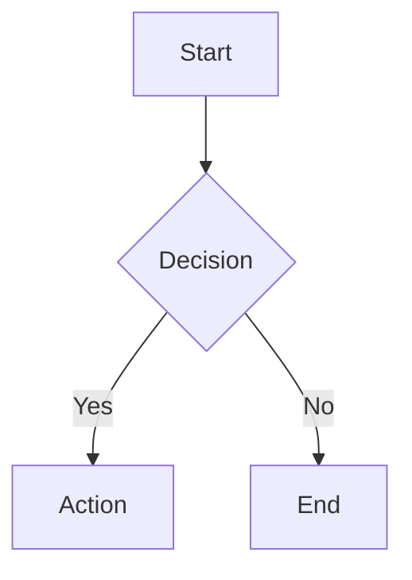

# PM Block Rules

## Block Types & Insertion

Use `create_pm_block` for structured PM blocks. Pass the `data` as a plain object — the tool encodes it automatically.

### TipTap JSON Format
```json
{
  "type": "pmBlock",
  "attrs": {
    "blockType": "<type>",
    "data": "<JSON-encoded string>",
    "version": 1
  }
}
```

### Supported Types

1. **Decision Record** (`blockType: "decision"`):
   - Status: open → decided → superseded
   - Options: label, description, pros[], cons[], effort, risk
   - Always include at least 2 options for binary decisions
   - Data: `{"title":"...", "status":"open", "type":"binary|multi-option", "options":[...], "linkedIssueIds":[]}`

2. **Form** (`blockType: "form"`):
   - 10 field types: text, textarea, number, date, select, multiselect, checkbox, rating, email, url
   - Include validation: required, min, max, pattern
   - Data: `{"title":"...", "fields":[{"id":"f1","label":"...","type":"text","required":true}], "responses":{}, "responseCount":0}`

3. **RACI Matrix** (`blockType: "raci"`):
   - Rows = deliverables, columns = stakeholders
   - Exactly one Accountable (A) per deliverable

4. **Risk Register** (`blockType: "risk"`):
   - probability (1-5), impact (1-5), score = P × I
   - Color: green (1-6), yellow (7-12), red (13-25)
   - Mitigation: avoid, mitigate, transfer, accept

5. **Timeline** (`blockType: "timeline"`):
   - Milestones: name, date, status (on-track/at-risk/blocked), dependencies
   - Data: `{"title":"...", "milestones":[{"id":"m-...","name":"...","date":"YYYY-MM-DD","status":"on-track","dependencies":[]}]}`

6. **Dashboard** (`blockType: "dashboard"`):
   - Widgets: metric, value, trend (up/down/flat), unit, target
   - Data: `{"title":"...", "widgets":[{"id":"w-...","metric":"...","value":0,"trend":"flat","unit":""}]}`

## Content Update Operations

For AI-initiated PM block operations:

- `insert_pm_block`: Insert new PM block. Non-destructive, no conflict detection.
  - Provide `pmBlockData.blockType`, `pmBlockData.data` (JSON string), and `afterBlockId`.
- `update_pm_block`: Update existing PM block data.
  - Provide `blockId` and `pmBlockData`.
  - **Edit guard (FR-048)**: If user has manually edited the block, the update is silently skipped. Create a new block instead.

## Diagrams (mermaid)

Insert via `insert_block` with markdown fenced code block:
````

````
- 10 types: flowchart, sequence, gantt, class, ER, state, C4, pie, mindmap, git graph
- Max 100 nodes for performance

## Smart Checklist

Insert via `insert_block` with taskList/taskItem JSON:
```json
{
  "type": "taskList",
  "content": [
    {
      "type": "taskItem",
      "attrs": { "checked": false, "assignee": null, "dueDate": null, "priority": "none", "isOptional": false },
      "content": [{ "type": "paragraph", "content": [{ "type": "text", "text": "Task name" }] }]
    }
  ]
}
```

## Batch PM Block Insertion

When generating multiple PM blocks (e.g., sprint planning with checklist + timeline + risk):
- Insert each block type as a SEPARATE `create_pm_block` call.
- Users see each block appear progressively instead of all at once.
- Use `after_block_id` from the previous insertion to maintain ordering.
- Use `insert_block` only for Smart Checklist (taskList) and mermaid diagrams.

Example — user asks "Set up sprint planning":
1. `insert_block` → Smart Checklist with sprint items (taskList JSON)
2. `create_pm_block(after_block_id=¶N)` → Timeline with milestones
3. `create_pm_block(after_block_id=¶M)` → Risk Register for sprint risks

## When to Suggest PM Blocks

- Planning discussions → Timeline, RACI
- Architecture decisions → Decision Record
- Risk assessment → Risk Register
- Data collection → Form
- Progress tracking → Dashboard, Smart Checklist
