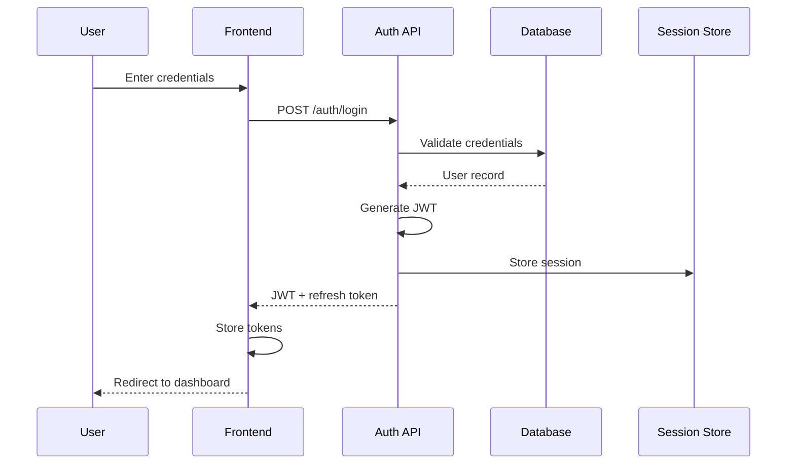

# Pilot Space - AI Capabilities Architecture

## Overview

Pilot Space integrates AI as a first-class platform capability, designed to augment human expertise across the software development lifecycle. This document details the AI features, architecture, and implementation strategy.

> **Important**: Pilot Space uses a **BYOK (Bring Your Own Key)** model per DD-002. Users must provide their own API keys:
> - **Anthropic** (Required): Claude Agent SDK orchestration for all agentic tasks
> - **OpenAI** (Required): Embeddings for semantic search, duplicate detection, RAG
> - **Google Gemini** (Recommended): Low-latency tasks like ghost text, large context analysis
> - **Azure OpenAI** (Optional): Enterprise data residency requirements
>
> See [claude-agent-sdk-architecture.md](./architect/claude-agent-sdk-architecture.md) for detailed BYOK implementation.

---

## AI Philosophy

### Human-in-the-Loop Principle (DD-003) (DD-003)

Every AI interaction in Pilot Space follows the **Critical-Only Approval** model (DD-003):

**Auto-Execute (Non-destructive)**:
- Suggest labels/priority
- Show ghost text
- Display margin annotations
- Post PR review comments
- Send notifications
- State transitions on PR events

**Require Approval (Destructive/Critical)**:
- Create sub-issues
- Delete any content
- Archive projects
- Publish documentation
- Merge PRs
- Bulk operations

```
┌─────────────────────────────────────────────────────────────────┐
│                     AI INTERACTION FLOW (DD-003)                    │
├─────────────────────────────────────────────────────────────────┤
│                                                                     │
│  ┌─────────┐    ┌──────────┐    ┌──────────┐    ┌──────────┐  │
│  │ Trigger │ → │    AI    │ → │  Check   │ → │  Action  │  │
│  │         │    │ Analysis │    │  Impact  │    │          │  │
│  └─────────┘    └──────────┘    └────┬─────┘    └──────────┘  │
│       │              │              │               │         │
│       ▼              ▼              ▼               ▼         │
│   User action    Suggestion   Non-destructive    Execute      │
│   or event      with rationale → Auto-execute   or Cancel     │
│                                Destructive →                   │
│                                Human Approval                   │
│                                                                 │
└─────────────────────────────────────────────────────────────────┘
```

### AI Confidence Levels (DD-048)

AI suggestions display contextual tags instead of raw percentages (see DD-048). Percentage values are available via tooltip for users who want numerical detail.

**Primary Display (Tags)**:

| Tag | Range | Meaning | Behavior |
|-----|-------|---------|----------|
| `Recommended` | ≥80% | Best option based on analysis | Prominent display, one-click accept |
| `Default` | 60-79% | Standard choice for this context | Visible suggestion, review recommended |
| `Current` | N/A | Matches existing pattern in codebase | Informational badge |
| `Alternative` | <60% | Valid but less common option | Flagged for human attention |

**Secondary Display (Tooltips)**:
Hover over any tag to see the underlying confidence percentage (e.g., "Recommended - 92% confidence").

### Transparency Requirements

All AI-generated content is clearly labeled:
- `✨ AI-assisted` badge on suggestions
- Expandable rationale section explaining AI reasoning
- Link to source data used for generation
- Ability to view alternative suggestions

---

## AI Agent Framework

### Agent Architecture

```
┌─────────────────────────────────────────────────────────────────┐
│                      AGENT ORCHESTRATOR                         │
├─────────────────────────────────────────────────────────────────┤
│                                                                 │
│  ┌───────────────────────────────────────────────────────────┐ │
│  │                    TASK ROUTER                             │ │
│  │  • Analyzes incoming request                               │ │
│  │  • Selects appropriate agent(s)                            │ │
│  │  • Manages agent coordination                              │ │
│  │  • Handles fallbacks and retries                           │ │
│  └───────────────────────────────────────────────────────────┘ │
│                              │                                  │
│  ┌───────────────────────────▼───────────────────────────────┐ │
│  │                    CONTEXT MANAGER                         │ │
│  │  • Workspace context (projects, members, settings)         │ │
│  │  • Project context (states, labels, conventions)           │ │
│  │  • User context (role, preferences, history)               │ │
│  │  • Codebase context (architecture, patterns, style)        │ │
│  └───────────────────────────────────────────────────────────┘ │
│                              │                                  │
│  ┌───────────────────────────▼───────────────────────────────┐ │
│  │                    AGENT POOL                              │ │
│  │                                                            │ │
│  │  MVP Critical Agents (Human Confirmation Required)         │ │
│  │  ┌─────────────────────────────────────────────────────┐  │ │
│  │  │              PRReviewAgent (DD-006 Unified)              │  │ │
│  │  │  ┌───────────┐ ┌───────────┐ ┌───────────────────┐  │  │ │
│  │  │  │🏗️Architect│ │✨Code      │ │🔒Security(OWASP) │  │  │ │
│  │  │  │  Review   │ │  Quality  │ │⚡Perf 📚Docs     │  │  │ │
│  │  │  └───────────┘ └───────────┘ └───────────────────┘  │  │ │
│  │  │  Provider: Claude Opus 4.5 via Claude Agent SDK        │  │ │
│  │  └─────────────────────────────────────────────────────┘  │ │
│  │                                                            │ │
│  │  MVP Autonomous Agents (Human-in-the-Loop)                 │ │
│  │  ┌────────────┐ ┌────────────┐ ┌────────────┐            │ │
│  │  │    Doc     │ │   Task     │ │  Diagram   │            │ │
│  │  │ Generator  │ │  Planner   │ │ Generator  │            │ │
│  │  └────────────┘ └────────────┘ └────────────┘            │ │
│  │                                                            │ │
│  │  ┌────────────┐ ┌────────────┐ ┌────────────┐            │ │
│  │  │ AI Context │ │  Issue     │ │ Knowledge  │            │ │
│  │  │   Agent    │ │ Enhancer   │ │   Search   │            │ │
│  │  └────────────┘ └────────────┘ └────────────┘            │ │
│  │                                                            │ │
│  │  Phase 2 Agents (Post-MVP)                                 │ │
│  │  ┌────────────┐ ┌────────────┐                            │ │
│  │  │  Pattern   │ │  Retro     │  ← Deferred per plan.md   │ │
│  │  │  Matcher   │ │  Analyst   │                            │ │
│  │  └────────────┘ └────────────┘                            │ │
│  │                                                            │ │
│  └───────────────────────────────────────────────────────────┘ │
│                                                                 │
└─────────────────────────────────────────────────────────────────┘
```

### Agent Definitions

#### 1. Architecture Review Agent
> **Note**: In MVP, this is implemented as part of the Unified `PRReviewAgent` (see DD-006), covering both Architecture and Code Quality.

**Purpose**: Analyze code changes for architectural compliance and suggest improvements.

**Triggers**:
- Pull request created/updated
- Manual review request
- Scheduled architecture audit

**Capabilities**:
```yaml
inputs:
  - Pull request diff
  - Codebase structure
  - Architecture documentation
  - Project conventions

outputs:
  - Compliance score (0-100)
  - Pattern violations list
  - Improvement suggestions
  - Related ADRs

actions:
  - Add PR comment with review
  - Create issue for violations
  - Update architecture docs
  - Suggest refactoring tasks
```

**Example Output**:
```markdown
## 🏗️ Architecture Review

### Compliance Score: 78/100

### Findings

#### ⚠️ Pattern Violations (2)
1. **Direct database access in controller** (Line 45-52)
   - Recommendation: Move to repository layer
   - Related: ADR-0023 Repository Pattern

2. **Missing input validation** (Line 89)
   - Recommendation: Add DTO validation decorator
   - Pattern: Input Validation at Boundaries

#### ✅ Good Practices Detected
- Proper dependency injection usage
- Clear separation of concerns in services

### Suggested Actions
- [ ] Refactor DB access to repository
- [ ] Add input validation
```

#### 2. Code Review Agent
> **Note**: In MVP, this is implemented as part of the Unified `PRReviewAgent` (see DD-006).

**Purpose**: Provide automated code review focusing on quality, security, and maintainability.

**Triggers**:
- Pull request created
- Code push to protected branch
- Manual review request

**Capabilities**:
```yaml
inputs:
  - Code diff
  - Test coverage data
  - Linting results
  - Historical patterns

outputs:
  - Code quality score
  - Security findings
  - Performance suggestions
  - Test coverage gaps

actions:
  - Inline PR comments
  - Request changes
  - Approve with suggestions
  - Create follow-up issues
```

#### 3. Documentation Generator Agent

**Purpose**: Generate and maintain documentation from code and discussions.

**Triggers**:
- Issue completion
- PR merge
- Manual doc request
- Scheduled doc refresh

**Capabilities**:
```yaml
inputs:
  - Source code
  - Code comments
  - Issue discussions
  - Existing documentation

outputs:
  - API documentation
  - README updates
  - Architecture diagrams
  - Changelog entries

actions:
  - Create/update Pages
  - Generate Mermaid diagrams
  - Update API specs
  - Create release notes
```

**Documentation Types**:

| Type | Source | Format | Trigger |
|------|--------|--------|---------|
| API Reference | Code + OpenAPI | Markdown + Swagger | PR merge |
| Architecture Diagram | Code structure | Mermaid C4 | Weekly/On-demand |
| Component Doc | Code + Comments | Markdown | File change |
| Decision Record | Issue + Discussion | ADR Template | Decision tag |
| Release Notes | Commits + Issues | Changelog | Release event |

#### 4. Task Planner Agent

**Purpose**: Decompose features into actionable tasks with estimates.

**Triggers**:
- Epic/Feature creation
- User request "Plan this feature"
- Sprint planning session

**Capabilities**:
```yaml
inputs:
  - Feature description
  - Acceptance criteria
  - Historical similar tasks
  - Team velocity data

outputs:
  - Task breakdown
  - Story point estimates
  - Dependencies map
  - Risk assessment

actions:
  - Create sub-issues
  - Set dependencies
  - Assign estimates
  - Add to backlog
```

**Example Interaction**:

```
User: Plan the "User Authentication" feature

AI Task Planner Response:

## Feature: User Authentication

### Proposed Task Breakdown

| # | Task | Type | Points | Dependencies |
|---|------|------|--------|--------------|
| 1 | Design auth database schema | Design | 2 | - |
| 2 | Implement user registration API | Backend | 3 | 1 |
| 3 | Implement login/logout API | Backend | 3 | 1 |
| 4 | Add JWT token management | Backend | 3 | 2, 3 |
| 5 | Create registration form UI | Frontend | 3 | 2 |
| 6 | Create login form UI | Frontend | 2 | 3 |
| 7 | Add auth state management | Frontend | 3 | 4, 5, 6 |
| 8 | Write integration tests | QA | 5 | All |

**Total Estimate**: 24 story points
**Confidence**: 85% (based on 12 similar features)

### Risks Identified
- OAuth integration may add 5-8 additional points
- Email verification adds 3 points if required

[Accept All] [Modify] [Reject]
```

#### 5. Diagram Generator Agent

**Purpose**: Create architectural and technical diagrams from descriptions or code.

**Supported Diagram Types**:

| Type | Use Case | Format |
|------|----------|--------|
| **Sequence** | API flows, interactions | Mermaid |
| **Class** | Domain models, relationships | Mermaid |
| **Component** | System architecture | C4 Model |
| **Entity-Relationship** | Database schema | Mermaid ERD |
| **Flowchart** | Process flows | Mermaid |
| **Architecture** | System overview | ArchiMate |

**Example Generation**:

```
User: Generate a sequence diagram for user login

AI Response:



[Copy Mermaid] [Edit] [Insert into Page]
```

#### 6. Pattern Matcher Agent

> **Phase 2**: This agent is deferred to Phase 2 per plan.md constitution check. Not included in MVP scope.

**Purpose**: Identify recurring patterns and suggest standardization.

**Capabilities**:
- Detect code patterns across codebase
- Identify anti-patterns
- Suggest pattern libraries
- Track pattern adoption

**Pattern Categories**:

| Category | Examples |
|----------|----------|
| **Architecture** | Repository, Service Layer, Event Sourcing |
| **Design** | Factory, Strategy, Observer, Decorator |
| **API** | RESTful conventions, Error handling, Pagination |
| **Testing** | Arrange-Act-Assert, Test doubles, Fixtures |
| **Security** | Input validation, Authentication, Authorization |

#### 7. Retrospective Analyst Agent

> **Phase 2**: This agent is deferred to Phase 2 per plan.md constitution check. Not included in MVP scope.

**Purpose**: Analyze sprint data and generate insights for retrospectives.

**Triggers**:
- Sprint completion
- Manual analysis request
- Scheduled weekly digest

**Outputs**:
```yaml
sprint_summary:
  velocity: 42 points (↑15% from avg)
  completion_rate: 87%
  carryover: 3 issues

insights:
  - "Testing tasks took 40% longer than estimated"
  - "Frontend tasks consistently under-estimated"
  - "Code review cycle time improved by 25%"

recommendations:
  - "Consider adding QA buffer for integration tasks"
  - "Pair programming showed 30% fewer defects"
  - "Morning standups correlated with faster blocker resolution"

metrics:
  cycle_time_avg: "2.3 days"
  pr_review_time: "4.2 hours"
  bug_injection_rate: "0.12 per feature"
```

#### 8. Knowledge Search Agent

**Purpose**: Semantic search across all workspace content.

**Searchable Content**:
- Issues and comments
- Pages and documentation
- Code and commits
- Slack/Discord messages (if integrated)
- External linked documents

**Features**:
- Natural language queries
- Context-aware results
- Related content suggestions
- Answer synthesis from multiple sources

**Example Query**:
```
User: "How do we handle rate limiting in our API?"

AI Response:

## Rate Limiting Implementation

Based on workspace knowledge:

### Current Implementation
Rate limiting is implemented in `api/middleware/rate_limit.py` using
Redis-based token bucket algorithm. (Source: API Architecture Doc)

### Configuration
- Default: 60 requests/minute per user
- Authenticated: 120 requests/minute
- Admin: Unlimited

### Related Resources
1. [ADR-0015: Rate Limiting Strategy](link)
2. [Issue #234: Add rate limit headers](link)
3. [Page: API Guidelines - Rate Limiting Section](link)

### Code Reference
`api/middleware/rate_limit.py:45-78`
```

#### 9. AI Context Agent

**Purpose**: Aggregate all relevant context for an issue and generate actionable tasks optimized for AI-assisted implementation with Claude Code.

**Triggers**:
- User opens "AI Context" tab on issue
- User requests context regeneration
- Linked issue/document changes (optional notification)

**Capabilities**:
```yaml
inputs:
  - Issue description and metadata
  - Linked issues (blocks, relates, blocked by)
  - Related documents (notes, ADRs, specs)
  - Codebase (semantic search + explicit tags)
  - Git history (PRs, branches, commits)
  - Historical patterns (similar resolved issues)

outputs:
  - Context summary with statistics
  - Structured related context
  - Codebase file tree with function/class extraction
  - Task dependency graph
  - Implementation checklist
  - Ready-to-use prompts for Claude Code
  - Markdown export

actions:
  - Generate context from multiple sources
  - Create task breakdown with dependencies
  - Apply task templates (bug fix, feature, refactor)
  - Interactive refinement via chat
  - Export to Claude Code format
  - Share context with team members
```

**Context Aggregation Pipeline**:

```
┌─────────────────────────────────────────────────────────────────┐
│                 AI CONTEXT AGGREGATION PIPELINE                  │
├─────────────────────────────────────────────────────────────────┤
│                                                                  │
│  Issue Input                                                     │
│       │                                                          │
│       ▼                                                          │
│  ┌─────────────────────────────────────────────────────────┐    │
│  │                  CONTEXT DISCOVERY                       │    │
│  │                                                          │    │
│  │  ┌──────────┐ ┌──────────┐ ┌──────────┐ ┌──────────┐   │    │
│  │  │  Issue   │ │ Document │ │ Codebase │ │   Git    │   │    │
│  │  │  Links   │ │  Search  │ │  Search  │ │ History  │   │    │
│  │  └────┬─────┘ └────┬─────┘ └────┬─────┘ └────┬─────┘   │    │
│  │       │            │            │            │          │    │
│  │       └────────────┴────────────┴────────────┘          │    │
│  │                          │                               │    │
│  └──────────────────────────┼───────────────────────────────┘    │
│                             ▼                                    │
│  ┌─────────────────────────────────────────────────────────┐    │
│  │                  RELEVANCE SCORING                       │    │
│  │                                                          │    │
│  │  • Semantic similarity (embedding distance)             │    │
│  │  • Explicit tagging (highest priority)                  │    │
│  │  • AST-aware analysis (function/class level)            │    │
│  │  • Historical patterns (similar issues)                 │    │
│  └──────────────────────────┬───────────────────────────────┘    │
│                             │                                    │
│                             ▼                                    │
│  ┌─────────────────────────────────────────────────────────┐    │
│  │                  TASK GENERATION                         │    │
│  │                                                          │    │
│  │  ┌──────────┐ ┌──────────┐ ┌──────────┐                │    │
│  │  │   LLM    │ │Historical│ │ Template │                │    │
│  │  │Generated │ │ Patterns │ │  Based   │                │    │
│  │  └────┬─────┘ └────┬─────┘ └────┬─────┘                │    │
│  │       │            │            │                       │    │
│  │       └────────────┴────────────┘                       │    │
│  │                    │                                     │    │
│  │                    ▼                                     │    │
│  │         ┌──────────────────┐                            │    │
│  │         │ Dependency Graph │                            │    │
│  │         │   + Validation   │                            │    │
│  │         └──────────────────┘                            │    │
│  └──────────────────────────────────────────────────────────┘    │
│                             │                                    │
│                             ▼                                    │
│  ┌─────────────────────────────────────────────────────────┐    │
│  │                  OUTPUT FORMATTING                       │    │
│  │                                                          │    │
│  │  • Interactive UI (AI Context tab)                      │    │
│  │  • Markdown export (Claude Code optimized)              │    │
│  │  • Ready-to-use prompts                                 │    │
│  │  • Shareable context views                              │    │
│  └─────────────────────────────────────────────────────────┘    │
│                                                                  │
└─────────────────────────────────────────────────────────────────┘
```

**Task Templates**:

| Template | Purpose | Structure |
|----------|---------|-----------|
| **Bug Fix** | Debugging and fixing issues | Reproduce → Diagnose → Fix → Test → Document |
| **Feature** | New functionality | Design → Implement → Test → Document → Review |
| **Refactor** | Code improvements | Analyze → Plan → Execute → Verify → Document |
| **Custom** | User-defined workflows | Configurable steps |

**Example Output**:

```markdown
## AI Context: PS-202 - Handle OAuth Errors Gracefully

### Context Summary
- **Related Issues**: 3 (1 blocks, 1 relates, 1 blocked by)
- **Documents**: 2 (1 note, 1 ADR)
- **Codebase Files**: 5 (2 to modify, 3 reference)
- **Git References**: 2 (1 PR, 1 branch)
- **Confidence**: 87%

### Implementation Tasks

#### Task 1: Add Retry Logic to OAuthService
**Template**: Bug Fix
**Priority**: High | **Estimate**: 2-3 hours
**Dependencies**: None

**Files**:
- `src/services/auth/oauth.py` (modify)
  - `OAuthService.handle_callback()` - Add retry wrapper
  - `OAuthService.refresh_token()` - Handle refresh failures

**Prompt for Claude Code**:
```
Implement retry logic for OAuth callbacks in src/services/auth/oauth.py.

Context:
- OAuth callbacks fail intermittently due to network issues
- Need exponential backoff with max 3 retries
- Reference: PR #234 shows similar pattern in http_client.py

Tasks:
1. Add retry decorator to handle_callback()
2. Configure exponential backoff (1s, 2s, 4s)
3. Add proper error logging
4. Update existing tests
```

#### Task 2: Update Error Messages
**Template**: Feature
**Priority**: Medium | **Estimate**: 1 hour
**Dependencies**: Task 1

[Continues with detailed prompt...]
```

**Interactive Refinement**:

The AI Context Agent supports multi-turn conversation to refine context:

```
User: "Add more context about the existing retry implementation"

AI: I found existing retry logic in `src/utils/http_client.py`.
    I've added it to the Codebase Context section with:
    - RetryConfig class (configures backoff parameters)
    - retry_with_backoff() decorator (wraps HTTP calls)

    The OAuth implementation should follow the same pattern.

    [Context view updated]

User: "Focus the tasks on API layer only"

AI: I've updated the task breakdown to focus on API layer changes:
    - Removed internal service-level tasks
    - Added API endpoint error handling tasks
    - Updated file references to src/api/auth/*

    [Tasks regenerated with API focus]
```

**Integration with Claude Code**:

| Integration Method | Description |
|-------------------|-------------|
| **Copy to Clipboard** | Markdown formatted for pasting into Claude Code |
| **CLI Command** | `pilot-space context --issue PS-202 | claude` |
| **MCP Protocol** | Direct tool access via MCP server |
| **IDE Extension** | One-click "Open in Claude Code" button |

**Security & Privacy**:

| Control | Implementation | Phase |
|---------|----------------|-------|
| **Workspace-scoped** | Context limited to accessible workspace data | MVP |
| **Permission-aware** | Respects user's project/issue permissions | MVP |
| **Sensitive exclusion** | `.env`, credentials, secrets auto-excluded | MVP |
| **Audit logging (Partial)** | AI context generations and operations logged | MVP |
| **Audit logging (Full)** | Complete audit trail (data access, modifications) | Phase 2 |

---

## AI Feature Details

### Issue AI Assistance

#### Smart Issue Creation

When creating an issue, AI assists with:

| Feature | Trigger | AI Action |
|---------|---------|-----------|
| **Title Enhancement** | User types title | Suggest clearer, searchable title |
| **Description Expansion** | Partial description | Generate acceptance criteria, steps to reproduce |
| **Label Suggestion** | Issue content | Recommend relevant labels |
| **Priority Inference** | Keywords, similar issues | Suggest appropriate priority |
| **Assignee Recommendation** | Content, code ownership | Suggest based on expertise |
| **Duplicate Detection** | Issue creation | Flag potential duplicates |

#### Issue Decomposition

```
┌─────────────────────────────────────────────────────────────────┐
│                    ISSUE DECOMPOSITION FLOW                     │
├─────────────────────────────────────────────────────────────────┤
│                                                                 │
│  Epic/Feature Description                                       │
│           │                                                     │
│           ▼                                                     │
│  ┌─────────────────┐                                           │
│  │   AI Analysis   │                                           │
│  │  • Parse intent │                                           │
│  │  • Identify scope│                                          │
│  │  • Find similar │                                           │
│  └────────┬────────┘                                           │
│           │                                                     │
│           ▼                                                     │
│  ┌─────────────────┐     ┌─────────────────┐                   │
│  │  Suggest Tasks  │ ──→ │  User Refines   │                   │
│  │  • Subtasks     │     │  • Add/Remove   │                   │
│  │  • Estimates    │     │  • Modify       │                   │
│  │  • Dependencies │     │  • Approve      │                   │
│  └─────────────────┘     └────────┬────────┘                   │
│                                   │                             │
│                                   ▼                             │
│                          Create Sub-Issues                      │
│                                                                 │
└─────────────────────────────────────────────────────────────────┘
```

### Documentation AI

#### Auto-Documentation Pipeline

```
Code Change
     │
     ▼
┌─────────────┐     ┌─────────────┐     ┌─────────────┐
│   Extract   │ ──→ │   Generate  │ ──→ │   Review    │
│   Context   │     │    Draft    │     │   & Edit    │
└─────────────┘     └─────────────┘     └─────────────┘
     │                    │                    │
     ▼                    ▼                    ▼
• Function signature  • Description        • Human approval
• Existing comments   • Parameters         • Modifications
• Usage patterns      • Return values      • Publication
• Test cases          • Examples
```

#### Living Documentation

AI maintains documentation freshness:

| Check | Frequency | Action |
|-------|-----------|--------|
| Code-Doc Sync | On PR merge | Flag outdated sections |
| Broken Links | Daily | Fix or flag for removal |
| Usage Analytics | Weekly | Archive unused docs |
| Completeness | On-demand | Identify missing docs |

### Code Review AI

#### Review Dimensions

```
┌─────────────────────────────────────────────────────────────────┐
│                    CODE REVIEW DIMENSIONS                       │
├─────────────────────────────────────────────────────────────────┤
│                                                                 │
│  ┌─────────────┐  ┌─────────────┐  ┌─────────────┐            │
│  │ Architecture│  │  Security   │  │Performance │            │
│  │  Compliance │  │   Analysis  │  │  Impact    │            │
│  └─────────────┘  └─────────────┘  └─────────────┘            │
│        │               │                │                      │
│        ▼               ▼                ▼                      │
│   • Pattern use    • OWASP checks   • Complexity           │
│   • Layer bounds   • Input valid.   • N+1 queries          │
│   • Dependencies   • Auth/AuthZ     • Memory leaks         │
│                    • Secrets        • Async issues          │
│                                                                 │
│  ┌─────────────┐  ┌─────────────┐  ┌─────────────┐            │
│  │   Quality   │  │   Testing   │  │Documentation│            │
│  │   Metrics   │  │   Coverage  │  │   Quality   │            │
│  └─────────────┘  └─────────────┘  └─────────────┘            │
│        │               │                │                      │
│        ▼               ▼                ▼                      │
│   • Readability    • Coverage %     • Comment clarity       │
│   • Maintainability• Edge cases     • API docs              │
│   • Code smells    • Test quality   • README updates        │
│                                                                 │
└─────────────────────────────────────────────────────────────────┘
```

#### Review Output Format

```markdown
## 🤖 AI Code Review

### Summary
- **Files Changed**: 12
- **Lines Added**: 234
- **Lines Removed**: 89
- **Overall Score**: 82/100

### Critical Issues (Must Fix)
1. **SQL Injection Risk** - `user_controller.py:67`
   ```python
   # Current (vulnerable)
   query = f"SELECT * FROM users WHERE id = {user_id}"

   # Suggested fix
   query = "SELECT * FROM users WHERE id = %s"
   cursor.execute(query, (user_id,))
   ```

### Warnings (Should Fix)
1. **Missing error handling** - `payment_service.py:123`
2. **Potential memory leak** - `cache_manager.py:45`

### Suggestions (Nice to Have)
1. Consider extracting method at line 89-120
2. Add type hints for public methods

### Testing Gaps
- [ ] Missing test for edge case: empty input
- [ ] No integration test for payment flow

### Documentation Impact
- [ ] Update API docs for new endpoint
- [ ] Add changelog entry
```

### Sprint Planning AI

#### Velocity Prediction

```
Historical Data
      │
      ├── Sprint velocities (last 6 sprints)
      ├── Team capacity changes
      ├── Issue complexity scores
      └── External factors (holidays, etc.)
      │
      ▼
┌─────────────────────────────────────────────────────────────────┐
│                    VELOCITY PREDICTION MODEL                    │
├─────────────────────────────────────────────────────────────────┤
│                                                                 │
│  Features:                                                      │
│  • Rolling average velocity                                     │
│  • Capacity adjustment factor                                   │
│  • Carryover penalty                                            │
│  • Complexity distribution                                       │
│                                                                 │
│  Output:                                                        │
│  • Predicted velocity: 38 points                                │
│  • Confidence interval: 35-42 points                            │
│  • Risk factors: 2 team members on PTO                          │
│                                                                 │
└─────────────────────────────────────────────────────────────────┘
```

#### Sprint Composition Suggestions

```
AI Sprint Planning Assistant

Based on your backlog and team capacity:

## Recommended Sprint Composition

### Must Include (Business Priority)
- AUTH-234: Password reset flow (5 pts) - P0
- API-567: Rate limiting fix (3 pts) - P0

### Recommended (Balanced Load)
- FE-890: Dashboard redesign (8 pts) - P1
- BE-123: Cache optimization (5 pts) - P1

### Risk Items (Uncertainty)
- INTEG-456: Third-party API migration (13 pts)
  ⚠️ High uncertainty - consider spike first

### Capacity Analysis
| Member | Available | Assigned | Skills Match |
|--------|-----------|----------|--------------|
| Alice  | 100%      | 13 pts   | ✅ Backend   |
| Bob    | 80%       | 10 pts   | ✅ Frontend  |
| Carol  | 50%       | 5 pts    | ⚠️ New to codebase |

Total: 28/38 points allocated

[Auto-fill Remaining] [Adjust] [Finalize]
```

---

## RAG (Retrieval-Augmented Generation) Pipeline

### Architecture

```
┌─────────────────────────────────────────────────────────────────┐
│                      RAG PIPELINE                               │
├─────────────────────────────────────────────────────────────────┤
│                                                                 │
│  ┌─────────────────────────────────────────────────────────┐   │
│  │                    INDEXING LAYER                        │   │
│  │                                                          │   │
│  │  Sources:                  Processing:                   │   │
│  │  ┌──────────┐             ┌──────────┐                  │   │
│  │  │  Issues  │────────────→│  Chunker │                  │   │
│  │  │  Pages   │             │  (512tok)│                  │   │
│  │  │  Code    │             └────┬─────┘                  │   │
│  │  │  Commits │                  │                        │   │
│  │  │  Docs    │                  ▼                        │   │
│  │  └──────────┘             ┌──────────┐                  │   │
│  │                           │Embeddings│                  │   │
│  │                           │ (Local)  │                  │   │
│  │                           └────┬─────┘                  │   │
│  │                                │                        │   │
│  │                                ▼                        │   │
│  │                           ┌──────────┐                  │   │
│  │                           │ pgvector │                  │   │
│  │                           │  Store   │                  │   │
│  │                           └──────────┘                  │   │
│  └─────────────────────────────────────────────────────────┘   │
│                                                                 │
│  ┌─────────────────────────────────────────────────────────┐   │
│  │                    RETRIEVAL LAYER                       │   │
│  │                                                          │   │
│  │  Query                     Retrieval                     │   │
│  │  ┌──────────┐             ┌──────────┐                  │   │
│  │  │  User    │────────────→│ Semantic │                  │   │
│  │  │  Query   │             │  Search  │                  │   │
│  │  └──────────┘             └────┬─────┘                  │   │
│  │                                │                        │   │
│  │                                ▼                        │   │
│  │                           ┌──────────┐                  │   │
│  │                           │ Re-Rank  │                  │   │
│  │                           │ (Top-K)  │                  │   │
│  │                           └────┬─────┘                  │   │
│  │                                │                        │   │
│  │                                ▼                        │   │
│  │                           ┌──────────┐                  │   │
│  │                           │ Context  │                  │   │
│  │                           │ Assembly │                  │   │
│  │                           └──────────┘                  │   │
│  └─────────────────────────────────────────────────────────┘   │
│                                                                 │
│  ┌─────────────────────────────────────────────────────────┐   │
│  │                    GENERATION LAYER                      │   │
│  │                                                          │   │
│  │  ┌──────────┐     ┌──────────┐     ┌──────────┐        │   │
│  │  │ Context  │ ──→ │   LLM    │ ──→ │ Response │        │   │
│  │  │+ Query   │     │  + Prompt│     │+ Sources │        │   │
│  │  └──────────┘     └──────────┘     └──────────┘        │   │
│  │                                                          │   │
│  └─────────────────────────────────────────────────────────┘   │
│                                                                 │
└─────────────────────────────────────────────────────────────────┘
```

### Embedding Models

Embeddings are generated using the configured LLM provider's embedding API:

| Model | Provider | Dimensions | Use Case |
|-------|----------|------------|----------|
| `text-embedding-3-large` | OpenAI | 3072 | Default, high quality retrieval |
| `text-embedding-3-small` | OpenAI | 1536 | Cost-effective alternative |
| `gemini-embedding-001` | Google | 768 | Fast, cost-effective |
| `voyage-code-3` | Voyage AI | 1024 | Code-specific embeddings |
| `voyage-3` | Voyage AI | 1024 | General-purpose, high quality |

**Note**: Embeddings are stored in PostgreSQL using the pgvector extension.

**Provider Fallback**: If a provider's embedding API is unavailable, the system automatically falls back to the next available provider in the routing configuration.

### Index Update Strategy

| Content Type | Update Trigger | Index Strategy |
|--------------|----------------|----------------|
| Issues | Create/Update | Real-time |
| Pages | Save | Debounced (30s) |
| Code | PR Merge | Batch (nightly) |
| Comments | Create | Real-time |

---

## LLM Provider Configuration

### BYOK (Bring Your Own Key) Model

Pilot Space requires users to provide their own API keys for LLM providers. This approach:
- Gives users full control over AI costs
- Eliminates complex metering and billing
- Allows users to leverage existing API credits
- Ensures data flows directly to user's chosen provider

### Supported Providers

```yaml
# User configuration (workspace settings or environment variables)

providers:
  openai:
    api_key: ${OPENAI_API_KEY}  # User-provided
    models:
      - gpt-4.1              # Latest flagship model (Jan 2026)
      - gpt-4.1-mini         # Cost-effective for suggestions
      - o3-mini              # Reasoning tasks
    default_model: gpt-4.1

  anthropic:
    api_key: ${ANTHROPIC_API_KEY}  # User-provided
    models:
      - claude-opus-4-5-20251101   # Most capable, deep analysis
      - claude-sonnet-4-20250514   # Balanced performance/cost
      - claude-haiku-4-20251215    # Fast, cost-effective
    default_model: claude-sonnet-4-20250514

  google:
    api_key: ${GOOGLE_API_KEY}  # User-provided
    models:
      - gemini-3.0-flash     # Fast, cost-effective
      - gemini-3.0-pro       # Advanced reasoning, code analysis
      - gemini-3.0-pro       # Long context (2M tokens)
    default_model: gemini-3.0-flash

  azure_openai:
    api_key: ${AZURE_OPENAI_KEY}  # User-provided
    endpoint: ${AZURE_OPENAI_ENDPOINT}  # User-provided
    deployment_name: gpt-4.1
    # Enterprise preferred for compliance requirements

# Task-to-provider routing (configurable)
routing:
  code_review:
    preferred: [anthropic, google, openai]
    model: claude-sonnet-4-20250514  # or gemini-3.0-pro

  documentation:
    preferred: [google, openai, anthropic]
    model: gemini-3.0-flash

  issue_enhancement:
    preferred: [google, openai, anthropic]
    model: gemini-3.0-flash

  task_decomposition:
    preferred: [anthropic, google, openai]
    model: claude-sonnet-4-20250514

  complex_reasoning:
    preferred: [anthropic, openai]
    model: claude-opus-4-5-20251101  # or o3-mini

  semantic_search:
    preferred: [openai, google]
    model: text-embedding-3-large  # or gemini-embedding-001
```

### Cost Optimization

| Strategy | Implementation |
|----------|----------------|
| **Tiered Models** | Use gpt-5.1-mini/haiku-4 for simple tasks, gpt-4.1/sonnet-4 for complex |
| **Caching** | Cache embeddings and common query responses (Redis) |
| **Batching** | Batch similar requests where possible |
| **Smart Routing** | Route to cheapest capable model per task type |

### Provider Comparison

| Provider | Strengths | Best For | Cost |
|----------|-----------|----------|------|
| **OpenAI** | Fast, reliable, good all-around | Documentation, search | $$ |
| **Anthropic** | Excellent code understanding, safety | Code review, architecture | $$$ |
| **Google Gemini** | Long context (1M tokens), multimodal, fast | Task planning, large codebase analysis | $ |
| **Azure OpenAI** | Enterprise compliance, private endpoints | Enterprise deployments | $$ |

### Provider Selection Guide

| Use Case | Recommended Provider | Rationale |
|----------|---------------------|-----------|
| **Code Review** | Anthropic Claude | Best code understanding and security analysis |
| **Documentation** | Google Gemini | Fast, cost-effective, good prose generation |
| **Task Decomposition** | Anthropic/Gemini | Strong reasoning for complex breakdown |
| **Diagram Generation** | OpenAI/Gemini | Good at structured output formats |
| **Large Codebase Analysis** | Google Gemini | 1M token context window |
| **Enterprise/Compliance** | Azure OpenAI | Private endpoints, data residency |

---

## AI Trigger Points

### Autonomy Model: Critical-Only Approval

AI actions follow a tiered autonomy model (configurable per project):

| Action Type | Default Behavior | Requires Approval |
|-------------|------------------|-------------------|
| **Suggestions** (labels, priority) | Show in UI | No (user accepts/rejects) |
| **State Transitions** (PR events) | Auto-execute + notify | No (configurable) |
| **PR Comments** (review feedback) | Auto-post | No |
| **Issue Creation** (from decomposition) | Require approval | Yes |
| **Documentation Updates** | Require approval | Yes |
| **Destructive Actions** (delete, archive) | Always require | Yes (not configurable) |

### Automatic Triggers

| Event | AI Action | Notification |
|-------|-----------|--------------|
| Issue Created | Label/Priority suggestion | Inline in UI |
| PR Opened | Code + architecture review | PR comment |
| PR Merged | Update linked issue state | Activity log |
| Sprint Completed | Generate retrospective insights | Notification |

### On-Demand Triggers (AI-Assisted)

| User Action | AI Response |
|-------------|-------------|
| `/ai review` | Comprehensive code review |
| `/ai plan <feature>` | Task decomposition |
| `/ai doc <file>` | Documentation generation |
| `/ai diagram <type>` | Diagram generation |
| `/ai explain` | Code/decision explanation |
| `/ai search <query>` | Semantic knowledge search |

### Comment Triggers

AI responds to special comment patterns:

```markdown
@pilot-ai review architecture
@pilot-ai suggest tests
@pilot-ai explain this function
@pilot-ai generate docs
@pilot-ai find similar issues
```

---

## Privacy & Security

### Data Handling

```
┌─────────────────────────────────────────────────────────────────┐
│                    DATA FLOW CONTROLS                           │
├─────────────────────────────────────────────────────────────────┤
│                                                                 │
│  User Data                     AI Processing                    │
│  ┌──────────┐                 ┌──────────┐                     │
│  │Workspace │                 │ Context  │                     │
│  │  Data    │─────────────────│ Builder  │                     │
│  └──────────┘                 └────┬─────┘                     │
│       │                            │                            │
│       ▼                            ▼                            │
│  ┌──────────┐                 ┌──────────┐                     │
│  │   PII    │                 │  Prompt  │                     │
│  │ Filtering│                 │ Assembly │                     │
│  └──────────┘                 └────┬─────┘                     │
│       │                            │                            │
│       ▼                            ▼                            │
│  ┌──────────┐                 ┌──────────┐                     │
│  │Anonymized│                 │   LLM    │                     │
│  │ Context  │────────────────▶│   API    │                     │
│  └──────────┘                 └────┬─────┘                     │
│                                    │                            │
│                               No data retained                  │
│                               by LLM provider                   │
│                                                                 │
└─────────────────────────────────────────────────────────────────┘
```

### Privacy Controls

| Setting | Default | Options |
|---------|---------|---------|
| PII Masking | Enabled | Per workspace toggle |
| Code Sharing with AI | Enabled | Per project toggle |
| Telemetry | Opt-in | Disable all |

### Data Privacy Considerations

Since Pilot Space uses BYOK (external LLM providers):

1. **Data flows to your chosen LLM provider** - Review their data policies
2. **OpenAI/Anthropic API agreements** - Enterprise plans offer zero data retention
3. **Azure OpenAI** - Data stays within your Azure tenant (enterprise recommended)
4. **PII Masking** - Enable to scrub sensitive data before sending to LLM

**For maximum privacy (Enterprise)**:
- Use Azure OpenAI with private endpoints
- Enable PII masking at workspace level
- Review and configure data retention policies with your LLM provider
- Enable audit logging for all AI operations

---

## Configuration & Settings

### Workspace-Level AI Settings

```yaml
workspace:
  ai:
    enabled: true
    default_provider: google  # openai | anthropic | google | azure_openai

    # API Keys (encrypted at rest)
    credentials:
      openai_api_key: "sk-..."       # User-provided (optional)
      anthropic_api_key: "sk-..."    # User-provided (optional)
      google_api_key: "AIza..."      # User-provided (optional)
      azure_endpoint: "https://..."  # User-provided (optional)

    features:
      auto_label: true
      auto_priority: true
      duplicate_detection: true

    review:
      auto_review_prs: true
      review_types: [architecture, security, quality]

    documentation:
      auto_generate: false
      update_on_merge: true
      diagram_format: mermaid

    agents:
      pr_review: enabled
      task_planner: enabled
      doc_generator: enabled
      knowledge_search: enabled
```

### Project-Level Overrides

```yaml
project:
  ai:
    # Override workspace settings
    auto_review_prs: false  # Disable for this project

    # Custom patterns
    architecture_patterns:
      - name: "Service Layer"
        path: "src/services/**"
        rules: ["no-direct-db-access", "inject-dependencies"]

    # Custom prompts
    review_instructions: |
      Focus on Python type hints and async patterns.
      Flag any blocking I/O in async functions.
```

---

## Metrics & Observability

### AI Usage Metrics

| Metric | Description | Dashboard |
|--------|-------------|-----------|
| Suggestions/day | AI suggestions generated | Usage |
| Acceptance rate | % of suggestions accepted | Quality |
| Response time | AI response latency | Performance |
| Token usage | LLM token consumption | Cost |
| Error rate | Failed AI operations | Reliability |

### Quality Metrics

| Metric | Measurement |
|--------|-------------|
| Review accuracy | Human override rate |
| Doc quality | User edits after generation |
| Prediction accuracy | Estimate vs actual |
| Search relevance | Click-through rate |

---

*Document Version: 1.3*
*Last Updated: 2026-01-21*
*Author: Pilot Space Team*
*Changes: Updated Gemini to 3.0, aligned confidence display (tags + percentage tooltips per DD-048), clarified audit logging scope (Partial MVP + Full Phase 2)*
