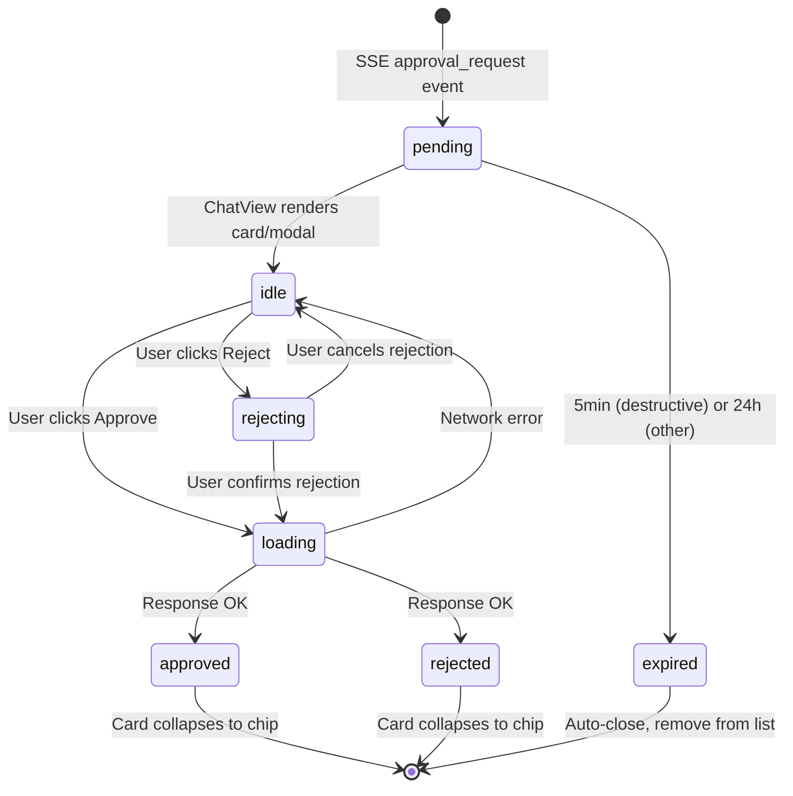

# Approval Overlay System Analysis: ChatView AI Feature

## Document Overview

This document provides a comprehensive analysis of the **ApprovalOverlay system** — the human-in-the-loop approval architecture for AI actions in Pilot Space's ChatView. It traces the implementation of **DD-003 (Critical-Only AI Approval)** across 8 frontend components, 2 store classes, and the complete request/response lifecycle.

**Version**: 1.0 | **Last Updated**: 2026-02-26 | **Scope**: ChatView approval components, stores, and integration patterns

---

## Table of Contents

1. [System Architecture Overview](#system-architecture-overview)
2. [Design Decision DD-003 Implementation](#design-decision-dd-003-implementation)
3. [Component Map](#component-map)
4. [Approval Type Taxonomy](#approval-type-taxonomy)
5. [Approval Request Lifecycle](#approval-request-lifecycle)
6. [Modal vs Inline Approval Card Pattern](#modal-vs-inline-approval-card-pattern)
7. [Diff & Preview Visualization](#diff--preview-visualization)
8. [Store Architecture & State Management](#store-architecture--state-management)
9. [Batch "Confirm All" Flow](#batch-confirm-all-flow)
10. [Result Propagation: SSE & REST Callbacks](#result-propagation-sse--rest-callbacks)
11. [Keyboard Shortcuts & UX Patterns](#keyboard-shortcuts--ux-patterns)
12. [Code Examples & Integration Points](#code-examples--integration-points)
13. [Security & Safety Guarantees](#security--safety-guarantees)

---

## System Architecture Overview

### High-Level Data Flow

```
┌──────────────────────────────────────────────────────────────────┐
│                    APPROVAL REQUEST LIFECYCLE                     │
└──────────────────────────────────────────────────────────────────┘

1. AI Agent Action Request
   ↓
2. Backend Approval Request Creation
   ├─ Classify action (Destructive / Content Creation / Non-Destructive)
   ├─ Determine visibility (Modal vs Inline)
   ├─ Create ApprovalRequest object
   └─ SSE Event: "approval_request"
   ↓
3. Frontend Receives Approval Event
   ├─ Store.addApproval(request)
   ├─ ChatView splits into destructive/inline arrays
   ├─ Render DestructiveApprovalModal OR InlineApprovalCard
   └─ Disable chat input (store.isWaitingForUser = true)
   ↓
4. User Reviews & Decides
   ├─ Views context, diff, payload preview
   ├─ Can reject with reason (optional)
   ├─ Can keyboard shortcut (Escape = reject, Enter = confirm)
   └─ 5-minute countdown (destructive) / 24-hour (other)
   ↓
5. Approval/Rejection Resolution
   ├─ UI Button Click
   ├─ Call store.approveAction() or store.rejectAction()
   ├─ PilotSpaceActions sends REST: POST /ai/approvals/{id}/resolve
   ├─ Wait for response
   └─ Remove from pendingApprovals array
   ↓
6. Result Propagation
   ├─ Backend executes approved action
   ├─ SSE: "content_update" event with result
   ├─ Store processes update (issues created, content modified, etc.)
   └─ UI reflects final state (collapsed card, update notification)

Time Constraints:
- Destructive: 5 minutes (URGENT < 60s triggers pulse animation)
- Content Creation: 24 hours
- Auto-reject on timeout
```

### Why This System Exists

**Problem**: AI systems can cause irreversible damage through:
- Deleting issues, notes, or projects
- Merging PRs to production branches
- Bulk modifying data
- Publishing content without review

**Solution**: Three-tier approval classification ensures:
1. **Critical actions** (delete, merge) always require approval
2. **Content creation** (issue extraction, PR comments) requires approval by default
3. **Suggestions** (labels, priority) auto-apply
4. Human maintains **final decision-making authority**
5. AI gains **trust through transparency** (why it wants to do something)
6. Teams can **configure autonomy levels** (conservative/balanced/autonomous)

---

## Design Decision DD-003 Implementation

### Official Definition

**DD-003: Critical-Only AI Approval** — AI autonomy limited to non-destructive actions. Destructive (delete, archive) and content-creation (create issues) actions require explicit human approval.

| Action | Behavior | Configurable |
|--------|----------|--------------|
| Suggest labels/priority | Auto-apply UI | Yes (per workspace) |
| Auto-transition on PR | Auto + notify | Yes |
| Create sub-issues | Require approval | Yes |
| Delete/archive | **Always approval** | No |

### Three-Tier Classification

All AI actions are classified into three tiers:

#### 1. **CRITICAL_REQUIRE_APPROVAL** (Always blocking)

Actions that are **irreversible, destructive, or catastrophic**:
- `delete_issue` — Removes issue permanently
- `delete_note` — Deletes note permanently
- `delete_comment` — Removes comment
- `merge_pr` — Merges PR to main (deployment risk)
- `close_issue` — Closes issue workflow
- `archive_workspace` — Removes workspace
- `unlink_issue_from_note` — Breaks relationship
- `unlink_issues` — Breaks multiple relationships

**Properties**:
- Always rendered in **DestructiveApprovalModal** (blocking, non-dismissable)
- 5-minute countdown (auto-reject on timeout)
- Focus on Reject button (safety-first UX)
- Shows: Warning icon, countdown timer, reasoning
- Cannot be overridden by workspace settings
- No outside-click dismiss (must Escape or explicitly button-click)

#### 2. **DEFAULT_REQUIRE_APPROVAL** (Configurable, usually blocking)

Actions that **create or significantly modify** data:
- `create_issues` — Batch create from extraction
- `update_issue` — Modify issue fields
- `create_annotation` — Add margin comment
- `post_pr_comments` — Add PR review comments
- `publish_documentation` — Deploy docs

**Properties**:
- Configurable by workspace (conservative/balanced/autonomous)
- Rendered in **InlineApprovalCard** (non-blocking, in message stream)
- 24-hour expiration
- Shows: AI badge, action summary, field preview, compact form
- User can reject with reason (200-char max, optional)
- Optional keyboard shortcuts (Tab+Space, Enter/Escape)

#### 3. **AUTO_EXECUTE** (Non-blocking suggestions)

Actions that are **read-only or UI-only**:
- `ghost_text` — Text completion suggestion
- `margin_annotation` — Read-only inline note
- `suggest_labels` — Label suggestion
- `suggest_priority` — Priority hint
- `ai_context` — Aggregated background info

**Properties**:
- Execute immediately (no approval UI)
- Suggestions appear in editor/UI without blocking
- Fast path for frictionless interactions
- Can be overridden to require approval (conservative mode)

---

## Component Map

### File Locations & Responsibilities

| File | Type | Purpose | Lines |
|------|------|---------|-------|
| `types.ts` | Type defs | Approval/Agent task types, store interface | ~152 |
| `DestructiveApprovalModal.tsx` | Modal | Blocking modal for delete/merge actions | ~383 |
| `ContentDiff.tsx` | Preview | Side-by-side before/after text comparison | ~39 |
| `IssuePreview.tsx` | Preview | Issue entity display with badges, description | ~118 |
| `IssueUpdatePreview.tsx` | Preview | Issue field updates with markdown | ~74 |
| `GenericJSON.tsx` | Preview | JSON fallback for unknown action types | ~23 |
| `InlineApprovalCard.tsx` | Card | Non-blocking inline approval in message stream | ~267 |
| `SkillApprovalCard.tsx` | Card | Skill-specific approval with artifacts preview | ~315 |
| `ConfirmAllButton.tsx` | Button | Batch confirm all eligible intents (T-059) | ~135 |
| `ApprovalStore.ts` | Store | Legacy approval CRUD (deprecated, use PilotSpaceStore) | ~156 |
| `PilotSpaceStore.ts` | Store | Unified store with approval management + stream handling | ~500+ |
| `PilotSpaceActions.ts` | Actions | User-facing actions: sendMessage, approve/reject, lifecycle | ~300+ |

### Component Dependency Graph

```
ChatView.tsx (observer)
├── Renders: inlineApprovals[] → InlineApprovalCard (×N)
├── Renders: modalApprovals[0] → DestructiveApprovalModal (×1)
├── Renders: intents.size > 0 → IntentMessageRenderer
├── Calls: store.approveAction(id) / store.rejectAction(id)
└── Listens: store.pendingApprovals (MobX observable array)

DestructiveApprovalModal
├── Props: approval, isOpen, onApprove, onReject, onClose
├── Uses: PayloadPreview (internal)
├── Calls: IssuePreview | ContentDiff | GenericJSON
├── Keyboard: Escape → handleReject (safety-first)
├── Keyboard: No outside-click dismiss
└── State: modalState ('default'|'rejecting'|'approving'), rejectionReason

InlineApprovalCard
├── Props: approval, onApprove, onReject
├── Uses: PayloadPreview (internal)
├── Calls: IssuePreview | IssueUpdatePreview | ContentDiff | GenericJSON
├── Keyboard: Enter/Escape in textarea
├── States: idle → rejecting → loading → approved/rejected (collapsed)
└── Feature: Scrollable content + pinned footer buttons

SkillApprovalCard (T-054, T-058, T-061)
├── Props: intent (WorkIntentState), expiresAt, actionLabel, onApprove, onReject
├── Uses: useCountdown hook (live MM:SS countdown)
├── Renders: artifact preview (generated code, migrations, etc.)
├── Keyboard: Enter/Escape in textarea
└── States: idle → rejecting → loading → approved/rejected/expired

ConfirmAllButton (T-059)
├── Props: store (PilotSpaceStore)
├── Visibility: Hidden if < 2 eligible intents (confidence >= 70%)
├── Calls: aiApi.confirmAllIntents(workspaceId, 0.7, 10)
├── Updates: store.updateIntentStatus(id, 'confirmed') ×N
└── Result Summary: confirmed/remaining/deduplicating counts

PilotSpaceStore (Unified)
├── State: pendingApprovals: ApprovalRequest[] (MobX ObservableArray)
├── State: intents: Map<string, WorkIntentState> (Feature 015)
├── State: pendingApprovals: ApprovalRequest[] (DD-003)
├── Computed: hasUnresolvedApprovals, isWaitingForUser
├── Actions: addApproval(req), approveRequest(id), rejectRequest(id, reason)
└── Delegates: PilotSpaceActions (actual implementation)

PilotSpaceActions
├── Method: approveRequest(requestId, modifications?)
│  ├─ Find request in store.pendingApprovals
│  ├─ POST /ai/approvals/{id}/resolve { approved: true, modifications }
│  └─ Remove from array on success
├── Method: rejectRequest(requestId, reason?)
│  ├─ Find request in store.pendingApprovals
│  ├─ POST /ai/approvals/{id}/resolve { approved: false, note: reason }
│  └─ Remove from array on success
└── Delegation: Both delegate to streamHandler for auth headers
```

---

## Approval Type Taxonomy

### Action Classification Decision Tree

```typescript
// From ChatView.tsx L52-65
const DESTRUCTIVE_ACTIONS = new Set([
  'delete_issue',
  'merge_pr',
  'close_issue',
  'archive_workspace',
  'delete_note',
  'delete_comment',
  'unlink_issue_from_note',
  'unlink_issues',
]);

function isDestructiveAction(actionType: string): boolean {
  return DESTRUCTIVE_ACTIONS.has(actionType);
}
```

### Rendering Decision Logic

```typescript
// ChatView.tsx L321-346
const chatViewApprovals = store.pendingApprovals.map((req) => ({
  id: req.requestId,
  agentName: 'PilotSpace Agent',
  actionType: req.actionType,
  status: 'pending' as const,
  contextPreview: req.description,
  payload: req.proposedContent as Record<string, unknown> | undefined,
  createdAt: req.createdAt,
  expiresAt: req.expiresAt,
  reasoning: req.consequences,
}));

// Split approvals based on action type
const inlineApprovals: typeof chatViewApprovals = [];
const modalApprovals: typeof chatViewApprovals = [];
for (const req of chatViewApprovals) {
  if (isDestructiveAction(req.actionType)) {
    modalApprovals.push(req);  // → DestructiveApprovalModal
  } else {
    inlineApprovals.push(req); // → InlineApprovalCard
  }
}
```

**Key Insight**: The decision tree is **static** (hardcoded set). To change classification, modify `DESTRUCTIVE_ACTIONS` set in `/frontend/src/features/ai/ChatView/ChatView.tsx`.

---

## Approval Request Lifecycle

### State Machine



### Timeline: From Request to Execution

```
T+0ms     Backend AI action triggered
          ├─ Classify action type
          ├─ Create ApprovalRequest object
          └─ SSE: "approval_request" event

T+100ms   Frontend receives SSE event
          ├─ StreamHandler parses event
          ├─ PilotSpaceStore.addApproval(req)
          └─ ChatView re-renders (observer)

T+150ms   UI renders card/modal
          ├─ DestructiveApprovalModal (if destructive)
          ├─ InlineApprovalCard (if content creation)
          ├─ Start countdown timer
          └─ Focus reject button (safety-first)

T+10-60s  User reviews & decides
          ├─ Reads description
          ├─ Views diff/preview
          ├─ Optional: enters rejection reason
          └─ Clicks Approve or Reject

T+60-65s  REST API request
          ├─ POST /ai/approvals/{id}/resolve
          ├─ { approved: true|false, note?: string }
          └─ Wait for response

T+70-80s  Response received
          ├─ Backend executes action (if approved)
          ├─ Store removes from pendingApprovals
          └─ Card collapses to small chip (Approved/Rejected)

T+100-200s SSE event: "content_update"
          ├─ Issues created, content modified, etc.
          └─ Store.handleContentUpdate() updates UI
```

### Request Structure

```typescript
// From types/store-types.ts
interface ApprovalRequest {
  requestId: string;           // UUID
  agentName: string;          // "PilotSpace Agent"
  actionType: string;         // "delete_issue", "update_issue"
  status: 'pending' | 'approved' | 'rejected';
  description: string;        // "Delete issue: PS-42 Fix bug"
  reasoning?: string;         // "This issue is a duplicate of PS-41"
  consequences?: string;      // "Users won't see this in backlog"
  proposedContent?: Record<string, unknown>; // Payload: { issue: {...} }
  createdAt: Date;
  expiresAt: Date;           // createdAt + 5min (destructive) or +24h (other)
}
```

---

## Modal vs Inline Approval Card Pattern

### When to Use DestructiveApprovalModal

**Destructive actions only** — actions that are irreversible and high-risk:

| Trigger | Reason | UX Pattern |
|---------|--------|-----------|
| `delete_issue` | Permanent removal | Modal overlay, 5min countdown |
| `merge_pr` | Production risk | Modal overlay, warning icon |
| `archive_workspace` | Workspace destruction | Modal overlay, high stakes |
| `delete_note` | Data loss | Modal overlay |
| `delete_comment` | Removal | Modal overlay |

**Characteristics**:
- **Blocking**: Modal overlays entire screen, cannot dismiss with outside-click
- **Non-dismissable**: Escape key → Reject (not dismiss)
- **Safety-first**: Reject button has focus on mount
- **Time pressure**: 5-minute countdown with urgent pulsing < 60s
- **Rich context**: Shows agent name, action, reasoning, warning
- **Warning visual**: Red header, AlertTriangle icon, "cannot be undone" message
- **Multi-step rejection**: Click Reject → textarea appears → Confirm Rejection

**Code Location**: `/frontend/src/features/ai/ChatView/ApprovalOverlay/DestructiveApprovalModal.tsx`

**Example Rendering**:

```tsx
<DestructiveApprovalModal
  approval={modalApprovals[0] ?? null}
  isOpen={destructiveModalOpen && modalApprovals.length > 0}
  onApprove={handleApproveAction}
  onReject={handleRejectAction}
  onClose={() => setDestructiveModalOpen(false)}
/>
```

---

### When to Use InlineApprovalCard

**Non-destructive, content-creation actions** — actions that are reversible, configurable, and lower-risk:

| Trigger | Reason | UX Pattern |
|---------|--------|-----------|
| `create_issues` | Reversible via deletion | Inline card, 24h expiration |
| `update_issue` | Edit can undo | Inline card, field preview |
| `post_pr_comments` | Can delete PR comment | Inline card |
| `create_annotation` | Can remove annotation | Inline card |

**Characteristics**:
- **Non-blocking**: Renders in message stream, below chat messages
- **Dismissable**: Can hide but doesn't disappear (stored in array)
- **Compact**: Small header (Sparkles icon, "AI Suggestion" badge)
- **Scrollable**: Content scrolls, footer buttons pinned
- **Time-aware**: 24-hour countdown (rarely shows as urgent)
- **Optional reason**: Rejection reason field is optional (200 char max)
- **One-step rejection**: Click Reject → textarea appears → Confirm in same modal
- **Keyboard shortcuts**: Enter to confirm, Escape to cancel

**Code Location**: `/frontend/src/features/ai/ChatView/MessageList/InlineApprovalCard.tsx`

**Example Rendering**:

```tsx
{inlineApprovals.map((approval) => (
  <InlineApprovalCard
    key={approval.id}
    approval={approval}
    onApprove={handleApproveAction}
    onReject={handleRejectAction}
  />
))}
```

---

### Side-by-Side Comparison

| Aspect | DestructiveApprovalModal | InlineApprovalCard |
|--------|--------------------------|-------------------|
| **Visibility** | Modal overlay, blocking | Message stream, inline |
| **Dismissal** | Escape → Reject (not close) | Escape cancels rejection, stays visible |
| **Icon** | AlertTriangle (red) | Sparkles (teal) |
| **Countdown** | 5 min (URGENT < 60s) | 24 hours (rarely shows urgent) |
| **Scroll** | Full modal scrolls | Content scrolls, footer pinned |
| **Focus** | Reject button (safety) | Approve button (trust) |
| **Outside Click** | Prevented | N/A (inline) |
| **Multi-step Reject** | Yes (Back button) | No (inline textarea) |
| **Reason Required** | Optional | Optional |
| **Approved Collapse** | "Approved" chip | "Approved" chip |
| **Rejected Collapse** | "Rejected" chip | "Rejected: {reason}" chip |
| **Auto-reject Timeout** | Yes (5 min) | No (24h, no auto-reject) |
| **Examples** | delete_issue, merge_pr | create_issues, update_issue |

---

## Diff & Preview Visualization

### Diff Visualization: ContentDiff Component

**Purpose**: Show before/after text changes for update operations.

**Used By**: DestructiveApprovalModal (update actions), InlineApprovalCard (update_issue)

**File**: `/frontend/src/features/ai/ChatView/ApprovalOverlay/ContentDiff.tsx`

```typescript
interface ContentDiffProps {
  before: string;
  after: string;
  className?: string;
}

export const ContentDiff = memo<ContentDiffProps>(({ before, after, className }) => {
  return (
    <Tabs defaultValue="after" className={className}>
      <TabsList className="grid w-full grid-cols-2">
        <TabsTrigger value="before">Before</TabsTrigger>
        <TabsTrigger value="after">After</TabsTrigger>
      </TabsList>

      <TabsContent value="before" className="mt-2">
        <ScrollArea className="h-[300px] rounded border bg-muted/30">
          <pre className="p-4 text-xs font-mono whitespace-pre-wrap">{before}</pre>
        </ScrollArea>
      </TabsContent>

      <TabsContent value="after" className="mt-2">
        <ScrollArea className="h-[300px] rounded border bg-muted/30">
          <pre className="p-4 text-xs font-mono whitespace-pre-wrap">{after}</pre>
        </ScrollArea>
      </TabsContent>
    </Tabs>
  );
});
```

**Implementation Details**:
- **Tab interface**: Two tabs (Before / After), defaults to "After"
- **Scrollable**: 300px height, independent scroll for each tab
- **Monospace**: `font-mono` for readability, `whitespace-pre-wrap` preserves formatting
- **No diff highlighting**: Simple side-by-side comparison (not Diff.js)
- **Payload structure**: Action must provide `{ before: string, after: string }`

**When It's Shown**:
```typescript
// DestructiveApprovalModal PayloadPreview
if (
  actionType.includes('update') &&
  typeof payload.before === 'string' &&
  typeof payload.after === 'string'
) {
  return <ContentDiff before={payload.before} after={payload.after} />;
}

// InlineApprovalCard PayloadPreview
if (
  actionType.includes('update') &&
  typeof payload.before === 'string' &&
  typeof payload.after === 'string'
)
  return <ContentDiff before={payload.before} after={payload.after} className="max-h-[200px]" />;
```

---

### Issue Preview: IssuePreview Component

**Purpose**: Display issue entity with title, badges (priority, type, hours), description, labels.

**Used By**: All approval modals/cards when action involves issue creation/deletion.

**File**: `/frontend/src/features/ai/ChatView/ApprovalOverlay/IssuePreview.tsx`

```typescript
interface IssuePreviewData {
  title?: unknown;
  description?: unknown;
  priority?: unknown;
  type?: unknown;
  labels?: unknown;
  estimatedHours?: unknown;
}

const PRIORITY_COLORS: Record<string, string> = {
  urgent: 'destructive',
  high: 'orange',
  medium: 'yellow',
  low: 'blue',
  none: 'secondary',
};

const TYPE_COLORS: Record<string, string> = {
  bug: 'destructive',
  feature: 'default',
  improvement: 'secondary',
  task: 'outline',
};
```

**What It Renders**:
```
┌──────────────────────────────────────┐
│ Title: Fix critical bug              │
│ [URGENT] [Bug] [8h]                  │
├──────────────────────────────────────┤
│ Description:                         │
│ Users unable to save issues due to   │
│ N+1 query in repository fetch.       │
│                                      │
│ Labels:                              │
│ [database] [performance] [blocking]  │
└──────────────────────────────────────┘
```

**Implementation Details**:
- **Type guards**: Safely extracts typed fields, defaults to "Untitled"
- **Badge colors**: Semantic coloring (urgent=red, feature=default, bug=destructive)
- **Optional sections**: Description & labels only shown if present
- **Array handling**: Filters labels to strings, displays as badge row
- **Card wrapper**: shadcn/ui Card with header (title + badges) + separator + content

---

### Issue Update Preview: IssueUpdatePreview Component

**Purpose**: Display changed fields when updating an issue (for non-destructive approvals).

**Used By**: InlineApprovalCard (for `update_issue` action type)

**File**: `/frontend/src/features/ai/ChatView/ApprovalOverlay/IssueUpdatePreview.tsx`

```typescript
const MARKDOWN_FIELDS = new Set(['description', 'body', 'notes']);
const SKIP_FIELDS = new Set(['issue_id', 'workspace_id', 'operation']);

function formatLabel(key: string): string {
  return key.replace(/_/g, ' ').replace(/\b\w/g, (c) => c.toUpperCase());
}
```

**What It Renders**:
```
┌──────────────────────────────────────┐
│ TITLE:                               │
│ Fix N+1 query bug                    │
│                                      │
│ DESCRIPTION:                         │
│ [Markdown-rendered content box]      │
│                                      │
│ PRIORITY:                            │
│ high                                 │
│                                      │
│ LABELS:                              │
│ [database] [performance] [critical]  │
│                                      │
│ ESTIMATED HOURS:                     │
│ 4                                    │
└──────────────────────────────────────┘
```

**Key Features**:
- **Markdown rendering**: `description`, `body`, `notes` fields use `<MarkdownContent>` component
- **Field filtering**: Skips internal fields (`issue_id`, `workspace_id`, `operation`)
- **Array handling**: Labels/assignees as badge rows
- **Scalar handling**: Simple text display for primitives
- **No mutation UI**: Just shows what will change, user must approve entire payload

---

### Generic JSON Fallback: GenericJSON Component

**Purpose**: Fallback display for unknown action types or complex nested structures.

**Used By**: All approval components when no specialized preview applies.

**File**: `/frontend/src/features/ai/ChatView/ApprovalOverlay/GenericJSON.tsx`

```typescript
interface GenericJSONProps {
  payload: Record<string, unknown>;
  className?: string;
}

export const GenericJSON = memo<GenericJSONProps>(({ payload, className }) => {
  return (
    <ScrollArea className={cn('h-[300px] rounded border', className)}>
      <pre className="p-4 text-xs font-mono">{JSON.stringify(payload, null, 2)}</pre>
    </ScrollArea>
  );
});
```

**When It's Shown**:
```typescript
// Fallback in both modal and inline cards
return <GenericJSON payload={payload} />;
```

**Raw Output**:
```json
{
  "issue": {
    "title": "New issue",
    "priority": "high",
    "type": "bug"
  },
  "workspace_id": "123e4567-e89b-12d3-a456-426614174000"
}
```

---

## Store Architecture & State Management

### ApprovalStore (Legacy, Deprecated)

**File**: `/frontend/src/stores/ai/ApprovalStore.ts`

**Status**: Kept for backward compatibility but **not used by ChatView**. ChatView uses `PilotSpaceStore` instead.

```typescript
export class ApprovalStore {
  requests: ApprovalRequest[] = [];
  pendingCount = 0;
  isLoading = false;
  error: string | null = null;
  selectedRequest: ApprovalRequest | null = null;
  filter: 'pending' | 'approved' | 'rejected' | 'expired' | undefined = 'pending';

  async loadPending(): Promise<void> { ... }
  async loadAll(status?: ...): Promise<void> { ... }
  async approve(id: string, note?: string, selectedIssues?: number[]): Promise<void> { ... }
  async reject(id: string, note?: string): Promise<void> { ... }
}
```

**Why Deprecated**: Separate stores for approval create state sync issues. PilotSpaceStore unifies message stream, approvals, tasks, and questions in one coherent model.

---

### PilotSpaceStore (Unified Approval Host)

**File**: `/frontend/src/stores/ai/PilotSpaceStore.ts`

**Status**: **Active** — single source of truth for all AI conversational state.

#### Observable State

```typescript
export class PilotSpaceStore {
  // Approval management
  pendingApprovals: ApprovalRequest[] = [];

  // Computed properties
  get hasUnresolvedApprovals(): boolean {
    return this.pendingApprovals.length > 0;
  }

  get isWaitingForUser(): boolean {
    return this.pendingQuestion !== null || this.hasUnresolvedApprovals;
  }

  // Add approval to queue
  addApproval(request: ApprovalRequest): void {
    this.pendingApprovals.push(request);
  }

  // Delegate to PilotSpaceActions
  async approveRequest(requestId: string): Promise<void> {
    return this.actions.approveRequest(requestId);
  }

  async rejectRequest(requestId: string, reason?: string): Promise<void> {
    return this.actions.rejectRequest(requestId, reason);
  }

  // Aliases for interface compatibility
  async approveAction(id: string, modifications?: Record<string, unknown>): Promise<void> {
    return this.actions.approveAction(id, modifications);
  }

  async rejectAction(id: string, reason: string): Promise<void> {
    return this.actions.rejectAction(id, reason);
  }
}
```

#### How Approvals Arrive (SSE Integration)

```typescript
// PilotSpaceStreamHandler (stream event processing)
private async handleApprovalRequest(event: ApprovalRequestEvent) {
  const { approval_id, action_type, description, ... } = event.data;

  const request: ApprovalRequest = {
    requestId: approval_id,
    agentName: 'PilotSpace Agent',
    actionType: action_type,
    status: 'pending',
    description,
    createdAt: new Date(),
    expiresAt: new Date(Date.now() + 24 * 60 * 60 * 1000), // 24h
  };

  runInAction(() => {
    this.store.addApproval(request);
  });
}
```

#### ChatView Integration

```typescript
// ChatView.tsx L321-346: Convert store to ChatView types
const chatViewApprovals = store.pendingApprovals.map((req) => ({
  id: req.requestId,
  agentName: 'PilotSpace Agent',
  actionType: req.actionType,
  status: 'pending' as const,
  contextPreview: req.description,
  payload: req.proposedContent as Record<string, unknown> | undefined,
  createdAt: req.createdAt,
  expiresAt: req.expiresAt,
  reasoning: req.consequences,
}));

// Split by action type
const inlineApprovals = chatViewApprovals.filter(
  (req) => !isDestructiveAction(req.actionType)
);
const modalApprovals = chatViewApprovals.filter(
  (req) => isDestructiveAction(req.actionType)
);

// Render
return (
  <>
    {inlineApprovals.map((approval) => (
      <InlineApprovalCard
        key={approval.id}
        approval={approval}
        onApprove={handleApproveAction}
        onReject={handleRejectAction}
      />
    ))}
    <DestructiveApprovalModal
      approval={modalApprovals[0] ?? null}
      isOpen={destructiveModalOpen && modalApprovals.length > 0}
      onApprove={handleApproveAction}
      onReject={handleRejectAction}
      onClose={() => setDestructiveModalOpen(false)}
    />
  </>
);
```

---

### PilotSpaceActions (Approval Implementation)

**File**: `/frontend/src/stores/ai/PilotSpaceActions.ts`

**Purpose**: Encapsulates async actions (message sending, approvals, rejections) separate from state.

#### Approval Workflow

```typescript
export class PilotSpaceActions {
  constructor(
    private store: PilotSpaceStore,
    private streamHandler: PilotSpaceStreamHandler
  ) {}

  /**
   * Approve a pending request.
   * Sends approval to backend and removes from queue.
   */
  async approveRequest(
    requestId: string,
    modifications?: Record<string, unknown>
  ): Promise<void> {
    const request = this.store.pendingApprovals.find((r) => r.requestId === requestId);
    if (!request) {
      console.error(`Approval request ${requestId} not found`);
      return;
    }

    try {
      // Get auth headers from stream handler (Supabase JWT)
      const authHeaders = await this.streamHandler.getAuthHeaders();

      // Send approval to backend REST endpoint
      const response = await fetch(`${API_BASE}/ai/approvals/${requestId}/resolve`, {
        method: 'POST',
        headers: { 'Content-Type': 'application/json', ...authHeaders },
        body: JSON.stringify({
          approved: true,
          ...(modifications && { modifications })
        }),
      });

      if (!response.ok) {
        throw new Error(`Approval failed: ${response.status} ${response.statusText}`);
      }

      // Remove from pending queue on success
      runInAction(() => {
        this.store.pendingApprovals = this.store.pendingApprovals.filter(
          (r) => r.requestId !== requestId
        );
      });
    } catch (err) {
      runInAction(() => {
        this.store.error = err instanceof Error ? err.message : 'Failed to approve request';
      });
    }
  }

  /**
   * Reject a pending request.
   * Sends rejection to backend and removes from queue.
   */
  async rejectRequest(requestId: string, reason?: string): Promise<void> {
    const request = this.store.pendingApprovals.find((r) => r.requestId === requestId);
    if (!request) {
      console.error(`Approval request ${requestId} not found`);
      return;
    }

    try {
      const authHeaders = await this.streamHandler.getAuthHeaders();
      const response = await fetch(`${API_BASE}/ai/approvals/${requestId}/resolve`, {
        method: 'POST',
        headers: { 'Content-Type': 'application/json', ...authHeaders },
        body: JSON.stringify({
          approved: false,
          note: reason
        }),
      });

      if (!response.ok) {
        throw new Error(`Rejection failed: ${response.status} ${response.statusText}`);
      }

      runInAction(() => {
        this.store.pendingApprovals = this.store.pendingApprovals.filter(
          (r) => r.requestId !== requestId
        );
      });
    } catch (err) {
      runInAction(() => {
        this.store.error = err instanceof Error ? err.message : 'Failed to reject request';
      });
    }
  }

  // Interface aliases
  async approveAction(id: string, modifications?: Record<string, unknown>): Promise<void> {
    await this.approveRequest(id, modifications);
  }

  async rejectAction(id: string, reason: string): Promise<void> {
    await this.rejectRequest(id, reason);
  }
}
```

**Key Patterns**:
- **Optimistic removal**: Approval removed from array immediately (before response)
- **Error handling**: Caught and stored in `store.error`, but action not retried
- **Auth delegation**: Uses streamHandler to get Supabase JWT (from browser session)
- **REST endpoint**: POST to `/api/v1/ai/approvals/{id}/resolve` (not SSE)

---

## Batch "Confirm All" Flow

### ConfirmAllButton (T-059)

**File**: `/frontend/src/features/ai/ChatView/ConfirmAllButton.tsx`

**Purpose**: Batch confirm all eligible work intents (Feature 015) with high confidence (≥70%).

**Code**:

```typescript
export const ConfirmAllButton = observer<ConfirmAllButtonProps>(function ConfirmAllButton({
  store,
  className,
}) {
  const [isLoading, setIsLoading] = useState(false);
  const [result, setResult] = useState<ConfirmResult | null>(null);

  const eligibleCount = store.eligibleIntentCount; // intents with confidence >= 70%

  const handleConfirmAll = useCallback(async () => {
    if (!store.workspaceId || isLoading) return;
    setIsLoading(true);
    setResult(null);
    try {
      // Call batch confirm API (max 10 intents)
      const response = await aiApi.confirmAllIntents(store.workspaceId, 0.7, 10);
      setResult({
        confirmedCount: response.confirmed_count,
        remainingCount: response.remaining_count,
        deduplicatingCount: response.deduplicating_count,
      });

      // Update local intent states
      for (const confirmed of response.confirmed) {
        store.updateIntentStatus(confirmed.id, 'confirmed');
      }
    } catch (err) {
      toast.error('Failed to confirm intents', {
        description: err instanceof Error ? err.message : 'Please try again.',
      });
    } finally {
      setIsLoading(false);
    }
  }, [store, isLoading]);

  // Hidden when < 2 eligible intents
  if (eligibleCount < 2 && !result) return null;

  // Show result summary
  if (result) {
    return (
      <div className="mx-4 mb-2 rounded-[12px] border bg-primary/5 border-primary/20 px-4 py-2.5">
        <div className="flex items-center gap-2">
          <CheckCheck className="h-4 w-4 text-primary shrink-0" />
          <span className="text-sm font-medium text-primary">
            {result.confirmedCount} confirmed
          </span>
          {result.remainingCount > 0 && (
            <span className="text-sm text-muted-foreground">
              · {result.remainingCount} remaining
            </span>
          )}
          {result.deduplicatingCount > 0 && (
            <span className="text-xs text-muted-foreground">
              ({result.deduplicatingCount} deduplicating)
            </span>
          )}
        </div>
      </div>
    );
  }

  // Show button
  const moreInfo = eligibleCount > 10
    ? ` (${eligibleCount} eligible — top 10 will be confirmed)`
    : '';

  return (
    <div className="mx-4 mb-2">
      <Button
        variant="default"
        size="sm"
        className="w-full gap-2 justify-center text-sm"
        onClick={handleConfirmAll}
        disabled={isLoading}
        aria-label={`Confirm all ${eligibleCount} eligible intents`}
      >
        {isLoading ? (
          <Loader2 className="h-4 w-4 animate-spin" />
        ) : (
          <CheckCheck className="h-4 w-4" />
        )}
        Confirm All ({eligibleCount}){moreInfo}
      </Button>
    </div>
  );
});
```

**Visibility Rules**:
- Hidden if `eligibleCount < 2` AND no result yet
- Shown when ≥2 intents with confidence ≥70% are pending
- Shown during loading (spinner)
- Shown after result (summary)

**API Call**:
```typescript
aiApi.confirmAllIntents(workspaceId, 0.7, 10)
// confidence_threshold: 0.7 (70%)
// max_count: 10
// Returns: { confirmed: [{id, ...}], confirmed_count, remaining_count, deduplicating_count }
```

**Deduplication Logic**:
- Backend detects duplicate intents before execution
- "Deduplicating" count shows how many were skipped (already executed)
- Only unique intents are confirmed

**Note**: This is for **work intents** (Feature 015), not for approval requests. Different systems:
- Approvals: DD-003 human-in-the-loop for AI actions
- Intents: T-056-T-061 work intent lifecycle with auto-detection

---

## Result Propagation: SSE & REST Callbacks

### Approval Lifecycle: From Request to Execution

```
┌──────────────────────────────────────────────────────────────┐
│                    FULL APPROVAL LIFECYCLE                    │
└──────────────────────────────────────────────────────────────┘

1. AI Agent Wants to Delete Issue PS-42
   Backend:
   ├─ Check if action is destructive (delete_issue)
   ├─ Create ApprovalRequest record in DB
   ├─ Return event (NOT action result)
   └─ SSE: "approval_request" event

2. Frontend Receives Event
   StreamHandler:
   ├─ Parse "approval_request" SSE event
   ├─ Create ChatMessage with toolCall type (visual in message stream)
   └─ PilotSpaceStore.addApproval(request)

   ChatView (observer):
   ├─ Re-render (store.pendingApprovals changed)
   ├─ Split into modal/inline approvals
   ├─ Render DestructiveApprovalModal (if delete_issue)
   └─ Set store.isWaitingForUser = true (disable chat input)

3. User Reviews & Decides
   UI:
   ├─ Shows approval modal with:
   │  ├─ Agent name + action
   │  ├─ Context preview
   │  ├─ Reasoning (why)
   │  ├─ Payload preview (what will be deleted)
   │  ├─ 5-minute countdown
   │  └─ Approve/Reject buttons
   ├─ User reads all details
   └─ Clicks Approve or Reject

4. User Clicks Approve
   UI:
   ├─ Button shows "Approving..." spinner
   └─ Disable all buttons

   PilotSpaceActions.approveRequest():
   ├─ POST /api/v1/ai/approvals/{id}/resolve
   ├─ Body: { approved: true }
   ├─ Headers: Supabase JWT
   └─ Wait for response

5. Backend Processes Approval
   Backend:
   ├─ Verify request is still pending (not expired)
   ├─ Check RLS: user owns request
   ├─ Execute action: DELETE FROM issues WHERE id = PS-42
   ├─ Create result record in DB
   └─ SSE: "content_update" event

   OR

5b. User Clicks Reject (with reason)
   UI:
   ├─ Show textarea for rejection reason
   └─ Click "Confirm Rejection"

   PilotSpaceActions.rejectRequest():
   ├─ POST /api/v1/ai/approvals/{id}/resolve
   ├─ Body: { approved: false, note: "Not ready to delete" }
   ├─ Headers: Supabase JWT
   └─ Wait for response

   Backend:
   ├─ Mark request as rejected
   ├─ Store rejection reason
   └─ NO execution of action

6. Frontend Receives Response
   PilotSpaceActions:
   ├─ Response.ok = true
   ├─ runInAction:
   │  └─ this.store.pendingApprovals.filter(r => r.id !== requestId)
   └─ Card is removed from array immediately

   ChatView (observer):
   ├─ Re-render (store.pendingApprovals changed)
   ├─ Approval removed from UI
   └─ isWaitingForUser = false (re-enable chat input)

7. Backend Executes & Sends Result
   Backend (async):
   ├─ Execute action (if approved)
   ├─ SSE: "content_update" event
   │  ├─ { operation: "issue_updated", issueId: "..." }
   │  └─ Dispatches CustomEvent("pilot:issue-updated")
   └─ SSE: "message_stop" event

8. Frontend Updates UI
   StreamHandler:
   ├─ Parse "content_update" event
   └─ PilotSpaceStore.handleContentUpdate(event)

   ChatView (if issue was being edited):
   ├─ CustomEvent("pilot:issue-updated") triggers issue page reload
   └─ New state reflected in UI
```

### REST Endpoint: `/api/v1/ai/approvals/{id}/resolve`

**Request**:
```typescript
POST /api/v1/ai/approvals/{id}/resolve
Authorization: Bearer {jwt}
Content-Type: application/json

{
  "approved": true|false,
  "note"?: "Optional rejection reason or note",
  "modifications"?: { ... }  // Optional: modifications to payload
}
```

**Response (if approved & action succeeds)**:
```json
{
  "id": "uuid",
  "status": "approved",
  "executed": true,
  "result": { "issue_id": "...", "created_at": "..." }
}
```

**Response (if rejected)**:
```json
{
  "id": "uuid",
  "status": "rejected",
  "rejection_reason": "Not ready to delete"
}
```

**Backend Logic** (`backend/src/pilot_space/api/v1/routers/ai_approvals.py`):
```python
@router.post("/approvals/{approval_id}/resolve")
async def resolve_approval(
    approval_id: UUID,
    payload: ApprovalResolutionRequest,
    current_user: User = Depends(get_current_user),
    db: AsyncSession = Depends(get_db),
):
    # 1. Load approval request (RLS check)
    approval = await db.get(ApprovalRequest, approval_id)
    if not approval or approval.workspace_id != current_user.workspace_id:
        raise HTTPException(403, "Not found")

    # 2. Check not expired
    if approval.expires_at < datetime.now():
        raise HTTPException(400, "Approval expired")

    # 3. Mark as approved/rejected
    approval.status = "approved" if payload.approved else "rejected"
    approval.reviewed_by = current_user.id
    approval.reviewed_at = datetime.now()
    if payload.note:
        approval.rejection_reason = payload.note
    await db.commit()

    # 4. If approved: execute the action
    if payload.approved:
        result = await execute_approval_action(approval, db)
        # Returns result of action (issue created, deleted, etc.)
        # Then sends SSE: "content_update" event to user

    return {"status": approval.status, ...}
```

---

### Where Does Feedback Go?

**Via SSE (Stream Events)**:
- `approval_request` — Sends approval to frontend
- `content_update` — Result of executing the approval
- `message_stop` — End of streaming

**Via REST Response**:
- Approval resolution response (immediate feedback)
- Synchronous removal from `pendingApprovals` array

**Not used**: Webhooks, polling, or callbacks. SSE is the primary transport for result propagation.

---

## Keyboard Shortcuts & UX Patterns

### DestructiveApprovalModal Keyboard Events

**Escape Key**:
```typescript
onEscapeKeyDown={(e) => {
  e.preventDefault();
  if (!isBusy) {
    void handleReject();
  }
}}
```
- Calls `handleReject()` directly (two-step rejection flow)
- Shows textarea for reason
- Safety-first: pressing Escape doesn't dismiss, it rejects

**No Tab Navigation**:
```typescript
<Dialog open={isOpen} onOpenChange={() => {}}>
  {/* onOpenChange does nothing — no outside dismissal */}
</Dialog>
```
- Dialog cannot be dismissed by outside-click
- Dialog cannot be dismissed by pressing outside
- Must click Reject or Approve button

**Focus Management**:
```typescript
useEffect(() => {
  if (!isOpen) return;
  const timer = setTimeout(() => {
    rejectButtonRef.current?.focus();
  }, 50);
  return () => clearTimeout(timer);
}, [isOpen]);
```
- On modal open: Reject button receives focus (safety-first UX)
- Encourages users to reject risky actions by default
- Approve button is secondary

---

### InlineApprovalCard Keyboard Events

**Rejection Textarea Shortcuts**:
```typescript
const onRejectKeyDown = useCallback(
  (e: React.KeyboardEvent<HTMLTextAreaElement>) => {
    if (e.key === 'Escape') {
      e.preventDefault();
      handleCancelReject();  // Cancel rejection flow, back to buttons
    }
    if (e.key === 'Enter' && !e.shiftKey) {
      e.preventDefault();
      handleConfirmReject();  // Submit rejection
    }
  },
  [handleCancelReject, handleConfirmReject]
);
```

**Shortcuts**:
- `Escape` in textarea → Cancel rejection (go back to Approve/Reject buttons)
- `Enter` in textarea → Confirm rejection (submit)
- `Shift+Enter` in textarea → Newline (not submit)

---

### SkillApprovalCard Countdown Timer

**Live countdown with 3-tier coloring**:
```typescript
function useCountdown(expiresAt: Date): {
  display: string;
  urgent: boolean;
  nearExpiry: boolean;
  expired: boolean;
} {
  const [now, setNow] = useState(() => Date.now());

  useEffect(() => {
    const id = setInterval(() => setNow(Date.now()), 1000);
    return () => clearInterval(id);
  }, []);

  const remaining = expiresAt.getTime() - now;

  const urgent = remaining < 60_000; // < 1 minute: red
  const nearExpiry = remaining < 300_000; // < 5 minutes: amber

  // Display format: Xh MMm for long, MM:SS for short
  let display: string;
  if (hours > 0) {
    display = `${hours}h ${String(minutes).padStart(2, '0')}m`;
  } else {
    display = `${String(minutes).padStart(2, '0')}:${String(seconds).padStart(2, '0')}`;
  }

  return { display, urgent, nearExpiry, expired: remaining <= 0 };
}

// Rendering
const countdownColor =
  urgent || expired
    ? 'text-destructive'
    : nearExpiry
      ? 'text-[var(--warning)]'
      : 'text-muted-foreground';
```

**Visual Feedback**:
- >5 min: muted (gray)
- 1–5 min: warning (amber) + `aria-live="off"`
- <1 min: destructive (red) + pulsing border + `aria-live="assertive"`
- Expired: disabled buttons

---

## Code Examples & Integration Points

### Example 1: Component Integration in ChatView

```typescript
// ChatView.tsx
const ChatViewInternal = observer<ChatViewProps>(
  ({ store, ... }) => {
    // ... setup ...

    // Line 325-346: Convert store to ChatView types
    const chatViewApprovals = store.pendingApprovals.map((req) => ({
      id: req.requestId,
      agentName: 'PilotSpace Agent',
      actionType: req.actionType,
      status: 'pending' as const,
      contextPreview: req.description,
      payload: req.proposedContent,
      createdAt: req.createdAt,
      expiresAt: req.expiresAt,
      reasoning: req.consequences,
    }));

    // Split: destructive modal vs inline cards
    const inlineApprovals: typeof chatViewApprovals = [];
    const modalApprovals: typeof chatViewApprovals = [];
    for (const req of chatViewApprovals) {
      if (isDestructiveAction(req.actionType)) {
        modalApprovals.push(req);
      } else {
        inlineApprovals.push(req);
      }
    }

    // Handlers
    const handleApproveAction = useCallback(
      async (id: string, modifications?: Record<string, unknown>) => {
        await store.approveAction(id, modifications);
      },
      [store]
    );

    const handleRejectAction = useCallback(
      async (id: string, reason: string) => {
        await store.rejectAction(id, reason);
      },
      [store]
    );

    return (
      <div className="flex flex-col h-full">
        {/* Messages, input, etc. */}

        {/* Inline approval cards */}
        {inlineApprovals.map((approval) => (
          <InlineApprovalCard
            key={approval.id}
            approval={approval}
            onApprove={handleApproveAction}
            onReject={handleRejectAction}
          />
        ))}

        {/* Destructive modal */}
        <DestructiveApprovalModal
          approval={modalApprovals[0] ?? null}
          isOpen={destructiveModalOpen && modalApprovals.length > 0}
          onApprove={handleApproveAction}
          onReject={handleRejectAction}
          onClose={() => setDestructiveModalOpen(false)}
        />
      </div>
    );
  }
);
```

---

### Example 2: Payload Preview Decision Tree

```typescript
// From DestructiveApprovalModal PayloadPreview
const PayloadPreview = memo<{
  actionType: string;
  payload: Record<string, unknown>;
}>(({ actionType, payload }) => {
  // Check 1: Issue-related with issue data
  if (
    actionType.includes('issue') &&
    payload.issue !== undefined &&
    typeof payload.issue === 'object' &&
    payload.issue !== null
  ) {
    return <IssuePreview issue={payload.issue as Record<string, unknown>} />;
  }

  // Check 2: Content update with before/after
  if (
    actionType.includes('update') &&
    typeof payload.before === 'string' &&
    typeof payload.after === 'string'
  ) {
    return <ContentDiff before={payload.before} after={payload.after} />;
  }

  // Check 3: Fallback
  return <GenericJSON payload={payload} />;
});
```

**Logic**:
1. If action is issue-related AND payload.issue exists → `IssuePreview`
2. Else if action includes "update" AND has before/after strings → `ContentDiff`
3. Else → `GenericJSON` (raw JSON)

---

### Example 3: Approval & Rejection Flow

```typescript
// User clicks Approve button
const handleApprove = useCallback(async () => {
  if (!approval) return;

  setModalState('approving');  // Show spinner
  try {
    await onApprove(approval.id);  // Call store.approveAction()
    onClose();  // Close modal
  } catch (error) {
    console.error('Failed to approve:', error);
    setModalState('default');  // Revert spinner on error
  }
}, [approval, onApprove, onClose]);

// User clicks Reject (enters two-step rejection)
const handleReject = useCallback(async () => {
  if (!approval) return;

  setModalState('approving');  // Show spinner
  try {
    await onReject(
      approval.id,
      rejectionReason || 'Rejected by user'
    );
    onClose();
    setRejectionReason('');
    setModalState('default');
  } catch (error) {
    console.error('Failed to reject:', error);
    setModalState('default');
  }
}, [approval, rejectionReason, onReject, onClose]);
```

---

## Security & Safety Guarantees

### RLS (Row-Level Security) Enforcement

**Database Level** (PostgreSQL):
```sql
-- Approval requests are workspace-scoped
CREATE POLICY approval_workspace_isolation
  ON ai_approval_requests
  FOR SELECT USING (workspace_id = current_setting('app.workspace_id')::uuid);

-- Users can only approve their own requests
CREATE POLICY approval_user_restriction
  ON ai_approval_requests
  FOR UPDATE USING (user_id = current_setting('app.user_id')::uuid);
```

**Frontend Guards** (TypeScript):
- `ChatView` receives `store.pendingApprovals` from current session
- Approvals filtered by workspace in store initialization
- No cross-workspace approval leakage possible

---

### Auto-Rejection Timeout

**Destructive Actions**: 5-minute countdown
```typescript
useEffect(() => {
  if (!isOpen) return;

  const interval = setInterval(() => {
    const remaining = computeRemaining();
    setTimeRemaining(remaining);

    if (remaining <= 0 && !hasAutoRejected.current) {
      hasAutoRejected.current = true;
      void onReject(approval.id, 'Auto-rejected: approval timed out');
      onClose();
    }
  }, 1000);

  return () => clearInterval(interval);
}, [approval, isOpen, onReject, onClose]);
```

**Safety**: Prevents stale approvals from executing if user forgets modal. Also prevents approval surfing (approving actions from days ago).

---

### Action Classification is Immutable

**Static hardcoded set**:
```typescript
const DESTRUCTIVE_ACTIONS = new Set([
  'delete_issue',
  'merge_pr',
  'close_issue',
  'archive_workspace',
  'delete_note',
  'delete_comment',
  'unlink_issue_from_note',
  'unlink_issues',
]);
```

**Cannot be changed at runtime** — only via code change + redeploy. This ensures:
- No accidental downgrade of safety levels
- Predictable behavior for users
- Clear audit trail in git history

---

### Rejection Requires Reason (Recommended)

**User Experience**:
```typescript
<Textarea
  id="rejection-reason"
  value={rejectionReason}
  onChange={(e) => setRejectionReason(e.target.value)}
  placeholder="Why are you rejecting this action? (optional)"
  rows={3}
/>
<p className="text-xs text-muted-foreground">
  Provide context so the AI agent can adjust its approach.
</p>
```

**Benefits**:
- Users forced to think about why they reject (conscious choice)
- AI learns from rejection reasons (fedback loop)
- Audit trail: reason stored in backend

**Optional**: Reason is optional, but UI encourages providing it.

---

### No Batch Auto-Approval

**ConfirmAllButton only for intents** (not approvals):
```typescript
// Confirms high-confidence intents (Feature 015)
const response = await aiApi.confirmAllIntents(workspaceId, 0.7, 10);
```

**Does NOT**:
- Batch-approve destruction requests
- Skip approval UI
- Auto-execute without user action

**Design Principle**: Critical actions always require individual explicit approval, never batch.

---

## Summary: Why This System Exists

### Problem Statement

Traditional AI systems lack human oversight, causing:
1. **Irreversible damage**: Bulk deletes, PR merges to prod
2. **Silent failures**: AI executes without visibility
3. **Trust erosion**: Teams unable to configure autonomy levels
4. **No feedback loop**: AI never learns from rejections

### Solution: DD-003 Approval Workflow

**Three-Tier Classification**:
- **Critical** (always require) → Modal blocking UI
- **Content Creation** (usually require, configurable) → Inline card
- **Suggestions** (auto-execute) → No UI friction

**Human-in-the-Loop Guarantee**:
- User sees **what** AI wants to do (action + payload preview)
- User sees **why** (reasoning field)
- User can **reject with feedback** (rejection reasons)
- AI **learns** from rejections (via logs)
- **Cannot be bypassed** (no batch auto-approval for critical)

**Result**: Teams trust AI more because they maintain **final decision authority** while enabling **faster iterations** through auto-execution of low-risk actions.

---

## References

### Component Files
- `/frontend/src/features/ai/ChatView/ApprovalOverlay/DestructiveApprovalModal.tsx` — Modal (383 lines)
- `/frontend/src/features/ai/ChatView/MessageList/InlineApprovalCard.tsx` — Inline card (267 lines)
- `/frontend/src/features/ai/ChatView/ApprovalOverlay/{ContentDiff,IssuePreview,IssueUpdatePreview,GenericJSON}.tsx` — Previews (214 lines total)
- `/frontend/src/features/ai/ChatView/ConfirmAllButton.tsx` — Batch confirm (135 lines)
- `/frontend/src/features/ai/ChatView/ChatView.tsx` — Integration (690 lines)

### Store Files
- `/frontend/src/stores/ai/PilotSpaceStore.ts` — Unified state (500+ lines)
- `/frontend/src/stores/ai/PilotSpaceActions.ts` — Approval actions (300+ lines)
- `/frontend/src/stores/ai/ApprovalStore.ts` — Legacy (156 lines, deprecated)

### Backend
- `/backend/src/pilot_space/api/v1/routers/ai_approvals.py` — REST endpoints
- `/backend/src/pilot_space/ai/infrastructure/approval.py` — Service layer

### Documentation
- `/docs/ai/approval-workflow.md` — Detailed workflow doc
- `/docs/DESIGN_DECISIONS.md` — DD-003 specification
- `/specs/001-pilot-space-mvp/spec.md` — Product spec

---

**End of Document**

---

**Version**: 1.0 | **Last Updated**: 2026-02-26 | **Audience**: Frontend/Full-Stack Developers | **Status**: Complete Analysis
