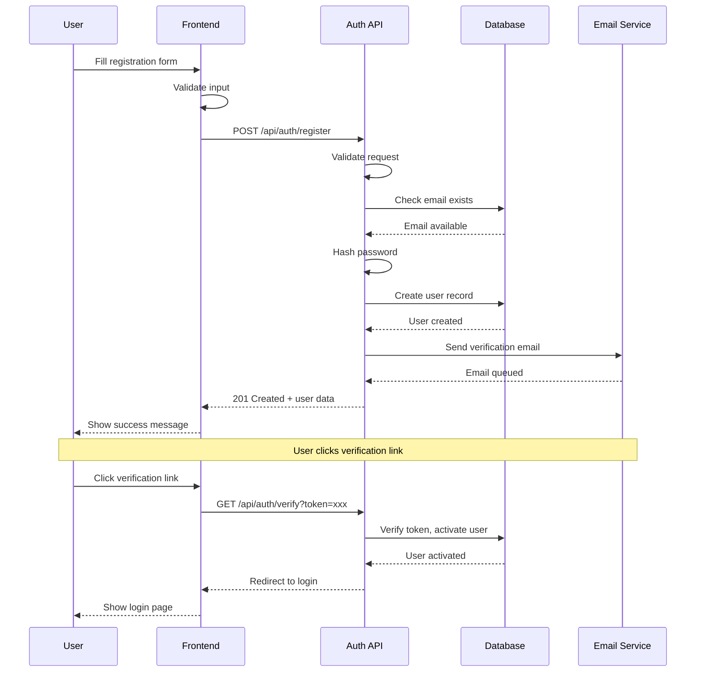

# Pilot Space - Feature Specification

## Overview

This document expands on the inherited Plane features with Pilot Space-specific AI-augmented capabilities. Features are organized by category and include implementation priority, AI integration points, and user value.

---

## Feature Categories

```
┌─────────────────────────────────────────────────────────────────┐
│                    FEATURE CATEGORIES                           │
├─────────────────────────────────────────────────────────────────┤
│                                                                 │
│  ┌─────────────────────────────────────────────────────────┐   │
│  │                CORE PM (Inherited from Plane)            │   │
│  │  Issues • Cycles • Modules • Pages • Views • Labels      │   │
│  └─────────────────────────────────────────────────────────┘   │
│                              │                                  │
│                              ▼                                  │
│  ┌─────────────────────────────────────────────────────────┐   │
│  │                AI-AUGMENTED LAYER                         │   │
│  │  Smart Creation • Code Review • Documentation • Planning  │   │
│  └─────────────────────────────────────────────────────────┘   │
│                              │                                  │
│                              ▼                                  │
│  ┌─────────────────────────────────────────────────────────┐   │
│  │                INTEGRATION LAYER                          │   │
│  │  VCS (GitHub) • Communication (Slack)                     │   │
│  └─────────────────────────────────────────────────────────┘   │
│                              │                                  │
│                              ▼                                  │
│  ┌─────────────────────────────────────────────────────────┐   │
│  │                ENTERPRISE LAYER                           │   │
│  │  RBAC • SSO • Audit • Compliance • Analytics              │   │
│  └─────────────────────────────────────────────────────────┘   │
│                                                                 │
└─────────────────────────────────────────────────────────────────┘
```

---

## Issue & Task Management

### PS-001: AI-Enhanced Issue Creation

**Priority**: MVP
**Category**: AI-Augmented

#### Description
When creating an issue, AI assists the user by enhancing titles, expanding descriptions, suggesting labels/priorities, detecting duplicates, and recommending assignees.

#### User Stories

| ID | As a | I want to | So that |
|----|------|-----------|---------|
| US-001.1 | Developer | have AI suggest a clearer issue title | the issue is searchable and well-defined |
| US-001.2 | Developer | have AI expand my brief description | acceptance criteria are comprehensive |
| US-001.3 | PM | see suggested labels and priority | triage is faster and more consistent |
| US-001.4 | Team Lead | be warned of potential duplicates | we avoid redundant work |
| US-001.5 | PM | see recommended assignees based on expertise | work is routed to the right people |

#### AI Integration Points

```yaml
triggers:
  - event: issue.title_input
    action: suggest_enhanced_title
    confidence_threshold: 0.7

  - event: issue.description_input
    action: expand_description
    includes: [acceptance_criteria, technical_notes]

  - event: issue.before_create
    action: suggest_metadata
    outputs: [labels, priority, assignees]

  - event: issue.before_create
    action: detect_duplicates
    threshold: 0.8
```

#### UI/UX

```
┌─────────────────────────────────────────────────────────────────┐
│                    CREATE ISSUE                                  │
├─────────────────────────────────────────────────────────────────┤
│                                                                 │
│  Title: [Fix login bug                              ]          │
│         ┌───────────────────────────────────────────┐          │
│         │ ✨ AI Suggestion:                          │          │
│         │ "Fix authentication failure on expired    │          │
│         │  session tokens"                          │          │
│         │ [Accept] [Modify] [Dismiss]               │          │
│         └───────────────────────────────────────────┘          │
│                                                                 │
│  Description:                                                   │
│  ┌─────────────────────────────────────────────────────────┐   │
│  │ Users cannot log in after session expires               │   │
│  │                                                         │   │
│  │ ✨ AI Enhanced:                                          │   │
│  │ ## Problem                                              │   │
│  │ Users report inability to log in after session...       │   │
│  │                                                         │   │
│  │ ## Acceptance Criteria                                  │   │
│  │ - [ ] Expired tokens trigger re-auth flow              │   │
│  │ - [ ] User sees clear error message                    │   │
│  │ - [ ] Session refresh works before expiry              │   │
│  └─────────────────────────────────────────────────────────┘   │
│                                                                 │
│  ┌─────────────────────────────────────────────────────────┐   │
│  │ ✨ AI Suggestions                                        │   │
│  │                                                         │   │
│  │ Labels: [bug] [authentication] [high-priority]          │   │
│  │ Priority: High (similar issues were marked high)        │   │
│  │ Assignee: @alice (owns auth-service, 85% match)        │   │
│  │                                                         │   │
│  │ ⚠️ Potential Duplicate: PROJ-234 (72% similarity)       │   │
│  │    "Session timeout causes login loop"                  │   │
│  │    [View] [Link as Related] [Proceed Anyway]           │   │
│  └─────────────────────────────────────────────────────────┘   │
│                                                                 │
│  [Cancel]                               [Create Issue]          │
│                                                                 │
└─────────────────────────────────────────────────────────────────┘
```

---

### PS-002: Smart Task Decomposition

**Priority**: MVP
**Category**: AI-Augmented

#### Description
AI automatically decomposes epics and feature requests into actionable tasks with estimates, dependencies, and acceptance criteria.

#### User Stories

| ID | As a | I want to | So that |
|----|------|-----------|---------|
| US-002.1 | PM | AI to break down features into tasks | sprint planning is faster |
| US-002.2 | Architect | tasks to include technical considerations | implementation is well-planned |
| US-002.3 | Team Lead | to see effort estimates | I can plan capacity |
| US-002.4 | Developer | to see dependencies identified | I know the order of work |

#### AI Behavior

```
Input: Feature Description
         │
         ▼
┌─────────────────────────────────────────────────────────────────┐
│                    DECOMPOSITION ENGINE                         │
├─────────────────────────────────────────────────────────────────┤
│                                                                 │
│  1. Parse feature intent and scope                              │
│  2. Identify required system components                         │
│  3. Generate task breakdown:                                    │
│     • Frontend tasks                                            │
│     • Backend tasks                                             │
│     • Database tasks                                            │
│     • Testing tasks                                             │
│     • Documentation tasks                                       │
│  4. Estimate based on historical data                           │
│  5. Identify dependencies between tasks                         │
│  6. Flag risks and uncertainties                                │
│                                                                 │
└─────────────────────────────────────────────────────────────────┘
         │
         ▼
Output: Structured Task List with Metadata
```

---

### PS-003: Custom Workflows with AI Transitions

**Priority**: Phase 2
**Category**: AI-Augmented

#### Description
Custom state workflows with AI-powered automatic transitions based on events and conditions.

#### Features

| Feature | Description |
|---------|-------------|
| Custom States | Define workflow states per project |
| Transition Rules | Conditional state changes |
| AI Auto-Transition | AI suggests/executes transitions |
| Workflow Templates | Pre-built workflows (Scrum, Kanban, Custom) |

#### AI Transition Rules

```yaml
workflows:
  default:
    states:
      - name: Backlog
        group: unstarted
      - name: Ready for Dev
        group: unstarted
      - name: In Progress
        group: started
      - name: Code Review
        group: started
      - name: QA
        group: started
      - name: Done
        group: completed

    ai_transitions:
      - trigger: pr_created
        from: "In Progress"
        to: "Code Review"
        auto: true

      - trigger: pr_merged
        from: "Code Review"
        to: "QA"
        auto: true
        condition: "has_qa_label"

      - trigger: pr_merged
        from: "Code Review"
        to: "Done"
        auto: true
        condition: "not has_qa_label"

      - trigger: ai_detected
        from: "In Progress"
        to: "Blocked"
        condition: "no_activity_3_days AND has_dependencies"
        notify: [assignee, lead]
```

---

## Documentation & Knowledge Management

### PS-004: AI Documentation Generator

**Priority**: MVP
**Category**: AI-Augmented

#### Description
Generate comprehensive documentation from code, issues, and discussions with AI assistance.

#### Documentation Types

| Type | Source | Trigger | Output Format |
|------|--------|---------|---------------|
| **API Docs** | Code + OpenAPI | PR merge, On-demand | Markdown, Swagger |
| **Architecture Docs** | Code structure, ADRs | Weekly, On-demand | Markdown + Diagrams |
| **Component Docs** | Code + Comments | File change | Markdown |
| **Decision Records** | Issue discussions | Manual tag | ADR Template |
| **Release Notes** | Commits + Issues | Release tag | Changelog |
| **Onboarding Docs** | Codebase analysis | On-demand | Tutorial format |

#### AI Generation Pipeline

```
┌─────────────────────────────────────────────────────────────────┐
│              DOCUMENTATION GENERATION PIPELINE                  │
├─────────────────────────────────────────────────────────────────┤
│                                                                 │
│  Source Analysis                                                │
│  ┌─────────────┐  ┌─────────────┐  ┌─────────────┐            │
│  │    Code     │  │   Issues    │  │  Comments   │            │
│  │  Analysis   │  │  History    │  │ Discussions │            │
│  └──────┬──────┘  └──────┬──────┘  └──────┬──────┘            │
│         │                │                │                    │
│         └────────────────┴────────────────┘                    │
│                          │                                      │
│                          ▼                                      │
│  ┌───────────────────────────────────────────────────────────┐ │
│  │                  CONTEXT ASSEMBLY                          │ │
│  │  • Extract function signatures                             │ │
│  │  • Parse existing comments                                 │ │
│  │  • Identify related issues                                 │ │
│  │  • Find usage examples                                     │ │
│  └───────────────────────────────────────────────────────────┘ │
│                          │                                      │
│                          ▼                                      │
│  ┌───────────────────────────────────────────────────────────┐ │
│  │                  GENERATION                                │ │
│  │  • Apply documentation template                            │ │
│  │  • Generate prose descriptions                             │ │
│  │  • Create code examples                                    │ │
│  │  • Add cross-references                                    │ │
│  └───────────────────────────────────────────────────────────┘ │
│                          │                                      │
│                          ▼                                      │
│  ┌───────────────────────────────────────────────────────────┐ │
│  │                  HUMAN REVIEW                              │ │
│  │  • Present draft for review                                │ │
│  │  • Highlight AI-generated sections                         │ │
│  │  • Allow inline editing                                    │ │
│  │  • Publish on approval                                     │ │
│  └───────────────────────────────────────────────────────────┘ │
│                                                                 │
└─────────────────────────────────────────────────────────────────┘
```

---

### PS-005: Architecture Decision Records (ADRs)

**Priority**: Phase 2
**Category**: AI-Augmented

#### Description
AI-assisted creation and maintenance of Architecture Decision Records.

#### ADR Template

```markdown
# ADR-{number}: {title}

## Status
{Proposed | Accepted | Deprecated | Superseded}

## Context
{AI-generated from issue discussions and code analysis}

What is the issue that we're seeing that is motivating this decision?

## Decision
{User-provided, AI-enhanced}

What is the change that we're proposing or have agreed to implement?

## Consequences
{AI-generated based on codebase analysis}

### Positive
- {benefit 1}
- {benefit 2}

### Negative
- {tradeoff 1}
- {tradeoff 2}

### Neutral
- {observation}

## Alternatives Considered
{AI-generated from research and discussion}

### Option A: {name}
- Pros: ...
- Cons: ...

### Option B: {name}
- Pros: ...
- Cons: ...

## Related
- Supersedes: ADR-{n}
- Related Issues: {links}
- Related Code: {file paths}
```

#### AI Assistance

| Field | AI Capability |
|-------|---------------|
| Context | Extract from linked issues and discussions |
| Consequences | Analyze codebase impact |
| Alternatives | Research and compare options |
| Related | Link to relevant ADRs, issues, code |

---

### PS-006: AI Diagram Generator

**Priority**: MVP
**Category**: AI-Augmented

#### Description
Generate architectural and technical diagrams from natural language descriptions or code analysis.

#### Supported Diagrams

| Type | Description | Formats Supported |
|------|-------------|-------------------|
| **Sequence** | API flows, interactions | Mermaid, PlantUML |
| **Class** | Domain models, relationships | Mermaid, PlantUML |
| **C4 Context** | System context view | C4-PlantUML, Structurizr DSL |
| **C4 Container** | Container architecture | C4-PlantUML, Structurizr DSL |
| **C4 Component** | Component details | C4-PlantUML, Structurizr DSL |
| **C4 Code** | Code-level detail | C4-PlantUML |
| **ERD** | Database schema | Mermaid, PlantUML |
| **Flowchart** | Process flows | Mermaid, PlantUML |
| **State** | State machines | Mermaid, PlantUML |
| **Activity** | Business processes | PlantUML |
| **Deployment** | Infrastructure diagrams | PlantUML, C4 |
| **Mind Map** | Concept visualization | Mermaid, PlantUML |

#### Notation Standards Support

| Standard | Implementation | Use Case |
|----------|----------------|----------|
| **Mermaid** | Native markdown embedding | Quick diagrams, documentation pages |
| **PlantUML** | Server-side rendering | Expressive UML, complex diagrams |
| **C4 Model** | C4-PlantUML library | Architecture documentation (4 levels) |
| **Structurizr** | DSL export | Architecture-as-code |
| **ArchiMate** | PlantUML-ArchiMate | Enterprise architecture modeling |

**Diagram Rendering Pipeline:**

```
┌─────────────────────────────────────────────────────────────────┐
│                 DIAGRAM GENERATION PIPELINE                      │
├─────────────────────────────────────────────────────────────────┤
│                                                                  │
│  Input                          Processing                       │
│  ┌─────────────┐               ┌─────────────┐                  │
│  │ Natural     │──────────────▶│ AI generates│                  │
│  │ Language    │               │ diagram code│                  │
│  └─────────────┘               └──────┬──────┘                  │
│                                       │                          │
│  ┌─────────────┐               ┌──────▼──────┐                  │
│  │ Code        │──────────────▶│  Format     │                  │
│  │ Analysis    │               │  Selection  │                  │
│  └─────────────┘               └──────┬──────┘                  │
│                                       │                          │
│                   ┌───────────────────┼───────────────────┐     │
│                   │                   │                   │     │
│                   ▼                   ▼                   ▼     │
│            ┌──────────┐       ┌──────────┐       ┌──────────┐  │
│            │ Mermaid  │       │ PlantUML │       │ C4 Model │  │
│            │ (inline) │       │ (server) │       │ (server) │  │
│            └────┬─────┘       └────┬─────┘       └────┬─────┘  │
│                 │                  │                  │         │
│                 └──────────────────┴──────────────────┘         │
│                                    │                             │
│                                    ▼                             │
│                            ┌──────────────┐                     │
│                            │ SVG/PNG      │                     │
│                            │ Output       │                     │
│                            └──────────────┘                     │
│                                                                  │
└─────────────────────────────────────────────────────────────────┘
```

#### Generation Modes

```yaml
modes:
  natural_language:
    input: "Show how the authentication flow works"
    output: sequence_diagram
    formats: [mermaid, plantuml]  # User selectable

  code_analysis:
    input: "src/services/auth/*"
    output: class_diagram
    formats: [mermaid, plantuml]

  database_reverse:
    input: database_connection
    output: erd_diagram
    formats: [mermaid, plantuml]

  architecture_scan:
    input: codebase_root
    output: c4_container_diagram
    formats: [c4_plantuml, structurizr]

  architecture_document:
    input: architecture_description
    output: c4_all_levels  # Context → Container → Component → Code
    formats: [c4_plantuml]

format_preferences:
  default: mermaid        # For inline markdown embedding
  complex_uml: plantuml   # For advanced UML needs
  architecture: c4        # For architecture documentation
```

#### C4 Model Integration

**C4 Level Support:**

| Level | Description | Auto-Generate From |
|-------|-------------|-------------------|
| **Context** | System in environment | Project description, integrations |
| **Container** | High-level tech | Codebase structure, docker-compose |
| **Component** | Internal structure | Module/service analysis |
| **Code** | Class/function level | Direct code analysis |

**Example C4 Generation:**

```
User: Generate C4 diagrams for the authentication module

AI Response:

### Level 1: System Context
[C4-PlantUML diagram showing Pilot Space with external systems]

### Level 2: Container
[C4-PlantUML showing API, Database, Redis, external auth providers]

### Level 3: Component
[C4-PlantUML showing AuthController, AuthService, UserRepository, TokenManager]

[Export All as PDF] [Copy PlantUML Code] [Insert into Page]
```

#### Example Interaction

**User**: Generate a sequence diagram for the user registration flow

**AI Response**:



---

## Code Review & Quality

### PS-007: AI Architecture Review

**Priority**: MVP
**Category**: AI-Augmented

#### Description
Automated architecture compliance checking on pull requests with AI-powered analysis.

#### Review Dimensions

| Dimension | Checks |
|-----------|--------|
| **Pattern Compliance** | Service layer boundaries, repository pattern, DI |
| **Layer Boundaries** | No direct DB access from controllers, proper abstraction |
| **Dependency Direction** | Domain doesn't depend on infrastructure |
| **API Design** | REST conventions, versioning, error handling |
| **Security** | Input validation, auth checks, secrets handling |
| **Performance** | N+1 queries, blocking in async, memory leaks |

#### Review Output

```markdown
## 🏗️ Architecture Review for PR #234

### Compliance Score: 78/100

---

### Critical Issues (2)

#### 1. Layer Violation: Direct DB Access in Controller
📍 `src/controllers/user_controller.py:45-52`

```python
# Current (violation)
class UserController:
    def get_user(self, user_id):
        return db.query(User).filter_by(id=user_id).first()

# Recommended
class UserController:
    def __init__(self, user_service: UserService):
        self._user_service = user_service

    def get_user(self, user_id):
        return self._user_service.get_by_id(user_id)
```

**Rationale**: Controllers should not access database directly. Use service layer for business logic.
**Reference**: ADR-0015 - Service Layer Pattern

---

#### 2. Missing Input Validation
📍 `src/api/endpoints/orders.py:89`

```python
# Current (missing validation)
@router.post("/orders")
def create_order(data: dict):
    return order_service.create(data)

# Recommended
@router.post("/orders")
def create_order(data: CreateOrderDTO):  # Pydantic model
    return order_service.create(data)
```

---

### Warnings (3)

1. **Unused dependency imported** - `src/services/payment.py:3`
2. **Consider extracting method** - `src/services/order.py:45-78` (34 lines)
3. **Missing type hints** - `src/utils/helpers.py` (5 functions)

---

### Good Practices Detected ✅

- Proper dependency injection in `PaymentService`
- Clear separation of concerns in `OrderModule`
- Comprehensive error handling in API layer

---

### Suggested Follow-ups

- [ ] Create tech debt ticket for layer violation fix
- [ ] Add Pydantic models for remaining endpoints
- [ ] Update architecture documentation

[View Full Report] [Request Human Review] [Approve with Notes]
```

---

### PS-008: AI Code Review

**Priority**: MVP (Unified with PS-007 as "AI PR Review")
**Category**: AI-Augmented

#### Description
Comprehensive code review with focus on quality, security, and maintainability. Combined with PS-007 (Architecture Review) as a unified "AI PR Review" feature.

#### Review Categories

```yaml
review_categories:
  security:
    - sql_injection
    - xss_vulnerabilities
    - authentication_bypass
    - sensitive_data_exposure
    - insecure_dependencies

  quality:
    - code_duplication
    - complexity_metrics
    - naming_conventions
    - dead_code
    - magic_numbers

  performance:
    - n_plus_one_queries
    - blocking_io_in_async
    - memory_leaks
    - inefficient_algorithms
    - missing_indexes

  testing:
    - coverage_gaps
    - missing_edge_cases
    - test_quality
    - mocking_issues

  documentation:
    - missing_docstrings
    - outdated_comments
    - api_doc_gaps
```

---

## Sprint & Agile Features

### PS-009: AI Sprint Planning Assistant

**Priority**: Phase 2
**Category**: AI-Augmented

#### Description
AI-powered sprint planning with velocity prediction, workload balancing, and risk identification.

#### Features

| Feature | Description |
|---------|-------------|
| **Velocity Prediction** | ML-based velocity forecast |
| **Capacity Planning** | Match work to team capacity |
| **Workload Balance** | Distribute work evenly |
| **Risk Identification** | Flag high-risk items |
| **Dependency Mapping** | Identify blocking dependencies |
| **Composition Suggestions** | Recommend sprint contents |

#### Planning Dashboard

```
┌─────────────────────────────────────────────────────────────────┐
│                    SPRINT PLANNING ASSISTANT                    │
├─────────────────────────────────────────────────────────────────┤
│                                                                 │
│  Sprint: Sprint 24 (Jan 20 - Feb 3)                            │
│                                                                 │
│  ┌─────────────────────────────────────────────────────────┐   │
│  │ VELOCITY PREDICTION                                      │   │
│  │                                                          │   │
│  │ Predicted: 42 points (±5)                               │   │
│  │ Historical Avg: 38 points                               │   │
│  │ Confidence: 85%                                         │   │
│  │                                                          │   │
│  │ Factors:                                                 │   │
│  │ ✅ Full team available                                  │   │
│  │ ✅ No major holidays                                    │   │
│  │ ⚠️ 2 new team members (adjustment: -3 pts)              │   │
│  └─────────────────────────────────────────────────────────┘   │
│                                                                 │
│  ┌─────────────────────────────────────────────────────────┐   │
│  │ RECOMMENDED COMPOSITION                                  │   │
│  │                                                          │   │
│  │ Must Include (P0):                                       │   │
│  │ • AUTH-234: Password reset (5 pts) - P0 deadline        │   │
│  │ • API-567: Rate limiting (3 pts) - Security fix         │   │
│  │                                                          │   │
│  │ Recommended (Balanced Load):                            │   │
│  │ • FE-890: Dashboard redesign (8 pts) - UX priority      │   │
│  │ • BE-123: Cache optimization (5 pts) - Performance      │   │
│  │                                                          │   │
│  │ Risk Items (Consider Spike):                            │   │
│  │ • INTEG-456: API migration (13 pts) - High uncertainty  │   │
│  │   ⚠️ Recommend: Create 3-pt spike first                 │   │
│  └─────────────────────────────────────────────────────────┘   │
│                                                                 │
│  ┌─────────────────────────────────────────────────────────┐   │
│  │ TEAM CAPACITY                                            │   │
│  │                                                          │   │
│  │ Member    │ Avail │ Assigned │ Skills        │ Balance │   │
│  │ ──────────┼───────┼──────────┼───────────────┼─────────│   │
│  │ Alice     │ 100%  │ 13 pts   │ Backend       │ ✅      │   │
│  │ Bob       │ 80%   │ 10 pts   │ Frontend      │ ✅      │   │
│  │ Carol     │ 50%   │ 8 pts    │ Full-stack    │ ⚠️ High │   │
│  │ Dave      │ 100%  │ 0 pts    │ QA            │ ❌ Low  │   │
│  │                                                          │   │
│  │ [Rebalance Automatically]                               │   │
│  └─────────────────────────────────────────────────────────┘   │
│                                                                 │
│  Total: 31/42 points allocated                                 │
│                                                                 │
│  [Auto-fill Remaining] [Finalize Sprint]                       │
│                                                                 │
└─────────────────────────────────────────────────────────────────┘
```

---

### PS-010: AI Retrospective Analyst

**Priority**: Phase 2
**Category**: AI-Augmented

#### Description
AI-generated sprint retrospective insights with data-driven recommendations.

#### Analysis Dimensions

| Dimension | Metrics |
|-----------|---------|
| **Velocity** | Completed vs planned, trend analysis |
| **Quality** | Bug injection rate, rework percentage |
| **Flow** | Cycle time, blocked time, WIP |
| **Team** | Workload distribution, collaboration patterns |
| **Patterns** | Recurring blockers, estimation accuracy |

#### Retrospective Report

```markdown
# Sprint 23 Retrospective Analysis

## Executive Summary

Sprint 23 achieved 87% completion with 38/44 points delivered. Overall performance was above average with notable improvements in code review turnaround.

---

## What Went Well 🎉

### 1. Code Review Efficiency Improved
- Average review time: 4.2 hours (↓25% from Sprint 22)
- Contributing factors:
  - Smaller PR sizes (avg 150 lines vs 280)
  - AI review pre-screening
  - Dedicated review slots

### 2. Zero Critical Bugs in Production
- All 3 bugs caught in QA stage
- Test coverage increased to 82%

### 3. Strong Team Collaboration
- 15 cross-team PR reviews
- 89% of blocked items resolved within 24h

---

## What Needs Improvement 📈

### 1. Estimation Accuracy for Frontend Tasks
- Frontend tasks averaged 40% over estimate
- Pattern: UI tasks with "simple" label were most inaccurate

**Recommendation**: Add UI complexity checklist to estimation

### 2. Dependency Management
- 3 items blocked by external team dependencies
- Average blocked time: 2.3 days

**Recommendation**: Identify external dependencies in planning

### 3. Documentation Debt
- 4 features shipped without updated docs
- API documentation 2 sprints behind

**Recommendation**: Make docs part of Definition of Done

---

## Metrics Deep Dive

### Velocity Trend
```
Sprint 20: ████████████████████ 35 pts
Sprint 21: ██████████████████████ 38 pts
Sprint 22: █████████████████████████ 42 pts
Sprint 23: ████████████████████████ 38 pts
```

### Cycle Time Distribution
- P90: 4.2 days
- Median: 2.1 days
- Outliers: 2 items (AUTH-234, INTEG-456)

### Team Workload Balance
- Highest: Carol (14 pts, 112% capacity)
- Lowest: Dave (6 pts, 48% capacity)
- Gini coefficient: 0.23 (moderate imbalance)

---

## AI-Generated Discussion Topics

1. **Should we cap WIP per developer?**
   Carol had 4 concurrent items, correlation with longer cycle times.

2. **Frontend estimation process review**
   Consider poker planning specifically for UI tasks.

3. **External dependency tracking**
   Add dependency status to daily standup?

---

## Action Items (AI Suggested)

- [ ] Create estimation checklist for UI tasks
- [ ] Add external dependency tracking board
- [ ] Schedule documentation catch-up day
- [ ] Review Carol's workload for next sprint
```

---

## Integration Features

### PS-011: GitHub Integration

**Priority**: MVP
**Category**: Integration

See [INTEGRATION_ARCHITECTURE.md](./INTEGRATION_ARCHITECTURE.md) for detailed specification.

#### Key Features
- PR linking with status tracking
- Commit tracking with issue mentions
- AI code review posted as PR comments
- Branch naming integration
- Repository linking to projects

> **Note**: GitLab integration deferred to Phase 2. See DESIGN_DECISIONS.md DD-004.

---

### PS-012: Additional VCS Integrations

**Priority**: Phase 2
**Category**: Integration

#### Deferred Integrations

| Integration | Status | Notes |
|-------------|--------|-------|
| GitLab | Phase 2 | MR linking, commits, AI review |
| Bitbucket | Removed | Lower priority, may reconsider |
| Jira | Removed | Complexity, users expected to migrate |
| Trello | Removed | Users expected to migrate fully |
| Asana | Removed | Users expected to migrate fully |

> **Decision**: See DESIGN_DECISIONS.md DD-004 for rationale on MVP integration scope.

---

### PS-013: Slack Integration

**Priority**: MVP
**Category**: Integration

#### Features

| Feature | Description |
|---------|-------------|
| **Notifications** | Rich notifications for issue events |
| **Issue Creation** | Create issues from Slack messages |
| **Slash Commands** | `/pilot search`, `/pilot create`, `/pilot sprint` |
| **URL Unfurling** | Rich previews for Pilot Space links |
| **Thread Sync** | Option to sync Slack threads as comments |

> **Note**: Discord integration deferred to Phase 2. See DESIGN_DECISIONS.md DD-004.

---

## Enterprise Features

### PS-014: Role-Based Access Control (RBAC)

**Priority**: Phase 3
**Category**: Enterprise

#### Permission Model

```yaml
roles:
  workspace_admin:
    description: Full workspace control
    permissions:
      - workspace.*
      - project.*
      - member.*
      - integration.*
      - billing.*

  project_admin:
    description: Full project control
    permissions:
      - project.{project_id}.*

  developer:
    description: Standard development access
    permissions:
      - issue.create
      - issue.update.assigned
      - issue.comment
      - page.create
      - page.update
      - cycle.view
      - module.view

  viewer:
    description: Read-only access
    permissions:
      - "*.view"

  guest:
    description: Limited external access
    permissions:
      - issue.view.public
      - page.view.public
      - comment.create.assigned_issues

custom_roles:
  - name: qa_lead
    extends: developer
    add_permissions:
      - issue.update.state
      - cycle.manage
    remove_permissions:
      - page.delete
```

---

### PS-015: SSO & LDAP Integration

**Priority**: Phase 3
**Category**: Enterprise

#### Supported Providers

| Provider | Protocol | Features |
|----------|----------|----------|
| **Google Workspace** | OAuth 2.0 / OIDC | User provisioning, group sync |
| **Azure AD** | SAML 2.0 / OIDC | User provisioning, role mapping |
| **Okta** | SAML 2.0 / OIDC | User provisioning, MFA |
| **LDAP/AD** | LDAP(S) | User sync, group mapping |
| **Custom OIDC** | OIDC | Standard OIDC provider |

---

### PS-016: Audit Logging

**Priority**: Phase 3
**Category**: Enterprise

#### Audit Events

```yaml
audit_categories:
  authentication:
    - user.login
    - user.logout
    - user.login_failed
    - user.mfa_enabled
    - user.password_changed

  authorization:
    - role.assigned
    - role.removed
    - permission.granted
    - permission.revoked

  data_access:
    - issue.viewed
    - page.viewed
    - export.initiated
    - api.accessed

  data_modification:
    - issue.created
    - issue.updated
    - issue.deleted
    - page.created
    - page.updated
    - page.deleted

  administration:
    - workspace.created
    - workspace.settings_changed
    - integration.connected
    - integration.disconnected
    - member.invited
    - member.removed
```

#### Audit Log Format

```json
{
  "id": "audit_123456",
  "timestamp": "2026-01-20T10:30:00Z",
  "category": "data_modification",
  "action": "issue.updated",
  "actor": {
    "id": "user_789",
    "email": "john@example.com",
    "ip_address": "192.168.1.100",
    "user_agent": "Mozilla/5.0..."
  },
  "resource": {
    "type": "issue",
    "id": "iss_456",
    "workspace_id": "ws_abc",
    "project_id": "proj_def"
  },
  "changes": {
    "state": {
      "from": "todo",
      "to": "in_progress"
    }
  },
  "metadata": {
    "request_id": "req_xyz",
    "session_id": "sess_abc"
  }
}
```

---

## Subscription Tiers

> **Important**: Pilot Space uses a **Support Tiers** model. All features are 100% free. Paid tiers provide support and SLA guarantees only.

### Pricing Model

| Tier | Price | Support Level |
|------|-------|---------------|
| **Community** | Free | GitHub issues, community forums |
| **Pro Support** | $10/seat/mo | Email support, 48h response SLA |
| **Business Support** | $18/seat/mo | Priority support, 24h SLA, dedicated Slack |
| **Enterprise** | Custom | Dedicated support, custom SLA, consulting |

### Feature Availability (All Tiers)

**All features are available to all users, including self-hosted Community Edition.**

| Feature | Available | Notes |
|---------|-----------|-------|
| Core PM (Issues, Cycles, Modules) | ✅ | Full functionality |
| Pages (Documentation) | ✅ | Standard editing (real-time in Phase 2) |
| Views with Filtering | ✅ | All layouts |
| Basic RBAC (Owner/Admin/Member/Guest) | ✅ | MVP |
| AI Issue Enhancement | ✅ | Requires BYOK |
| AI Task Decomposition | ✅ | Requires BYOK |
| AI PR Review (Code + Architecture) | ✅ | Requires BYOK |
| AI Documentation Generation | ✅ | Requires BYOK |
| Diagram Generation | ✅ | Requires BYOK |
| Semantic Search | ✅ | Requires BYOK |
| GitHub Integration | ✅ | PR linking, commits, review comments |
| Slack Integration | ✅ | Notifications, slash commands |
| Webhooks (Outbound) | ✅ | Custom integrations |
| API Access | ✅ | Full API |

### BYOK (Bring Your Own Key) for AI

AI features require users to provide their own LLM API keys:

| Provider | Supported | Best For | Setup |
|----------|-----------|----------|-------|
| OpenAI | ✅ | Documentation, search, general tasks | API key in workspace settings |
| Anthropic | ✅ | Code review, architecture analysis | API key in workspace settings |
| Google Gemini | ✅ | Large context, task planning | API key in workspace settings |
| Azure OpenAI | ✅ | Enterprise, compliance requirements | Endpoint + API key |

**No limits on AI usage** - users control their own costs directly with their LLM provider.

**Provider Routing**: The system intelligently routes tasks to the most suitable provider based on task type. Users can configure preferred providers per workspace or project.

### What Paid Tiers Provide

| Benefit | Pro | Business | Enterprise |
|---------|-----|----------|------------|
| Email Support | ✅ | ✅ | ✅ |
| Response SLA | 48h | 24h | Custom |
| Dedicated Slack Channel | ❌ | ✅ | ✅ |
| Onboarding Assistance | ❌ | ✅ | ✅ |
| Architecture Consulting | ❌ | ❌ | ✅ |
| Custom Development | ❌ | ❌ | ✅ |
| Training Sessions | ❌ | ❌ | ✅ |

---

## AI Context & Task Execution

### PS-017: AI Context for Issues

**Priority**: MVP
**Category**: AI-Augmented

#### Description
Comprehensive AI context aggregation for issues that collects all related context (documents, linked issues, codebase references) and generates actionable tasks optimized for AI-assisted implementation with Claude Code.

#### User Stories

| ID | As a | I want to | So that |
|----|------|-----------|---------|
| US-017.1 | Developer | see all context related to an issue in one view | I understand the full scope before implementation |
| US-017.2 | Developer | have AI generate implementation tasks from context | I can execute work efficiently with Claude Code |
| US-017.3 | Developer | copy complete context as markdown | I can paste into Claude Code for AI-assisted development |
| US-017.4 | Developer | refine context through AI chat | the generated tasks better match my requirements |
| US-017.5 | Team Lead | share context views with team members | everyone has the same understanding of requirements |
| US-017.6 | Developer | see task dependencies visualized | I know the correct order of implementation |

#### AI Context Components

```
┌─────────────────────────────────────────────────────────────────┐
│                    AI CONTEXT TAB                                │
├─────────────────────────────────────────────────────────────────┤
│                                                                  │
│  ┌─────────────────────────────────────────────────────────┐    │
│  │                  CONTEXT SUMMARY                         │    │
│  │  • 3 Related Issues • 2 Documents • 5 Files • 2 PRs     │    │
│  │  • Last updated: 5 min ago                               │    │
│  │  [Copy All Context] [Regenerate]                        │    │
│  └─────────────────────────────────────────────────────────┘    │
│                                                                  │
│  ┌─────────────────────────────────────────────────────────┐    │
│  │ RELATED CONTEXT                                          │    │
│  │                                                          │    │
│  │ Issues:                                                  │    │
│  │ ├── PS-201 [BLOCKS] Simplify password reset             │    │
│  │ ├── PS-202 [RELATES] OAuth error handling               │    │
│  │ └── PS-203 [BLOCKED BY] Session timeout settings        │    │
│  │                                                          │    │
│  │ Documents:                                               │    │
│  │ ├── [NOTE] Authentication Refactor Planning             │    │
│  │ ├── [ADR] ADR-0015: Error Handling in Auth Flows        │    │
│  │ └── [SPEC] OAuth Integration Specification              │    │
│  └─────────────────────────────────────────────────────────┘    │
│                                                                  │
│  ┌─────────────────────────────────────────────────────────┐    │
│  │ CODEBASE CONTEXT                                         │    │
│  │                                                          │    │
│  │ Relevant Files (Semantic + Tagged):                     │    │
│  │ ├── src/services/auth/oauth.py [MODIFIED]               │    │
│  │ │   ├── class OAuthService                              │    │
│  │ │   └── def handle_callback()                           │    │
│  │ ├── src/api/auth/endpoints.py [REFERENCE]               │    │
│  │ └── tests/auth/test_oauth.py [NEW]                      │    │
│  │                                                          │    │
│  │ Git References:                                          │    │
│  │ ├── PR #234: OAuth retry logic (merged)                 │    │
│  │ └── Branch: feature/oauth-errors (3 commits ahead)      │    │
│  └─────────────────────────────────────────────────────────┘    │
│                                                                  │
│  ┌─────────────────────────────────────────────────────────┐    │
│  │ AI TASKS                                                 │    │
│  │                                                          │    │
│  │ Task Dependency Graph:                                   │    │
│  │ [1] ──→ [2] ──→ [3]                                     │    │
│  │          ↘       ↑                                       │    │
│  │           [4] ───┘                                       │    │
│  │                                                          │    │
│  │ Implementation Checklist:                                │    │
│  │ □ 1. Add retry logic to OAuthService (Bug Fix)          │    │
│  │ □ 2. Update error messages in auth endpoints            │    │
│  │ □ 3. Add integration tests for retry scenarios          │    │
│  │ □ 4. Update API documentation                           │    │
│  │                                                          │    │
│  │ Ready-to-Use Prompts:                                    │    │
│  │ ┌─────────────────────────────────────────────────┐     │    │
│  │ │ ## Task 1: Add Retry Logic                       │     │    │
│  │ │ Context: OAuth callbacks failing intermittently  │     │    │
│  │ │ Files: src/services/auth/oauth.py               │     │    │
│  │ │ ...                                              │     │    │
│  │ │ [Copy] [Execute with Claude Code]               │     │    │
│  │ └─────────────────────────────────────────────────┘     │    │
│  └─────────────────────────────────────────────────────────┘    │
│                                                                  │
│  ┌─────────────────────────────────────────────────────────┐    │
│  │ ENHANCE CONTEXT                                          │    │
│  │                                                          │    │
│  │ 🤖 I've analyzed the context. The main focus is OAuth   │    │
│  │    error handling with 3 actionable tasks identified.    │    │
│  │                                                          │    │
│  │ You: Can you add more context about the existing        │    │
│  │      retry implementation?                               │    │
│  │                                                          │    │
│  │ 🤖 Found existing retry logic in http_client.py. I've   │    │
│  │    added it to the codebase context section.            │    │
│  │                                                          │    │
│  │ [────────────────────────────────────] [Send]           │    │
│  └─────────────────────────────────────────────────────────┘    │
│                                                                  │
└─────────────────────────────────────────────────────────────────┘
```

#### Context Data Sources

| Source | Method | Update Frequency |
|--------|--------|------------------|
| **Related Issues** | Issue links, semantic similarity | On-demand |
| **Documents** | Explicit links, keyword matching | On-demand |
| **Codebase Files** | Semantic similarity, explicit tagging, AST analysis | On-demand |
| **Git References** | PR/branch linking, commit mentions | On-demand |
| **Historical Patterns** | Similar issue resolution history | Cached (daily) |

#### File Relevance Detection

```yaml
relevance_methods:
  semantic_similarity:
    description: AI embeds issue description and finds similar code chunks
    threshold: 0.75
    max_results: 20

  explicit_tagging:
    description: Files tagged in issue or linked documents
    priority: highest  # Always included

  ast_aware_context:
    description: Parse code to extract key functions, classes, imports
    languages: [python, typescript, javascript, go, rust, java]
    depth: function_level  # Not line-by-line
```

#### Code Context Depth

| Level | Included | Use Case |
|-------|----------|----------|
| **File paths** | Path, size, last modified | Overview |
| **Key functions/classes** | Signatures, docstrings | Implementation context |
| **AST-aware context** | Dependencies, call graph | Deep understanding |

#### Task Generation

```yaml
generation_modes:
  llm_generated:
    description: AI analyzes context and generates tasks
    model: claude-sonnet-4  # Best for code understanding
    confidence_required: 0.7

  historical_patterns:
    description: Learn from similar resolved issues
    lookback: 90_days
    min_similarity: 0.8

  manual_with_suggestions:
    description: User creates, AI suggests improvements
    suggestions: [missing_steps, better_ordering, estimate]

  templates:
    description: Pre-defined task templates
    types:
      - bug_fix
      - feature
      - refactor
      - custom
```

#### Task Templates

| Template | Structure | Best For |
|----------|-----------|----------|
| **Bug Fix** | Reproduce → Diagnose → Fix → Test → Document | Bug issues |
| **Feature** | Design → Implement → Test → Document → Review | New features |
| **Refactor** | Analyze → Plan → Execute → Verify → Document | Code improvements |
| **Custom** | User-defined structure | Specific workflows |

**Example Bug Fix Template**:
```markdown
## Bug Fix: {issue_title}

### Context
{ai_generated_context_summary}

### Steps
1. **Reproduce**: Verify the bug exists
   - [ ] Set up test environment
   - [ ] Follow reproduction steps
   - [ ] Confirm expected vs actual behavior

2. **Diagnose**: Identify root cause
   - [ ] Review relevant code: {file_paths}
   - [ ] Check logs and error messages
   - [ ] Identify the failing code path

3. **Fix**: Implement solution
   - [ ] Modify: {files_to_modify}
   - [ ] Handle edge cases
   - [ ] Follow existing patterns

4. **Test**: Verify fix
   - [ ] Add unit tests
   - [ ] Run existing test suite
   - [ ] Manual verification

5. **Document**: Update documentation
   - [ ] Add code comments if needed
   - [ ] Update relevant docs
```

#### Export Format

**Markdown for Claude Code**:
```markdown
# Issue: PS-202 - Handle OAuth Errors Gracefully

## Context Summary
This issue addresses intermittent OAuth callback failures...

## Related Context
### Issues
- PS-201 (BLOCKS): Simplify password reset flow
- PS-203 (BLOCKED BY): Session timeout settings

### Documents
- Authentication Refactor Planning (Note)
- ADR-0015: Error Handling in Auth Flows

## Codebase Context
### Files to Modify
- `src/services/auth/oauth.py` - OAuthService class
  - `handle_callback()` - Main callback handler
  - `refresh_token()` - Token refresh logic

### Reference Files
- `src/api/auth/endpoints.py` - API layer
- `tests/auth/test_oauth.py` - Existing tests

### Git Context
- PR #234: OAuth retry logic (merged) - Reference implementation
- Branch: feature/oauth-errors (3 commits ahead)

## Implementation Tasks
### Task 1: Add Retry Logic (Bug Fix Template)
**Priority**: High
**Estimate**: 2-3 hours
**Dependencies**: None

[Detailed task prompt...]

### Task 2: Update Error Messages
**Priority**: Medium
**Estimate**: 1 hour
**Dependencies**: Task 1

[Detailed task prompt...]

---
Generated by Pilot Space AI Context
Last Updated: 2026-01-21 10:30:00 UTC
```

#### Integrations

| Integration | Purpose | Implementation |
|-------------|---------|----------------|
| **GitHub API** | Fetch PR details, branch info, file contents | REST API calls |
| **IDE Extensions** | Open files directly, navigate to functions | Deep link protocol |
| **Claude Code CLI** | Execute tasks directly | `pilot-space execute --task <id>` |
| **MCP Tools** | AI tool access to codebase | MCP protocol support |
| **Skills** | Pre-defined AI workflows | Skill registry |
| **Hooks** | Custom automation triggers | Webhook system |

> **Note**: GitLab integration deferred to Phase 2. See DD-004 for rationale.

#### Interactive Refinement Chat

**Behavior**:
- Multi-turn conversation to iteratively improve context
- AI remembers conversation history within session
- User can ask for more context, different focus, or task modifications
- Changes reflected immediately in context view

**Example Interactions**:
- "Add more context about the retry implementation"
- "Focus tasks on the API layer only"
- "Generate tasks using the feature template instead"
- "What files are we missing?"

#### Task Dependencies

```yaml
dependency_management:
  mode: hybrid_with_validation

  ai_suggestions:
    description: AI infers dependencies from code analysis
    confidence_display: true
    validation_required: true

  user_validation:
    description: User can accept, modify, or reject suggested dependencies
    bulk_accept: true
    manual_override: true

  visualization:
    type: directed_graph
    interactive: true  # Click to focus, drag to reorder
```

#### Security Controls

| Control | Description | Phase |
|---------|-------------|-------|
| **Workspace-scoped** | Context limited to current workspace | MVP |
| **Permission-aware** | Respects user's access level | MVP |
| **Audit logging (Partial)** | AI context generations and operations logged | MVP |
| **Audit logging (Full)** | Complete audit trail (data access, modifications) | Phase 2 |
| **Sensitive file exclusion** | `.env`, credentials excluded by default | MVP |

#### Collaboration Features

| Feature | Description |
|---------|-------------|
| **Shared context views** | Team members see same context |
| **Context annotations** | Add notes to context items |
| **Context history** | View previous context generations |
| **Expert suggestions** | Route to team members with relevant expertise |

---

*Document Version: 1.4*
*Last Updated: 2026-01-21*
*Author: Pilot Space Team*
*Changes: Updated PS-017 integrations (GitHub only for MVP per DD-004), clarified audit logging scope (Partial MVP + Full Phase 2)*
