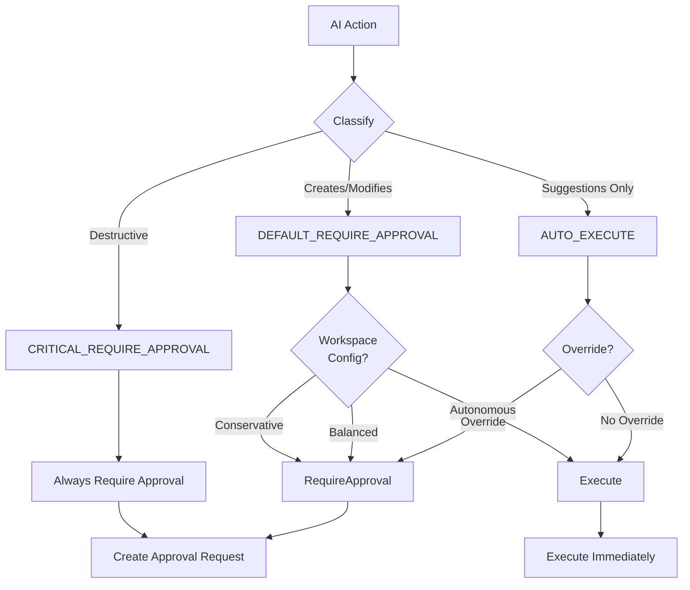
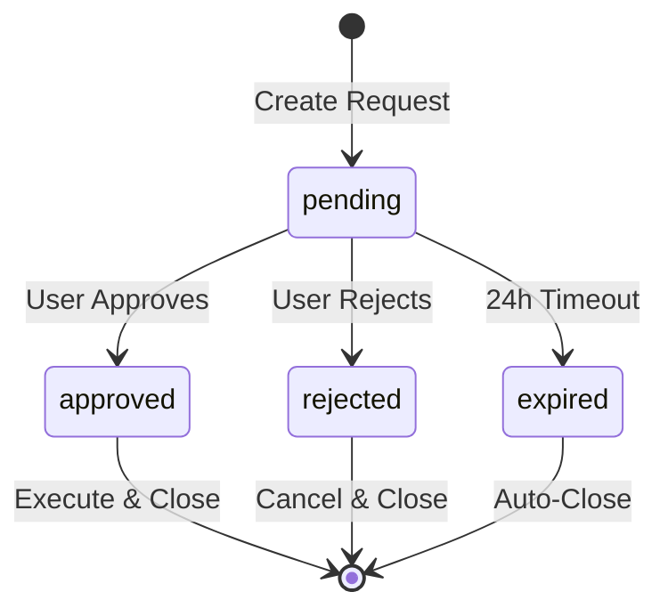

# Approval Workflow Documentation (T104)

Comprehensive guide to DD-003 human-in-the-loop approval implementation, including action classifications, UI flows, and integration patterns.

**Version**: 1.0 | **Last Updated**: 2026-01-28

---

## Table of Contents

- [Overview](#overview)
- [DD-003 Implementation](#dd-003-implementation)
- [Action Classifications](#action-classifications)
- [Approval Request Lifecycle](#approval-request-lifecycle)
- [Workspace Configuration](#workspace-configuration)
- [UI Flows](#ui-flows)
- [API Integration](#api-integration)
- [Security Considerations](#security-considerations)

---

## Overview

The **Approval Workflow** implements DD-003 (Human-in-the-Loop) to ensure users maintain control over AI actions. All AI-suggested actions are classified into three tiers, determining whether they auto-execute or require human approval.

**Design Philosophy**:
- **Human Agency**: Users retain final decision-making power
- **Progressive Trust**: Allow auto-execution as confidence grows
- **Transparency**: Clear visibility into AI actions and reasoning
- **Reversibility**: Approvals can be revoked within 24 hours

---

## DD-003 Implementation

### Three-Tier Classification



### Classification Matrix

| Action | Classification | Configurable | Default Behavior |
|--------|---------------|--------------|------------------|
| Delete issue/note/project | CRITICAL | ❌ No | Always require |
| Merge PR | CRITICAL | ❌ No | Always require |
| Bulk delete (>10 items) | CRITICAL | ❌ No | Always require |
| Create issues from note | DEFAULT | ✅ Yes | Require in Balanced |
| Extract issues | DEFAULT | ✅ Yes | Require in Balanced |
| Publish documentation | DEFAULT | ✅ Yes | Require in Balanced |
| Post PR comments | DEFAULT | ✅ Yes | Require in Balanced |
| Ghost text suggestions | AUTO | ✅ Yes | Always auto-execute |
| Margin annotations | AUTO | ✅ Yes | Always auto-execute |
| Suggest labels/priority | AUTO | ✅ Yes | Always auto-execute |
| AI context aggregation | AUTO | ✅ Yes | Always auto-execute |

---

## Action Classifications

### CRITICAL_REQUIRE_APPROVAL

**Characteristics**:
- Destructive, irreversible operations
- Cannot be overridden by workspace settings
- Require explicit approval every time
- 24-hour expiration for safety

**Examples**:

```python
# Delete Issue (CRITICAL)
@classify_action("critical_require")
async def delete_issue(issue_id: UUID):
    """Delete issue requires approval."""
    approval = await create_approval_request(
        action_type="delete_issue",
        description=f"Delete issue: {issue.name}",
        warning="⚠️ This action cannot be undone",
        classification="critical_require",
    )
    return {"approval_id": approval.id}

# Merge PR (CRITICAL)
@classify_action("critical_require")
async def merge_pr(repo_id: UUID, pr_number: int):
    """Merge PR requires approval."""
    approval = await create_approval_request(
        action_type="merge_pr",
        description=f"Merge PR #{pr_number} into main",
        warning="⚠️ Will deploy to production",
        classification="critical_require",
    )
    return {"approval_id": approval.id}
```

---

### DEFAULT_REQUIRE_APPROVAL

**Characteristics**:
- Creates or modifies entities
- Configurable per workspace (Conservative/Balanced/Autonomous)
- Defaults to requiring approval in Balanced mode
- Can be overridden in Autonomous mode

**Examples**:

```python
# Create Issues (DEFAULT)
@classify_action("default_require")
async def create_issues_from_note(note_id: UUID, issues: list):
    """Create issues requires approval in Balanced mode."""
    workspace_config = await get_workspace_config()

    if workspace_config.approval_level in ["conservative", "balanced"]:
        approval = await create_approval_request(
            action_type="create_issues",
            description=f"Create {len(issues)} issues from note",
            proposed_changes={"issues": issues},
            classification="default_require",
        )
        return {"approval_id": approval.id}
    else:
        # Auto-execute in Autonomous mode
        created = await batch_create_issues(issues)
        return {"issues_created": created}

# Post PR Comments (DEFAULT)
@classify_action("default_require")
async def post_pr_comments(repo_id: UUID, pr_number: int, comments: list):
    """Post PR review comments."""
    workspace_config = await get_workspace_config()

    if should_require_approval(workspace_config, "post_pr_comments"):
        approval = await create_approval_request(
            action_type="post_pr_comments",
            description=f"Post {len(comments)} review comments to PR #{pr_number}",
            proposed_changes={"comments": comments},
        )
        return {"approval_id": approval.id}
    else:
        posted = await github_client.post_comments(comments)
        return {"comments_posted": posted}
```

---

### AUTO_EXECUTE

**Characteristics**:
- Read-only or suggestion-only actions
- No data mutation
- Execute immediately unless overridden
- Lowest friction for users

**Examples**:

```python
# Ghost Text (AUTO)
@classify_action("auto_execute")
async def generate_ghost_text(context: str):
    """Ghost text always auto-executes."""
    suggestion = await ghost_text_agent.generate(context)
    return {"suggestion": suggestion}

# Margin Annotations (AUTO)
@classify_action("auto_execute")
async def create_margin_annotation(block_id: UUID, content: str):
    """Annotations auto-execute unless overridden."""
    workspace_config = await get_workspace_config()

    # Check for explicit override
    if workspace_config.approval_overrides.get("create_annotation"):
        approval = await create_approval_request(...)
        return {"approval_id": approval.id}

    # Default: auto-execute
    annotation = await annotation_service.create(block_id, content)
    return {"annotation_id": annotation.id}

# AI Context (AUTO)
@classify_action("auto_execute")
async def aggregate_ai_context(issue_id: UUID):
    """AI context aggregation auto-executes."""
    context = await ai_context_agent.execute(issue_id)
    return {"context": context}
```

---

## Approval Request Lifecycle

### State Machine



### Request Structure

```python
@dataclass
class ApprovalRequest:
    """Approval request entity."""
    id: UUID
    workspace_id: UUID
    user_id: UUID
    agent_name: str
    action_name: str
    classification: ActionClassification
    description: str
    proposed_changes: dict[str, Any]
    warning: str | None = None
    status: ApprovalStatus = ApprovalStatus.PENDING
    created_at: datetime
    expires_at: datetime  # created_at + 24 hours
    reviewed_by: UUID | None = None
    reviewed_at: datetime | None = None
    rejection_reason: str | None = None
```

### Lifecycle Events

```python
# 1. Create Approval Request
approval = await approval_service.create_approval_request(
    workspace_id=workspace_id,
    user_id=user_id,
    agent_name="issue_extractor",
    action_name="create_issues",
    classification=ActionClassification.DEFAULT_REQUIRE_APPROVAL,
    description="Create 3 issues from note content",
    proposed_changes={
        "issues": [
            {"name": "Issue 1", "description": "..."},
            {"name": "Issue 2", "description": "..."},
        ]
    },
)

# 2. User Approves
await approval_service.approve(
    approval_id=approval.id,
    reviewed_by=user_id,
)

# 3. Execute Action
result = await execute_approved_action(approval)

# 4. Close Request
await approval_service.mark_complete(approval.id, result)
```

---

## Workspace Configuration

### Approval Levels

#### CONSERVATIVE
**Philosophy**: Require approval for all AI actions except pure suggestions.

```json
{
  "approval_level": "conservative",
  "approval_overrides": {
    "create_issues": true,
    "extract_issues": true,
    "post_pr_comments": true,
    "create_annotation": true,
    "suggest_labels": true
  }
}
```

**Effect**: Even AUTO_EXECUTE actions require approval if overridden.

---

#### BALANCED (Default)
**Philosophy**: Require approval for significant changes, auto-execute suggestions.

```json
{
  "approval_level": "balanced",
  "approval_overrides": {}
}
```

**Effect**: DEFAULT actions require approval, AUTO actions execute immediately.

---

#### AUTONOMOUS
**Philosophy**: Trust AI for most actions, approve only critical operations.

```json
{
  "approval_level": "autonomous",
  "approval_overrides": {
    "create_issues": false,
    "post_pr_comments": false
  }
}
```

**Effect**: DEFAULT actions auto-execute unless overridden, CRITICAL still requires approval.

---

### Configuration API

```python
# Get workspace AI settings
GET /api/v1/workspaces/{workspace_id}/ai-settings
→ {
    "approval_level": "balanced",
    "approval_overrides": {...}
}

# Update approval level
PATCH /api/v1/workspaces/{workspace_id}/ai-settings
{
  "approval_level": "autonomous"
}

# Add action-specific override
PATCH /api/v1/workspaces/{workspace_id}/ai-settings
{
  "approval_overrides": {
    "create_issues": false  # Auto-execute in Autonomous
  }
}
```

---

## UI Flows

### Flow 1: Approval Request Notification

```
1. AI action triggers approval request
   → Backend creates ApprovalRequest, returns approval_id

2. Frontend receives approval_id
   → Shows toast notification: "AI action requires your approval"

3. User clicks notification
   → Opens approval modal with action details

4. User reviews proposed changes
   → Views diff, description, rationale

5. User approves or rejects
   → POST /api/v1/ai/approvals/{id}/approve | /reject

6. Backend executes action (if approved)
   → Returns result, updates UI
```

### Flow 2: Pending Approvals View

```
User navigates to Settings > AI > Pending Approvals

→ Shows list of pending approvals:
   - Description
   - Proposed changes preview
   - Time remaining (24h countdown)
   - Approve/Reject buttons

→ User bulk-approves safe actions
   → Multi-select + "Approve Selected" button

→ User rejects risky action with reason
   → Opens rejection modal, requires comment
```

### Flow 3: Approval History

```
User navigates to Settings > AI > Approval History

→ Shows historical approvals:
   - Approved/Rejected/Expired
   - Timestamp
   - Action description
   - Executed result (if approved)

→ User clicks to view details
   → Shows full approval record, execution log
```

---

## API Integration

### Client Implementation

```typescript
// frontend/src/services/api/approvals.ts
import { apiClient } from './client';

export interface ApprovalRequest {
  id: string;
  action_type: string;
  classification: string;
  description: string;
  proposed_changes: any;
  status: 'pending' | 'approved' | 'rejected' | 'expired';
  created_at: string;
  expires_at: string;
}

export const approvalsApi = {
  async getApproval(approvalId: string): Promise<ApprovalRequest> {
    const response = await apiClient.get(`/api/v1/ai/approvals/${approvalId}`);
    return response.data;
  },

  async approve(approvalId: string): Promise<ApprovalRequest> {
    const response = await apiClient.post(`/api/v1/ai/approvals/${approvalId}/approve`);
    return response.data;
  },

  async reject(approvalId: string, reason: string): Promise<ApprovalRequest> {
    const response = await apiClient.post(`/api/v1/ai/approvals/${approvalId}/reject`, {
      reason,
    });
    return response.data;
  },

  async listPending(): Promise<ApprovalRequest[]> {
    const response = await apiClient.get('/api/v1/ai/approvals', {
      params: { status: 'pending' },
    });
    return response.data.items;
  },
};
```

### MobX Store

```typescript
// frontend/src/stores/ai/ApprovalStore.ts
import { makeAutoObservable, runInAction } from 'mobx';
import { approvalsApi, ApprovalRequest } from '@/services/api/approvals';

export class ApprovalStore {
  pendingApprovals: ApprovalRequest[] = [];
  loading = false;

  constructor() {
    makeAutoObservable(this);
  }

  async loadPending() {
    this.loading = true;
    try {
      const approvals = await approvalsApi.listPending();
      runInAction(() => {
        this.pendingApprovals = approvals;
      });
    } finally {
      runInAction(() => {
        this.loading = false;
      });
    }
  }

  async approve(approvalId: string) {
    const approved = await approvalsApi.approve(approvalId);
    runInAction(() => {
      this.pendingApprovals = this.pendingApprovals.filter(a => a.id !== approvalId);
    });
    return approved;
  }

  async reject(approvalId: string, reason: string) {
    const rejected = await approvalsApi.reject(approvalId, reason);
    runInAction(() => {
      this.pendingApprovals = this.pendingApprovals.filter(a => a.id !== approvalId);
    });
    return rejected;
  }

  get pendingCount() {
    return this.pendingApprovals.length;
  }
}
```

---

## Security Considerations

### RLS Enforcement

All approval requests enforce Row-Level Security:

```sql
-- Only show approvals for user's workspace
CREATE POLICY approval_workspace_isolation ON ai_approval_requests
  FOR SELECT USING (workspace_id = current_setting('app.workspace_id')::uuid);

-- Only allow user to approve their own requests
CREATE POLICY approval_user_restriction ON ai_approval_requests
  FOR UPDATE USING (user_id = current_setting('app.user_id')::uuid);
```

### Expiration Safety

- Approval requests expire after 24 hours
- Expired requests cannot be approved
- Background job cleans up expired requests
- Prevents stale approvals from executing

### Audit Trail

All approval actions are logged:

```python
await audit_log.record(
    workspace_id=workspace_id,
    user_id=user_id,
    action="approval.approved",
    details={
        "approval_id": str(approval.id),
        "action_type": approval.action_type,
        "executed_result": result,
    },
)
```

---

## References

- **Design Decision DD-003**: Human-in-the-Loop Approval
- **API Documentation**: `docs/api/ai-chat-api.md#approvals`
- **Permission Handler**: `backend/src/pilot_space/ai/sdk/permission_handler.py`
- **Approval Service**: `backend/src/pilot_space/ai/infrastructure/approval.py`

---

**Last Updated**: 2026-01-28 | **Version**: 1.0
