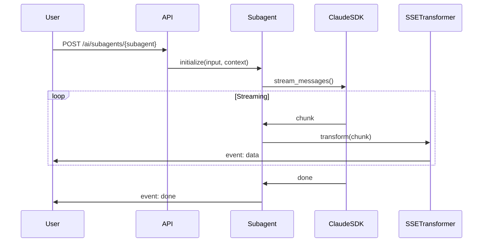
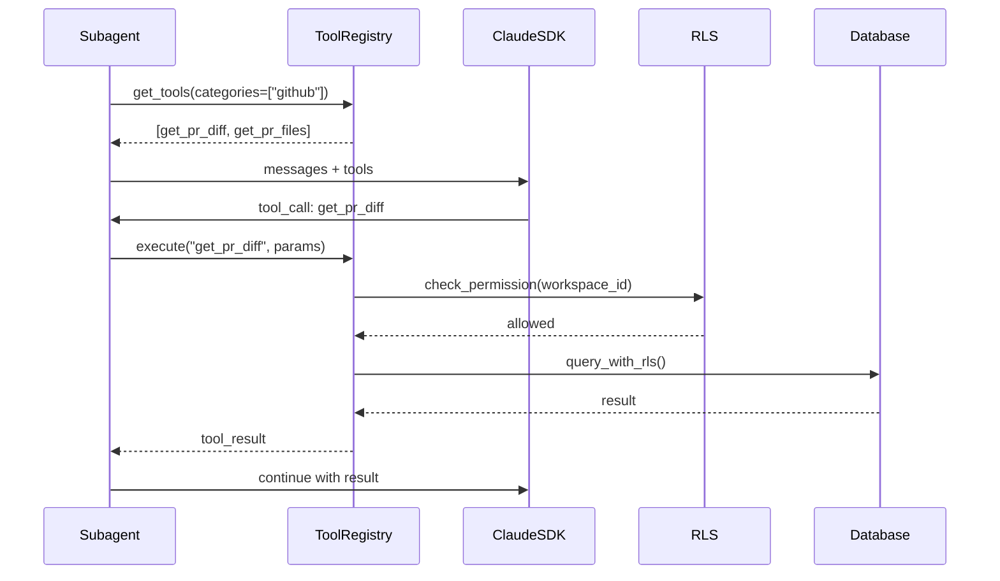

# Subagents Reference Documentation (T103)

Comprehensive reference for all 3 PilotSpace AI subagents, including delegation patterns and response formats.

**Version**: 1.0 | **Last Updated**: 2026-01-28

---

## Table of Contents

- [Overview](#overview)
- [Subagent Architecture](#subagent-architecture)
- [Available Subagents](#available-subagents)
  - [PRReviewSubagent](#prreviewsubagent)
  - [AIContextSubagent](#aicontextsubagent)
  - [DocGeneratorSubagent](#docgeneratorsubagent)
- [Delegation Patterns](#delegation-patterns)
- [Multi-Turn Conversations](#multi-turn-conversations)
- [Tool Access](#tool-access)

---

## Overview

**Subagents** are specialized AI agents that handle complex, multi-turn tasks requiring streaming responses and tool usage. Unlike skills (one-shot), subagents maintain conversation state and can ask clarifying questions.

**Key Characteristics**:
- **Streaming responses**: Use SSE for real-time updates
- **Multi-turn capable**: Support back-and-forth conversation
- **Tool-equipped**: Access to MCP tools for data retrieval
- **Session-based**: Maintain context across requests
- **Model**: Claude Sonnet 4 for quality (per DD-002)

**Comparison to Skills**:

| Aspect | Skills | Subagents |
|--------|--------|-----------|
| Execution | One-shot | Multi-turn |
| Response | JSON | SSE streaming |
| Tools | Limited | Full MCP access |
| Session | Stateless | Stateful |
| Use Case | Quick tasks | Complex analysis |

---

## Subagent Architecture

### Component Structure

```
StreamingSDKBaseAgent
  └── Subagent (PRReview, AIContext, DocGenerator)
      ├── System Prompt (defines role and guidelines)
      ├── Tool Registry (MCP tools available to agent)
      ├── Stream Handler (SSE event generation)
      └── Session Manager (conversation state)
```

### Execution Flow



### Session Management

Subagents support two modes:

1. **One-shot mode**: Single request, no session
   - Endpoint: `POST /api/v1/ai/subagents/{subagent}`
   - Use for: Simple queries, quick analysis

2. **Session mode**: Multi-turn conversation
   - Endpoint: `POST /api/v1/ai/subagents/{subagent}/sessions/{session_id}/messages`
   - Use for: Iterative analysis, follow-up questions

---

## Available Subagents

### PRReviewSubagent

**Interactive pull request review with architecture, security, and performance analysis.**

**Location**: `backend/src/pilot_space/ai/agents/subagents/pr_review_subagent.py`

#### System Prompt

```
You are a senior software engineer conducting a thorough PR review.

Review across these dimensions:
1. Architecture: Design patterns, separation of concerns, maintainability
2. Security: OWASP vulnerabilities, authentication, authorization
3. Code Quality: Readability, naming, complexity, error handling
4. Performance: Algorithmic complexity, database queries, caching
5. Documentation: Code comments, API docs, README updates

For each finding:
- Severity: 🔴 CRITICAL | 🟡 WARNING | 🔵 SUGGESTION
- Location: File path and line number
- Rationale: Why this is an issue
- Fix: Specific code suggestion

Be constructive and specific.
```

#### Input

```json
{
  "repository_id": "uuid",
  "pr_number": 123,
  "include_architecture": true,
  "include_security": true,
  "include_performance": true
}
```

#### Available Tools

- `get_pr_diff`: Retrieve full PR diff
- `get_pr_files`: List changed files
- `add_review_comment`: Post inline comment to PR

#### SSE Events

```
event: finding
data: {
  "category": "security",
  "severity": "critical",
  "file_path": "src/auth.py",
  "line_number": 42,
  "description": "SQL injection vulnerability in login query",
  "fix_suggestion": "Use parameterized queries: cursor.execute('SELECT * FROM users WHERE email = %s', (email,))",
  "code_snippet": "cursor.execute(f'SELECT * FROM users WHERE email = {email}')"
}

event: finding
data: {
  "category": "performance",
  "severity": "warning",
  "file_path": "src/api/issues.py",
  "line_number": 100,
  "description": "N+1 query: loading assignees in loop",
  "fix_suggestion": "Use joinedload: query.options(joinedload(Issue.assignee))"
}

event: summary
data: {
  "approval_status": "CHANGES_REQUESTED",
  "total_findings": 8,
  "critical": 1,
  "warnings": 4,
  "suggestions": 3,
  "files_reviewed": 12,
  "lines_changed": 347
}

event: done
data: {
  "total_tokens": 5420,
  "cost_usd": 0.0135
}
```

#### Finding Categories

- **architecture**: Design patterns, module boundaries, coupling
- **security**: Vulnerabilities, auth/authz, data validation
- **code_quality**: Readability, complexity, maintainability
- **performance**: Complexity, queries, resource usage
- **documentation**: Comments, docs, README

#### Severity Levels

- **critical** (🔴): Blocks merge, security/data loss risk
- **warning** (🟡): Should fix before merge, non-critical issues
- **suggestion** (🔵): Nice-to-have improvements

---

### AIContextSubagent

**Conversational issue context aggregation with related notes, code, and task breakdown.**

**Location**: `backend/src/pilot_space/ai/agents/subagents/ai_context_subagent.py`

#### System Prompt

```
You are an AI assistant helping developers understand issue context.

Your goal is to aggregate:
1. Related notes: Find notes mentioning similar topics
2. Code snippets: Locate relevant code files/functions
3. Task breakdown: Decompose issue into actionable subtasks
4. Dependencies: Identify blocking issues or prerequisites

For each discovery:
- Relevance: RECOMMENDED | DEFAULT | ALTERNATIVE
- Explanation: Why this is relevant (1-2 sentences)
- Link: Direct reference (note ID, file path, issue ID)

Prioritize recency and semantic relevance.
```

#### Input

```json
{
  "issue_id": "uuid",
  "include_notes": true,
  "include_code": true,
  "include_tasks": true
}
```

#### Available Tools

- `search_related_notes`: Semantic search for notes
- `search_codebase`: Full-text code search
- `find_similar_issues`: Find duplicate/related issues
- `get_issue_history`: Get issue activity timeline

#### SSE Events

```
event: related_note
data: {
  "note_id": "uuid",
  "title": "Authentication Architecture Review",
  "relevance": "RECOMMENDED",
  "excerpt": "JWT implementation considerations for refresh tokens...",
  "similarity_score": 0.89,
  "rationale": "Discusses JWT architecture relevant to this auth issue"
}

event: code_snippet
data: {
  "file_path": "src/auth/jwt.py",
  "line_number": 42,
  "code": "def verify_token(token: str) -> User:\n    payload = jwt.decode(token, SECRET_KEY)\n    return User.query.get(payload['sub'])",
  "relevance": "RECOMMENDED",
  "explanation": "Current JWT verification logic that issue modifies"
}

event: task
data: {
  "name": "Update JWT library to v3.0",
  "description": "Upgrade PyJWT to version 3.0 for improved security",
  "confidence": "RECOMMENDED",
  "dependencies": [],
  "estimated_effort": "small",
  "rationale": "Required for CVE-2023-XXXX fix mentioned in issue"
}

event: similar_issue
data: {
  "issue_id": "uuid",
  "title": "Add OAuth2 refresh token rotation",
  "similarity_score": 0.76,
  "status": "closed",
  "resolution": "Implemented token rotation with 7-day refresh window"
}

event: summary
data: {
  "related_notes_count": 3,
  "code_files_count": 5,
  "subtasks_count": 4,
  "similar_issues_count": 2,
  "total_context_items": 14
}
```

#### Context Item Types

- **related_note**: Notes from semantic search
- **code_snippet**: Relevant code sections
- **task**: Subtask breakdown
- **similar_issue**: Duplicate/related issues
- **dependency**: Blocking issues

---

### DocGeneratorSubagent

**Interactive documentation generation from source code and existing docs.**

**Location**: `backend/src/pilot_space/ai/agents/subagents/doc_generator_subagent.py`

#### System Prompt

```
You are a technical writer creating clear, accurate documentation.

Generate documentation that is:
1. Accurate: Reflect actual code behavior
2. Complete: Cover all public APIs and major features
3. Clear: Use examples, avoid jargon when possible
4. Structured: Use consistent headings and formatting

Documentation types:
- API Reference: Endpoint docs with request/response examples
- Architecture: System design, component diagrams
- User Guide: Step-by-step tutorials
- README: Project overview, quick start

Always include:
- Code examples (working, tested)
- Parameter descriptions
- Return value documentation
- Error cases
```

#### Input

```json
{
  "doc_type": "api_reference",
  "source_files": [
    "src/api/v1/routers/issues.py",
    "src/api/v1/schemas/issues.py"
  ],
  "existing_docs": "docs/api/issues.md"
}
```

#### Available Tools

- `read_source_file`: Read Python/TypeScript files
- `analyze_api_endpoints`: Extract FastAPI routes
- `get_existing_docs`: Load current documentation
- `validate_code_examples`: Test code snippets

#### SSE Events

```
event: section
data: {
  "heading": "Issues API",
  "level": 1,
  "content": "# Issues API\n\nManage project issues with full CRUD operations and AI enhancements."
}

event: section
data: {
  "heading": "Endpoints",
  "level": 2,
  "content": "## Endpoints\n\n### GET /api/v1/issues\n\nList issues with filtering and pagination."
}

event: code_example
data: {
  "language": "python",
  "title": "List Issues Example",
  "code": "import httpx\n\nresponse = httpx.get(\n    'http://localhost:8000/api/v1/issues',\n    params={'status': 'in_progress', 'limit': 10}\n)\nissues = response.json()",
  "tested": true
}

event: diagram
data: {
  "type": "mermaid",
  "title": "Issue State Machine",
  "code": "stateDiagram-v2\n  [*] --> triage\n  triage --> backlog\n  backlog --> todo\n  todo --> in_progress\n  in_progress --> in_review\n  in_review --> done"
}

event: done
data: {
  "total_sections": 8,
  "total_examples": 12,
  "total_tokens": 6780,
  "doc_path": "docs/api/issues.md"
}
```

#### Documentation Types

- **api_reference**: Endpoint documentation
- **architecture**: System design docs
- **user_guide**: Tutorial-style guides
- **readme**: Project overview
- **changelog**: Version history

---

## Delegation Patterns

### Pattern 1: Direct Invocation

**Use case**: One-shot analysis, no follow-up needed

```python
# User triggers via UI or API
POST /api/v1/ai/subagents/pr-review
{
  "repository_id": "uuid",
  "pr_number": 123
}

# Subagent streams results
event: finding
data: {...}
event: done
```

### Pattern 2: Session-Based

**Use case**: Iterative analysis, follow-up questions

```python
# 1. Create session
POST /api/v1/ai/subagents/pr-review/sessions
{
  "repository_id": "uuid",
  "pr_number": 123
}
→ {"session_id": "uuid"}

# 2. Start review
POST /api/v1/ai/subagents/pr-review/sessions/{session_id}/messages
{
  "message": "Start the review"
}
→ Streams findings...

# 3. Follow-up
POST /api/v1/ai/subagents/pr-review/sessions/{session_id}/messages
{
  "message": "Can you elaborate on the security findings?"
}
→ Streams detailed security analysis...
```

### Pattern 3: Agent-to-Subagent Delegation

**Use case**: Parent agent delegates complex subtask

```python
# Parent agent (e.g., ConversationAgent)
async def handle_user_request(self, message):
    if "@pr-review" in message:
        # Delegate to PRReviewSubagent
        subagent = PRReviewSubagent(...)
        async for chunk in subagent.stream(input_data, context):
            yield chunk
```

---

## Multi-Turn Conversations

### Context Preservation

Subagent sessions preserve:
- **Previous messages**: User and assistant history
- **Tool results**: Cached tool outputs
- **Discoveries**: Found notes, code snippets, issues
- **Token budget**: Max 8000 tokens per session

### Example Multi-Turn Flow

```
User: Start PR review for PR #123
Agent: [Streams initial findings]
→ Found 5 security issues, 3 performance warnings

User: Tell me more about the SQL injection issue
Agent: The SQL injection is in auth.py line 42...
       [Detailed explanation with code context]

User: How should I fix it?
Agent: Use parameterized queries:
       [Code suggestion with example]

User: Are there any other SQL injections in this PR?
Agent: Let me check... [Uses get_pr_diff tool]
       No other SQL injections found in this PR.
```

---

## Tool Access

### Tool Execution Flow



### Permission Enforcement

All tool calls respect:
- **RLS policies**: Workspace isolation
- **Action classification**: Approval flow (DD-003)
- **Rate limiting**: Per-workspace quotas

---

## Best Practices

### SSE Streaming

✅ **DO**:
- Send `event: ` before `data: `
- Include blank line after each event
- Stream incrementally for responsiveness
- Send `done` event at completion

❌ **DON'T**:
- Buffer entire response before streaming
- Omit event types
- Send malformed JSON in `data: `

### Error Handling

✅ **DO**:
- Stream `error` events for failures
- Provide actionable error messages
- Continue streaming after recoverable errors

❌ **DON'T**:
- Abort stream on first error
- Return generic "internal error"
- Leave streams hanging

### Tool Usage

✅ **DO**:
- Cache tool results within session
- Batch related tool calls
- Respect RLS permissions

❌ **DON'T**:
- Call same tool repeatedly
- Bypass approval flow
- Ignore tool errors

---

## References

- **API Documentation**: `docs/api/ai-chat-api.md`
- **Subagent Implementation**: `backend/src/pilot_space/ai/agents/subagents/`
- **Design Decision DD-006**: Unified AI PR Review
- **Design Decision DD-058**: SDK mode for streaming

---

**Last Updated**: 2026-01-28 | **Version**: 1.0
