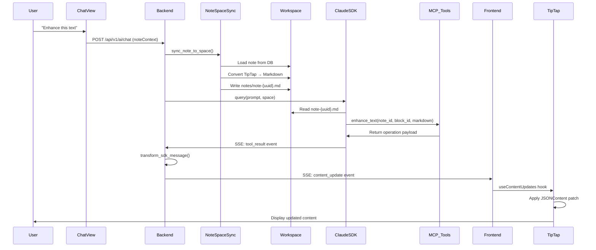

# AI Layer Architecture

**Framework**: Claude Agent SDK + Multi-Provider BYOK
**Architecture**: Event-Driven Agents with SSE Streaming
**Runtime**: Python 3.12+ (Async)

> **Detailed SDK Documentation**: See [claude-agent-sdk-architecture.md](./claude-agent-sdk-architecture.md) for comprehensive Claude Agent SDK integration patterns, BYOK implementation, and MCP tool specifications.

---

## Overview

The AI Layer provides intelligent capabilities across Pilot Space using a **BYOK (Bring Your Own Key)** model (DD-002). Users configure their own LLM provider API keys, and the platform routes tasks to optimal providers based on task type, cost, and latency requirements per DD-011.

### Core Principles

| Principle | Implementation |
|-----------|----------------|
| **Human-in-the-Loop** | Critical-only approval: auto-execute non-destructive, approve destructive (DD-003) |
| **BYOK Only** | Anthropic required, OpenAI required for embeddings, Gemini recommended (DD-002) |
| **Provider Agnostic** | Support OpenAI, Anthropic, Google Gemini, Azure with fallbacks (DD-011) |
| **Task-Specific Routing** | Claude→code, Gemini→latency, OpenAI→embeddings |
| **Cost Transparency** | Track and display AI costs per user/workspace |
| **Streaming First** | SSE for real-time AI responses |
| **Unified PR Review** | Architecture + Code + Security + Performance + Docs in one feature (DD-006) |

---

## Layer Diagram

```
┌─────────────────────────────────────────────────────────────────────────────┐
│                              AI LAYER                                        │
├─────────────────────────────────────────────────────────────────────────────┤
│                                                                              │
│  ┌────────────────────────────────────────────────────────────────────────┐ │
│  │                         ORCHESTRATION                                   │ │
│  │  ┌─────────────────┐  ┌─────────────────┐  ┌─────────────────────────┐ │ │
│  │  │  AIOrchestrator │  │ ProviderSelector│  │   SessionManager        │ │ │
│  │  │  (Task Router)  │  │  (Load Balance) │  │   (Conversation State)  │ │ │
│  │  └─────────────────┘  └─────────────────┘  └─────────────────────────┘ │ │
│  └────────────────────────────────────────────────────────────────────────┘ │
│                                    │                                         │
│                                    ▼                                         │
│  ┌────────────────────────────────────────────────────────────────────────┐ │
│  │                          AGENTS                                         │ │
│  │  ┌──────────────┐ ┌──────────────┐ ┌──────────────┐ ┌──────────────┐  │ │
│  │  │ GhostText    │ │ PRReview     │ │ TaskDecomp   │ │ DocGenerator │  │ │
│  │  │ Agent        │ │ Agent        │ │ Agent        │ │ Agent        │  │ │
│  │  └──────────────┘ └──────────────┘ └──────────────┘ └──────────────┘  │ │
│  │  ┌──────────────┐ ┌──────────────┐ ┌──────────────┐ ┌──────────────┐  │ │
│  │  │ IssueEnhance │ │ Diagram      │ │ AIContext    │ │ Assignee     │  │ │
│  │  │ Agent        │ │ Agent        │ │ Agent        │ │ Recommender  │  │ │
│  │  └──────────────┘ └──────────────┘ └──────────────┘ └──────────────┘  │ │
│  └────────────────────────────────────────────────────────────────────────┘ │
│                                    │                                         │
│                                    ▼                                         │
│  ┌────────────────────────────────────────────────────────────────────────┐ │
│  │                         PROVIDERS                                       │ │
│  │  ┌──────────────┐ ┌──────────────┐ ┌──────────────┐ ┌──────────────┐  │ │
│  │  │ Claude Agent │ │ OpenAI       │ │ Google       │ │ Azure        │  │ │
│  │  │ SDK Provider │ │ Provider     │ │ Provider     │ │ Provider     │  │ │
│  │  └──────────────┘ └──────────────┘ └──────────────┘ └──────────────┘  │ │
│  └────────────────────────────────────────────────────────────────────────┘ │
│                                    │                                         │
│                                    ▼                                         │
│  ┌────────────────────────────────────────────────────────────────────────┐ │
│  │                           RAG                                           │ │
│  │  ┌──────────────┐ ┌──────────────┐ ┌──────────────┐ ┌──────────────┐  │ │
│  │  │ Embedder     │ │ Chunker      │ │ Retriever    │ │ Indexer      │  │ │
│  │  │ (3072 dims)  │ │ (Semantic)   │ │ (pgvector)   │ │ (Async)      │  │ │
│  │  └──────────────┘ └──────────────┘ └──────────────┘ └──────────────┘  │ │
│  └────────────────────────────────────────────────────────────────────────┘ │
│                                    │                                         │
│                                    ▼                                         │
│  ┌────────────────────────────────────────────────────────────────────────┐ │
│  │                      INFRASTRUCTURE                                     │ │
│  │  ┌──────────────┐ ┌──────────────┐ ┌──────────────┐ ┌──────────────┐  │ │
│  │  │ CostTracker  │ │ RateLimiter  │ │ CacheManager │ │ QueueManager │  │ │
│  │  │              │ │              │ │ (Redis)      │ │ (pgmq)       │  │ │
│  │  └──────────────┘ └──────────────┘ └──────────────┘ └──────────────┘  │ │
│  └────────────────────────────────────────────────────────────────────────┘ │
│                                                                              │
└─────────────────────────────────────────────────────────────────────────────┘
```

---

## Directory Structure

```
backend/src/pilot_space/ai/
├── __init__.py
├── orchestrator.py                    # Main AI task router
├── config.py                          # AI configuration settings
│
├── providers/                         # LLM Provider Adapters
│   ├── __init__.py
│   ├── base.py                        # LLMProvider ABC interface
│   ├── claude_sdk_provider.py         # Claude Agent SDK (primary)
│   ├── openai_provider.py             # OpenAI direct API
│   ├── google_provider.py             # Google Gemini API
│   ├── azure_provider.py              # Azure OpenAI
│   └── provider_selector.py           # Task-based provider routing
│
├── agents/                            # Domain-Specific AI Agents
│   ├── __init__.py
│   ├── base.py                        # BaseAgent ABC
│   ├── ghost_text_agent.py            # Real-time note suggestions
│   ├── pr_review_agent.py             # Unified PR review (DD-006)
│   ├── task_decomposer_agent.py       # Feature → subtasks
│   ├── issue_enhancer_agent.py        # AI-improve issue content
│   ├── doc_generator_agent.py         # Documentation from code
│   ├── diagram_generator_agent.py     # Mermaid/PlantUML/C4
│   ├── ai_context_agent.py            # Context aggregation
│   └── assignee_recommender_agent.py  # Suggest team members
│
├── prompts/                           # Prompt Templates
│   ├── __init__.py
│   ├── base.py                        # PromptTemplate base
│   ├── ghost_text.py                  # Note completion prompts
│   ├── pr_review.py                   # Code review prompts
│   ├── task_decomposition.py          # Task breakdown prompts
│   ├── issue_enhancement.py           # Issue improvement prompts
│   └── documentation.py               # Doc generation prompts
│
├── tools/                             # Custom MCP Tools
│   ├── __init__.py
│   ├── database_tools.py              # Pilot Space DB access
│   ├── github_tools.py                # GitHub integration tools
│   └── search_tools.py                # Semantic search tools
│
├── rag/                               # RAG Pipeline
│   ├── __init__.py
│   ├── embedder.py                    # Text → vector (3072 dims)
│   ├── chunker.py                     # Semantic content chunking
│   ├── retriever.py                   # pgvector similarity search
│   └── indexer.py                     # Async index management
│
├── session/                           # Conversation Management
│   ├── __init__.py
│   ├── session_manager.py             # Multi-turn session handling
│   └── context_builder.py             # Build agent context
│
└── infrastructure/                    # AI Infrastructure
    ├── __init__.py
    ├── cost_tracker.py                # Usage and cost tracking
    ├── rate_limiter.py                # Provider rate limiting
    ├── cache.py                       # Response caching (Redis)
    └── resilience.py                  # Retry, timeout, circuit breaker
```

---

## Claude Agent SDK Integration

### SDK Selection: `query()` vs `ClaudeSDKClient`

| Pattern | Use Case in Pilot Space |
|---------|-------------------------|
| **`query()`** | One-off tasks: PR review, doc generation, task decomposition |
| **`ClaudeSDKClient`** | Streaming: Ghost text, interactive note analysis, AIContext chat |

### Provider Architecture

```python
# ai/providers/claude_sdk_provider.py
from claude_agent_sdk import query, ClaudeSDKClient, ClaudeAgentOptions
from claude_agent_sdk import tool, create_sdk_mcp_server
from claude_agent_sdk.types import (
    AssistantMessage, TextBlock, ToolUseBlock, ResultMessage
)
from typing import AsyncIterator, Any
from abc import ABC, abstractmethod

class LLMProvider(ABC):
    """Abstract base for LLM providers."""

    @abstractmethod
    async def complete(
        self,
        prompt: str,
        options: dict[str, Any],
    ) -> AsyncIterator[str]:
        """Generate completion with streaming."""
        pass

    @abstractmethod
    async def embed(self, text: str) -> list[float]:
        """Generate embedding vector."""
        pass


class ClaudeSDKProvider(LLMProvider):
    """Claude Agent SDK provider with full agentic capabilities."""

    def __init__(self, config: "AIConfig"):
        self.config = config
        self.mcp_server = self._create_mcp_server()

    def _create_mcp_server(self) -> "McpSdkServerConfig":
        """Create SDK MCP server with Pilot Space tools."""
        return create_sdk_mcp_server(
            name="pilot-space",
            version="1.0.0",
            tools=[
                get_issue_context,
                get_note_content,
                create_note_annotation,
                search_codebase,
            ]
        )

    async def complete(
        self,
        prompt: str,
        options: dict[str, Any],
    ) -> AsyncIterator[str]:
        """Execute Claude Agent SDK query with streaming."""
        agent_options = ClaudeAgentOptions(
            model=options.get("model", "claude-opus-4-5"),
            system_prompt=options.get("system_prompt"),
            allowed_tools=options.get("allowed_tools", []),
            mcp_servers={"pilot_space": self.mcp_server},
            permission_mode=options.get("permission_mode", "default"),
            max_budget_usd=options.get("max_budget_usd", 10.0),
            max_turns=options.get("max_turns", 20),
        )

        async for message in query(prompt=prompt, options=agent_options):
            if isinstance(message, AssistantMessage):
                for block in message.content:
                    if isinstance(block, TextBlock):
                        yield block.text

            # Track costs from result message
            if isinstance(message, ResultMessage):
                await self._track_cost(message)

    async def complete_with_session(
        self,
        prompt: str,
        options: dict[str, Any],
        session_id: str | None = None,
    ) -> AsyncIterator[str]:
        """Execute with session continuity for multi-turn conversations."""
        agent_options = ClaudeAgentOptions(
            model=options.get("model", "claude-opus-4-5"),
            system_prompt=options.get("system_prompt"),
            allowed_tools=options.get("allowed_tools", []),
            mcp_servers={"pilot_space": self.mcp_server},
            permission_mode="default",
            resume=session_id,  # Resume previous session
        )

        async with ClaudeSDKClient(options=agent_options) as client:
            await client.query(prompt)

            async for message in client.receive_response():
                if isinstance(message, AssistantMessage):
                    for block in message.content:
                        if isinstance(block, TextBlock):
                            yield block.text

                if isinstance(message, ResultMessage):
                    yield f"__SESSION_ID__:{message.session_id}"

    async def _track_cost(self, result: ResultMessage) -> None:
        """Track cost metrics from result message."""
        if result.total_cost_usd:
            # Emit to cost tracking system
            pass
```

---

## Note Sync Workflow

The Note-AI Chat Integration enables the PilotSpace Agent to read, modify, and enhance note content in real-time through conversational interaction. The workflow synchronizes note content between the database (TipTap JSON) and the agent's workspace (Markdown files).

### Architecture Diagram



### Bidirectional Sync Flow

**To Space (DB → Workspace)**:
```python
# Before agent query
sync = NoteSpaceSync()
file_path = await sync.sync_note_to_space(
    space_path=agent.space_path,
    note_id=note_id,
    session=db_session
)
# Creates: {space_path}/notes/note-{uuid}.md with block ID comments
```

**From Space (Workspace → DB)**:
```python
# After agent modifications
changes = await sync.sync_space_to_note(
    space_path=agent.space_path,
    note_id=note_id,
    session=db_session
)
# Returns: List[BlockChange] for review/application
```

### Content Conversion

**TipTap → Markdown**:
```python
converter = ContentConverter()
markdown = converter.tiptap_to_markdown({
    "type": "doc",
    "content": [
        {
            "type": "heading",
            "attrs": {"id": "block-abc", "level": 1},
            "content": [{"type": "text", "text": "Title"}]
        },
        {
            "type": "paragraph",
            "attrs": {"id": "block-def"},
            "content": [
                {"type": "text", "text": "Link to "},
                {
                    "type": "inlineIssue",
                    "attrs": {
                        "issueId": "uuid",
                        "issueKey": "PS-99",
                        "title": "Fix bug"
                    }
                }
            ]
        }
    ]
})

# Output:
# <!-- block:block-abc -->
# # Title
#
# <!-- block:block-def -->
# Link to [PS-99](issue:uuid "Fix bug")
```

**Markdown → TipTap**:
```python
tiptap_json = converter.markdown_to_tiptap(markdown)
# Preserves block IDs from <!-- block:uuid --> comments
# Parses [PS-99](issue:uuid "title") back to inlineIssue nodes
```

### 6 MCP Tools for Note Manipulation

| Tool | Category | Operation | Example |
|------|----------|-----------|---------|
| `update_note_block` | Write | replace/append | `update_note_block("note-1", "block-abc", "## New Title", "replace")` |
| `enhance_text` | Write | replace | `enhance_text("note-1", "block-abc", "Improved prose...")` |
| `summarize_note` | Read | analyze | `summarize_note("note-1")` → Returns full content |
| `extract_issues` | Write | create+link | `extract_issues("note-1", ["block-1"], [{"title": "Fix X", "priority": "high"}])` |
| `create_issue_from_note` | Write | create+link | `create_issue_from_note("note-1", "block-abc", "Bug title", "desc", "high", "bug")` |
| `link_existing_issues` | Write | search+link | `link_existing_issues("note-1", "authentication", "workspace-1")` |

**Tool Return Format**:
```python
# Tools return operation payloads, not direct DB mutations
{
    "tool": "enhance_text",
    "note_id": "uuid",
    "operation": "replace_block",
    "block_id": "block-abc",
    "markdown": "Enhanced content...",
    "status": "pending_apply"
}
```

### SSE Transform Pipeline

**Backend Transform**:
```python
# ai/agents/pilotspace_agent.py - transform_sdk_message()
async for sdk_message in client.receive_response():
    if sdk_message.type == "tool_result":
        result = sdk_message.result

        # Detect note tool results
        if result.get("tool") in NOTE_TOOLS:
            # Convert markdown to TipTap JSON
            converter = ContentConverter()
            tiptap_content = converter.markdown_to_tiptap(
                result["markdown"]
            )

            # Apply update via NoteAIUpdateService
            update_service = NoteAIUpdateService(session)
            await update_service.execute(AIUpdatePayload(
                note_id=result["note_id"],
                operation=result["operation"],
                block_id=result["block_id"],
                content=tiptap_content
            ))

            # Emit content_update SSE event
            yield {
                "event": "content_update",
                "data": {
                    "noteId": result["note_id"],
                    "operation": result["operation"],
                    "blockId": result["block_id"],
                    "content": tiptap_content
                }
            }
```

**Frontend Handler**:
```typescript
// stores/ai/PilotSpaceStore.ts
handleContentUpdate(event: ContentUpdateEvent) {
    this.pendingContentUpdates.push(event);
}

// features/notes/editor/hooks/useContentUpdates.ts
useEffect(() => {
    reaction(
        () => store.pendingContentUpdates.filter(e => e.noteId === noteId),
        (updates) => {
            updates.forEach(update => {
                // Conflict check: skip if user editing same block
                if (isUserEditingBlock(update.blockId)) {
                    return;
                }

                // Apply update to TipTap
                const pos = findBlockPosition(update.blockId);
                editor.chain()
                    .setNodeSelection(pos)
                    .insertContent(update.content)
                    .run();

                // Remove from queue
                store.removePendingUpdate(update);
            });
        }
    );
}, [editor, noteId]);
```

### Conflict Detection

**Cursor-Based Conflict Detection**:
```typescript
function isUserEditingBlock(blockId: string): boolean {
    const { selection } = editor.state;
    const currentBlockId = findBlockIdAtPosition(selection.from);
    return currentBlockId === blockId;
}
```

**AI Yields to User**:
- If user cursor is in block being updated → skip AI change
- Notify user in chat: "Skipped updating block X (you're editing it)"
- User can manually apply suggestion later

### Agent Instructions

**CLAUDE.md Template Addition**:
```markdown
## Note Manipulation

You have access to note files in the `notes/` directory:
- File format: `notes/note-{uuid}.md`
- Block IDs are preserved via HTML comments: `<!-- block:uuid -->`
- NEVER remove block ID comments - they ensure round-trip fidelity

### Available MCP Tools

**update_note_block**: Replace or append content to a specific block
**enhance_text**: Rewrite/improve text in place
**summarize_note**: Read full note content for analysis
**extract_issues**: Find actionable items and create linked issues
**create_issue_from_note**: Create single issue from note content
**link_existing_issues**: Search and link existing issues

### When to Replace vs Append

- **Replace**: Enhance, improve, rewrite existing content
- **Append**: Add new sections, extract issues as new blocks

### Multi-Turn Protocol

If user request is ambiguous:
1. Ask clarifying questions before modifying
2. Show what you plan to change
3. Wait for confirmation for large changes
```

---

## Custom MCP Tools

### Database Access Tools

```python
# ai/tools/database_tools.py
from claude_agent_sdk import tool
from typing import Any
import json

@tool(
    "get_issue_context",
    "Retrieve complete issue context including description, related notes, code references, and activity history",
    {"issue_id": str}
)
async def get_issue_context(args: dict[str, Any]) -> dict[str, Any]:
    """Fetch comprehensive issue context from Pilot Space database."""
    from pilot_space.infrastructure.persistence.repositories import (
        SQLAlchemyIssueRepository,
        SQLAlchemyNoteRepository,
    )
    from pilot_space.container import Container

    container = Container()
    issue_repo = container.issue_repository()
    note_repo = container.note_repository()

    issue = await issue_repo.get_by_id(args["issue_id"])
    if not issue:
        return {
            "content": [{"type": "text", "text": f"Issue not found: {args['issue_id']}"}],
            "is_error": True
        }

    # Get related notes
    related_notes = await note_repo.find_by_linked_issue(issue.id)

    # Build context
    context = {
        "issue": {
            "id": str(issue.id),
            "identifier": issue.identifier,
            "title": issue.title,
            "description": issue.description,
            "state": issue.state.name,
            "priority": issue.priority.value if issue.priority else None,
            "assignee": str(issue.assignee_id) if issue.assignee_id else None,
        },
        "related_notes": [
            {
                "id": str(note.id),
                "title": note.title,
                "excerpt": note.content[:500] if note.content else None,
            }
            for note in related_notes
        ],
        "code_references": [],  # Populated from AIContext
    }

    return {
        "content": [{"type": "text", "text": json.dumps(context, indent=2)}]
    }


@tool(
    "get_note_content",
    "Retrieve note content with all blocks for AI analysis",
    {"note_id": str}
)
async def get_note_content(args: dict[str, Any]) -> dict[str, Any]:
    """Fetch note content including all blocks."""
    from pilot_space.container import Container

    container = Container()
    note_repo = container.note_repository()

    note = await note_repo.get_by_id(args["note_id"])
    if not note:
        return {
            "content": [{"type": "text", "text": f"Note not found: {args['note_id']}"}],
            "is_error": True
        }

    # Serialize blocks
    blocks = [
        {
            "id": str(block.id),
            "type": block.block_type,
            "content": block.content,
            "position": block.position,
        }
        for block in note.blocks
    ]

    content = {
        "note_id": str(note.id),
        "title": note.title,
        "blocks": blocks,
        "total_blocks": len(blocks),
    }

    return {
        "content": [{"type": "text", "text": json.dumps(content, indent=2)}]
    }


@tool(
    "create_note_annotation",
    "Create an AI-generated annotation for a specific note block (appears in right margin)",
    {
        "note_id": str,
        "block_id": str,
        "annotation_type": str,  # "suggestion", "improvement", "question", "reference"
        "content": str,
        "confidence": float,  # 0.0 - 1.0
    }
)
async def create_note_annotation(args: dict[str, Any]) -> dict[str, Any]:
    """Create NoteAnnotation entity in database."""
    from pilot_space.domain.entities.note import NoteAnnotation
    from pilot_space.domain.value_objects import NoteId, BlockId, AIConfidence
    from pilot_space.container import Container

    container = Container()
    annotation_repo = container.annotation_repository()
    uow = container.uow()

    async with uow:
        annotation = NoteAnnotation.create(
            note_id=NoteId(args["note_id"]),
            block_id=BlockId(args["block_id"]),
            annotation_type=args["annotation_type"],
            content=args["content"],
            confidence=AIConfidence(args["confidence"]),
        )

        await annotation_repo.add(annotation)
        await uow.commit()

    return {
        "content": [{
            "type": "text",
            "text": f"Annotation created: {annotation.id} for block {args['block_id']}"
        }]
    }


@tool(
    "search_codebase",
    "Search the linked repository codebase using semantic search",
    {"query": str, "project_id": str, "limit": int}
)
async def search_codebase(args: dict[str, Any]) -> dict[str, Any]:
    """Semantic search across indexed codebase."""
    from pilot_space.ai.rag.retriever import SemanticRetriever
    from pilot_space.container import Container

    container = Container()
    retriever = container.semantic_retriever()

    results = await retriever.search(
        query=args["query"],
        project_id=args["project_id"],
        limit=args.get("limit", 10),
    )

    formatted_results = [
        {
            "file_path": r.file_path,
            "chunk": r.content[:500],
            "score": r.similarity_score,
            "line_start": r.line_start,
            "line_end": r.line_end,
        }
        for r in results
    ]

    return {
        "content": [{
            "type": "text",
            "text": json.dumps(formatted_results, indent=2)
        }]
    }
```

---

## AI Agents Catalog

Pilot Space implements **9 primary AI agents + 7 helper components = 16 total** mapping to user stories. Primary domain agents are bolded:

| Agent | User Story | Trigger | Provider | Purpose |
|-------|------------|---------|----------|---------|
| **GhostTextAgent** | US-01 | 500ms typing pause | Gemini Flash | Real-time text suggestions |
| **IssueExtractorAgent** | US-01 | User selects "Extract Issue" | Claude | Extract issues from note content |
| **MarginAnnotationAgent** | US-01 | Block focus + 1s delay | Gemini Flash | Generate margin suggestions |
| **IssueEnhancerAgent** | US-02 | Issue creation/edit | Claude | Suggest labels, priority, AC |
| **DuplicateDetectorAgent** | US-02 | Issue creation | pgvector + Claude | Find similar existing issues |
| **PRReviewAgent** | US-03 | GitHub PR webhook | Claude Opus | Unified code review |
| **AIContextAgent** | US-12 | Issue view + manual refresh | Claude Opus | Aggregate context for issues |
| **CommitLinkerAgent** | US-18 | GitHub push webhook | Claude Haiku | Parse commit message for issue refs |
| **TaskDecomposerAgent** | US-07 | User triggers decompose | Claude Opus | Break features into subtasks |
| **DiagramGeneratorAgent** | US-08 | User requests diagram | Claude | Generate Mermaid DSL |
| **DocGeneratorAgent** | US-06 | User triggers generation | Claude | Generate docs from code |
| **TemplateFillerAgent** | US-15 | User selects template | Claude | Fill template with AI |
| **PatternDetectorAgent** | US-14 | Background job (daily) | Claude | Find knowledge patterns |
| **SemanticSearchAgent** | US-10 | User search query | pgvector + Gemini | Vector similarity search |
| **NotificationPrioritizerAgent** | US-17 | New notification | Gemini Flash | Score notification importance |
| **AssigneeRecommenderAgent** | US-02 | Issue assignment | Claude Haiku | Suggest team members |

---

### Ghost Text Agent (Real-Time Suggestions)

```python
# ai/agents/ghost_text_agent.py
from pilot_space.ai.agents.base import BaseAgent
from pilot_space.ai.providers.provider_selector import ProviderSelector
from claude_agent_sdk import ClaudeSDKClient, ClaudeAgentOptions
from typing import AsyncIterator

class GhostTextAgent(BaseAgent):
    """Real-time text completion suggestions for Note Canvas.

    Design Decisions:
    - Uses Google Gemini Flash for low latency (per DD-011)
    - Fallback to Claude Haiku if Gemini unavailable
    - Max 2s response time target
    - Streams character-by-character
    """

    PROVIDER_PREFERENCE = ["google", "anthropic"]
    LATENCY_TARGET_MS = 2000

    def __init__(
        self,
        provider_selector: ProviderSelector,
        prompt_template: "GhostTextPromptTemplate",
    ):
        self.provider_selector = provider_selector
        self.prompt_template = prompt_template

    async def suggest(
        self,
        context: str,
        cursor_position: int,
        note_id: str,
        block_id: str,
    ) -> AsyncIterator[str]:
        """Generate ghost text suggestion with streaming.

        Args:
            context: Text before cursor (up to 2000 chars)
            cursor_position: Character position in block
            note_id: Parent note ID
            block_id: Current block ID

        Yields:
            Character chunks of suggestion
        """
        # Select fastest available provider
        provider_config = await self.provider_selector.select_for_latency(
            task_type="ghost_text",
            target_latency_ms=self.LATENCY_TARGET_MS,
            preference_order=self.PROVIDER_PREFERENCE,
        )

        prompt = self.prompt_template.render(
            context=context[-2000:],  # Last 2000 chars
            cursor_position=cursor_position,
        )

        options = ClaudeAgentOptions(
            model=provider_config.model,
            system_prompt=self.prompt_template.system_prompt,
            max_tokens=150,  # Short completions
            permission_mode="bypassPermissions",  # No tools needed
        )

        accumulated = ""
        async for chunk in self.provider.complete(prompt, options):
            # Stop at natural boundaries
            if any(stop in chunk for stop in ["\n\n", ".", "!", "?"]):
                idx = min(
                    chunk.find(stop) + 1
                    for stop in ["\n\n", ".", "!", "?"]
                    if stop in chunk
                )
                yield chunk[:idx]
                break

            accumulated += chunk
            yield chunk

            # Limit total suggestion length
            if len(accumulated) > 100:
                break
```

### PR Review Agent (Unified Review - DD-006)

```python
# ai/agents/pr_review_agent.py
from pilot_space.ai.agents.base import BaseAgent
from claude_agent_sdk import query, ClaudeAgentOptions
from claude_agent_sdk.types import AssistantMessage, TextBlock, ResultMessage
from dataclasses import dataclass
from typing import AsyncIterator

@dataclass
class PRReviewResult:
    """Structured PR review result."""
    architecture_issues: list[dict]
    code_quality_issues: list[dict]
    security_issues: list[dict]
    performance_issues: list[dict]
    documentation_issues: list[dict]
    overall_recommendation: str  # "approve", "request_changes", "comment"
    summary: str
    confidence: float
    total_cost_usd: float


class PRReviewAgent(BaseAgent):
    """Unified AI PR Review combining architecture, code, and security.

    Implements DD-006: Both architecture and code review in MVP as unified feature.

    Review Aspects:
    - Architecture: Layer boundaries, patterns, dependency direction
    - Security: OWASP basics, secrets detection, auth checks
    - Quality: Complexity, duplication, naming
    - Performance: N+1 queries, blocking calls
    - Documentation: Missing docstrings, outdated comments
    """

    PROVIDER_PREFERENCE = ["anthropic"]  # Claude best for code review
    MODEL = "claude-opus-4-5"

    def __init__(
        self,
        prompt_template: "PRReviewPromptTemplate",
        github_client: "GitHubClient",
    ):
        self.prompt_template = prompt_template
        self.github_client = github_client

    async def review(
        self,
        pr_number: int,
        repo_full_name: str,
        project_id: str,
    ) -> AsyncIterator[str]:
        """Perform comprehensive PR review with streaming.

        Args:
            pr_number: GitHub PR number
            repo_full_name: e.g., "owner/repo"
            project_id: Pilot Space project ID

        Yields:
            Review content chunks (Markdown formatted)
        """
        # Fetch PR details and diff
        pr_data = await self.github_client.get_pr(repo_full_name, pr_number)
        diff = await self.github_client.get_pr_diff(repo_full_name, pr_number)

        # Build review prompt with context
        prompt = self.prompt_template.render(
            pr_title=pr_data["title"],
            pr_description=pr_data["body"],
            diff=diff,
            files_changed=pr_data["changed_files"],
            additions=pr_data["additions"],
            deletions=pr_data["deletions"],
        )

        options = ClaudeAgentOptions(
            model=self.MODEL,
            system_prompt=self.prompt_template.system_prompt,
            allowed_tools=[
                "Read",
                "Grep",
                "Glob",
                "mcp__pilot_space__get_issue_context",
                "mcp__pilot_space__search_codebase",
            ],
            permission_mode="default",
            max_budget_usd=20.0,  # PR reviews can be expensive
            max_turns=15,
        )

        async for message in query(prompt=prompt, options=options):
            if isinstance(message, AssistantMessage):
                for block in message.content:
                    if isinstance(block, TextBlock):
                        yield block.text

            if isinstance(message, ResultMessage):
                # Emit final metadata
                yield f"\n\n---\n**Review Cost**: ${message.total_cost_usd:.4f}"
                yield f"\n**Duration**: {message.duration_ms}ms"

    async def post_review_comments(
        self,
        pr_number: int,
        repo_full_name: str,
        review_content: str,
        recommendation: str,
    ) -> None:
        """Post review to GitHub PR."""
        event_map = {
            "approve": "APPROVE",
            "request_changes": "REQUEST_CHANGES",
            "comment": "COMMENT",
        }

        await self.github_client.create_pr_review(
            repo_full_name=repo_full_name,
            pr_number=pr_number,
            body=review_content,
            event=event_map.get(recommendation, "COMMENT"),
        )
```

### Task Decomposer Agent

```python
# ai/agents/task_decomposer_agent.py
from pilot_space.ai.agents.base import BaseAgent
from claude_agent_sdk import query, ClaudeAgentOptions
from dataclasses import dataclass
from typing import AsyncIterator

@dataclass
class DecomposedTask:
    """A single decomposed task with Claude Code prompt."""
    title: str
    description: str
    acceptance_criteria: list[str]
    claude_code_prompt: str  # Ready-to-use prompt for Claude Code
    estimated_complexity: str  # "low", "medium", "high"
    dependencies: list[str]  # Task IDs this depends on
    suggested_assignee_skills: list[str]


class TaskDecomposerAgent(BaseAgent):
    """Decompose features/issues into actionable subtasks with Claude Code prompts.

    Key Feature: Generates ready-to-use Claude Code prompts for each task,
    enabling developers to immediately start implementation.
    """

    MODEL = "claude-opus-4-5"

    async def decompose(
        self,
        issue_id: str,
        issue_title: str,
        issue_description: str,
        project_context: str,
    ) -> AsyncIterator[str]:
        """Decompose issue into subtasks with streaming.

        Output Format (Markdown):
        ```
        ## Task 1: [Title]
        **Description**: ...
        **Acceptance Criteria**:
        - [ ] Criterion 1
        - [ ] Criterion 2

        **Claude Code Prompt**:
        ```
        [Ready-to-paste prompt]
        ```

        **Complexity**: Medium
        **Dependencies**: None
        **Skills**: Python, FastAPI
        ```

        Yields:
            Markdown chunks of decomposed tasks
        """
        prompt = f"""Decompose this issue into actionable subtasks:

**Issue**: {issue_title}
**Description**: {issue_description}

**Project Context**:
{project_context}

For EACH subtask, provide:
1. Clear title (imperative form: "Add...", "Create...", "Implement...")
2. Detailed description
3. Acceptance criteria (testable checkboxes)
4. A ready-to-use Claude Code prompt that a developer can paste to implement the task
5. Complexity estimate (low/medium/high)
6. Dependencies on other subtasks
7. Required skills

Format as Markdown with clear sections for each task."""

        options = ClaudeAgentOptions(
            model=self.MODEL,
            allowed_tools=[
                "mcp__pilot_space__get_issue_context",
                "mcp__pilot_space__search_codebase",
            ],
            permission_mode="default",
            max_budget_usd=5.0,
        )

        async for message in query(prompt=prompt, options=options):
            if isinstance(message, AssistantMessage):
                for block in message.content:
                    if isinstance(block, TextBlock):
                        yield block.text
```

### AIContext Agent

```python
# ai/agents/ai_context_agent.py
from pilot_space.ai.agents.base import BaseAgent
from claude_agent_sdk import ClaudeSDKClient, ClaudeAgentOptions
from dataclasses import dataclass
from typing import AsyncIterator

@dataclass
class AIContextData:
    """Aggregated AI context for an issue."""
    summary: str
    related_documents: list[dict]
    code_references: list[dict]
    similar_issues: list[dict]
    suggested_tasks: list[dict]
    claude_code_prompts: list[str]


class AIContextAgent(BaseAgent):
    """Build and maintain AI Context for issues.

    AI Context aggregates:
    - Related documentation from project pages
    - Code snippets from linked repositories
    - Similar past issues
    - Suggested implementation tasks
    - Ready-to-use Claude Code prompts
    """

    MODEL = "claude-opus-4-5"

    async def build_context(
        self,
        issue_id: str,
        refresh: bool = False,
    ) -> AsyncIterator[str]:
        """Build comprehensive AI context for issue.

        Uses ClaudeSDKClient for multi-turn context building:
        1. Analyze issue and extract key concepts
        2. Search for related documentation
        3. Find relevant code sections
        4. Identify similar issues
        5. Generate implementation suggestions

        Yields:
            Progress updates and final context JSON
        """
        options = ClaudeAgentOptions(
            model=self.MODEL,
            allowed_tools=[
                "mcp__pilot_space__get_issue_context",
                "mcp__pilot_space__get_note_content",
                "mcp__pilot_space__search_codebase",
                "Read",
                "Grep",
            ],
            permission_mode="default",
            max_budget_usd=10.0,
        )

        async with ClaudeSDKClient(options=options) as client:
            # Step 1: Analyze issue
            yield "Analyzing issue context...\n"
            await client.query(
                f"Analyze issue {issue_id} and identify key concepts, "
                "technologies, and potential implementation areas."
            )

            async for message in client.receive_response():
                if isinstance(message, AssistantMessage):
                    for block in message.content:
                        if isinstance(block, TextBlock):
                            yield block.text

            # Step 2: Find related docs
            yield "\n\nSearching related documentation...\n"
            await client.query(
                "Based on your analysis, search for related documentation "
                "and code that would help implement this issue."
            )

            async for message in client.receive_response():
                if isinstance(message, AssistantMessage):
                    for block in message.content:
                        if isinstance(block, TextBlock):
                            yield block.text

            # Step 3: Generate Claude Code prompts
            yield "\n\nGenerating Claude Code prompts...\n"
            await client.query(
                "Generate 3-5 ready-to-use Claude Code prompts that would "
                "help a developer implement this issue. Each prompt should "
                "be specific, actionable, and include relevant context."
            )

            async for message in client.receive_response():
                if isinstance(message, AssistantMessage):
                    for block in message.content:
                        if isinstance(block, TextBlock):
                            yield block.text
```

---

## Provider Selection Strategy

```python
# ai/providers/provider_selector.py
from dataclasses import dataclass
from typing import Literal

@dataclass
class ProviderConfig:
    provider: str
    model: str
    reason: str


class ProviderSelector:
    """Select optimal LLM provider based on task requirements.

    Per Design Decisions:
    - DD-002: BYOK only (OpenAI, Anthropic, Google, Azure)
    - DD-011: Google Gemini for large context + fast tasks
    """

    ROUTING_TABLE: dict[str, ProviderConfig] = {
        # Code-intensive tasks → Claude
        "pr_review": ProviderConfig(
            provider="anthropic",
            model="claude-opus-4-5",
            reason="Best code understanding and architecture analysis"
        ),
        "code_generation": ProviderConfig(
            provider="anthropic",
            model="claude-opus-4-5",
            reason="Superior code generation quality"
        ),
        "task_decomposition": ProviderConfig(
            provider="anthropic",
            model="claude-opus-4-5",
            reason="Strong reasoning for breaking down tasks"
        ),

        # Latency-sensitive tasks → Gemini Flash
        "ghost_text": ProviderConfig(
            provider="google",
            model="gemini-2.0-flash",
            reason="Lowest latency for real-time suggestions"
        ),
        "note_annotation": ProviderConfig(
            provider="google",
            model="gemini-2.0-flash",
            reason="Fast margin annotation generation"
        ),

        # Large context tasks → Gemini Pro
        "large_codebase_analysis": ProviderConfig(
            provider="google",
            model="gemini-2.0-pro",
            reason="2M token context for large codebases"
        ),

        # Documentation → Any provider
        "documentation": ProviderConfig(
            provider="anthropic",
            model="claude-opus-4-5",
            reason="Good prose generation"
        ),

        # Embeddings → OpenAI
        "embeddings": ProviderConfig(
            provider="openai",
            model="text-embedding-3-large",
            reason="Superior 3072-dim embeddings for RAG"
        ),
    }

    async def select(
        self,
        task_type: str,
        user_preferences: dict | None = None,
    ) -> ProviderConfig:
        """Select provider for task type with user preference override."""
        # Check user preference first
        if user_preferences and task_type in user_preferences:
            return user_preferences[task_type]

        # Use routing table
        return self.ROUTING_TABLE.get(
            task_type,
            ProviderConfig(
                provider="anthropic",
                model="claude-opus-4-5",
                reason="Default fallback"
            )
        )

    async def select_for_latency(
        self,
        task_type: str,
        target_latency_ms: int,
        preference_order: list[str],
    ) -> ProviderConfig:
        """Select fastest available provider meeting latency target."""
        for provider in preference_order:
            if await self._check_provider_health(provider):
                return ProviderConfig(
                    provider=provider,
                    model=self._get_fast_model(provider),
                    reason=f"Selected for {target_latency_ms}ms latency target"
                )

        # Fallback
        return self.ROUTING_TABLE["ghost_text"]

    def _get_fast_model(self, provider: str) -> str:
        """Get fastest model for provider."""
        fast_models = {
            "google": "gemini-2.0-flash",
            "anthropic": "claude-3-5-haiku-20241022",
            "openai": "gpt-4o-mini",
        }
        return fast_models.get(provider, "claude-3-5-haiku-20241022")

    async def _check_provider_health(self, provider: str) -> bool:
        """Check if provider is available and healthy."""
        # Implementation: ping provider, check rate limits
        return True
```

---

## RAG Pipeline

### Embedder (3072 Dimensions)

```python
# ai/rag/embedder.py
from openai import AsyncOpenAI
from typing import list

class Embedder:
    """Generate embeddings using OpenAI text-embedding-3-large.

    Outputs 3072-dimensional vectors for maximum semantic resolution.
    Stored in pgvector for similarity search.
    """

    MODEL = "text-embedding-3-large"
    DIMENSIONS = 3072

    def __init__(self, api_key: str):
        self.client = AsyncOpenAI(api_key=api_key)

    async def embed(self, text: str) -> list[float]:
        """Generate embedding for single text."""
        response = await self.client.embeddings.create(
            model=self.MODEL,
            input=text,
            dimensions=self.DIMENSIONS,
        )
        return response.data[0].embedding

    async def embed_batch(self, texts: list[str]) -> list[list[float]]:
        """Generate embeddings for batch of texts."""
        response = await self.client.embeddings.create(
            model=self.MODEL,
            input=texts,
            dimensions=self.DIMENSIONS,
        )
        return [item.embedding for item in response.data]
```

### Semantic Retriever

```python
# ai/rag/retriever.py
from sqlalchemy import text
from sqlalchemy.ext.asyncio import AsyncSession
from dataclasses import dataclass

@dataclass
class RetrievalResult:
    content: str
    file_path: str | None
    similarity_score: float
    line_start: int | None
    line_end: int | None
    source_type: str  # "code", "note", "page", "issue"


class SemanticRetriever:
    """pgvector-based semantic search across indexed content."""

    def __init__(self, session: AsyncSession, embedder: "Embedder"):
        self.session = session
        self.embedder = embedder

    async def search(
        self,
        query: str,
        project_id: str,
        limit: int = 10,
        source_types: list[str] | None = None,
    ) -> list[RetrievalResult]:
        """Search for semantically similar content.

        Args:
            query: Search query
            project_id: Limit to project scope
            limit: Max results
            source_types: Filter by source type

        Returns:
            Ranked list of similar content
        """
        # Generate query embedding
        query_embedding = await self.embedder.embed(query)

        # Build pgvector query
        sql = text("""
            SELECT
                content,
                file_path,
                1 - (embedding <=> :query_embedding) as similarity,
                line_start,
                line_end,
                source_type
            FROM embeddings
            WHERE project_id = :project_id
            AND (:source_types IS NULL OR source_type = ANY(:source_types))
            ORDER BY embedding <=> :query_embedding
            LIMIT :limit
        """)

        result = await self.session.execute(
            sql,
            {
                "query_embedding": query_embedding,
                "project_id": project_id,
                "source_types": source_types,
                "limit": limit,
            }
        )

        return [
            RetrievalResult(
                content=row.content,
                file_path=row.file_path,
                similarity_score=row.similarity,
                line_start=row.line_start,
                line_end=row.line_end,
                source_type=row.source_type,
            )
            for row in result
        ]
```

---

## SSE Streaming Endpoints

### FastAPI Router Integration

```python
# api/v1/routers/ai.py
from fastapi import APIRouter, Depends, HTTPException
from fastapi.responses import StreamingResponse
from sqlalchemy.ext.asyncio import AsyncSession
from pilot_space.ai.agents import GhostTextAgent, PRReviewAgent, TaskDecomposerAgent
from pilot_space.api.dependencies import get_current_user, get_db
import json

router = APIRouter(prefix="/ai", tags=["AI"])


@router.post("/notes/{note_id}/ghost-text")
async def stream_ghost_text(
    note_id: str,
    context: str,
    cursor_position: int,
    block_id: str,
    current_user: "User" = Depends(get_current_user),
    db: AsyncSession = Depends(get_db),
):
    """Stream ghost text suggestions via SSE.

    Returns Server-Sent Events with text chunks.
    Client should render ghost text in gray after cursor.
    """
    agent = GhostTextAgent(...)  # Inject dependencies

    async def event_generator():
        try:
            async for chunk in agent.suggest(
                context=context,
                cursor_position=cursor_position,
                note_id=note_id,
                block_id=block_id,
            ):
                yield f"data: {json.dumps({'type': 'text', 'content': chunk})}\n\n"

            yield f"data: {json.dumps({'type': 'done'})}\n\n"

        except Exception as e:
            yield f"data: {json.dumps({'type': 'error', 'message': str(e)})}\n\n"

    return StreamingResponse(
        event_generator(),
        media_type="text/event-stream",
        headers={
            "Cache-Control": "no-cache",
            "Connection": "keep-alive",
            "X-Accel-Buffering": "no",
        }
    )


@router.post("/prs/{pr_number}/review")
async def stream_pr_review(
    pr_number: int,
    repo_full_name: str,
    project_id: str,
    current_user: "User" = Depends(get_current_user),
    db: AsyncSession = Depends(get_db),
):
    """Stream comprehensive PR review via SSE.

    Unified review per DD-006:
    - Architecture analysis
    - Code quality
    - Security review
    - Performance issues
    - Documentation gaps
    """
    agent = PRReviewAgent(...)

    async def event_generator():
        try:
            yield f"data: {json.dumps({'type': 'status', 'message': 'Starting PR review...'})}\n\n"

            async for chunk in agent.review(
                pr_number=pr_number,
                repo_full_name=repo_full_name,
                project_id=project_id,
            ):
                yield f"data: {json.dumps({'type': 'content', 'text': chunk})}\n\n"

            yield f"data: {json.dumps({'type': 'done'})}\n\n"

        except Exception as e:
            yield f"data: {json.dumps({'type': 'error', 'message': str(e)})}\n\n"

    return StreamingResponse(
        event_generator(),
        media_type="text/event-stream",
    )


@router.post("/issues/{issue_id}/decompose")
async def stream_task_decomposition(
    issue_id: str,
    current_user: "User" = Depends(get_current_user),
    db: AsyncSession = Depends(get_db),
):
    """Stream task decomposition with Claude Code prompts via SSE."""
    agent = TaskDecomposerAgent(...)

    async def event_generator():
        try:
            # Fetch issue
            issue = await db.get(Issue, issue_id)
            if not issue:
                yield f"data: {json.dumps({'type': 'error', 'message': 'Issue not found'})}\n\n"
                return

            async for chunk in agent.decompose(
                issue_id=issue_id,
                issue_title=issue.title,
                issue_description=issue.description or "",
                project_context="",  # Built from project pages
            ):
                yield f"data: {json.dumps({'type': 'content', 'text': chunk})}\n\n"

            yield f"data: {json.dumps({'type': 'done'})}\n\n"

        except Exception as e:
            yield f"data: {json.dumps({'type': 'error', 'message': str(e)})}\n\n"

    return StreamingResponse(
        event_generator(),
        media_type="text/event-stream",
    )
```

---

## Cost Tracking

```python
# ai/infrastructure/cost_tracker.py
from sqlalchemy import Column, String, Float, Integer, DateTime
from sqlalchemy.ext.asyncio import AsyncSession
from datetime import datetime
from dataclasses import dataclass

@dataclass
class AICostRecord:
    """Track AI API costs for billing and optimization."""
    id: str
    user_id: str
    workspace_id: str
    task_type: str
    provider: str
    model: str
    input_tokens: int
    output_tokens: int
    total_cost_usd: float
    duration_ms: int
    status: str
    created_at: datetime


class CostTracker:
    """Track and report AI costs per workspace/user."""

    # Pricing per 1M tokens (as of 2026)
    PRICING = {
        "anthropic": {
            "claude-opus-4-5": {"input": 15.0, "output": 75.0},
            "claude-sonnet-4": {"input": 3.0, "output": 15.0},
            "claude-3-5-haiku": {"input": 1.0, "output": 5.0},
        },
        "openai": {
            "gpt-4o": {"input": 5.0, "output": 15.0},
            "gpt-4o-mini": {"input": 0.15, "output": 0.6},
            "text-embedding-3-large": {"input": 0.13, "output": 0.0},
        },
        "google": {
            "gemini-2.0-pro": {"input": 1.25, "output": 5.0},
            "gemini-2.0-flash": {"input": 0.075, "output": 0.3},
        },
    }

    def __init__(self, db: AsyncSession):
        self.db = db

    async def track(
        self,
        user_id: str,
        workspace_id: str,
        task_type: str,
        provider: str,
        model: str,
        input_tokens: int,
        output_tokens: int,
        duration_ms: int,
        status: str = "success",
    ) -> AICostRecord:
        """Record AI usage and calculate cost."""
        pricing = self.PRICING.get(provider, {}).get(model, {"input": 0, "output": 0})

        cost_usd = (
            (input_tokens / 1_000_000) * pricing["input"] +
            (output_tokens / 1_000_000) * pricing["output"]
        )

        record = AICostRecord(
            id=str(uuid.uuid4()),
            user_id=user_id,
            workspace_id=workspace_id,
            task_type=task_type,
            provider=provider,
            model=model,
            input_tokens=input_tokens,
            output_tokens=output_tokens,
            total_cost_usd=cost_usd,
            duration_ms=duration_ms,
            status=status,
            created_at=datetime.utcnow(),
        )

        # Persist
        self.db.add(record)
        await self.db.commit()

        return record

    async def get_workspace_summary(
        self,
        workspace_id: str,
        days: int = 30,
    ) -> dict:
        """Get cost summary for workspace billing dashboard."""
        from sqlalchemy import func
        from datetime import timedelta

        cutoff = datetime.utcnow() - timedelta(days=days)

        result = await self.db.execute(
            select(
                AICostRecord.task_type,
                AICostRecord.provider,
                AICostRecord.model,
                func.count(AICostRecord.id).label("requests"),
                func.sum(AICostRecord.total_cost_usd).label("total_cost"),
                func.sum(AICostRecord.input_tokens).label("input_tokens"),
                func.sum(AICostRecord.output_tokens).label("output_tokens"),
            )
            .where(
                AICostRecord.workspace_id == workspace_id,
                AICostRecord.created_at >= cutoff,
            )
            .group_by(
                AICostRecord.task_type,
                AICostRecord.provider,
                AICostRecord.model,
            )
        )

        return {
            "period_days": days,
            "breakdown": [row._asdict() for row in result],
            "total_cost_usd": sum(row.total_cost for row in result),
        }
```

---

## Resilience Patterns

```python
# ai/infrastructure/resilience.py
import asyncio
from tenacity import (
    retry,
    stop_after_attempt,
    wait_exponential,
    retry_if_exception_type,
)
from dataclasses import dataclass, field
from datetime import datetime, timedelta
from typing import AsyncIterator, TypeVar, Callable
import logging

logger = logging.getLogger(__name__)

T = TypeVar("T")


@dataclass
class CircuitBreakerState:
    """Circuit breaker state tracking."""
    failures: int = 0
    last_failure: datetime | None = None
    state: str = "closed"  # closed, open, half-open

    FAILURE_THRESHOLD = 5
    RESET_TIMEOUT = timedelta(seconds=60)

    def record_failure(self) -> None:
        self.failures += 1
        self.last_failure = datetime.utcnow()

        if self.failures >= self.FAILURE_THRESHOLD:
            self.state = "open"
            logger.warning(f"Circuit breaker opened after {self.failures} failures")

    def record_success(self) -> None:
        self.failures = 0
        self.state = "closed"

    def can_attempt(self) -> bool:
        if self.state == "closed":
            return True

        if self.state == "open":
            if datetime.utcnow() - self.last_failure > self.RESET_TIMEOUT:
                self.state = "half-open"
                return True
            return False

        return True  # half-open allows one attempt


class ResilientExecutor:
    """Execute AI operations with retry, timeout, and circuit breaker."""

    def __init__(self):
        self.circuit_breakers: dict[str, CircuitBreakerState] = {}

    def _get_circuit_breaker(self, provider: str) -> CircuitBreakerState:
        if provider not in self.circuit_breakers:
            self.circuit_breakers[provider] = CircuitBreakerState()
        return self.circuit_breakers[provider]

    @retry(
        stop=stop_after_attempt(3),
        wait=wait_exponential(multiplier=1, min=2, max=10),
        retry=retry_if_exception_type((TimeoutError, ConnectionError)),
    )
    async def execute_with_retry(
        self,
        provider: str,
        operation: Callable[[], AsyncIterator[T]],
        timeout_sec: int = 300,
    ) -> AsyncIterator[T]:
        """Execute operation with retry, timeout, and circuit breaker."""
        circuit_breaker = self._get_circuit_breaker(provider)

        if not circuit_breaker.can_attempt():
            raise CircuitBreakerOpenError(
                f"Circuit breaker open for provider: {provider}"
            )

        try:
            async with asyncio.timeout(timeout_sec):
                async for item in operation():
                    yield item

            circuit_breaker.record_success()

        except asyncio.TimeoutError:
            circuit_breaker.record_failure()
            logger.error(f"Timeout after {timeout_sec}s for provider: {provider}")
            raise

        except Exception as e:
            circuit_breaker.record_failure()
            logger.error(f"Error from provider {provider}: {e}")
            raise


class CircuitBreakerOpenError(Exception):
    """Raised when circuit breaker is open."""
    pass
```

---

## Supabase Queues for Background AI

Pilot Space uses **Supabase Queues (pgmq + pg_cron)** for background AI tasks, replacing Celery + RabbitMQ (Session 2026-01-22).

### Queue Worker Pattern

```python
# infrastructure/queue/ai_worker.py
from pilot_space.ai.agents import PRReviewAgent, AIContextAgent
from pilot_space.infrastructure.database import get_db_session
from sqlalchemy import text
import asyncio

class AIQueueWorker:
    """Process AI tasks from Supabase Queues (pgmq).

    Deployed as FastAPI background task or Supabase Edge Function.
    """

    QUEUE_NAME = "ai_tasks"
    POLL_INTERVAL_SEC = 5

    async def process_loop(self):
        """Main processing loop - polls queue for tasks."""
        async with get_db_session() as db:
            while True:
                # Dequeue next task (atomic operation)
                task = await self._dequeue_task(db)

                if task:
                    await self._process_task(task, db)
                else:
                    await asyncio.sleep(self.POLL_INTERVAL_SEC)

    async def _dequeue_task(self, db) -> dict | None:
        """Atomically dequeue and lock a task."""
        result = await db.execute(text("""
            UPDATE ai_task_queue
            SET status = 'processing', started_at = now()
            WHERE id = (
                SELECT id FROM ai_task_queue
                WHERE status = 'pending'
                ORDER BY priority DESC, created_at
                FOR UPDATE SKIP LOCKED
                LIMIT 1
            )
            RETURNING id, task_type, payload, retry_count, max_retries
        """))
        row = result.fetchone()
        return dict(row._mapping) if row else None

    async def _process_task(self, task: dict, db):
        """Process a single task by type."""
        task_type = task["task_type"]
        payload = task["payload"]

        try:
            if task_type == "pr_review":
                await self._process_pr_review(payload)
            elif task_type == "ai_context":
                await self._process_ai_context(payload)
            elif task_type == "embeddings":
                await self._process_embeddings(payload)

            # Mark complete
            await db.execute(text("""
                UPDATE ai_task_queue
                SET status = 'completed', completed_at = now()
                WHERE id = :task_id
            """), {"task_id": task["id"]})
            await db.commit()

        except Exception as e:
            # Handle retry or failure
            if task["retry_count"] < task["max_retries"]:
                await db.execute(text("""
                    UPDATE ai_task_queue
                    SET status = 'pending',
                        retry_count = retry_count + 1,
                        error = :error
                    WHERE id = :task_id
                """), {"task_id": task["id"], "error": str(e)})
            else:
                await db.execute(text("""
                    UPDATE ai_task_queue
                    SET status = 'failed', error = :error
                    WHERE id = :task_id
                """), {"task_id": task["id"], "error": str(e)})
            await db.commit()

    async def _process_pr_review(self, payload: dict):
        """Process PR review task."""
        agent = PRReviewAgent(...)

        review_content = []
        async for chunk in agent.review(
            pr_number=payload["pr_number"],
            repo_full_name=payload["repo_full_name"],
            project_id=payload["project_id"],
        ):
            review_content.append(chunk)

        full_review = "".join(review_content)

        # Post review to GitHub
        await agent.post_review_comments(
            pr_number=payload["pr_number"],
            repo_full_name=payload["repo_full_name"],
            review_content=full_review,
            recommendation="comment",
        )

    async def _process_ai_context(self, payload: dict):
        """Process AI context generation task."""
        agent = AIContextAgent(...)

        context_parts = []
        async for chunk in agent.build_context(issue_id=payload["issue_id"]):
            context_parts.append(chunk)

        # Store aggregated context in database
        # ...

    async def _process_embeddings(self, payload: dict):
        """Process embedding generation for RAG index."""
        # Batch process embeddings
        pass
```

### Enqueue Tasks

```python
# infrastructure/queue/enqueue.py
from sqlalchemy import text
from sqlalchemy.ext.asyncio import AsyncSession
import json

async def enqueue_pr_review(
    db: AsyncSession,
    pr_number: int,
    repo_full_name: str,
    project_id: str,
    user_id: str,
    workspace_id: str,
    priority: int = 5,
):
    """Enqueue PR review for background processing."""
    await db.execute(text("""
        INSERT INTO ai_task_queue (task_type, payload, priority)
        VALUES ('pr_review', :payload, :priority)
    """), {
        "payload": json.dumps({
            "pr_number": pr_number,
            "repo_full_name": repo_full_name,
            "project_id": project_id,
            "user_id": user_id,
            "workspace_id": workspace_id,
        }),
        "priority": priority,
    })
    await db.commit()

async def enqueue_ai_context(
    db: AsyncSession,
    issue_id: str,
    user_id: str,
    workspace_id: str,
    priority: int = 5,
):
    """Enqueue AI context generation."""
    await db.execute(text("""
        INSERT INTO ai_task_queue (task_type, payload, priority)
        VALUES ('ai_context', :payload, :priority)
    """), {
        "payload": json.dumps({
            "issue_id": issue_id,
            "user_id": user_id,
            "workspace_id": workspace_id,
        }),
        "priority": priority,
    })
    await db.commit()
```

---

## Human-in-the-Loop Approval

```python
# ai/infrastructure/approval.py
from dataclasses import dataclass
from enum import Enum
from datetime import datetime

class ApprovalStatus(Enum):
    PENDING = "pending"
    APPROVED = "approved"
    REJECTED = "rejected"
    EXPIRED = "expired"


@dataclass
class AIApprovalRequest:
    """Request for human approval of AI action.

    Per DD-003: Critical-only approval model.
    """
    id: str
    user_id: str
    action_type: str  # "create_issue", "post_pr_comment", "delete", etc.
    description: str
    payload: dict
    confidence: float
    status: ApprovalStatus
    expires_at: datetime
    created_at: datetime
    resolved_at: datetime | None = None
    resolved_by: str | None = None


class ApprovalService:
    """Manage AI action approvals per DD-003."""

    # Actions requiring approval (per DD-003)
    REQUIRE_APPROVAL = {
        "create_sub_issues": True,
        "delete_any": True,
        "publish_docs": True,
        "merge_pr": True,
    }

    # Actions that auto-execute with notification
    AUTO_EXECUTE = {
        "suggest_labels": True,
        "auto_transition_state": True,
        "post_pr_comments": True,
        "send_notifications": True,
    }

    async def check_approval_required(
        self,
        action_type: str,
        project_settings: dict,
    ) -> bool:
        """Check if action requires human approval."""
        # Project-level override
        if action_type in project_settings.get("ai_autonomy", {}).get("overrides", {}):
            return project_settings["ai_autonomy"]["overrides"][action_type] == "approval"

        # Default behavior
        return self.REQUIRE_APPROVAL.get(action_type, False)

    async def create_approval_request(
        self,
        user_id: str,
        action_type: str,
        description: str,
        payload: dict,
        confidence: float,
    ) -> AIApprovalRequest:
        """Create approval request and notify user."""
        request = AIApprovalRequest(
            id=str(uuid.uuid4()),
            user_id=user_id,
            action_type=action_type,
            description=description,
            payload=payload,
            confidence=confidence,
            status=ApprovalStatus.PENDING,
            expires_at=datetime.utcnow() + timedelta(hours=24),
            created_at=datetime.utcnow(),
        )

        # Store and notify
        await self._store(request)
        await self._notify_user(request)

        return request

    async def resolve(
        self,
        request_id: str,
        approved: bool,
        resolved_by: str,
    ) -> AIApprovalRequest:
        """Resolve approval request."""
        request = await self._get(request_id)

        request.status = ApprovalStatus.APPROVED if approved else ApprovalStatus.REJECTED
        request.resolved_at = datetime.utcnow()
        request.resolved_by = resolved_by

        await self._store(request)

        if approved:
            await self._execute_action(request)

        return request
```

---

## Configuration

```python
# ai/config.py
from pydantic import BaseModel, Field
from typing import Literal

class ProviderConfig(BaseModel):
    """Configuration for a single LLM provider."""
    api_key: str | None = None
    endpoint: str | None = None  # For Azure
    enabled: bool = True
    default_model: str


class AIConfig(BaseModel):
    """AI Layer configuration."""

    # Provider configurations (BYOK)
    anthropic: ProviderConfig = Field(
        default=ProviderConfig(default_model="claude-opus-4-5")
    )
    openai: ProviderConfig = Field(
        default=ProviderConfig(default_model="gpt-4o")
    )
    google: ProviderConfig = Field(
        default=ProviderConfig(default_model="gemini-2.0-pro")
    )
    azure: ProviderConfig = Field(
        default=ProviderConfig(default_model="gpt-4o", enabled=False)
    )

    # Default provider for unspecified tasks
    default_provider: Literal["anthropic", "openai", "google", "azure"] = "anthropic"

    # Cost controls
    max_cost_per_request_usd: float = 10.0
    max_cost_per_workspace_day_usd: float = 100.0

    # Rate limits
    max_requests_per_minute: int = 100
    max_tokens_per_minute: int = 100_000

    # Embedding configuration
    embedding_model: str = "text-embedding-3-large"
    embedding_dimensions: int = 3072

    # Ghost text configuration
    ghost_text_debounce_ms: int = 500
    ghost_text_max_tokens: int = 150
    ghost_text_timeout_ms: int = 2000

    # PR review configuration
    pr_review_max_diff_lines: int = 5000
    pr_review_max_files: int = 50

    # RAG configuration
    rag_chunk_size: int = 1000
    rag_chunk_overlap: int = 200
    rag_top_k: int = 10
```

---

## Testing Strategy

### Unit Tests

```python
# tests/unit/ai/test_provider_selector.py
import pytest
from pilot_space.ai.providers.provider_selector import ProviderSelector

def test_select_pr_review_returns_anthropic():
    selector = ProviderSelector()
    result = selector.select("pr_review")

    assert result.provider == "anthropic"
    assert result.model == "claude-opus-4-5"

def test_select_ghost_text_returns_google():
    selector = ProviderSelector()
    result = selector.select("ghost_text")

    assert result.provider == "google"
    assert result.model == "gemini-2.0-flash"

def test_select_embeddings_returns_openai():
    selector = ProviderSelector()
    result = selector.select("embeddings")

    assert result.provider == "openai"
    assert result.model == "text-embedding-3-large"
```

### Integration Tests

```python
# tests/integration/ai/test_ghost_text_agent.py
import pytest
from pilot_space.ai.agents.ghost_text_agent import GhostTextAgent

@pytest.mark.asyncio
async def test_ghost_text_streams_response(mock_provider):
    agent = GhostTextAgent(provider=mock_provider)

    chunks = []
    async for chunk in agent.suggest(
        context="def calculate_total(",
        cursor_position=21,
        note_id="note-1",
        block_id="block-1",
    ):
        chunks.append(chunk)

    assert len(chunks) > 0
    assert "".join(chunks)  # Non-empty response
```

---

## Related Documents

- [Backend Architecture](./backend-architecture.md) - FastAPI structure
- [Design Patterns](./design-patterns.md) - Patterns and conventions
- [Project Structure](./project-structure.md) - Directory layout
- [Design Decisions](../DESIGN_DECISIONS.md) - DD-002, DD-003, DD-006, DD-011
- [AI Capabilities](../AI_CAPABILITIES.md) - Feature descriptions
- [Technical Research](../../specs/001-pilot-space-mvp/research.md) - TipTap, RAG research
