# Pilot Space - Technical Architecture Diagrams

**Version**: 1.0
**Date**: 2026-01-22
**Status**: Reference Documentation

---

## Table of Contents

1. [System Overview](#1-system-overview)
2. [Clean Architecture Layers](#2-clean-architecture-layers)
3. [Frontend Architecture](#3-frontend-architecture)
4. [Backend Architecture](#4-backend-architecture)
5. [AI Layer Architecture](#5-ai-layer-architecture)
6. [Infrastructure & Deployment](#6-infrastructure--deployment)
7. [Request Flow](#7-request-flow)
8. [Data Model (ERD)](#8-data-model-erd)
9. [Authentication & Authorization](#9-authentication--authorization)
10. [Real-time Collaboration](#10-real-time-collaboration)
11. [AI Agents Catalog](#11-ai-agents-catalog)
12. [State Management](#12-state-management)

---

## 1. System Overview

### High-Level Architecture

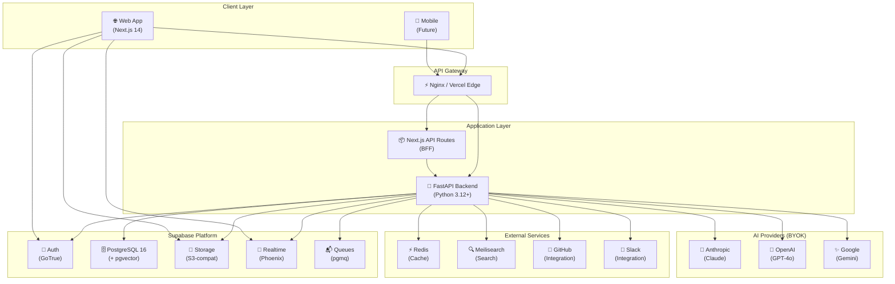
```mermaid
graph TB
    subgraph "Client Layer"
        WEB["🌐 Web App<br/>(Next.js 14)"]
        MOBILE["📱 Mobile<br/>(Future)"]
    end

    subgraph "API Gateway"
        NGINX["⚡ Nginx / Vercel Edge"]
    end

    subgraph "Application Layer"
        FASTAPI["🐍 FastAPI Backend<br/>(Python 3.12+)"]
        NEXTAPI["📦 Next.js API Routes<br/>(BFF)"]
    end

    subgraph "Supabase Platform"
        AUTH["🔐 Auth<br/>(GoTrue)"]
        DB["🗄️ PostgreSQL 16<br/>(+ pgvector)"]
        STORAGE["📁 Storage<br/>(S3-compat)"]
        REALTIME["📡 Realtime<br/>(Phoenix)"]
        QUEUES["📬 Queues<br/>(pgmq)"]
    end

    subgraph "External Services"
        REDIS["⚡ Redis<br/>(Cache)"]
        MEILI["🔍 Meilisearch<br/>(Search)"]
        GITHUB["🐙 GitHub<br/>(Integration)"]
        SLACK["💬 Slack<br/>(Integration)"]
    end

    subgraph "AI Providers (BYOK)"
        ANTHROPIC["🤖 Anthropic<br/>(Claude)"]
        OPENAI["🧠 OpenAI<br/>(GPT-4o)"]
        GOOGLE["✨ Google<br/>(Gemini)"]
    end

    WEB --> NGINX
    MOBILE --> NGINX
    NGINX --> FASTAPI
    NGINX --> NEXTAPI
    NEXTAPI --> FASTAPI

    FASTAPI --> AUTH
    FASTAPI --> DB
    FASTAPI --> STORAGE
    FASTAPI --> REALTIME
    FASTAPI --> QUEUES
    FASTAPI --> REDIS
    FASTAPI --> MEILI
    FASTAPI --> GITHUB
    FASTAPI --> SLACK

    FASTAPI --> ANTHROPIC
    FASTAPI --> OPENAI
    FASTAPI --> GOOGLE

    WEB --> AUTH
    WEB --> REALTIME
    WEB --> STORAGE
```

### Core Philosophy

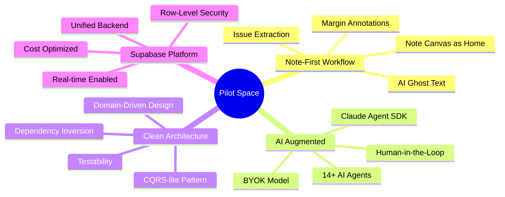
```mermaid
mindmap
  root((Pilot Space))
    Note-First Workflow
      Note Canvas as Home
      AI Ghost Text
      Issue Extraction
      Margin Annotations
    AI Augmented
      BYOK Model
      Claude Agent SDK
      14+ AI Agents
      Human-in-the-Loop
    Clean Architecture
      Domain-Driven Design
      CQRS-lite Pattern
      Dependency Inversion
      Testability
    Supabase Platform
      Unified Backend
      Row-Level Security
      Real-time Enabled
      Cost Optimized
```

---

## 2. Clean Architecture Layers

### Layer Dependency Diagram

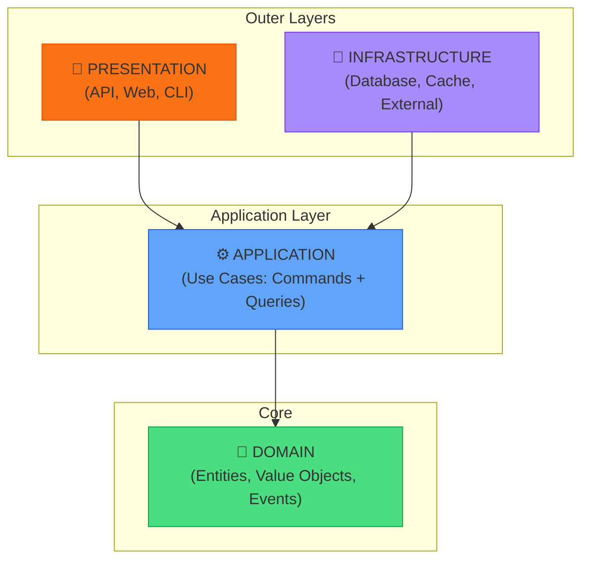
```mermaid
graph TB
    subgraph "Outer Layers"
        PRES["📱 PRESENTATION<br/>(API, Web, CLI)"]
        INFRA["🔧 INFRASTRUCTURE<br/>(Database, Cache, External)"]
    end

    subgraph "Application Layer"
        APP["⚙️ APPLICATION<br/>(Use Cases: Commands + Queries)"]
    end

    subgraph "Core"
        DOMAIN["💎 DOMAIN<br/>(Entities, Value Objects, Events)"]
    end

    PRES --> APP
    INFRA --> APP
    APP --> DOMAIN

    style DOMAIN fill:#4ade80,stroke:#16a34a
    style APP fill:#60a5fa,stroke:#2563eb
    style PRES fill:#f97316,stroke:#ea580c
    style INFRA fill:#a78bfa,stroke:#7c3aed
```

### Detailed Layer Architecture

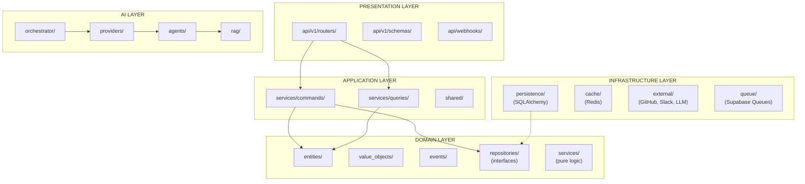
```mermaid
graph TB
    subgraph "PRESENTATION LAYER"
        direction LR
        R1["api/v1/routers/"]
        R2["api/v1/schemas/"]
        R3["api/webhooks/"]
    end

    subgraph "APPLICATION LAYER"
        direction LR
        A1["services/commands/"]
        A2["services/queries/"]
        A3["shared/"]
    end

    subgraph "DOMAIN LAYER"
        direction LR
        D1["entities/"]
        D2["value_objects/"]
        D3["events/"]
        D4["repositories/<br/>(interfaces)"]
        D5["services/<br/>(pure logic)"]
    end

    subgraph "INFRASTRUCTURE LAYER"
        direction LR
        I1["persistence/<br/>(SQLAlchemy)"]
        I2["cache/<br/>(Redis)"]
        I3["external/<br/>(GitHub, Slack, LLM)"]
        I4["queue/<br/>(Supabase Queues)"]
    end

    subgraph "AI LAYER"
        direction LR
        AI1["orchestrator/"]
        AI2["providers/"]
        AI3["agents/"]
        AI4["rag/"]
    end

    R1 --> A1
    R1 --> A2
    A1 --> D1
    A2 --> D1
    A1 --> D4
    I1 -.-> D4
    AI1 --> AI2
    AI2 --> AI3
    AI3 --> AI4
```

---

## 3. Frontend Architecture

### Component Architecture

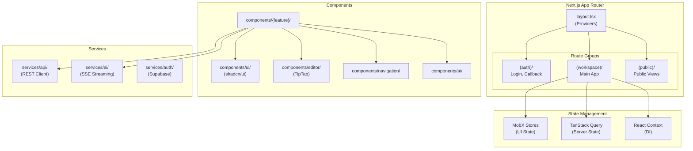
```mermaid
graph TB
    subgraph "Next.js App Router"
        ROOT["layout.tsx<br/>(Providers)"]

        subgraph "Route Groups"
            AUTH["(auth)/<br/>Login, Callback"]
            WORK["(workspace)/<br/>Main App"]
            PUB["(public)/<br/>Public Views"]
        end
    end

    subgraph "State Management"
        MOBX["MobX Stores<br/>(UI State)"]
        TANSTACK["TanStack Query<br/>(Server State)"]
        CONTEXT["React Context<br/>(DI)"]
    end

    subgraph "Components"
        UI["components/ui/<br/>(shadcn/ui)"]
        EDITOR["components/editor/<br/>(TipTap)"]
        FEATURE["components/{feature}/"]
        NAV["components/navigation/"]
        AICOMP["components/ai/"]
    end

    subgraph "Services"
        API["services/api/<br/>(REST Client)"]
        AISERVICE["services/ai/<br/>(SSE Streaming)"]
        AUTHSVC["services/auth/<br/>(Supabase)"]
    end

    ROOT --> AUTH
    ROOT --> WORK
    ROOT --> PUB
    WORK --> MOBX
    WORK --> TANSTACK
    WORK --> CONTEXT
    FEATURE --> UI
    FEATURE --> EDITOR
    FEATURE --> NAV
    FEATURE --> AICOMP
    FEATURE --> API
    FEATURE --> AISERVICE
```

### Note Canvas Architecture

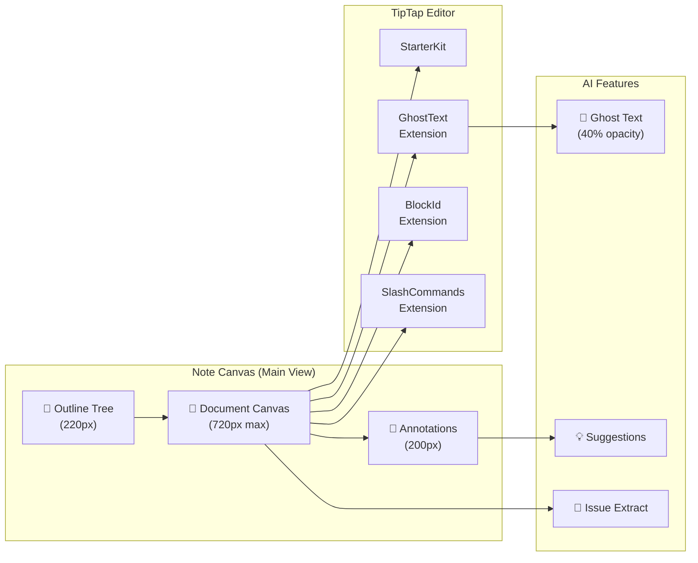
```mermaid
graph LR
    subgraph "Note Canvas (Main View)"
        SIDEBAR["📑 Outline Tree<br/>(220px)"]
        CANVAS["📝 Document Canvas<br/>(720px max)"]
        MARGIN["💬 Annotations<br/>(200px)"]
    end

    subgraph "TipTap Editor"
        STARTER["StarterKit"]
        GHOST["GhostText<br/>Extension"]
        BLOCKID["BlockId<br/>Extension"]
        SLASH["SlashCommands<br/>Extension"]
    end

    subgraph "AI Features"
        GHOSTTXT["👻 Ghost Text<br/>(40% opacity)"]
        SUGGEST["💡 Suggestions"]
        EXTRACT["🎯 Issue Extract"]
    end

    SIDEBAR --> CANVAS
    CANVAS --> MARGIN
    CANVAS --> STARTER
    CANVAS --> GHOST
    CANVAS --> BLOCKID
    CANVAS --> SLASH
    GHOST --> GHOSTTXT
    MARGIN --> SUGGEST
    CANVAS --> EXTRACT
```

---

## 4. Backend Architecture

### CQRS-lite Pattern

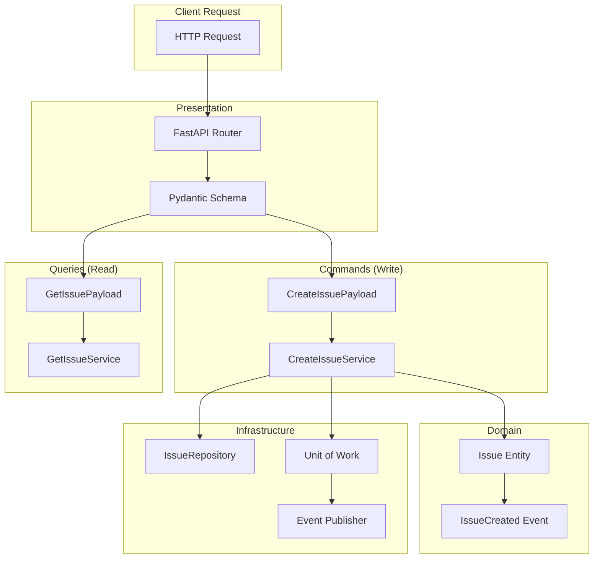
```mermaid
graph TB
    subgraph "Client Request"
        REQ["HTTP Request"]
    end

    subgraph "Presentation"
        ROUTER["FastAPI Router"]
        SCHEMA["Pydantic Schema"]
    end

    subgraph "Commands (Write)"
        CMD["CreateIssuePayload"]
        CMDHANDLER["CreateIssueService"]
    end

    subgraph "Queries (Read)"
        QRY["GetIssuePayload"]
        QRYHANDLER["GetIssueService"]
    end

    subgraph "Domain"
        ENTITY["Issue Entity"]
        EVENT["IssueCreated Event"]
    end

    subgraph "Infrastructure"
        REPO["IssueRepository"]
        UOW["Unit of Work"]
        EVENTBUS["Event Publisher"]
    end

    REQ --> ROUTER
    ROUTER --> SCHEMA
    SCHEMA --> CMD
    SCHEMA --> QRY
    CMD --> CMDHANDLER
    QRY --> QRYHANDLER
    CMDHANDLER --> ENTITY
    ENTITY --> EVENT
    CMDHANDLER --> REPO
    CMDHANDLER --> UOW
    UOW --> EVENTBUS
```

### Dependency Injection Container

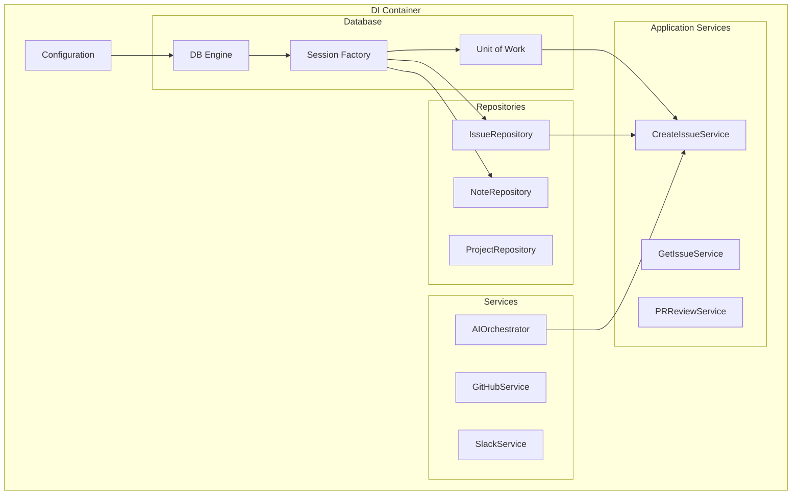
```mermaid
graph TB
    subgraph "DI Container"
        CONFIG["Configuration"]

        subgraph "Database"
            ENGINE["DB Engine"]
            SESSION["Session Factory"]
            UOW["Unit of Work"]
        end

        subgraph "Repositories"
            ISSUE_REPO["IssueRepository"]
            NOTE_REPO["NoteRepository"]
            PROJECT_REPO["ProjectRepository"]
        end

        subgraph "Services"
            AI_ORCH["AIOrchestrator"]
            GITHUB_SVC["GitHubService"]
            SLACK_SVC["SlackService"]
        end

        subgraph "Application Services"
            CREATE_ISSUE["CreateIssueService"]
            GET_ISSUE["GetIssueService"]
            PR_REVIEW["PRReviewService"]
        end
    end

    CONFIG --> ENGINE
    ENGINE --> SESSION
    SESSION --> UOW
    SESSION --> ISSUE_REPO
    SESSION --> NOTE_REPO
    UOW --> CREATE_ISSUE
    ISSUE_REPO --> CREATE_ISSUE
    AI_ORCH --> CREATE_ISSUE
```

---

## 5. AI Layer Architecture

### AI Orchestration

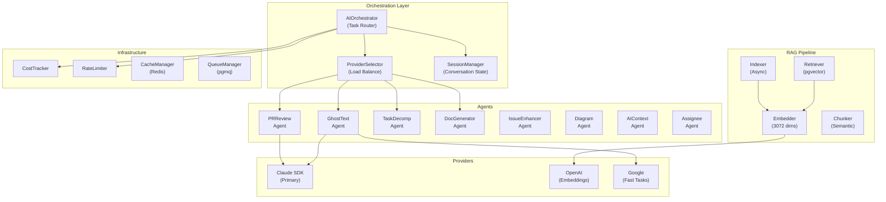
```mermaid
graph TB
    subgraph "Orchestration Layer"
        ORCH["AIOrchestrator<br/>(Task Router)"]
        SELECTOR["ProviderSelector<br/>(Load Balance)"]
        SESSION["SessionManager<br/>(Conversation State)"]
    end

    subgraph "Agents"
        direction LR
        GHOST["GhostText<br/>Agent"]
        PR["PRReview<br/>Agent"]
        TASK["TaskDecomp<br/>Agent"]
        DOC["DocGenerator<br/>Agent"]
        ISSUE["IssueEnhancer<br/>Agent"]
        DIAGRAM["Diagram<br/>Agent"]
        CONTEXT["AIContext<br/>Agent"]
        ASSIGN["Assignee<br/>Agent"]
    end

    subgraph "Providers"
        CLAUDE["Claude SDK<br/>(Primary)"]
        GPT["OpenAI<br/>(Embeddings)"]
        GEMINI["Google<br/>(Fast Tasks)"]
    end

    subgraph "RAG Pipeline"
        EMBED["Embedder<br/>(3072 dims)"]
        CHUNK["Chunker<br/>(Semantic)"]
        RETRIEVE["Retriever<br/>(pgvector)"]
        INDEX["Indexer<br/>(Async)"]
    end

    subgraph "Infrastructure"
        COST["CostTracker"]
        RATE["RateLimiter"]
        CACHE["CacheManager<br/>(Redis)"]
        QUEUE["QueueManager<br/>(pgmq)"]
    end

    ORCH --> SELECTOR
    ORCH --> SESSION
    SELECTOR --> GHOST
    SELECTOR --> PR
    SELECTOR --> TASK
    SELECTOR --> DOC
    GHOST --> CLAUDE
    GHOST --> GEMINI
    PR --> CLAUDE
    EMBED --> GPT
    RETRIEVE --> EMBED
    INDEX --> EMBED
    ORCH --> COST
    ORCH --> RATE
```

### Provider Selection Strategy (DD-011)

Per DD-011, tasks are routed to optimal providers based on requirements:

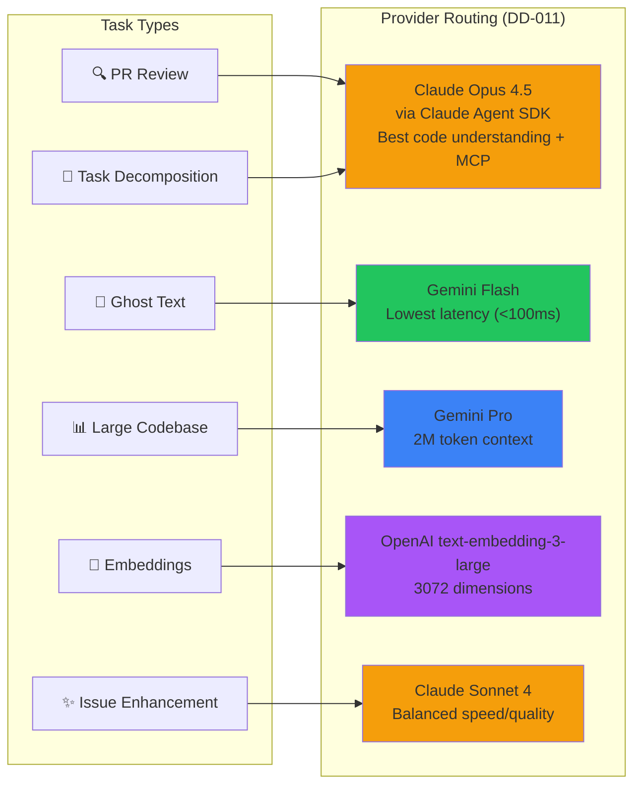
```mermaid
graph LR
    subgraph "Task Types"
        T1["🔍 PR Review"]
        T2["👻 Ghost Text"]
        T3["📊 Large Codebase"]
        T4["🔢 Embeddings"]
        T5["📝 Task Decomposition"]
        T6["✨ Issue Enhancement"]
    end

    subgraph "Provider Routing (DD-011)"
        R1["Claude Opus 4.5<br/>via Claude Agent SDK<br/>Best code understanding + MCP"]
        R2["Gemini Flash<br/>Lowest latency (<100ms)"]
        R3["Gemini Pro<br/>2M token context"]
        R4["OpenAI text-embedding-3-large<br/>3072 dimensions"]
        R5["Claude Sonnet 4<br/>Balanced speed/quality"]
    end

    T1 --> R1
    T2 --> R2
    T3 --> R3
    T4 --> R4
    T5 --> R1
    T6 --> R5

    style R1 fill:#f59e0b
    style R2 fill:#22c55e
    style R3 fill:#3b82f6
    style R4 fill:#a855f7
    style R5 fill:#f59e0b
```

**Provider Fallbacks**:
- Ghost text: Gemini Flash → Claude Haiku (if no Google key)
- Issue enhancement: Claude Sonnet → Claude Haiku
- Large codebase: Gemini Pro → Chunked Claude analysis

---

## 6. Infrastructure & Deployment

### Supabase Platform Integration

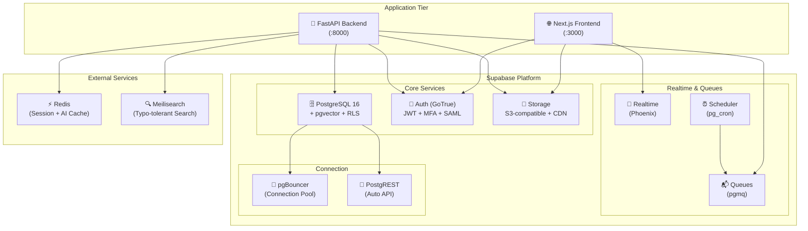
```mermaid
graph TB
    subgraph "Application Tier"
        FRONTEND["🌐 Next.js Frontend<br/>(:3000)"]
        BACKEND["🐍 FastAPI Backend<br/>(:8000)"]
    end

    subgraph "Supabase Platform"
        subgraph "Core Services"
            PGDB["🗄️ PostgreSQL 16<br/>+ pgvector + RLS"]
            GOAUTH["🔐 Auth (GoTrue)<br/>JWT + MFA + SAML"]
            S3["📁 Storage<br/>S3-compatible + CDN"]
        end

        subgraph "Realtime & Queues"
            PHOENIX["📡 Realtime<br/>(Phoenix)"]
            PGMQ["📬 Queues<br/>(pgmq)"]
            PGCRON["⏰ Scheduler<br/>(pg_cron)"]
        end

        subgraph "Connection"
            PGBOUNCE["🔄 pgBouncer<br/>(Connection Pool)"]
            POSTG["🚀 PostgREST<br/>(Auto API)"]
        end
    end

    subgraph "External Services"
        REDIS["⚡ Redis<br/>(Session + AI Cache)"]
        MEILI["🔍 Meilisearch<br/>(Typo-tolerant Search)"]
    end

    FRONTEND --> GOAUTH
    FRONTEND --> PHOENIX
    FRONTEND --> S3
    BACKEND --> PGDB
    BACKEND --> GOAUTH
    BACKEND --> S3
    BACKEND --> PGMQ
    BACKEND --> REDIS
    BACKEND --> MEILI
    PGDB --> PGBOUNCE
    PGDB --> POSTG
    PGCRON --> PGMQ
```

---

## 7. Request Flow

### API Request Lifecycle

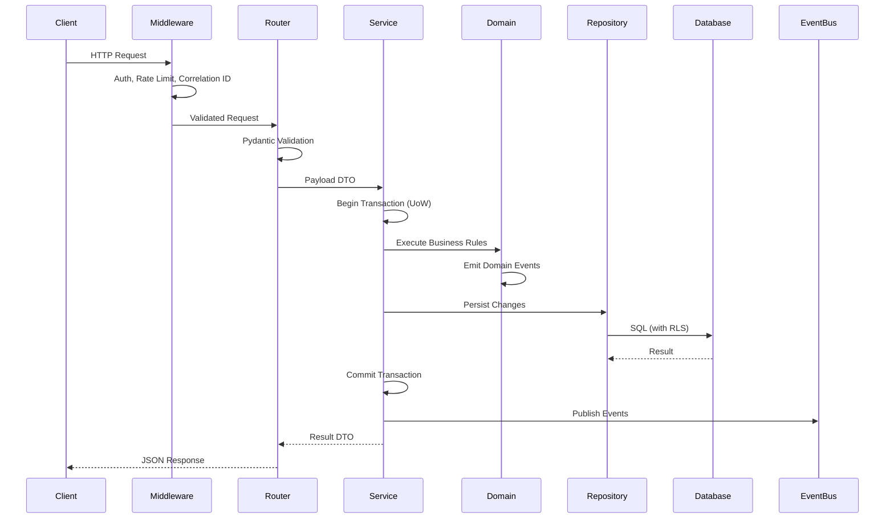
```mermaid
sequenceDiagram
    participant Client
    participant Middleware
    participant Router
    participant Service
    participant Domain
    participant Repository
    participant Database
    participant EventBus

    Client->>Middleware: HTTP Request
    Middleware->>Middleware: Auth, Rate Limit, Correlation ID
    Middleware->>Router: Validated Request
    Router->>Router: Pydantic Validation
    Router->>Service: Payload DTO
    Service->>Service: Begin Transaction (UoW)
    Service->>Domain: Execute Business Rules
    Domain->>Domain: Emit Domain Events
    Service->>Repository: Persist Changes
    Repository->>Database: SQL (with RLS)
    Database-->>Repository: Result
    Service->>Service: Commit Transaction
    Service->>EventBus: Publish Events
    Service-->>Router: Result DTO
    Router-->>Client: JSON Response
```

### AI Streaming Flow (SSE)

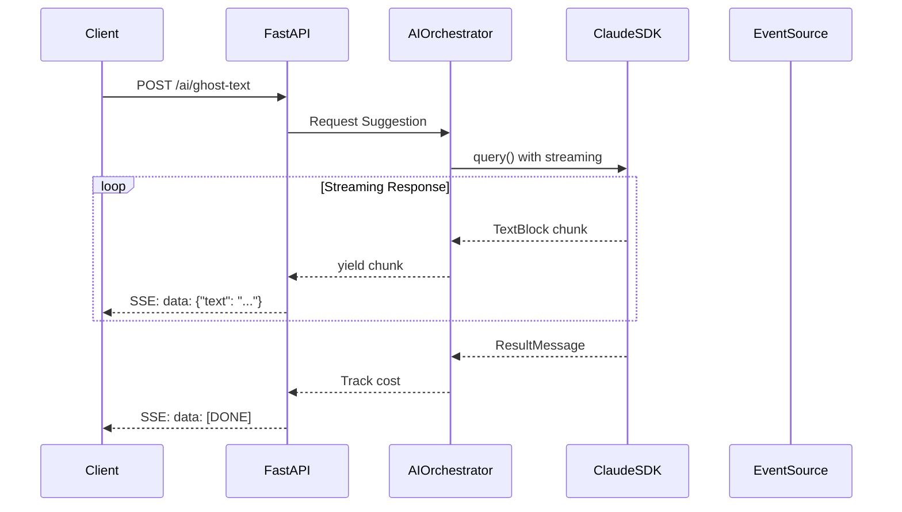
```mermaid
sequenceDiagram
    participant Client
    participant FastAPI
    participant AIOrchestrator
    participant ClaudeSDK
    participant EventSource

    Client->>FastAPI: POST /ai/ghost-text
    FastAPI->>AIOrchestrator: Request Suggestion
    AIOrchestrator->>ClaudeSDK: query() with streaming

    loop Streaming Response
        ClaudeSDK-->>AIOrchestrator: TextBlock chunk
        AIOrchestrator-->>FastAPI: yield chunk
        FastAPI-->>Client: SSE: data: {"text": "..."}
    end

    ClaudeSDK-->>AIOrchestrator: ResultMessage
    AIOrchestrator-->>FastAPI: Track cost
    FastAPI-->>Client: SSE: data: [DONE]
```

---

## 8. Data Model (ERD)

### Core Entities

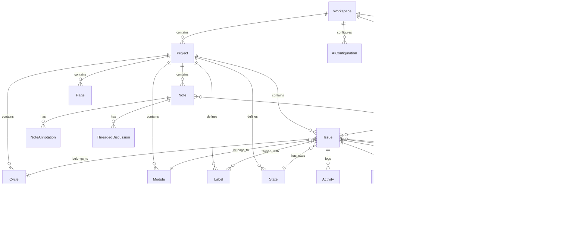
```mermaid
erDiagram
    Workspace ||--o{ Project : contains
    Workspace ||--o{ WorkspaceMember : has
    Workspace ||--o{ AIConfiguration : configures
    Workspace ||--o{ Integration : connects

    Project ||--o{ Issue : contains
    Project ||--o{ Note : contains
    Project ||--o{ Page : contains
    Project ||--o{ Cycle : contains
    Project ||--o{ Module : contains
    Project ||--o{ Label : defines
    Project ||--o{ State : defines

    Note ||--o{ NoteAnnotation : has
    Note ||--o{ ThreadedDiscussion : has
    Note }o--o{ Issue : extracts_to

    Issue ||--o{ Activity : logs
    Issue }o--o{ Label : tagged_with
    Issue ||--o{ IntegrationLink : linked_to
    Issue ||--o{ AIContext : has_context
    Issue }o--|| Cycle : belongs_to
    Issue }o--|| Module : belongs_to
    Issue }o--|| User : assigned_to
    Issue }o--|| State : has_state
    Issue ||--o{ IssueLink : relates_to

    User ||--o{ WorkspaceMember : member_of
```

### AI & Integration Entities

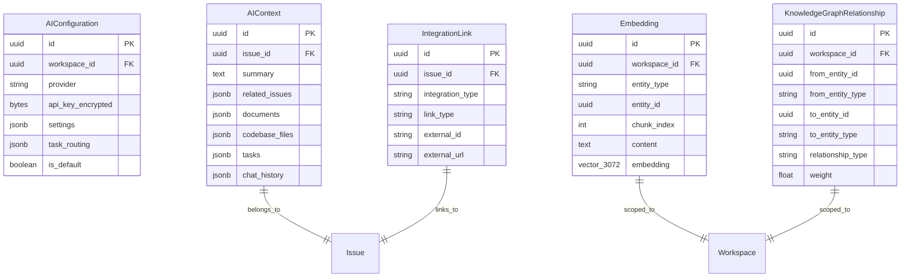
```mermaid
erDiagram
    AIConfiguration {
        uuid id PK
        uuid workspace_id FK
        string provider
        bytes api_key_encrypted
        jsonb settings
        jsonb task_routing
        boolean is_default
    }

    AIContext {
        uuid id PK
        uuid issue_id FK
        text summary
        jsonb related_issues
        jsonb documents
        jsonb codebase_files
        jsonb tasks
        jsonb chat_history
    }

    Embedding {
        uuid id PK
        uuid workspace_id FK
        string entity_type
        uuid entity_id
        int chunk_index
        text content
        vector_3072 embedding
    }

    KnowledgeGraphRelationship {
        uuid id PK
        uuid workspace_id FK
        uuid from_entity_id
        string from_entity_type
        uuid to_entity_id
        string to_entity_type
        string relationship_type
        float weight
    }

    IntegrationLink {
        uuid id PK
        uuid issue_id FK
        string integration_type
        string link_type
        string external_id
        string external_url
    }

    AIContext ||--|| Issue : belongs_to
    Embedding ||--|| Workspace : scoped_to
    KnowledgeGraphRelationship ||--|| Workspace : scoped_to
    IntegrationLink ||--|| Issue : links_to
```

---

## 9. Authentication & Authorization

### Auth Flow

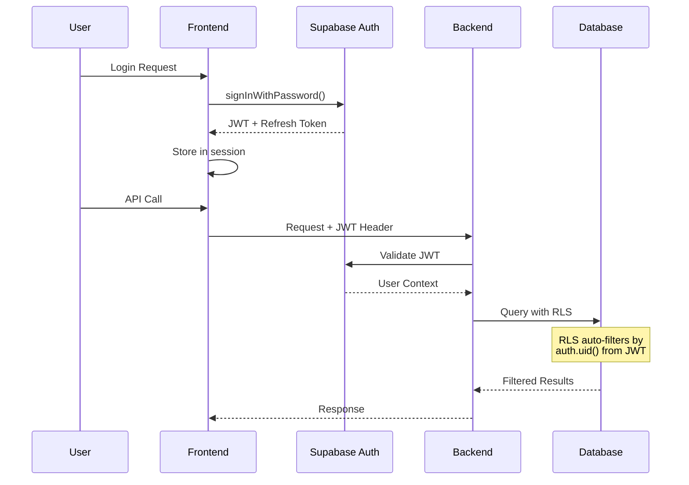
```mermaid
sequenceDiagram
    participant User
    participant Frontend
    participant Supabase Auth
    participant Backend
    participant Database

    User->>Frontend: Login Request
    Frontend->>Supabase Auth: signInWithPassword()
    Supabase Auth-->>Frontend: JWT + Refresh Token
    Frontend->>Frontend: Store in session

    User->>Frontend: API Call
    Frontend->>Backend: Request + JWT Header
    Backend->>Supabase Auth: Validate JWT
    Supabase Auth-->>Backend: User Context
    Backend->>Database: Query with RLS
    Note over Database: RLS auto-filters by<br/>auth.uid() from JWT
    Database-->>Backend: Filtered Results
    Backend-->>Frontend: Response
```

### RLS Policy Architecture

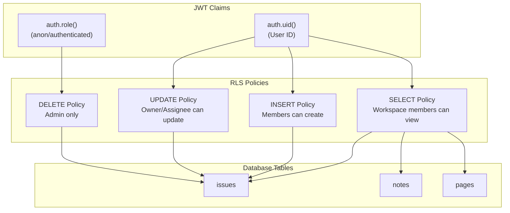
```mermaid
graph TB
    subgraph "JWT Claims"
        UID["auth.uid()<br/>(User ID)"]
        ROLE["auth.role()<br/>(anon/authenticated)"]
    end

    subgraph "RLS Policies"
        SELECT_POL["SELECT Policy<br/>Workspace members can view"]
        INSERT_POL["INSERT Policy<br/>Members can create"]
        UPDATE_POL["UPDATE Policy<br/>Owner/Assignee can update"]
        DELETE_POL["DELETE Policy<br/>Admin only"]
    end

    subgraph "Database Tables"
        ISSUES["issues"]
        NOTES["notes"]
        PAGES["pages"]
    end

    UID --> SELECT_POL
    UID --> INSERT_POL
    UID --> UPDATE_POL
    ROLE --> DELETE_POL

    SELECT_POL --> ISSUES
    SELECT_POL --> NOTES
    SELECT_POL --> PAGES
    INSERT_POL --> ISSUES
    UPDATE_POL --> ISSUES
    DELETE_POL --> ISSUES
```

### RBAC Model

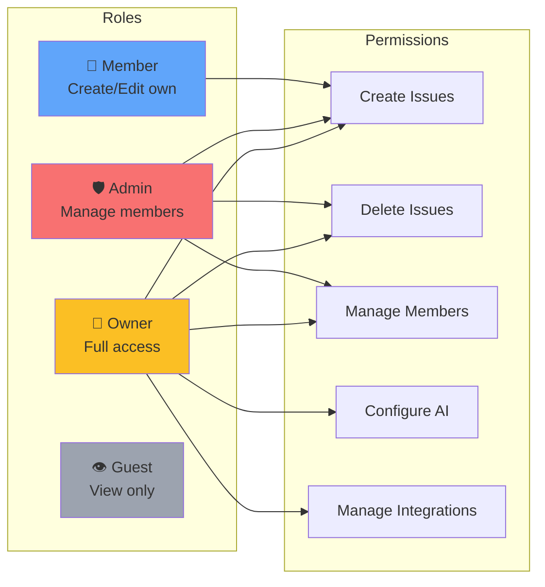
```mermaid
graph LR
    subgraph "Roles"
        OWNER["👑 Owner<br/>Full access"]
        ADMIN["🛡️ Admin<br/>Manage members"]
        MEMBER["👤 Member<br/>Create/Edit own"]
        GUEST["👁️ Guest<br/>View only"]
    end

    subgraph "Permissions"
        P1["Create Issues"]
        P2["Delete Issues"]
        P3["Manage Members"]
        P4["Configure AI"]
        P5["Manage Integrations"]
    end

    OWNER --> P1
    OWNER --> P2
    OWNER --> P3
    OWNER --> P4
    OWNER --> P5

    ADMIN --> P1
    ADMIN --> P2
    ADMIN --> P3

    MEMBER --> P1

    style OWNER fill:#fbbf24
    style ADMIN fill:#f87171
    style MEMBER fill:#60a5fa
    style GUEST fill:#9ca3af
```

---

## 10. Real-time Collaboration

### Supabase Realtime Architecture

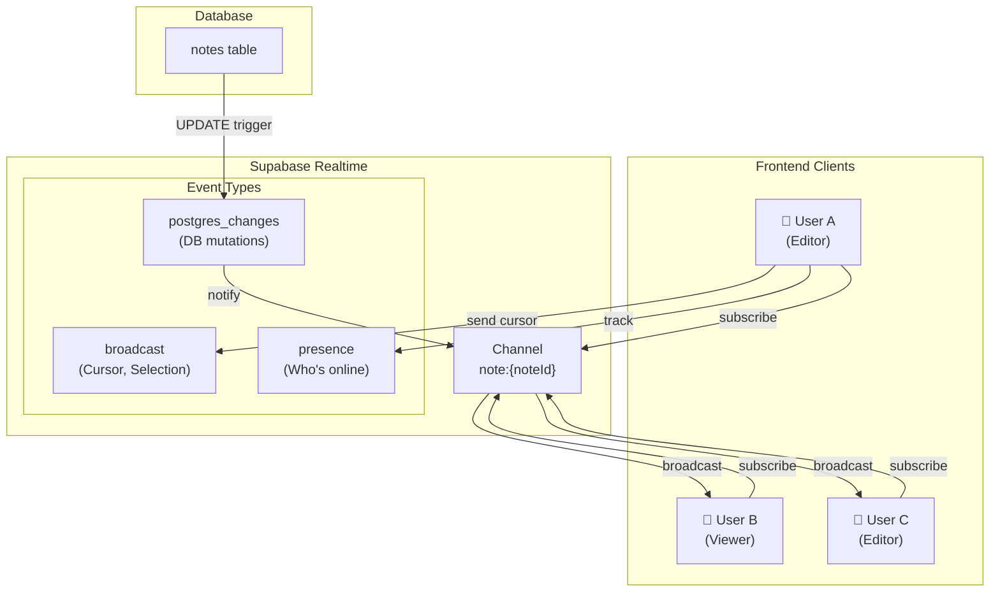
```mermaid
graph TB
    subgraph "Frontend Clients"
        C1["👤 User A<br/>(Editor)"]
        C2["👤 User B<br/>(Viewer)"]
        C3["👤 User C<br/>(Editor)"]
    end

    subgraph "Supabase Realtime"
        CHANNEL["Channel<br/>note:{noteId}"]

        subgraph "Event Types"
            POSTGRES["postgres_changes<br/>(DB mutations)"]
            BROADCAST["broadcast<br/>(Cursor, Selection)"]
            PRESENCE["presence<br/>(Who's online)"]
        end
    end

    subgraph "Database"
        NOTES["notes table"]
    end

    C1 -->|subscribe| CHANNEL
    C2 -->|subscribe| CHANNEL
    C3 -->|subscribe| CHANNEL

    C1 -->|track| PRESENCE
    C1 -->|send cursor| BROADCAST

    NOTES -->|UPDATE trigger| POSTGRES
    POSTGRES -->|notify| CHANNEL
    CHANNEL -->|broadcast| C2
    CHANNEL -->|broadcast| C3
```

### Note Collaboration Flow

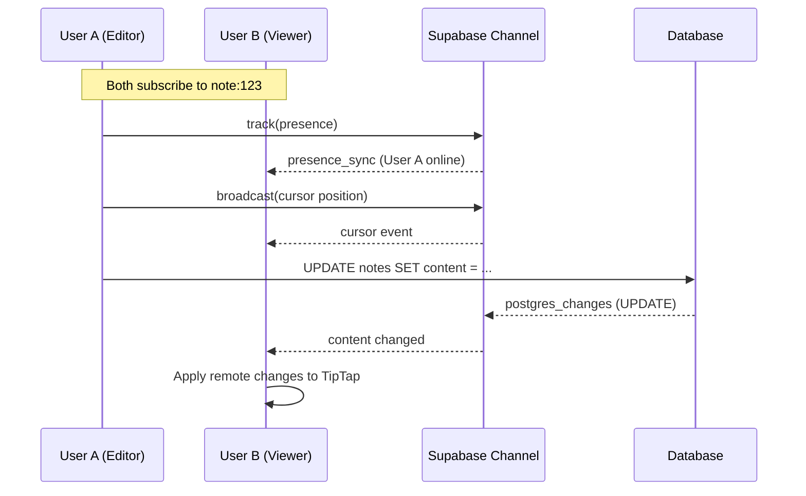
```mermaid
sequenceDiagram
    participant UserA as User A (Editor)
    participant UserB as User B (Viewer)
    participant Channel as Supabase Channel
    participant DB as Database

    Note over UserA,UserB: Both subscribe to note:123

    UserA->>Channel: track(presence)
    Channel-->>UserB: presence_sync (User A online)

    UserA->>Channel: broadcast(cursor position)
    Channel-->>UserB: cursor event

    UserA->>DB: UPDATE notes SET content = ...
    DB-->>Channel: postgres_changes (UPDATE)
    Channel-->>UserB: content changed

    UserB->>UserB: Apply remote changes to TipTap
```

---

## 11. AI Agents Catalog

### Agent Mapping

```mermaid
graph TB
    subgraph "User Stories"
        US01["US-01<br/>Note Canvas"]
        US02["US-02<br/>Issue Creation"]
        US03["US-03<br/>PR Review"]
        US12["US-12<br/>AI Context"]
        US07["US-07<br/>Task Decompose"]
    end

    subgraph "AI Agents"
        A1["GhostTextAgent<br/>💨 Gemini Flash"]
        A2["IssueExtractorAgent<br/>🎯 Claude"]
        A3["MarginAnnotationAgent<br/>📝 Gemini Flash"]
        A4["IssueEnhancerAgent<br/>✨ Claude"]
        A5["DuplicateDetectorAgent<br/>🔍 pgvector + Claude"]
        A6["PRReviewAgent<br/>🔬 Claude Opus"]
        A7["AIContextAgent<br/>📚 Claude Opus"]
        A8["TaskDecomposerAgent<br/>📋 Claude Opus"]
    end

    US01 --> A1
    US01 --> A2
    US01 --> A3
    US02 --> A4
    US02 --> A5
    US03 --> A6
    US12 --> A7
    US07 --> A8
```

### Agent Response Times

```mermaid
gantt
    title AI Agent Response Time Targets
    dateFormat X
    axisFormat %s

    section Latency-Critical
    Ghost Text (2s max)     :0, 2
    Margin Annotation       :0, 3

    section Interactive
    Issue Enhancement      :0, 5
    Task Decomposition     :0, 30

    section Background
    PR Review              :0, 300
    AI Context             :0, 180
    Embedding Index        :0, 600
```

---

## 12. State Management

### Frontend State Architecture

```mermaid
graph TB
    subgraph "Server State (TanStack Query)"
        SQ1["Issues Cache"]
        SQ2["Notes Cache"]
        SQ3["Projects Cache"]
        SQ4["Users Cache"]
    end

    subgraph "UI State (MobX)"
        MX1["IssueStore<br/>(selection, drag)"]
        MX2["NoteStore<br/>(editor state)"]
        MX3["UIStore<br/>(modals, sidebar)"]
    end

    subgraph "Context"
        CTX1["StoreProvider"]
        CTX2["QueryClientProvider"]
        CTX3["SupabaseProvider"]
    end

    subgraph "Components"
        COMP["Feature Components"]
    end

    CTX1 --> MX1
    CTX1 --> MX2
    CTX1 --> MX3
    CTX2 --> SQ1
    CTX2 --> SQ2
    CTX2 --> SQ3
    CTX3 --> SQ4

    COMP --> MX1
    COMP --> SQ1
```

### State Sync with Supabase Realtime

```mermaid
sequenceDiagram
    participant Component
    participant TanStack as TanStack Query
    participant MobX
    participant Supabase as Supabase Realtime
    participant DB

    Note over Component,DB: Initial Load
    Component->>TanStack: useQuery('issues')
    TanStack->>DB: GET /issues
    DB-->>TanStack: Issues[]
    TanStack-->>Component: data

    Note over Component,DB: Real-time Subscription
    Component->>Supabase: subscribe(postgres_changes)

    Note over Component,DB: Remote Update
    DB-->>Supabase: INSERT/UPDATE event
    Supabase-->>Component: payload
    Component->>TanStack: queryClient.setQueryData()

    Note over Component,DB: Optimistic Update
    Component->>MobX: optimisticUpdate(issue)
    MobX-->>Component: Immediate UI update
    Component->>TanStack: mutate()
    TanStack->>DB: PUT /issues/:id
    alt Success
        DB-->>TanStack: Updated issue
        Component->>MobX: confirmUpdate()
    else Error
        DB-->>TanStack: Error
        Component->>MobX: rollback()
    end
```

---

## Quick Reference

### Technology Stack Summary

| Layer | Technology | Purpose |
|-------|------------|---------|
| Frontend | Next.js 14 + React 18 | App Router, Server Components |
| State | MobX + TanStack Query | UI + Server state |
| Editor | TipTap/ProseMirror | Rich text editing |
| Styling | TailwindCSS + shadcn/ui | Utility-first CSS |
| Backend | FastAPI + Python 3.12 | REST API |
| ORM | SQLAlchemy 2.0 (async) | Database operations |
| AI SDK | Claude Agent SDK | AI orchestration |
| Database | PostgreSQL 16 + pgvector | Primary data + vectors |
| Auth | Supabase Auth (GoTrue) | JWT + RLS |
| Storage | Supabase Storage | S3-compatible |
| Realtime | Supabase Realtime | WebSocket |
| Queues | Supabase Queues (pgmq) | Background jobs |
| Cache | Redis | Sessions, AI cache |
| Search | Meilisearch | Typo-tolerant search |

### Key Design Decisions

| Decision | Choice | Rationale |
|----------|--------|-----------|
| Architecture | Clean + DDD + CQRS-lite | Testability, maintainability |
| State | MobX | Complex reactive UI |
| AI Model | BYOK only | Cost transparency, no lock-in |
| Auth | Supabase Auth | Simpler, RLS integration |
| Realtime | Supabase Realtime | Built-in WebSocket support |
| Streaming | SSE | Simpler AI streaming |

---

*Generated: 2026-01-22 | Version: 1.0*
