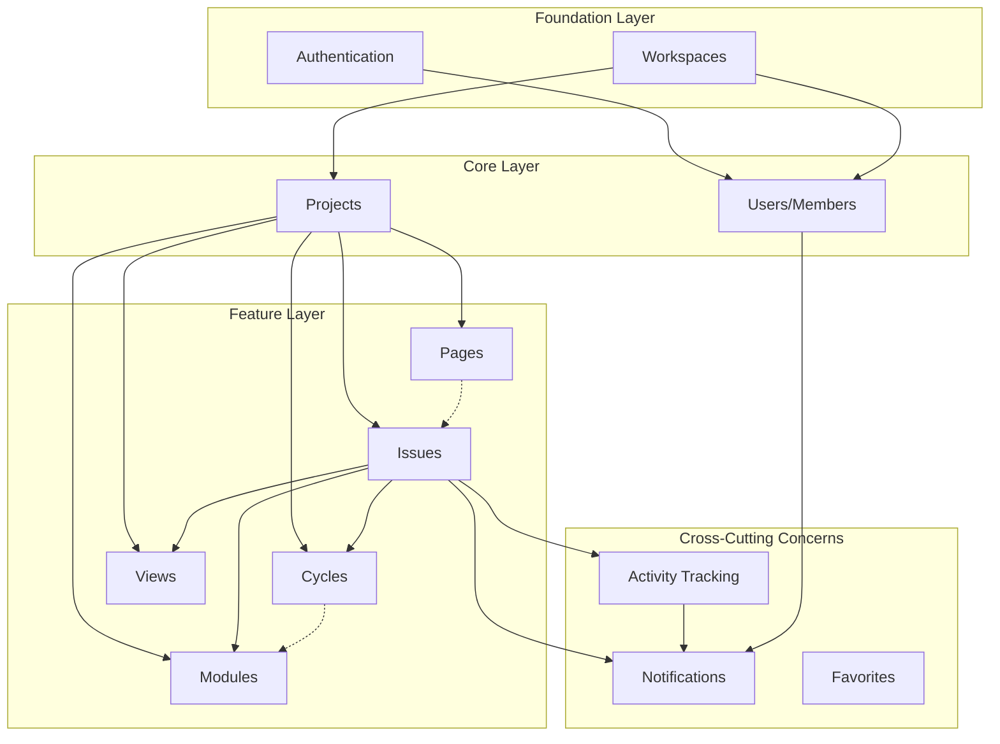
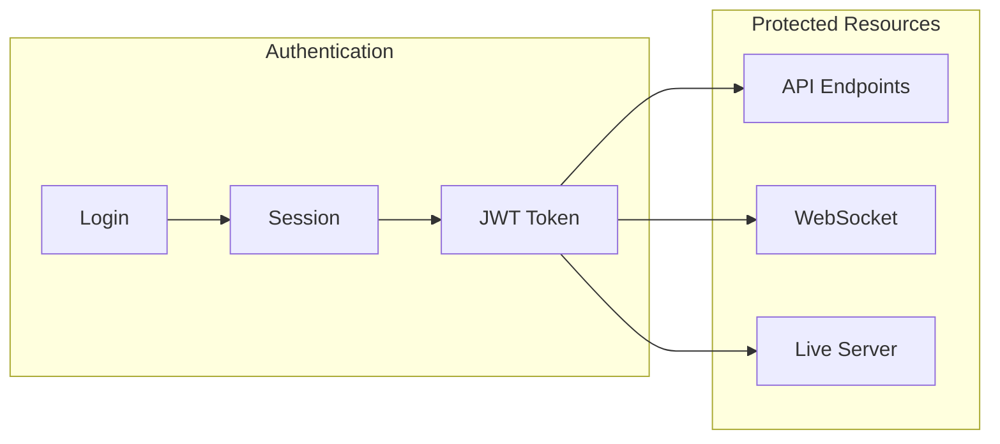
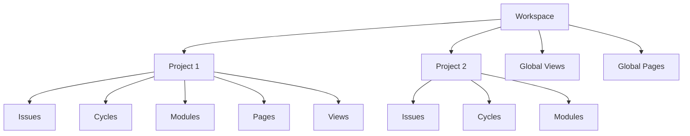
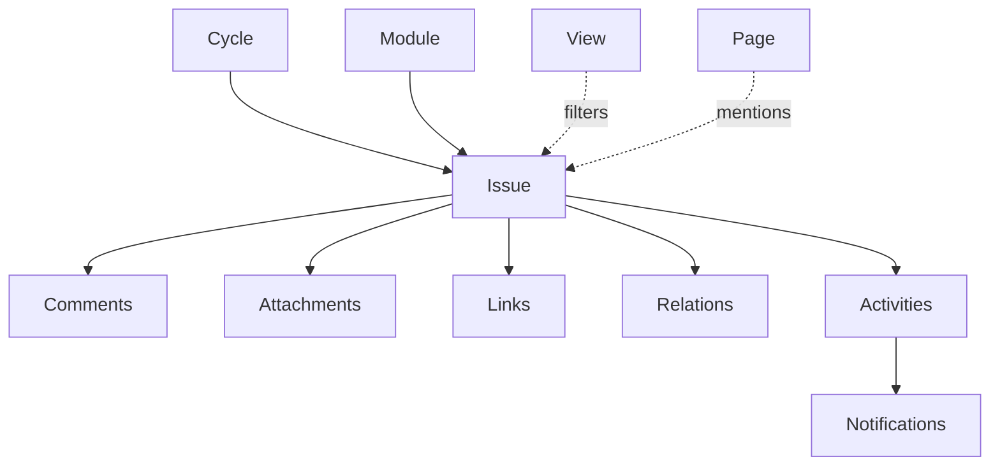
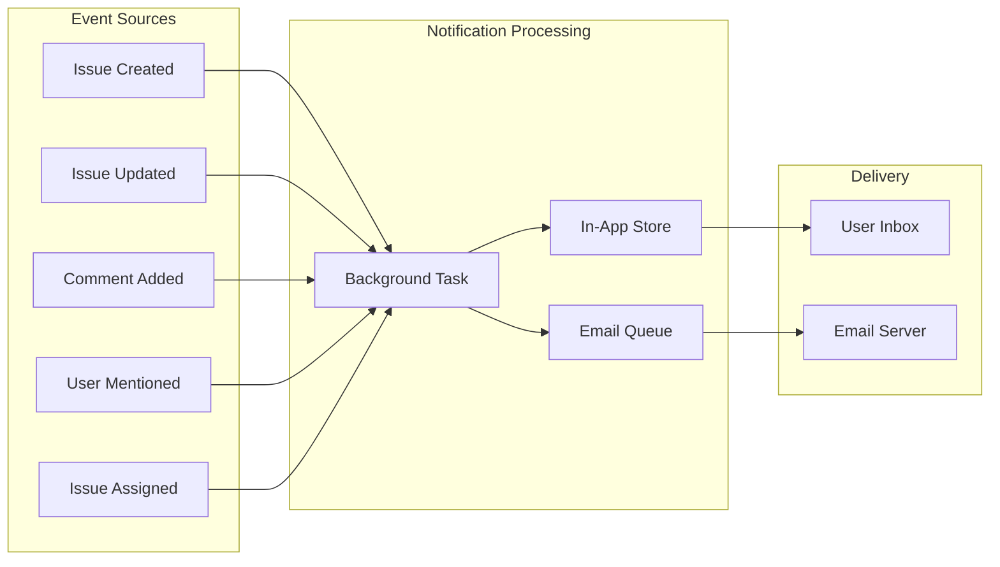
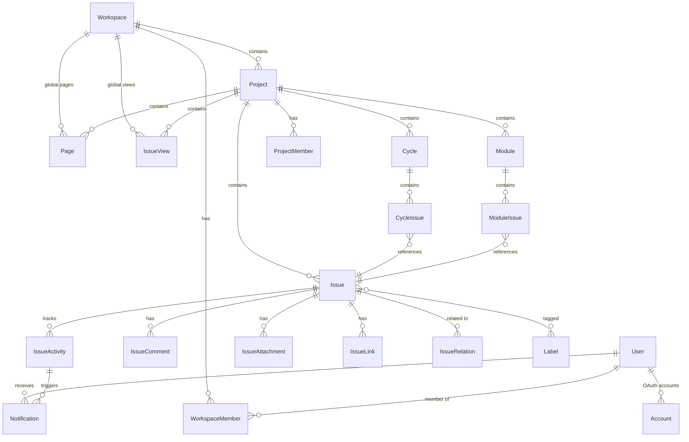
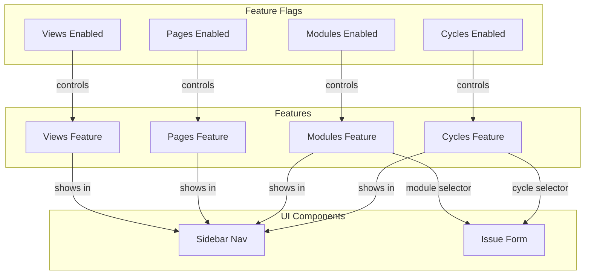

# Plane Feature Dependency Graph

## Overview

This document visualizes the dependencies and relationships between Plane's core features, showing how data flows between components and which features depend on others.

---

## High-Level Architecture Diagram



---

## Detailed Dependency Matrix

| Feature | Depends On | Depended By | Relationship Type |
|---------|------------|-------------|-------------------|
| **Authentication** | - | All features | Foundation |
| **Workspaces** | Authentication | Projects, Members, Views, Pages | Foundation |
| **Projects** | Workspaces | Issues, Cycles, Modules, Pages, Views | Container |
| **Users/Members** | Workspaces, Auth | Issues (assignees), Notifications | Identity |
| **Issues** | Projects, Users | Cycles, Modules, Views, Notifications | Core Entity |
| **Cycles** | Projects, Issues | - | Grouping |
| **Modules** | Projects, Issues | - | Grouping |
| **Pages** | Projects, Workspaces | Issues (mentions) | Documentation |
| **Views** | Projects, Issues | - | Query/Filter |
| **Notifications** | Issues, Users, Activities | - | Event-driven |

---

## Data Flow Dependencies

### 1. Authentication → Everything



### 2. Workspace → Project → Features



### 3. Issue as Central Entity



### 4. Notification Event Sources



---

## Database Model Dependencies



---

## Service Layer Dependencies

### Backend Services

```
plane/
├── authentication/          # No internal dependencies
│   ├── adapter/
│   └── provider/
│
├── db/models/              # Foundation models
│   ├── user.py             # → Account, Profile
│   ├── workspace.py        # → WorkspaceMember, WorkspaceMemberInvite
│   ├── project.py          # → Workspace, User
│   ├── issue.py            # → Project, User, State, Label
│   ├── cycle.py            # → Project, Issue
│   ├── module.py           # → Project, Issue
│   ├── page.py             # → Project, Workspace, User
│   ├── view.py             # → Project, Workspace, User
│   └── notification.py     # → Workspace, Project, User
│
├── bgtasks/                # Background task dependencies
│   ├── issue_activities_task.py    # → Issue, IssueActivity
│   ├── notification_task.py        # → Notification, EmailNotificationLog
│   ├── email_notification_task.py  # → EmailNotificationLog
│   └── page_version_task.py        # → Page, PageVersion
│
└── app/views/              # API view dependencies
    ├── workspace/          # → WorkspaceMember, Invite
    ├── project/            # → Workspace, ProjectMember
    ├── issue/              # → Project, Cycle, Module
    ├── cycle/              # → Project, Issue
    ├── module/             # → Project, Issue
    ├── page/               # → Project, Workspace
    ├── view/               # → Project, Workspace
    └── notification/       # → Workspace, User
```

### Frontend Store Dependencies

```
apps/web/core/store/
├── root.store.ts           # Orchestrates all stores
│
├── user/                   # Authentication state
│   └── profile.store.ts    # No store dependencies
│
├── workspace/              # Workspace management
│   └── index.ts            # → user store
│
├── member/                 # Member management
│   └── workspace-member.store.ts  # → workspace store
│
├── project/                # Project management
│   └── project.store.ts    # → workspace store
│
├── issue/                  # Issue management
│   ├── issue.store.ts      # → project, cycle, module stores
│   ├── issue-detail/       # → issue store
│   └── helpers/            # → filter utilities
│
├── cycle/                  # Cycle management
│   └── cycle.store.ts      # → project, issue stores
│
├── module/                 # Module management
│   └── module.store.ts     # → project, issue stores
│
├── pages/                  # Page management
│   └── project-page.store.ts  # → project store
│
├── project-view.store.ts   # View management
│   └──                     # → project, issue stores
│
└── notifications/          # Notification management
    └── workspace-notifications.store.ts  # → workspace store
```

---

## API Endpoint Dependency Chain

### Creating an Issue (Full Chain)

```
POST /api/workspaces/{slug}/projects/{project_id}/issues/

Dependencies resolved in order:
1. Authentication middleware → Validate session/token
2. WorkspaceEntityPermission → Check workspace membership
3. ProjectEntityPermission → Check project access
4. IssueSerializer validation:
   ├── state_id → State exists in project
   ├── assignee_ids → Users are project members
   ├── label_ids → Labels exist in project
   ├── cycle_id → Cycle exists in project (optional)
   └── module_ids → Modules exist in project (optional)
5. Issue.objects.create() → Database insert
6. issue_activity.delay() → Async activity tracking
7. notifications.delay() → Async notification dispatch
```

### Real-time Page Collaboration (Full Chain)

```
WebSocket wss://live.example.com/collaboration/{page_id}/

Dependencies resolved in order:
1. JWT token validation → User authenticated
2. onAuthenticate hook:
   ├── Decode JWT → Get user_id
   ├── Check page access → Page.objects.get()
   └── Verify project membership
3. Database.fetch() → Load page.description_binary
4. Y.js document sync → CRDT merge
5. Database.store() → Persist changes (debounced 10s)
6. page_transaction.delay() → Track mentions/embeds
7. page_version.delay() → Create version snapshot
```

---

## Feature Toggle Dependencies



---

## Cross-Feature Data References

| Source Feature | Target Feature | Reference Type | Field/Relation |
|---------------|----------------|----------------|----------------|
| Issue | Cycle | Many-to-One | `CycleIssue.cycle_id` |
| Issue | Module | Many-to-Many | `ModuleIssue.module_id` |
| Issue | Issue | Self-reference | `IssueRelation` |
| Issue | User | Many-to-Many | `assignees`, `created_by` |
| Page | Issue | Mention | `PageLog.entity_identifier` |
| Page | User | Mention | `PageLog.entity_identifier` |
| Page | Page | Hierarchy | `Page.parent_id` |
| View | Issue | Query | `IssueView.filters` |
| Notification | Issue | Reference | `entity_identifier` |
| Activity | Issue | Audit | `IssueActivity.issue_id` |

---

## Initialization Order (App Bootstrap)

```
1. Authentication
   └── Load user session/token

2. User Profile
   └── Fetch /api/users/me/

3. Workspaces
   └── Fetch /api/users/me/workspaces/

4. Current Workspace
   ├── Workspace details
   ├── Workspace members
   └── Navigation preferences

5. Projects (for current workspace)
   └── Fetch /api/workspaces/{slug}/projects/

6. Feature Data (lazy loaded per project)
   ├── Issues (on demand)
   ├── Cycles (on demand)
   ├── Modules (on demand)
   ├── Pages (on demand)
   └── Views (on demand)

7. Notifications
   └── Fetch unread count (polling/WebSocket)
```

---

## File Reference

| Diagram Type | Related Architecture Doc |
|--------------|-------------------------|
| Authentication flow | `AUTHENTICATION_ARCHITECTURE.md` |
| Workspace/Project hierarchy | `WORKSPACES_ARCHITECTURE.md` |
| Issue relationships | `ISSUES_ARCHITECTURE.md` |
| Cycle dependencies | `CYCLES_ARCHITECTURE.md` |
| Module dependencies | `MODULES_ARCHITECTURE.md` |
| Page collaboration | `PAGES_ARCHITECTURE.md` |
| View filtering | `VIEWS_ARCHITECTURE.md` |
| Notification events | `NOTIFICATIONS_ARCHITECTURE.md` |
