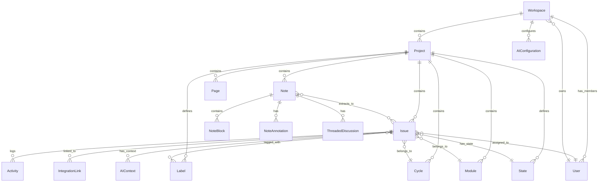

# Data Model: Pilot Space MVP

**Branch**: `001-pilot-space-mvp` | **Date**: 2026-01-22
**Purpose**: Define all entities, relationships, validation rules, and state transitions derived from the feature specification.
**Updated**: Session 2026-01-22 - Supabase platform, issue links junction table, knowledge graph relationships

---

## Entity Overview



---

## Core Entities

### 1. Workspace

**Purpose**: Top-level container for projects, members, and organization-wide settings.

```python
# backend/src/pilot_space/infrastructure/database/models/workspace.py
from sqlalchemy import String, Boolean, ForeignKey, Text
from sqlalchemy.dialects.postgresql import UUID, JSONB
from sqlalchemy.orm import Mapped, mapped_column, relationship

class Workspace(Base):
    __tablename__ = "workspaces"

    id: Mapped[UUID] = mapped_column(UUID(as_uuid=True), primary_key=True, default=uuid.uuid4)
    name: Mapped[str] = mapped_column(String(100), nullable=False)
    slug: Mapped[str] = mapped_column(String(50), unique=True, nullable=False, index=True)
    description: Mapped[str | None] = mapped_column(Text)
    logo_url: Mapped[str | None] = mapped_column(String(500))

    # Owner (Keycloak user)
    owner_id: Mapped[UUID] = mapped_column(UUID(as_uuid=True), ForeignKey("users.id"), nullable=False)

    # Settings
    settings: Mapped[dict] = mapped_column(JSONB, default=dict)
    # {
    #   "default_timezone": "UTC",
    #   "default_issue_state": "backlog",
    #   "ai_enabled": true,
    #   "ai_autonomy_level": "suggest_only"  # suggest_only | auto_safe | auto_all
    # }

    # Soft delete
    is_deleted: Mapped[bool] = mapped_column(Boolean, default=False)
    deleted_at: Mapped[datetime | None] = mapped_column(DateTime(timezone=True))

    # Timestamps
    created_at: Mapped[datetime] = mapped_column(DateTime(timezone=True), server_default=func.now())
    updated_at: Mapped[datetime] = mapped_column(DateTime(timezone=True), onupdate=func.now())

    # Relationships
    owner: Mapped["User"] = relationship(back_populates="owned_workspaces")
    members: Mapped[list["WorkspaceMember"]] = relationship(back_populates="workspace")
    projects: Mapped[list["Project"]] = relationship(back_populates="workspace")
    ai_configurations: Mapped[list["AIConfiguration"]] = relationship(back_populates="workspace")
    integrations: Mapped[list["Integration"]] = relationship(back_populates="workspace")


class WorkspaceMember(Base):
    __tablename__ = "workspace_members"

    id: Mapped[UUID] = mapped_column(UUID(as_uuid=True), primary_key=True, default=uuid.uuid4)
    workspace_id: Mapped[UUID] = mapped_column(UUID(as_uuid=True), ForeignKey("workspaces.id"))
    user_id: Mapped[UUID] = mapped_column(UUID(as_uuid=True), ForeignKey("users.id"))
    role: Mapped[str] = mapped_column(String(20), nullable=False)  # owner, admin, member, guest

    joined_at: Mapped[datetime] = mapped_column(DateTime(timezone=True), server_default=func.now())

    __table_args__ = (
        UniqueConstraint('workspace_id', 'user_id', name='unique_workspace_member'),
    )
```

**Validation Rules**:
- `slug`: Lowercase, alphanumeric with hyphens, 3-50 characters, globally unique
- `name`: 1-100 characters
- `role`: Must be one of: `owner`, `admin`, `member`, `guest`

---

### 2. Project

**Purpose**: Container for issues, notes, pages, cycles, and modules within a workspace.

```python
class Project(Base):
    __tablename__ = "projects"

    id: Mapped[UUID] = mapped_column(UUID(as_uuid=True), primary_key=True, default=uuid.uuid4)
    workspace_id: Mapped[UUID] = mapped_column(UUID(as_uuid=True), ForeignKey("workspaces.id"), nullable=False)

    name: Mapped[str] = mapped_column(String(100), nullable=False)
    identifier: Mapped[str] = mapped_column(String(10), nullable=False)  # e.g., "PS", "AUTH"
    description: Mapped[str | None] = mapped_column(Text)
    emoji: Mapped[str | None] = mapped_column(String(10))  # Project icon
    cover_image_url: Mapped[str | None] = mapped_column(String(500))

    # Project settings
    settings: Mapped[dict] = mapped_column(JSONB, default=dict)
    # {
    #   "default_state_id": "uuid",
    #   "default_priority": "medium",
    #   "cycle_duration_weeks": 2,
    #   "ai_settings": {
    #     "ghost_text_enabled": true,
    #     "auto_suggest_labels": true,
    #     "duplicate_detection": true
    #   }
    # }

    # Issue counter for sequence IDs
    issue_counter: Mapped[int] = mapped_column(Integer, default=0)

    # Visibility
    is_public: Mapped[bool] = mapped_column(Boolean, default=False)

    # Soft delete
    is_deleted: Mapped[bool] = mapped_column(Boolean, default=False)
    deleted_at: Mapped[datetime | None] = mapped_column(DateTime(timezone=True))

    # Timestamps
    created_at: Mapped[datetime] = mapped_column(DateTime(timezone=True), server_default=func.now())
    updated_at: Mapped[datetime] = mapped_column(DateTime(timezone=True), onupdate=func.now())

    # Relationships
    workspace: Mapped["Workspace"] = relationship(back_populates="projects")
    issues: Mapped[list["Issue"]] = relationship(back_populates="project")
    notes: Mapped[list["Note"]] = relationship(back_populates="project")
    pages: Mapped[list["Page"]] = relationship(back_populates="project")
    cycles: Mapped[list["Cycle"]] = relationship(back_populates="project")
    modules: Mapped[list["Module"]] = relationship(back_populates="project")
    states: Mapped[list["State"]] = relationship(back_populates="project")
    labels: Mapped[list["Label"]] = relationship(back_populates="project")
    templates: Mapped[list["Template"]] = relationship(back_populates="project")

    __table_args__ = (
        UniqueConstraint('workspace_id', 'identifier', name='unique_project_identifier'),
    )
```

**Validation Rules**:
- `identifier`: Uppercase, 2-10 alphanumeric characters, unique within workspace
- `name`: 1-100 characters
- `emoji`: Single emoji character or shortcode

---

### 3. User

**Purpose**: User identity synced from Supabase Auth (GoTrue) provider.

```python
class User(Base):
    __tablename__ = "users"

    id: Mapped[UUID] = mapped_column(UUID(as_uuid=True), primary_key=True, default=uuid.uuid4)
    supabase_id: Mapped[str] = mapped_column(String(100), unique=True, nullable=False, index=True)  # Supabase Auth user ID

    email: Mapped[str] = mapped_column(String(255), unique=True, nullable=False)
    first_name: Mapped[str | None] = mapped_column(String(100))
    last_name: Mapped[str | None] = mapped_column(String(100))
    display_name: Mapped[str] = mapped_column(String(200), nullable=False)
    avatar_url: Mapped[str | None] = mapped_column(String(500))

    # User settings
    settings: Mapped[dict] = mapped_column(JSONB, default=dict)
    # {
    #   "theme": "system",  # light | dark | system
    #   "timezone": "UTC",
    #   "notification_preferences": {...}
    # }

    # Status
    is_active: Mapped[bool] = mapped_column(Boolean, default=True)
    last_active_at: Mapped[datetime | None] = mapped_column(DateTime(timezone=True))

    # Timestamps
    created_at: Mapped[datetime] = mapped_column(DateTime(timezone=True), server_default=func.now())
    updated_at: Mapped[datetime] = mapped_column(DateTime(timezone=True), onupdate=func.now())

    # Relationships
    owned_workspaces: Mapped[list["Workspace"]] = relationship(back_populates="owner")
    workspace_memberships: Mapped[list["WorkspaceMember"]] = relationship(back_populates="user")
    assigned_issues: Mapped[list["Issue"]] = relationship(back_populates="assignee")
    activities: Mapped[list["Activity"]] = relationship(back_populates="actor")
```

---

### 4. Note

**Purpose**: Block-based document with AI annotations, the primary entry point for "Note-First" workflow.

```python
class Note(Base):
    __tablename__ = "notes"

    id: Mapped[UUID] = mapped_column(UUID(as_uuid=True), primary_key=True, default=uuid.uuid4)
    workspace_id: Mapped[UUID] = mapped_column(UUID(as_uuid=True), ForeignKey("workspaces.id"), nullable=False)
    project_id: Mapped[UUID | None] = mapped_column(UUID(as_uuid=True), ForeignKey("projects.id"))

    title: Mapped[str] = mapped_column(String(255), nullable=False)
    emoji: Mapped[str | None] = mapped_column(String(10))

    # Content stored as JSON (TipTap/ProseMirror format)
    content: Mapped[dict] = mapped_column(JSONB, default=dict)
    # {
    #   "type": "doc",
    #   "content": [
    #     { "type": "heading", "attrs": { "level": 1, "blockId": "uuid" }, "content": [...] },
    #     { "type": "paragraph", "attrs": { "blockId": "uuid" }, "content": [...] }
    #   ]
    # }

    # Plain text version for search indexing
    content_text: Mapped[str | None] = mapped_column(Text)

    # Template reference (if created from template)
    template_id: Mapped[UUID | None] = mapped_column(UUID(as_uuid=True), ForeignKey("templates.id"))

    # Ownership
    created_by_id: Mapped[UUID] = mapped_column(UUID(as_uuid=True), ForeignKey("users.id"), nullable=False)
    last_edited_by_id: Mapped[UUID | None] = mapped_column(UUID(as_uuid=True), ForeignKey("users.id"))

    # Pinned to sidebar (per DD-025)
    is_pinned: Mapped[bool] = mapped_column(Boolean, default=False)
    pinned_at: Mapped[datetime | None] = mapped_column(DateTime(timezone=True))

    # Sync state (for bidirectional sync per DD-013)
    sync_state: Mapped[str] = mapped_column(String(20), default="draft")  # draft | synced | conflict

    # Soft delete
    is_deleted: Mapped[bool] = mapped_column(Boolean, default=False)
    deleted_at: Mapped[datetime | None] = mapped_column(DateTime(timezone=True))

    # Timestamps
    created_at: Mapped[datetime] = mapped_column(DateTime(timezone=True), server_default=func.now())
    updated_at: Mapped[datetime] = mapped_column(DateTime(timezone=True), onupdate=func.now())

    # Relationships
    workspace: Mapped["Workspace"] = relationship()
    project: Mapped["Project"] = relationship(back_populates="notes")
    template: Mapped["Template"] = relationship()
    created_by: Mapped["User"] = relationship(foreign_keys=[created_by_id])
    last_edited_by: Mapped["User"] = relationship(foreign_keys=[last_edited_by_id])
    annotations: Mapped[list["NoteAnnotation"]] = relationship(back_populates="note")
    discussions: Mapped[list["ThreadedDiscussion"]] = relationship(back_populates="note")
    extracted_issues: Mapped[list["NoteIssueLink"]] = relationship(back_populates="note")

    __table_args__ = (
        Index('idx_notes_project_created', 'project_id', 'created_at',
              postgresql_where=text('is_deleted = false')),
        Index('idx_notes_workspace_updated', 'workspace_id', 'updated_at',
              postgresql_where=text('is_deleted = false')),
    )
```

**State Machine**:
```
                    ┌─────────┐
                    │  Draft  │ ← Initial state
                    └────┬────┘
                         │ (Issue extracted & linked)
                         ▼
                    ┌─────────┐
              ┌────►│ Synced  │◄────┐
              │     └────┬────┘     │
              │          │          │
     (Issue updated)     │    (Note updated, sync)
              │          │          │
              │          ▼          │
              │    ┌───────────┐    │
              └────│ Conflict  │────┘
                   │(Auto-merge)│
                   └───────────┘
```

---

### 5. NoteAnnotation

**Purpose**: AI suggestions displayed in the right margin of notes.

```python
class NoteAnnotation(Base):
    __tablename__ = "note_annotations"

    id: Mapped[UUID] = mapped_column(UUID(as_uuid=True), primary_key=True, default=uuid.uuid4)
    note_id: Mapped[UUID] = mapped_column(UUID(as_uuid=True), ForeignKey("notes.id"), nullable=False)

    # Link to specific block in note
    block_id: Mapped[str] = mapped_column(String(36), nullable=False)

    # Annotation type (per DD-015)
    annotation_type: Mapped[str] = mapped_column(String(30), nullable=False)
    # suggestion | issue_candidate | warning | linked_issue | comment

    # Content
    content: Mapped[str] = mapped_column(Text, nullable=False)
    metadata: Mapped[dict] = mapped_column(JSONB, default=dict)
    # For suggestions: { "confidence": 0.85, "action": "expand_description" }
    # For issue_candidate: { "extracted_title": "...", "priority_suggestion": "high" }
    # For linked_issue: { "issue_id": "uuid", "issue_identifier": "PS-123" }

    # AI confidence (per DD-048)
    confidence: Mapped[float | None] = mapped_column(Float)  # 0.0 - 1.0

    # State
    is_dismissed: Mapped[bool] = mapped_column(Boolean, default=False)
    is_accepted: Mapped[bool] = mapped_column(Boolean, default=False)

    # Created by AI or user
    created_by_ai: Mapped[bool] = mapped_column(Boolean, default=True)
    created_by_id: Mapped[UUID | None] = mapped_column(UUID(as_uuid=True), ForeignKey("users.id"))

    # Timestamps
    created_at: Mapped[datetime] = mapped_column(DateTime(timezone=True), server_default=func.now())
    dismissed_at: Mapped[datetime | None] = mapped_column(DateTime(timezone=True))
    accepted_at: Mapped[datetime | None] = mapped_column(DateTime(timezone=True))

    # Relationships
    note: Mapped["Note"] = relationship(back_populates="annotations")
    created_by: Mapped["User"] = relationship()

    __table_args__ = (
        Index('idx_note_annotations_block', 'note_id', 'block_id'),
    )
```

---

### 6. ThreadedDiscussion

**Purpose**: Comment threads attached to specific blocks in notes (per DD-032).

```python
class ThreadedDiscussion(Base):
    __tablename__ = "threaded_discussions"

    id: Mapped[UUID] = mapped_column(UUID(as_uuid=True), primary_key=True, default=uuid.uuid4)
    note_id: Mapped[UUID] = mapped_column(UUID(as_uuid=True), ForeignKey("notes.id"), nullable=False)

    # Link to specific block
    block_id: Mapped[str] = mapped_column(String(36), nullable=False)

    # Thread state
    is_resolved: Mapped[bool] = mapped_column(Boolean, default=False)
    resolved_by_id: Mapped[UUID | None] = mapped_column(UUID(as_uuid=True), ForeignKey("users.id"))
    resolved_at: Mapped[datetime | None] = mapped_column(DateTime(timezone=True))

    # Timestamps
    created_at: Mapped[datetime] = mapped_column(DateTime(timezone=True), server_default=func.now())

    # Relationships
    note: Mapped["Note"] = relationship(back_populates="discussions")
    comments: Mapped[list["DiscussionComment"]] = relationship(back_populates="discussion")


class DiscussionComment(Base):
    __tablename__ = "discussion_comments"

    id: Mapped[UUID] = mapped_column(UUID(as_uuid=True), primary_key=True, default=uuid.uuid4)
    discussion_id: Mapped[UUID] = mapped_column(UUID(as_uuid=True), ForeignKey("threaded_discussions.id"))

    content: Mapped[str] = mapped_column(Text, nullable=False)
    author_id: Mapped[UUID] = mapped_column(UUID(as_uuid=True), ForeignKey("users.id"), nullable=False)

    # Edit tracking
    is_edited: Mapped[bool] = mapped_column(Boolean, default=False)
    edited_at: Mapped[datetime | None] = mapped_column(DateTime(timezone=True))

    # Timestamps
    created_at: Mapped[datetime] = mapped_column(DateTime(timezone=True), server_default=func.now())

    # Relationships
    discussion: Mapped["ThreadedDiscussion"] = relationship(back_populates="comments")
    author: Mapped["User"] = relationship()
```

---

### 7. Issue

**Purpose**: Work item with state tracking, AI enhancements, and integration links.

```python
class Issue(Base):
    __tablename__ = "issues"

    id: Mapped[UUID] = mapped_column(UUID(as_uuid=True), primary_key=True, default=uuid.uuid4)
    workspace_id: Mapped[UUID] = mapped_column(UUID(as_uuid=True), ForeignKey("workspaces.id"), nullable=False)
    project_id: Mapped[UUID] = mapped_column(UUID(as_uuid=True), ForeignKey("projects.id"), nullable=False)

    # Sequence ID within project (e.g., PS-123)
    sequence_id: Mapped[int] = mapped_column(Integer, nullable=False)

    # Core fields
    name: Mapped[str] = mapped_column(String(255), nullable=False)
    description: Mapped[str | None] = mapped_column(Text)
    description_html: Mapped[str | None] = mapped_column(Text)  # Rendered HTML

    # State and workflow
    state_id: Mapped[UUID] = mapped_column(UUID(as_uuid=True), ForeignKey("states.id"), nullable=False)
    priority: Mapped[str | None] = mapped_column(String(20))  # urgent | high | medium | low | none

    # Dates
    start_date: Mapped[date | None] = mapped_column(Date)
    target_date: Mapped[date | None] = mapped_column(Date)
    completed_at: Mapped[datetime | None] = mapped_column(DateTime(timezone=True))

    # Estimation
    estimate_points: Mapped[int | None] = mapped_column(Integer)

    # Assignment
    assignee_id: Mapped[UUID | None] = mapped_column(UUID(as_uuid=True), ForeignKey("users.id"))
    reporter_id: Mapped[UUID] = mapped_column(UUID(as_uuid=True), ForeignKey("users.id"), nullable=False)

    # Grouping
    cycle_id: Mapped[UUID | None] = mapped_column(UUID(as_uuid=True), ForeignKey("cycles.id"))
    module_id: Mapped[UUID | None] = mapped_column(UUID(as_uuid=True), ForeignKey("modules.id"))

    # Parent issue (for sub-tasks)
    parent_id: Mapped[UUID | None] = mapped_column(UUID(as_uuid=True), ForeignKey("issues.id"))

    # Sort order (for manual sorting in views)
    sort_order: Mapped[int] = mapped_column(Integer, default=0)

    # AI metadata
    ai_metadata: Mapped[dict] = mapped_column(JSONB, default=dict)
    # {
    #   "title_enhanced": true,
    #   "description_expanded": true,
    #   "labels_suggested": ["bug", "auth"],
    #   "priority_suggested": "high",
    #   "duplicate_candidates": ["uuid1", "uuid2"]
    # }

    # Soft delete
    is_deleted: Mapped[bool] = mapped_column(Boolean, default=False)
    deleted_at: Mapped[datetime | None] = mapped_column(DateTime(timezone=True))

    # Timestamps
    created_at: Mapped[datetime] = mapped_column(DateTime(timezone=True), server_default=func.now())
    updated_at: Mapped[datetime] = mapped_column(DateTime(timezone=True), onupdate=func.now())

    # Relationships
    workspace: Mapped["Workspace"] = relationship()
    project: Mapped["Project"] = relationship(back_populates="issues")
    state: Mapped["State"] = relationship()
    assignee: Mapped["User"] = relationship(foreign_keys=[assignee_id])
    reporter: Mapped["User"] = relationship(foreign_keys=[reporter_id])
    cycle: Mapped["Cycle"] = relationship(back_populates="issues")
    module: Mapped["Module"] = relationship(back_populates="issues")
    parent: Mapped["Issue"] = relationship(remote_side=[id], back_populates="sub_issues")
    sub_issues: Mapped[list["Issue"]] = relationship(back_populates="parent")
    labels: Mapped[list["Label"]] = relationship(secondary="issue_labels")
    activities: Mapped[list["Activity"]] = relationship(back_populates="issue")
    integration_links: Mapped[list["IntegrationLink"]] = relationship(back_populates="issue")
    ai_contexts: Mapped[list["AIContext"]] = relationship(back_populates="issue")
    note_links: Mapped[list["NoteIssueLink"]] = relationship(back_populates="issue")

    __table_args__ = (
        UniqueConstraint('project_id', 'sequence_id', name='unique_issue_sequence'),
        Index('idx_issues_state', 'project_id', 'state_id'),
        Index('idx_issues_assignee', 'project_id', 'assignee_id'),
        Index('idx_issues_cycle', 'cycle_id'),
    )
```

**Validation Rules**:
- `name`: 1-255 characters
- `priority`: Must be one of: `urgent`, `high`, `medium`, `low`, `none`, or null
- `estimate_points`: Positive integer or null

---

### 8. NoteIssueLink

**Purpose**: Bidirectional sync between notes and extracted issues (per DD-013).

```python
class NoteIssueLink(Base):
    __tablename__ = "note_issue_links"

    id: Mapped[UUID] = mapped_column(UUID(as_uuid=True), primary_key=True, default=uuid.uuid4)
    note_id: Mapped[UUID] = mapped_column(UUID(as_uuid=True), ForeignKey("notes.id"), nullable=False)
    issue_id: Mapped[UUID] = mapped_column(UUID(as_uuid=True), ForeignKey("issues.id"), nullable=False)

    # Block in note that corresponds to issue
    block_id: Mapped[str] = mapped_column(String(36), nullable=False)

    # Sync direction
    sync_direction: Mapped[str] = mapped_column(String(20), default="bidirectional")
    # note_to_issue | issue_to_note | bidirectional

    # Last sync timestamps
    note_synced_at: Mapped[datetime | None] = mapped_column(DateTime(timezone=True))
    issue_synced_at: Mapped[datetime | None] = mapped_column(DateTime(timezone=True))

    # Timestamps
    created_at: Mapped[datetime] = mapped_column(DateTime(timezone=True), server_default=func.now())

    # Relationships
    note: Mapped["Note"] = relationship(back_populates="extracted_issues")
    issue: Mapped["Issue"] = relationship(back_populates="note_links")

    __table_args__ = (
        UniqueConstraint('note_id', 'issue_id', name='unique_note_issue_link'),
    )
```

---

### 8b. IssueLink (Session 2026-01-22)

**Purpose**: Junction table for issue-to-issue relationships (blocks, relates, duplicates) per Session 2026-01-22 clarification.

```python
class IssueLink(Base):
    __tablename__ = "issue_links"

    id: Mapped[UUID] = mapped_column(UUID(as_uuid=True), primary_key=True, default=uuid.uuid4)

    # Link endpoints
    from_issue_id: Mapped[UUID] = mapped_column(UUID(as_uuid=True), ForeignKey("issues.id"), nullable=False)
    to_issue_id: Mapped[UUID] = mapped_column(UUID(as_uuid=True), ForeignKey("issues.id"), nullable=False)

    # Link type (per Session 2026-01-22)
    link_type: Mapped[str] = mapped_column(String(20), nullable=False)
    # blocks | relates | duplicates | parent_of | child_of

    # Created by
    created_by_id: Mapped[UUID] = mapped_column(UUID(as_uuid=True), ForeignKey("users.id"), nullable=False)

    # Timestamps
    created_at: Mapped[datetime] = mapped_column(DateTime(timezone=True), server_default=func.now())

    # Relationships
    from_issue: Mapped["Issue"] = relationship(foreign_keys=[from_issue_id])
    to_issue: Mapped["Issue"] = relationship(foreign_keys=[to_issue_id])
    created_by: Mapped["User"] = relationship()

    __table_args__ = (
        UniqueConstraint('from_issue_id', 'to_issue_id', 'link_type', name='unique_issue_link'),
        Index('idx_issue_links_from', 'from_issue_id'),
        Index('idx_issue_links_to', 'to_issue_id'),
        CheckConstraint('from_issue_id != to_issue_id', name='no_self_link'),
    )
```

**Link Types**:
| Type | Description | Inverse |
|------|-------------|---------|
| blocks | This issue blocks the linked issue | blocked_by |
| relates | General relationship | relates |
| duplicates | This issue duplicates the linked issue | duplicated_by |
| parent_of | Parent-child hierarchy | child_of |

---

### 9. State

**Purpose**: Custom workflow states per project.

```python
class State(Base):
    __tablename__ = "states"

    id: Mapped[UUID] = mapped_column(UUID(as_uuid=True), primary_key=True, default=uuid.uuid4)
    project_id: Mapped[UUID] = mapped_column(UUID(as_uuid=True), ForeignKey("projects.id"), nullable=False)

    name: Mapped[str] = mapped_column(String(50), nullable=False)
    color: Mapped[str] = mapped_column(String(7), nullable=False)  # Hex color
    description: Mapped[str | None] = mapped_column(String(200))

    # State group (for grouping in views and burndown)
    group: Mapped[str] = mapped_column(String(20), nullable=False)
    # backlog | unstarted | started | completed | cancelled

    # Sort order
    sort_order: Mapped[int] = mapped_column(Integer, default=0)

    # Default state flag
    is_default: Mapped[bool] = mapped_column(Boolean, default=False)

    # Timestamps
    created_at: Mapped[datetime] = mapped_column(DateTime(timezone=True), server_default=func.now())

    # Relationships
    project: Mapped["Project"] = relationship(back_populates="states")

    __table_args__ = (
        UniqueConstraint('project_id', 'name', name='unique_state_name'),
    )
```

**Default States** (seeded per project):
| Name | Group | Color | Is Default |
|------|-------|-------|------------|
| Backlog | backlog | #666666 | Yes |
| Todo | unstarted | #3b82f6 | No |
| In Progress | started | #f59e0b | No |
| In Review | started | #8b5cf6 | No |
| Done | completed | #22c55e | No |
| Cancelled | cancelled | #ef4444 | No |

---

### 10. AIContext

**Purpose**: Aggregated context for AI-assisted issue work (PS-017).

```python
class AIContext(Base):
    __tablename__ = "ai_contexts"

    id: Mapped[UUID] = mapped_column(UUID(as_uuid=True), primary_key=True, default=uuid.uuid4)
    issue_id: Mapped[UUID] = mapped_column(UUID(as_uuid=True), ForeignKey("issues.id"), nullable=False)

    # Context summary
    summary: Mapped[str | None] = mapped_column(Text)

    # Related issues (computed)
    related_issues: Mapped[dict] = mapped_column(JSONB, default=list)
    # [{ "issue_id": "uuid", "identifier": "PS-123", "relation": "blocks", "similarity": 0.85 }]

    # Documents (computed)
    documents: Mapped[dict] = mapped_column(JSONB, default=list)
    # [{ "id": "uuid", "type": "note", "title": "...", "relevance": 0.9 }]

    # Codebase files (computed)
    codebase_files: Mapped[dict] = mapped_column(JSONB, default=list)
    # [{ "path": "src/auth/oauth.py", "relevance": 0.85, "functions": ["handle_callback"] }]

    # Git references (from integrations)
    git_references: Mapped[dict] = mapped_column(JSONB, default=list)
    # [{ "type": "pr", "number": 234, "title": "...", "status": "merged" }]

    # Generated tasks
    tasks: Mapped[dict] = mapped_column(JSONB, default=list)
    # [{
    #   "id": "1",
    #   "title": "Add retry logic",
    #   "description": "...",
    #   "type": "bug_fix",
    #   "dependencies": [],
    #   "prompt": "..."  # Ready-to-use Claude Code prompt
    # }]

    # Task dependency graph
    task_dependencies: Mapped[dict] = mapped_column(JSONB, default=dict)
    # { "1": [], "2": ["1"], "3": ["1", "2"] }

    # Generation metadata
    generated_at: Mapped[datetime | None] = mapped_column(DateTime(timezone=True))
    model_used: Mapped[str | None] = mapped_column(String(100))
    generation_cost: Mapped[dict | None] = mapped_column(JSONB)
    # { "input_tokens": 1500, "output_tokens": 800, "cost_usd": 0.05 }

    # Chat history (for refinement)
    chat_history: Mapped[dict] = mapped_column(JSONB, default=list)
    # [{ "role": "user", "content": "..." }, { "role": "assistant", "content": "..." }]

    # TTL management (for cache invalidation)
    expires_at: Mapped[datetime | None] = mapped_column(DateTime(timezone=True))
    # Computed context expires after 24h or on source changes
    last_refreshed_at: Mapped[datetime | None] = mapped_column(DateTime(timezone=True))
    # Track when context was last refreshed

    # Timestamps
    created_at: Mapped[datetime] = mapped_column(DateTime(timezone=True), server_default=func.now())
    updated_at: Mapped[datetime] = mapped_column(DateTime(timezone=True), onupdate=func.now())

    # Relationships
    issue: Mapped["Issue"] = relationship(back_populates="ai_contexts")
```

---

### 11. Cycle

**Purpose**: Sprint container for time-boxed work.

```python
class Cycle(Base):
    __tablename__ = "cycles"

    id: Mapped[UUID] = mapped_column(UUID(as_uuid=True), primary_key=True, default=uuid.uuid4)
    workspace_id: Mapped[UUID] = mapped_column(UUID(as_uuid=True), ForeignKey("workspaces.id"), nullable=False)
    project_id: Mapped[UUID] = mapped_column(UUID(as_uuid=True), ForeignKey("projects.id"), nullable=False)

    name: Mapped[str] = mapped_column(String(100), nullable=False)
    description: Mapped[str | None] = mapped_column(Text)

    # Dates
    start_date: Mapped[date] = mapped_column(Date, nullable=False)
    end_date: Mapped[date] = mapped_column(Date, nullable=False)

    # Status (computed from dates)
    # upcoming | current | completed

    # Soft delete
    is_deleted: Mapped[bool] = mapped_column(Boolean, default=False)

    # Timestamps
    created_at: Mapped[datetime] = mapped_column(DateTime(timezone=True), server_default=func.now())
    updated_at: Mapped[datetime] = mapped_column(DateTime(timezone=True), onupdate=func.now())

    # Relationships
    workspace: Mapped["Workspace"] = relationship()
    project: Mapped["Project"] = relationship(back_populates="cycles")
    issues: Mapped[list["Issue"]] = relationship(back_populates="cycle")
```

---

### 12. Module

**Purpose**: Epic or feature grouping for issues.

```python
class Module(Base):
    __tablename__ = "modules"

    id: Mapped[UUID] = mapped_column(UUID(as_uuid=True), primary_key=True, default=uuid.uuid4)
    workspace_id: Mapped[UUID] = mapped_column(UUID(as_uuid=True), ForeignKey("workspaces.id"), nullable=False)
    project_id: Mapped[UUID] = mapped_column(UUID(as_uuid=True), ForeignKey("projects.id"), nullable=False)

    name: Mapped[str] = mapped_column(String(100), nullable=False)
    description: Mapped[str | None] = mapped_column(Text)

    # Optional dates
    start_date: Mapped[date | None] = mapped_column(Date)
    target_date: Mapped[date | None] = mapped_column(Date)

    # Status
    status: Mapped[str] = mapped_column(String(20), default="backlog")
    # backlog | planned | in_progress | paused | completed | cancelled

    # Lead
    lead_id: Mapped[UUID | None] = mapped_column(UUID(as_uuid=True), ForeignKey("users.id"))

    # Parent module (for hierarchy)
    parent_id: Mapped[UUID | None] = mapped_column(UUID(as_uuid=True), ForeignKey("modules.id"))

    # Soft delete
    is_deleted: Mapped[bool] = mapped_column(Boolean, default=False)

    # Timestamps
    created_at: Mapped[datetime] = mapped_column(DateTime(timezone=True), server_default=func.now())
    updated_at: Mapped[datetime] = mapped_column(DateTime(timezone=True), onupdate=func.now())

    # Relationships
    workspace: Mapped["Workspace"] = relationship()
    project: Mapped["Project"] = relationship(back_populates="modules")
    lead: Mapped["User"] = relationship()
    parent: Mapped["Module"] = relationship(remote_side=[id])
    issues: Mapped[list["Issue"]] = relationship(back_populates="module")
```

---

### 13. Page

**Purpose**: Rich text documentation pages.

```python
class Page(Base):
    __tablename__ = "pages"

    id: Mapped[UUID] = mapped_column(UUID(as_uuid=True), primary_key=True, default=uuid.uuid4)
    workspace_id: Mapped[UUID] = mapped_column(UUID(as_uuid=True), ForeignKey("workspaces.id"), nullable=False)
    project_id: Mapped[UUID | None] = mapped_column(UUID(as_uuid=True), ForeignKey("projects.id"))

    title: Mapped[str] = mapped_column(String(255), nullable=False)
    emoji: Mapped[str | None] = mapped_column(String(10))

    # Content (TipTap/ProseMirror JSON)
    content: Mapped[dict] = mapped_column(JSONB, default=dict)
    content_text: Mapped[str | None] = mapped_column(Text)  # For search

    # Page hierarchy
    parent_id: Mapped[UUID | None] = mapped_column(UUID(as_uuid=True), ForeignKey("pages.id"))

    # Access
    is_public: Mapped[bool] = mapped_column(Boolean, default=False)
    is_locked: Mapped[bool] = mapped_column(Boolean, default=False)

    # Ownership
    created_by_id: Mapped[UUID] = mapped_column(UUID(as_uuid=True), ForeignKey("users.id"), nullable=False)

    # Soft delete
    is_deleted: Mapped[bool] = mapped_column(Boolean, default=False)

    # Timestamps
    created_at: Mapped[datetime] = mapped_column(DateTime(timezone=True), server_default=func.now())
    updated_at: Mapped[datetime] = mapped_column(DateTime(timezone=True), onupdate=func.now())

    # Relationships
    workspace: Mapped["Workspace"] = relationship()
    project: Mapped["Project"] = relationship(back_populates="pages")
    parent: Mapped["Page"] = relationship(remote_side=[id])
    created_by: Mapped["User"] = relationship()
```

---

### 14. Label

**Purpose**: Categorization tags for issues.

```python
class Label(Base):
    __tablename__ = "labels"

    id: Mapped[UUID] = mapped_column(UUID(as_uuid=True), primary_key=True, default=uuid.uuid4)
    workspace_id: Mapped[UUID] = mapped_column(UUID(as_uuid=True), ForeignKey("workspaces.id"), nullable=False)
    project_id: Mapped[UUID | None] = mapped_column(UUID(as_uuid=True), ForeignKey("projects.id"))

    name: Mapped[str] = mapped_column(String(50), nullable=False)
    color: Mapped[str] = mapped_column(String(7), nullable=False)  # Hex color
    description: Mapped[str | None] = mapped_column(String(200))

    # Parent label (for hierarchy)
    parent_id: Mapped[UUID | None] = mapped_column(UUID(as_uuid=True), ForeignKey("labels.id"))

    # Timestamps
    created_at: Mapped[datetime] = mapped_column(DateTime(timezone=True), server_default=func.now())

    # Relationships
    workspace: Mapped["Workspace"] = relationship()
    project: Mapped["Project"] = relationship(back_populates="labels")
    parent: Mapped["Label"] = relationship(remote_side=[id])

    __table_args__ = (
        UniqueConstraint('project_id', 'name', name='unique_label_name'),
    )


# Association table
issue_labels = Table(
    'issue_labels',
    Base.metadata,
    Column('issue_id', UUID(as_uuid=True), ForeignKey('issues.id'), primary_key=True),
    Column('label_id', UUID(as_uuid=True), ForeignKey('labels.id'), primary_key=True),
    Column('created_at', DateTime(timezone=True), server_default=func.now())
)
```

---

### 15. Activity

**Purpose**: Audit log for issue changes.

```python
class Activity(Base):
    __tablename__ = "activities"

    id: Mapped[UUID] = mapped_column(UUID(as_uuid=True), primary_key=True, default=uuid.uuid4)
    workspace_id: Mapped[UUID] = mapped_column(UUID(as_uuid=True), ForeignKey("workspaces.id"), nullable=False)
    issue_id: Mapped[UUID] = mapped_column(UUID(as_uuid=True), ForeignKey("issues.id"), nullable=False)

    # Activity type
    verb: Mapped[str] = mapped_column(String(50), nullable=False)
    # created | updated | state_changed | assigned | labeled | commented | linked | etc.

    # Who did it
    actor_id: Mapped[UUID] = mapped_column(UUID(as_uuid=True), ForeignKey("users.id"), nullable=False)

    # What changed
    field: Mapped[str | None] = mapped_column(String(50))  # state, assignee, priority, etc.
    old_value: Mapped[str | None] = mapped_column(Text)
    new_value: Mapped[str | None] = mapped_column(Text)

    # Comment content (if verb == 'commented')
    comment: Mapped[str | None] = mapped_column(Text)
    comment_html: Mapped[str | None] = mapped_column(Text)

    # AI-generated flag
    is_ai_generated: Mapped[bool] = mapped_column(Boolean, default=False)

    # Timestamps
    created_at: Mapped[datetime] = mapped_column(DateTime(timezone=True), server_default=func.now())

    # Relationships
    workspace: Mapped["Workspace"] = relationship()
    issue: Mapped["Issue"] = relationship(back_populates="activities")
    actor: Mapped["User"] = relationship(back_populates="activities")

    __table_args__ = (
        Index('idx_activities_issue', 'issue_id', 'created_at'),
        Index('idx_activities_actor', 'actor_id', 'created_at'),  # For user activity feed
    )
```

---

### 16. Template

**Purpose**: Note templates for quick creation.

```python
class Template(Base):
    __tablename__ = "templates"

    id: Mapped[UUID] = mapped_column(UUID(as_uuid=True), primary_key=True, default=uuid.uuid4)
    workspace_id: Mapped[UUID] = mapped_column(UUID(as_uuid=True), ForeignKey("workspaces.id"), nullable=False)
    project_id: Mapped[UUID | None] = mapped_column(UUID(as_uuid=True), ForeignKey("projects.id"))

    name: Mapped[str] = mapped_column(String(100), nullable=False)
    description: Mapped[str | None] = mapped_column(String(500))
    emoji: Mapped[str | None] = mapped_column(String(10))

    # Template content (TipTap/ProseMirror JSON)
    content: Mapped[dict] = mapped_column(JSONB, nullable=False)

    # Template type
    template_type: Mapped[str] = mapped_column(String(20), default="note")
    # note | page | issue_description

    # Sort order
    sort_order: Mapped[int] = mapped_column(Integer, default=0)

    # Timestamps
    created_at: Mapped[datetime] = mapped_column(DateTime(timezone=True), server_default=func.now())
    updated_at: Mapped[datetime] = mapped_column(DateTime(timezone=True), onupdate=func.now())

    # Relationships
    workspace: Mapped["Workspace"] = relationship()
    project: Mapped["Project"] = relationship(back_populates="templates")
```

---

### 17. AIConfiguration

**Purpose**: Workspace-level AI provider configuration (BYOK).

```python
class AIConfiguration(Base):
    __tablename__ = "ai_configurations"

    id: Mapped[UUID] = mapped_column(UUID(as_uuid=True), primary_key=True, default=uuid.uuid4)
    workspace_id: Mapped[UUID] = mapped_column(UUID(as_uuid=True), ForeignKey("workspaces.id"), nullable=False)

    provider: Mapped[str] = mapped_column(String(20), nullable=False)
    # openai | anthropic | google | azure

    # Encrypted API key (AES-256 per INTEGRATION_ARCHITECTURE.md)
    api_key_encrypted: Mapped[bytes] = mapped_column(LargeBinary, nullable=False)

    # Azure-specific
    azure_endpoint: Mapped[str | None] = mapped_column(String(500))

    # Provider-specific settings
    settings: Mapped[dict] = mapped_column(JSONB, default=dict)
    # {
    #   "default_model": "claude-sonnet-4-20250514",
    #   "max_tokens_per_request": 4096,
    #   "temperature": 0.7
    # }

    # Task routing preferences
    task_routing: Mapped[dict] = mapped_column(JSONB, default=dict)
    # {
    #   "code_review": "anthropic",
    #   "ghost_text": "google",
    #   "documentation": "openai"
    # }

    # Is this the default provider?
    is_default: Mapped[bool] = mapped_column(Boolean, default=False)

    # Validation status
    is_valid: Mapped[bool] = mapped_column(Boolean, default=True)
    last_validated_at: Mapped[datetime | None] = mapped_column(DateTime(timezone=True))
    validation_error: Mapped[str | None] = mapped_column(String(500))

    # Timestamps
    created_at: Mapped[datetime] = mapped_column(DateTime(timezone=True), server_default=func.now())
    updated_at: Mapped[datetime] = mapped_column(DateTime(timezone=True), onupdate=func.now())

    # Relationships
    workspace: Mapped["Workspace"] = relationship(back_populates="ai_configurations")

    __table_args__ = (
        UniqueConstraint('workspace_id', 'provider', name='unique_workspace_provider'),
    )
```

---

### 18. Integration

**Purpose**: External integration connections (GitHub, Slack).

```python
class Integration(Base):
    __tablename__ = "integrations"

    id: Mapped[UUID] = mapped_column(UUID(as_uuid=True), primary_key=True, default=uuid.uuid4)
    workspace_id: Mapped[UUID] = mapped_column(UUID(as_uuid=True), ForeignKey("workspaces.id"), nullable=False)

    integration_type: Mapped[str] = mapped_column(String(20), nullable=False)
    # github | slack

    # Integration status
    is_active: Mapped[bool] = mapped_column(Boolean, default=True)

    # Credentials (encrypted)
    credentials_encrypted: Mapped[bytes] = mapped_column(LargeBinary, nullable=False)

    # Integration-specific data
    metadata: Mapped[dict] = mapped_column(JSONB, default=dict)
    # GitHub: { "installation_id": 123, "app_id": 456 }
    # Slack: { "team_id": "T123", "team_name": "Acme Corp" }

    # Connected by
    connected_by_id: Mapped[UUID] = mapped_column(UUID(as_uuid=True), ForeignKey("users.id"), nullable=False)

    # Timestamps
    created_at: Mapped[datetime] = mapped_column(DateTime(timezone=True), server_default=func.now())
    updated_at: Mapped[datetime] = mapped_column(DateTime(timezone=True), onupdate=func.now())

    # Relationships
    workspace: Mapped["Workspace"] = relationship(back_populates="integrations")
    connected_by: Mapped["User"] = relationship()

    __table_args__ = (
        UniqueConstraint('workspace_id', 'integration_type', name='unique_workspace_integration'),
    )
```

---

### 19. IntegrationLink

**Purpose**: Links between issues and external entities (PRs, commits).

```python
class IntegrationLink(Base):
    __tablename__ = "integration_links"

    id: Mapped[UUID] = mapped_column(UUID(as_uuid=True), primary_key=True, default=uuid.uuid4)
    workspace_id: Mapped[UUID] = mapped_column(UUID(as_uuid=True), ForeignKey("workspaces.id"), nullable=False)
    issue_id: Mapped[UUID] = mapped_column(UUID(as_uuid=True), ForeignKey("issues.id"), nullable=False)

    # External entity
    integration_type: Mapped[str] = mapped_column(String(20), nullable=False)  # github
    link_type: Mapped[str] = mapped_column(String(20), nullable=False)  # pr | commit | branch
    external_id: Mapped[str] = mapped_column(String(100), nullable=False)  # PR number, SHA
    external_url: Mapped[str] = mapped_column(String(500), nullable=False)

    # Additional metadata
    metadata: Mapped[dict] = mapped_column(JSONB, default=dict)
    # {
    #   "title": "Fix auth bug",
    #   "state": "open",  # open | closed | merged
    #   "author": "octocat"
    # }

    # Timestamps
    created_at: Mapped[datetime] = mapped_column(DateTime(timezone=True), server_default=func.now())
    updated_at: Mapped[datetime] = mapped_column(DateTime(timezone=True), onupdate=func.now())

    # Relationships
    workspace: Mapped["Workspace"] = relationship()
    issue: Mapped["Issue"] = relationship(back_populates="integration_links")

    __table_args__ = (
        UniqueConstraint('issue_id', 'integration_type', 'external_id', name='unique_integration_link'),
        Index('idx_integration_links_external', 'integration_type', 'external_id'),
    )
```

---

### 20. Embedding

**Purpose**: Vector embeddings for RAG search.

```python
class Embedding(Base):
    __tablename__ = "embeddings"

    id: Mapped[UUID] = mapped_column(UUID(as_uuid=True), primary_key=True, default=uuid.uuid4)
    workspace_id: Mapped[UUID] = mapped_column(UUID(as_uuid=True), ForeignKey("workspaces.id"), nullable=False)

    # Entity reference
    entity_type: Mapped[str] = mapped_column(String(20), nullable=False)  # note | issue | page | code
    entity_id: Mapped[UUID] = mapped_column(UUID(as_uuid=True), nullable=False)
    chunk_index: Mapped[int] = mapped_column(Integer, nullable=False)

    # Content chunk
    content: Mapped[str] = mapped_column(Text, nullable=False)

    # Vector (pgvector)
    embedding: Mapped[list] = mapped_column(Vector(3072), nullable=False)

    # Metadata
    metadata: Mapped[dict | None] = mapped_column(JSONB)
    # { "heading": "OAuth Integration", "section": "Architecture" }

    # Timestamps
    created_at: Mapped[datetime] = mapped_column(DateTime(timezone=True), server_default=func.now())

    __table_args__ = (
        UniqueConstraint('entity_id', 'chunk_index', name='unique_embedding_chunk'),
        Index('idx_embeddings_workspace', 'workspace_id'),
        Index(
            'embeddings_hnsw_idx',
            'embedding',
            postgresql_using='hnsw',
            postgresql_with={'m': 16, 'ef_construction': 64},
            postgresql_ops={'embedding': 'vector_cosine_ops'}
        ),
    )
```

---

### 21. KnowledgeGraphRelationship (Session 2026-01-22)

**Purpose**: Adjacency table for knowledge graph relationships between entities (per Session 2026-01-22 clarification).

```python
class KnowledgeGraphRelationship(Base):
    __tablename__ = "knowledge_graph_relationships"

    id: Mapped[UUID] = mapped_column(UUID(as_uuid=True), primary_key=True, default=uuid.uuid4)
    workspace_id: Mapped[UUID] = mapped_column(UUID(as_uuid=True), ForeignKey("workspaces.id"), nullable=False)

    # Source entity
    from_entity_id: Mapped[UUID] = mapped_column(UUID(as_uuid=True), nullable=False)
    from_entity_type: Mapped[str] = mapped_column(String(20), nullable=False)  # issue | note | page | code

    # Target entity
    to_entity_id: Mapped[UUID] = mapped_column(UUID(as_uuid=True), nullable=False)
    to_entity_type: Mapped[str] = mapped_column(String(20), nullable=False)

    # Relationship details (per Session 2026-01-22)
    relationship_type: Mapped[str] = mapped_column(String(30), nullable=False)
    # explicit | semantic | mentions

    # Weight for graph algorithms
    weight: Mapped[float] = mapped_column(Float, default=1.0)

    # Metadata
    metadata: Mapped[dict] = mapped_column(JSONB, default=dict)
    # For semantic: { "similarity_score": 0.85, "detected_at": "..." }
    # For explicit: { "created_by": "user_id", "label": "relates to" }
    # For mentions: { "mention_context": "...", "position": {...} }

    # Timestamps
    created_at: Mapped[datetime] = mapped_column(DateTime(timezone=True), server_default=func.now())
    updated_at: Mapped[datetime] = mapped_column(DateTime(timezone=True), onupdate=func.now())

    __table_args__ = (
        UniqueConstraint('from_entity_id', 'to_entity_id', 'relationship_type', name='unique_kg_relationship'),
        Index('idx_kg_from', 'from_entity_id'),
        Index('idx_kg_to', 'to_entity_id'),
        Index('idx_kg_type', 'relationship_type'),
        Index('idx_kg_workspace', 'workspace_id'),
    )
```

**Relationship Types** (per Session 2026-01-22):
| Type | Description | Detection |
|------|-------------|-----------|
| explicit | User-created link | On user action |
| semantic | AI-detected similarity | Embedding cosine > 0.7, weekly batch |
| mentions | @-mention or reference | On save |

---

## Database Indexes Summary

| Table | Index | Purpose |
|-------|-------|---------|
| workspaces | slug | URL routing |
| users | supabase_id | Auth lookup (Supabase Auth) |
| users | email | Login |
| issues | (project_id, sequence_id) | Unique sequence |
| issues | (project_id, state_id) | Filter by state |
| issues | (project_id, assignee_id) | Filter by assignee |
| issues | cycle_id | Sprint view |
| issue_links | from_issue_id | Link traversal |
| issue_links | to_issue_id | Reverse link lookup |
| activities | (issue_id, created_at) | Activity timeline |
| note_annotations | (note_id, block_id) | Block lookup |
| integration_links | (integration_type, external_id) | Webhook lookup |
| embeddings | workspace_id | Workspace isolation |
| embeddings | embedding (HNSW) | Vector similarity search |
| knowledge_graph_relationships | from_entity_id | Graph traversal |
| knowledge_graph_relationships | to_entity_id | Reverse traversal |
| knowledge_graph_relationships | workspace_id | Workspace isolation |
| notes | (project_id, created_at) | Note listing per project |
| activities | actor_id | User activity feed |

---

## Query Optimization Patterns

### N+1 Query Prevention

**Problem**: Loading collections (e.g., Issue.labels, Note.annotations) triggers separate queries per entity.

**Solution**: Use explicit eager loading strategies per use case.

```python
# backend/src/pilot_space/infrastructure/database/repositories/issue_repository.py
from sqlalchemy.orm import selectinload, joinedload

class IssueRepository:
    async def list_with_labels(
        self,
        session: AsyncSession,
        project_id: UUID,
        limit: int = 50,
    ) -> list[Issue]:
        """Load issues with labels in 2 queries (not N+1)."""
        stmt = (
            select(Issue)
            .where(Issue.project_id == project_id)
            .where(Issue.is_deleted == False)
            .options(selectinload(Issue.labels))  # Single additional query
            .order_by(Issue.sort_order)
            .limit(limit)
        )
        result = await session.execute(stmt)
        return result.scalars().all()

    async def get_with_full_context(
        self,
        session: AsyncSession,
        issue_id: UUID,
    ) -> Issue | None:
        """Load single issue with all related data for detail view."""
        stmt = (
            select(Issue)
            .where(Issue.id == issue_id)
            .options(
                selectinload(Issue.labels),
                selectinload(Issue.activities).limit(50),  # Recent activities
                joinedload(Issue.assignee),
                joinedload(Issue.reporter),
                joinedload(Issue.state),
            )
        )
        result = await session.execute(stmt)
        return result.scalar_one_or_none()
```

**Note Repository Pattern**:

```python
class NoteRepository:
    async def get_for_editor(
        self,
        session: AsyncSession,
        note_id: UUID,
    ) -> Note | None:
        """Load note with annotations for editor view."""
        stmt = (
            select(Note)
            .where(Note.id == note_id)
            .options(
                selectinload(Note.annotations),  # Margin annotations
                selectinload(Note.discussions),   # Threaded AI discussions
                # Don't load extracted_issues here - fetch on demand
            )
        )
        result = await session.execute(stmt)
        return result.scalar_one_or_none()

    async def list_for_sidebar(
        self,
        session: AsyncSession,
        project_id: UUID,
    ) -> list[Note]:
        """Load notes for sidebar - NO relationships needed."""
        stmt = (
            select(Note)
            .where(Note.project_id == project_id)
            .where(Note.is_deleted == False)
            # No .options() - just titles and metadata
            .order_by(Note.is_pinned.desc(), Note.updated_at.desc())
        )
        result = await session.execute(stmt)
        return result.scalars().all()
```

### Loading Strategy Guidelines

| Use Case | Loading Strategy | Rationale |
|----------|------------------|-----------|
| Issue list view | `selectinload(labels)` only | Show label badges, defer activities |
| Issue detail view | `selectinload(labels, activities)` + `joinedload(assignee, state)` | Full context needed |
| Note sidebar | No eager loading | Only title/metadata shown |
| Note editor | `selectinload(annotations, discussions)` | Full editing context |
| Board view | `selectinload(labels)` + `joinedload(assignee)` | Cards show assignee avatar + labels |

### Query Patterns to Avoid

```python
# ❌ BAD: N+1 - loops trigger individual queries
issues = await session.execute(select(Issue))
for issue in issues.scalars():
    labels = issue.labels  # N queries!

# ✅ GOOD: Eager load in original query
issues = await session.execute(
    select(Issue).options(selectinload(Issue.labels))
)
for issue in issues.scalars():
    labels = issue.labels  # Already loaded

# ❌ BAD: Loading everything "just in case"
.options(
    selectinload(Issue.labels),
    selectinload(Issue.activities),
    selectinload(Issue.integration_links),
    selectinload(Issue.ai_contexts),
)

# ✅ GOOD: Load only what's needed for this view
.options(selectinload(Issue.labels))  # For list view
```

---

## Migration Strategy

### Initial Migration

```python
# backend/src/pilot_space/infrastructure/database/migrations/versions/001_initial.py

def upgrade():
    # 1. Create base tables (users, workspaces)
    # 2. Create project tables (projects, states, labels)
    # 3. Create content tables (notes, pages, issues)
    # 4. Create relationship tables (workspace_members, issue_labels, etc.)
    # 5. Create integration tables
    # 6. Create embedding table with pgvector

    # Enable pgvector
    op.execute('CREATE EXTENSION IF NOT EXISTS vector')

    # Create tables in dependency order
    # ...

def downgrade():
    # Drop in reverse order
    # ...
```

### Seeding

```python
# backend/src/pilot_space/infrastructure/database/seed.py

async def seed_default_states(project_id: UUID):
    """Seed default workflow states for a new project."""
    default_states = [
        {"name": "Backlog", "group": "backlog", "color": "#666666", "is_default": True, "sort_order": 0},
        {"name": "Todo", "group": "unstarted", "color": "#3b82f6", "sort_order": 1},
        {"name": "In Progress", "group": "started", "color": "#f59e0b", "sort_order": 2},
        {"name": "In Review", "group": "started", "color": "#8b5cf6", "sort_order": 3},
        {"name": "Done", "group": "completed", "color": "#22c55e", "sort_order": 4},
        {"name": "Cancelled", "group": "cancelled", "color": "#ef4444", "sort_order": 5},
    ]
    for state_data in default_states:
        await create_state(project_id=project_id, **state_data)

async def seed_default_templates(workspace_id: UUID):
    """Seed default note templates for a new workspace."""
    default_templates = [
        {
            "name": "Feature Brainstorm",
            "emoji": "💡",
            "description": "Brainstorm and refine feature ideas",
            "content": {...}  # TipTap JSON
        },
        {
            "name": "Meeting Notes",
            "emoji": "📝",
            "description": "Capture meeting discussions and action items",
            "content": {...}
        },
        {
            "name": "Bug Investigation",
            "emoji": "🐛",
            "description": "Investigate and document bug findings",
            "content": {...}
        },
    ]
    for template_data in default_templates:
        await create_template(workspace_id=workspace_id, **template_data)
```

---

*Data Model Version: 2.0*
*Generated: 2026-01-22*
*Updates: Supabase Auth (supabase_id), IssueLink junction table, KnowledgeGraphRelationship*
*Next Step: Generate API contracts in /contracts/*
