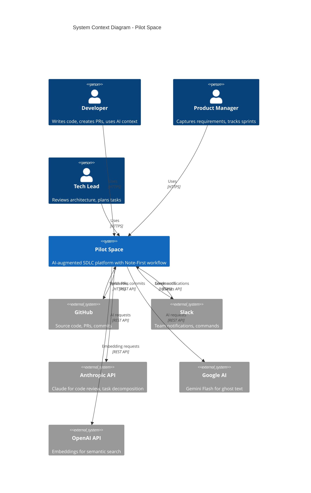
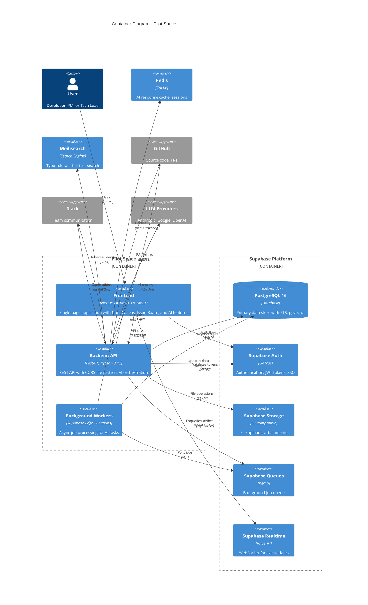
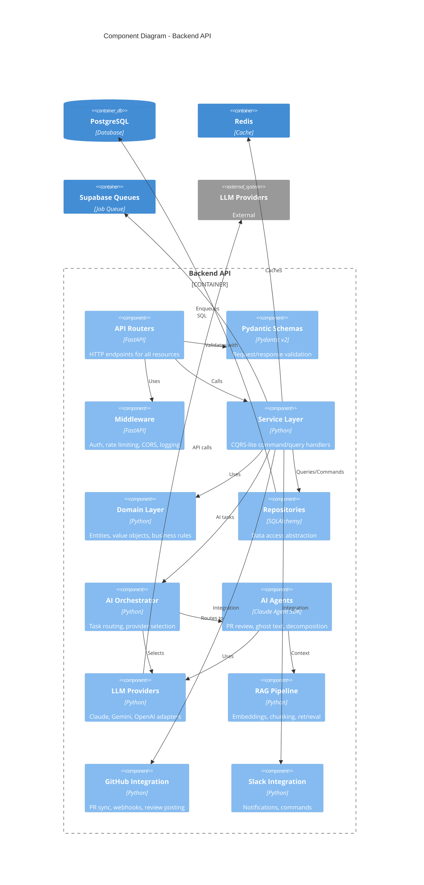
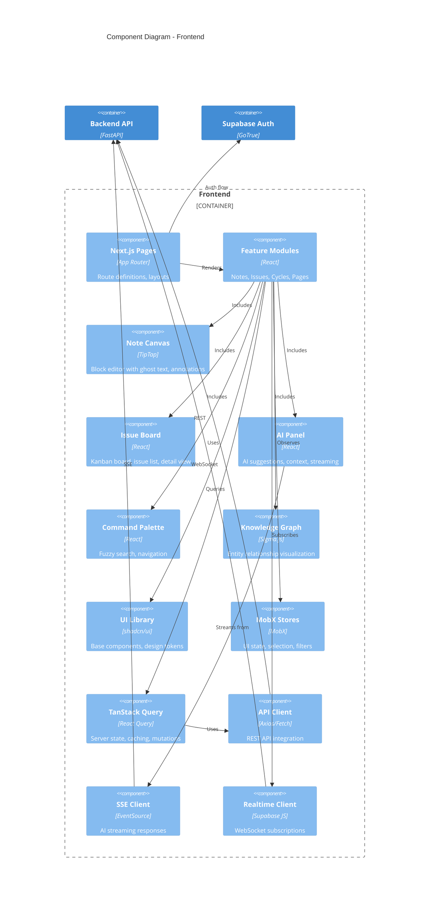
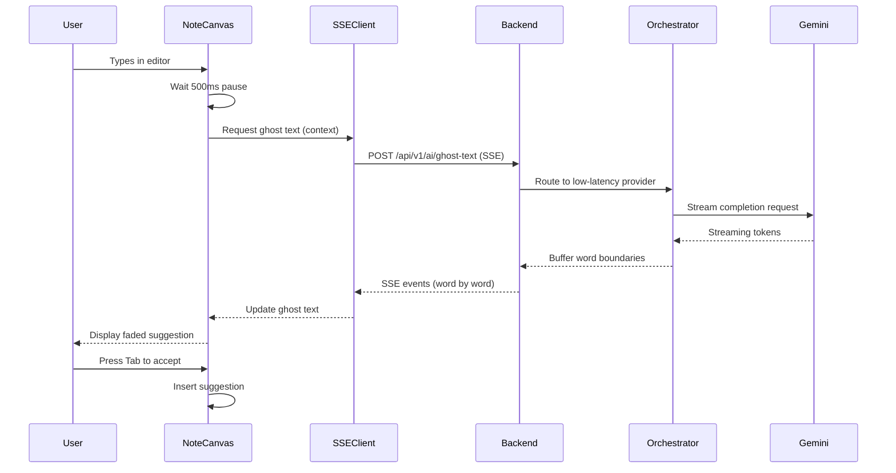
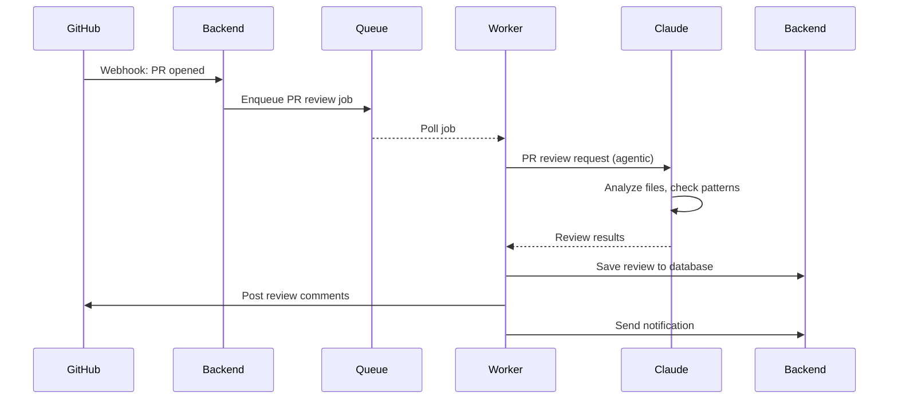

# C4 Architecture Diagrams

**Version**: 1.0 | **Date**: 2026-01-23 | **Branch**: `001-pilot-space-mvp`

---

## Overview

This document provides C4 model diagrams for Pilot Space MVP, covering System Context (L1), Container (L2), and Component (L3) levels.

---

## Level 1: System Context Diagram

Shows Pilot Space and its relationships with users and external systems.

### External System Interfaces

| System | Direction | Purpose | Protocol |
|--------|-----------|---------|----------|
| **GitHub** | Bidirectional | PR sync, commit linking, AI review posting | REST API, Webhooks |
| **Slack** | Bidirectional | Notifications, `/pilot` commands, link unfurl | Events API |
| **Anthropic** | Outbound | Claude for agentic tasks (PR review, decomposition) | REST API |
| **Google AI** | Outbound | Gemini Flash for low-latency tasks (ghost text) | REST API |
| **OpenAI** | Outbound | Embeddings for semantic search | REST API |

---

## Level 2: Container Diagram

Shows the major containers (applications/services) within Pilot Space.

### Container Descriptions

| Container | Technology | Purpose | Scaling |
|-----------|------------|---------|---------|
| **Frontend** | Next.js 14, React 18, MobX | User interface, Note Canvas, Issue Board | CDN, static hosting |
| **Backend API** | FastAPI, Python 3.12 | REST API, AI orchestration, business logic | Horizontal (containers) |
| **Background Workers** | Supabase Edge Functions | Async AI tasks, webhooks, scheduled jobs | Auto-scaled |
| **PostgreSQL** | PostgreSQL 16 + pgvector | Primary database, embeddings | Supabase managed |
| **Supabase Auth** | GoTrue | Authentication, SSO | Supabase managed |
| **Supabase Storage** | S3-compatible | File attachments | Supabase managed |
| **Supabase Queues** | pgmq | Background job queue | Supabase managed |
| **Supabase Realtime** | Phoenix | Live updates | Supabase managed |
| **Redis** | Redis 7 | Caching, sessions | Managed service |
| **Meilisearch** | Meilisearch 1.6 | Full-text search | Managed service |

---

## Level 3: Component Diagram - Backend

Shows components within the Backend API container.

### Backend Component Responsibilities

| Component | Layer | Responsibility |
|-----------|-------|----------------|
| **API Routers** | Presentation | HTTP endpoint definitions, OpenAPI docs |
| **Pydantic Schemas** | Presentation | Request/response validation and serialization |
| **Middleware** | Presentation | Cross-cutting: auth, rate limiting, CORS, logging |
| **Service Layer** | Application | CQRS command/query handlers, use case orchestration |
| **Domain Layer** | Domain | Business entities, value objects, domain events |
| **Repositories** | Infrastructure | Data access, query building, transaction management |
| **AI Orchestrator** | AI | Task classification, provider routing, session management |
| **AI Agents** | AI | Domain-specific AI capabilities (PR review, ghost text) |
| **LLM Providers** | AI | Provider adapters (Claude SDK, OpenAI, Gemini) |
| **RAG Pipeline** | AI | Embedding, chunking, vector search |
| **GitHub Integration** | Integration | PR sync, commit linking, review posting |
| **Slack Integration** | Integration | Notifications, slash commands |

---

## Level 3: Component Diagram - Frontend

Shows components within the Frontend container.

### Frontend Component Responsibilities

| Component | Category | Responsibility |
|-----------|----------|----------------|
| **Next.js Pages** | Routing | App Router pages, layouts, error boundaries |
| **Feature Modules** | Features | Domain-specific UI (notes, issues, cycles) |
| **Note Canvas** | Editor | TipTap-based block editor with AI extensions |
| **Issue Board** | Feature | Kanban board, list view, detail panel |
| **AI Panel** | Feature | AI suggestions, streaming responses, context |
| **Command Palette** | Navigation | Global search, quick actions |
| **Knowledge Graph** | Visualization | Sigma.js entity relationships |
| **UI Library** | Components | Design system, base components |
| **MobX Stores** | State | UI-only state (selection, filters, modals) |
| **TanStack Query** | State | Server state, caching, optimistic updates |
| **API Client** | Data | REST API integration, error handling |
| **SSE Client** | Streaming | AI response streaming |
| **Realtime Client** | Sync | Live updates via WebSocket |

---

## Data Flow Diagrams

### Ghost Text Request Flow

### PR Review Flow

---

## References

- [docs/architect/README.md](../../../../docs/architect/README.md) - Architecture overview
- [docs/architect/architecture-diagrams.md](../../../../docs/architect/architecture-diagrams.md) - Additional diagrams
- [docs/architect/backend-architecture.md](../../../../docs/architect/backend-architecture.md) - Backend details
- [docs/architect/frontend-architecture.md](../../../../docs/architect/frontend-architecture.md) - Frontend details
