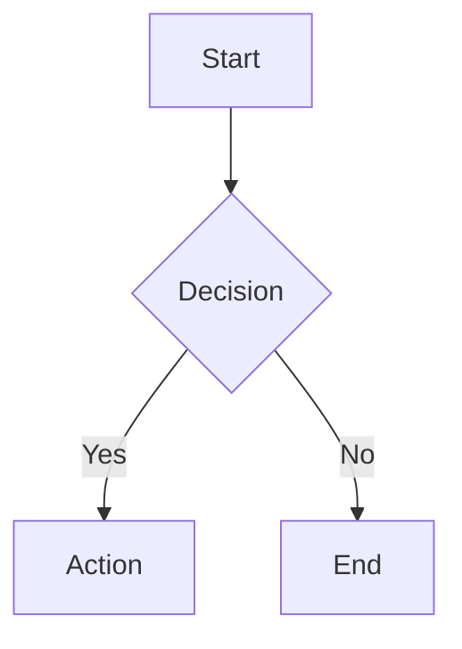

# Documentation Governance

**Version**: 1.0 | **Date**: 2026-01-23 | **Branch**: `001-pilot-space-mvp`

---

## Overview

This document establishes governance practices for maintaining Pilot Space documentation as a living, accurate resource. Following a **Doc-as-Code** approach, documentation is treated with the same rigor as application code.

---

## Core Principles

### 1. Doc-as-Code

Documentation lives alongside code in version control:

```
pilot-space/
├── docs/                  # General documentation
├── specs/                 # Feature specifications
│   └── 001-pilot-space-mvp/
│       ├── spec.md        # Feature specification
│       ├── plan.md        # Implementation plan
│       └── sdlc/          # SDLC documentation
├── CLAUDE.md              # Project instructions
└── README.md              # Entry point
```

**Benefits**:
- Version history for all changes
- Changes reviewed via PRs
- Documentation ships with features
- Single source of truth

### 2. Documentation Must Be Reviewed

All documentation changes go through pull request review:

```yaml
# .github/CODEOWNERS
/docs/          @tech-leads @doc-reviewers
/specs/         @product @tech-leads
CLAUDE.md       @tech-leads
```

### 3. Documentation Has Owners

Every document has a designated owner responsible for accuracy:

| Document Type | Owner Role |
|---------------|------------|
| Architecture docs | Tech Lead |
| Feature specs | Product Manager |
| API documentation | Backend Lead |
| User guides | Technical Writer |
| Operations runbooks | SRE/DevOps |

### 4. Stale Documentation Is Worse Than No Documentation

Outdated docs mislead and cost time. Better to delete than maintain inaccuracies.

---

## Documentation Standards

### File Naming

```
lowercase-with-hyphens.md   ✅ Correct
CamelCase.md                 ❌ Avoid
snake_case.md                ⚠️ Acceptable for existing conventions
```

### Document Structure

Every document should include:

```markdown
# Document Title

**Version**: X.Y | **Date**: YYYY-MM-DD | **Owner**: @username

---

## Overview
Brief description of what this document covers.

---

## Content Sections
...

---

## References
Links to related documents.
```

### Versioning

Use semantic versioning for major documents:

- **Major (X.0)**: Breaking changes, restructuring
- **Minor (X.Y)**: New sections, significant updates
- **Date only**: For frequently updated operational docs

### Markdown Standards

```markdown
# Use ATX-style headers (with #)

**Bold** for emphasis, *italic* for technical terms

- Use hyphens for unordered lists
1. Use numbers for ordered lists

| Table | Headers |
|-------|---------|
| Use   | Tables  |

```code blocks for code```

> Blockquotes for important callouts

[Link text](url) for hyperlinks
```

### Diagrams

Use Mermaid for diagrams (renders in GitHub):



---

## Freshness Indicators

### Staleness Warning System

Add freshness metadata to documents:

```markdown
---
last_reviewed: 2026-01-23
review_cycle: quarterly
stale_after: 90 days
owner: @username
---
```

### Automated Staleness Checks

```yaml
# .github/workflows/doc-freshness.yml
name: Documentation Freshness Check

on:
  schedule:
    - cron: '0 9 * * 1'  # Weekly Monday 9am

jobs:
  check-freshness:
    runs-on: ubuntu-latest
    steps:
      - uses: actions/checkout@v4
      - name: Check stale docs
        run: |
          find docs specs -name "*.md" -mtime +90 | while read file; do
            echo "::warning file=$file::Document not updated in 90+ days"
          done
```

### Review Reminders

Documents requiring periodic review:

| Document | Review Cycle | Reason |
|----------|--------------|--------|
| API docs | Monthly | API changes frequently |
| Security docs | Quarterly | Compliance requirements |
| Architecture | Quarterly | Design evolution |
| Runbooks | Monthly | Operational accuracy |
| User guides | With releases | Feature changes |

---

## Documentation Workflow

### New Feature Documentation

```
1. Product writes spec.md
2. Tech Lead reviews architecture impact
3. Developer adds implementation details
4. Tech Writer refines user-facing docs
5. PR review includes doc review
6. Ship feature + docs together
```

### Documentation-Only Changes

```
1. Author makes changes
2. Submit PR with [docs] prefix
3. Doc owner reviews
4. Merge when approved
5. Auto-published on merge
```

### Deprecation Process

When removing or replacing documentation:

1. Add deprecation notice at top:
```markdown
> ⚠️ **DEPRECATED**: This document is deprecated. See [new-document.md](./new-document.md) instead.
```

2. Keep for 30 days with redirects
3. Archive (don't delete) after deprecation period
4. Update all incoming links

---

## Cross-Reference System

### Document Linking

Use relative links for internal references:

```markdown
See [API Guide](../03-api/api-developer-guide.md) for details.
```

### Centralized Index

Maintain navigation indexes:

- `docs/architect/README.md` - Architecture index
- `specs/001-pilot-space-mvp/sdlc/README.md` - SDLC index
- `CLAUDE.md` - AI assistant index

### Link Checking

```yaml
# .github/workflows/link-check.yml
name: Check Documentation Links

on: [push, pull_request]

jobs:
  link-check:
    runs-on: ubuntu-latest
    steps:
      - uses: actions/checkout@v4
      - uses: lycheeverse/lychee-action@v1
        with:
          args: --verbose --no-progress './docs/**/*.md' './specs/**/*.md'
          fail: true
```

---

## AI-Assisted Documentation

### Using Pilot Space for Docs

Pilot Space can help maintain its own documentation:

1. **Note-First for Doc Planning**
   - Draft documentation as notes
   - AI helps structure and clarify
   - Extract documentation tasks

2. **AI Context for Accuracy**
   - Link docs to code files
   - AI verifies code-doc alignment
   - Flag outdated examples

3. **PR Review for Docs**
   - AI reviews doc changes
   - Checks for broken links
   - Suggests clarity improvements

### Documentation Generation

AI can generate initial drafts:

| Document Type | Generation Approach |
|---------------|---------------------|
| API docs | From OpenAPI spec |
| Code docs | From docstrings |
| Runbooks | From incident history |
| Release notes | From commit history |

Always human-review AI-generated docs before publishing.

---

## Quality Metrics

### Documentation Health Dashboard

Track these metrics:

| Metric | Target | Measurement |
|--------|--------|-------------|
| Freshness | <90 days | Last commit date |
| Link validity | 100% | Automated check |
| Coverage | All features documented | Manual audit |
| Findability | <3 clicks to any doc | Navigation audit |
| Accuracy | No reported errors | User feedback |

### Feedback Collection

Encourage documentation feedback:

```markdown
---

## Feedback

Found an issue with this document? [Open an issue](https://github.com/org/pilot-space/issues/new?labels=documentation) or suggest an edit.
```

---

## Tool Recommendations

### Writing

| Tool | Purpose |
|------|---------|
| VS Code | Primary editor with markdown preview |
| Grammarly | Grammar and style checking |
| markdownlint | Markdown linting |
| Mermaid Live Editor | Diagram creation |

### Publishing

| Tool | Purpose |
|------|---------|
| GitHub Pages | Public documentation hosting |
| Docusaurus | Documentation site generator |
| ReadMe | API documentation platform |

### Validation

| Tool | Purpose |
|------|---------|
| lychee | Link checking |
| markdownlint-cli | Markdown validation |
| alex | Inclusive language checking |
| write-good | Style suggestions |

---

## Compliance

### Required Documentation

MVP must have documentation for:

- [ ] Architecture overview
- [ ] API reference
- [ ] Deployment guide
- [ ] Security practices
- [ ] User getting started
- [ ] Contributing guide

### Audit Trail

Maintain change history via:

- Git commit history
- PR descriptions
- Changelog files

---

## References

- [CONTRIBUTING.md](../05-development/CONTRIBUTING.md) - Contribution process
- [docs/architect/README.md](../../../../docs/architect/README.md) - Architecture docs
- [Google Developer Documentation Style Guide](https://developers.google.com/style)
- [Write the Docs](https://www.writethedocs.org/)
