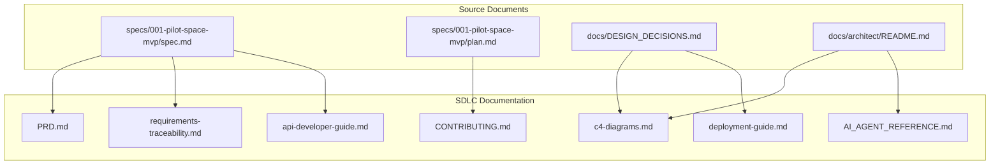

# SDLC Documentation Suite: Pilot Space MVP

**Version**: 1.0.0 | **Created**: 2026-01-23 | **Branch**: `001-pilot-space-mvp`

---

## Documentation Architecture

This directory contains the complete Software Development Lifecycle (SDLC) documentation for Pilot Space MVP. Documents are organized by SDLC phase and audience.

```
sdlc/
├── README.md                           # This file - Documentation index
│
├── 01-requirements/                    # Phase 1: Requirements
│   ├── PRD.md                         # Product Requirements Document
│   ├── user-story-map.md              # Visual user story mapping
│   ├── acceptance-criteria-catalog.md # Testable acceptance criteria
│   ├── nfr-specification.md           # Non-functional requirements
│   └── requirements-traceability.md   # RTM linking all requirements
│
├── 02-architecture/                    # Phase 2: Architecture (extends docs/architect/)
│   ├── c4-diagrams.md                 # C4 model diagrams (L1-L3)
│   ├── data-flow-diagrams.md          # Request lifecycle, AI streaming
│   └── integration-architecture.md    # GitHub, Slack, Supabase
│
├── 03-api/                            # Phase 3: API Documentation
│   ├── api-developer-guide.md         # API getting started
│   ├── authentication-guide.md        # Supabase Auth flow
│   ├── ai-endpoints-guide.md          # SSE streaming, BYOK setup
│   ├── webhook-contracts.md           # GitHub, Slack webhooks
│   └── error-catalog.md               # RFC 7807 error codes
│
├── 04-ai-agents/                       # Phase 4: AI Agent Documentation
│   └── AI_AGENT_REFERENCE.md          # Complete AI agent catalog
│
├── 05-development/                     # Phase 5: Development Workflow
│   ├── CONTRIBUTING.md                # Contribution guidelines
│   ├── testing-strategy.md            # Test pyramid, coverage
│   ├── local-development.md           # Docker setup, env vars
│   └── ci-cd-pipeline.md              # GitHub Actions workflows
│
├── 06-operations/                      # Phase 6: Operations
│   ├── deployment-guide.md            # Production deployment
│   ├── monitoring-observability.md    # Logging, metrics, alerts
│   ├── incident-response.md           # Runbooks for failures
│   └── backup-recovery.md             # 4-hour RTO procedures
│
├── 07-user-guide/                      # Phase 7: User Documentation
│   ├── getting-started.md             # Workspace setup, BYOK config
│   ├── note-first-workflow.md         # Core workflow guide
│   └── ai-capabilities.md             # AI features user guide
│
└── 08-governance/                      # Phase 8: Maintenance
    └── documentation-governance.md    # Doc-as-code practices
```

---

## Quick Navigation by Audience

### 👨‍💻 Developers
| Document | Purpose |
|----------|---------|
| [CONTRIBUTING.md](05-development/CONTRIBUTING.md) | Git workflow, PR templates, code standards |
| [Testing Strategy](05-development/testing-strategy.md) | Test pyramid, coverage requirements |
| [Local Development](05-development/local-development.md) | Docker Compose setup, environment configuration |
| [API Developer Guide](03-api/api-developer-guide.md) | REST API integration guide |

### 🏗️ Architects
| Document | Purpose |
|----------|---------|
| [PRD](01-requirements/PRD.md) | Business objectives, success metrics |
| [C4 Diagrams](02-architecture/c4-diagrams.md) | System context, container, component views |
| [Data Flow Diagrams](02-architecture/data-flow-diagrams.md) | Request lifecycle, AI streaming flows |
| [AI Agent Reference](04-ai-agents/AI_AGENT_REFERENCE.md) | 16 AI agents architecture |

### 🔧 Operators
| Document | Purpose |
|----------|---------|
| [Deployment Guide](06-operations/deployment-guide.md) | Production Supabase setup |
| [Monitoring & Observability](06-operations/monitoring-observability.md) | Logging patterns, metrics |
| [Incident Response](06-operations/incident-response.md) | Failure runbooks |
| [Backup & Recovery](06-operations/backup-recovery.md) | 4-hour RTO procedures |

### 👤 End Users
| Document | Purpose |
|----------|---------|
| [Getting Started](07-user-guide/getting-started.md) | Workspace setup, BYOK configuration |
| [Note-First Workflow](07-user-guide/note-first-workflow.md) | Core product workflow guide |
| [AI Capabilities](07-user-guide/ai-capabilities.md) | Using AI features effectively |

---

## Documentation Dependencies



---

## Version Control

| Version | Date | Author | Changes |
|---------|------|--------|---------|
| 1.0.0 | 2026-01-23 | Claude | Initial SDLC documentation suite |

---

## Related Documentation

- **Feature Specification**: [spec.md](../spec.md) - 18 user stories, 123 FRs
- **Implementation Plan**: [plan.md](../plan.md) - Architecture patterns, project structure
- **Design Decisions**: [DESIGN_DECISIONS.md](../../../docs/DESIGN_DECISIONS.md) - 85 ADRs
- **Architecture Index**: [docs/architect/README.md](../../../docs/architect/README.md) - AI QA retrieval index
- **Data Model**: [data-model.md](../data-model.md) - Entity definitions
- **UI Design**: [ui-design-spec.md](../ui-design-spec.md) - UX specifications
