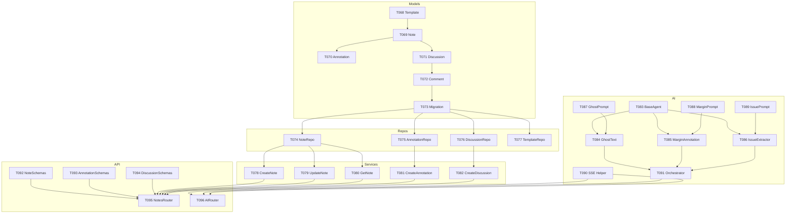

# Phase 3: US1 Note-First Writing - Backend Tasks

**Epic/PR**: US-01 Note-First Collaborative Writing (P0 - MVP Core)
**Task Count**: 36 tasks (T068-T096, T073a, T091a-f)
**Combined Complexity**: 🟡 174/145 (avg 6/task)
**Type**: IMPLEMENTATION

**User Story**: As a user, I want to write notes with AI assistance (ghost text, margin annotations) so that I can brainstorm ideas and extract issues naturally.

---

## Shared Context

| Artifact | Location | Relevance |
|----------|----------|-----------|
| Spec | `spec.md#us-01-note-first` | Feature requirements |
| Data Model | `data-model.md#note-entities` | Note, NoteAnnotation, Discussion |
| UI Spec | `ui-design-spec.md#note-canvas` | Ghost text, margin behavior |
| AI Layer | `docs/architect/ai-layer.md` | GhostTextAgent spec |

## Dev Patterns (Shared)

| Pattern | File | Purpose |
|---------|------|---------|
| Service Layer | `docs/dev-pattern/08-service-layer-pattern.md` | CQRS-lite pattern |
| Repository | `docs/dev-pattern/07-repository-pattern.md` | Data access |
| AI Agents | `docs/architect/ai-layer.md#agent-patterns` | Claude SDK patterns |
| Pilot Space | `docs/dev-pattern/45-pilot-space-patterns.md` | SSE streaming |
| Table Model | `docs/dev-pattern/38-database-table-model-pattern.md` | SQLAlchemy 2.0 |

## Document References

### Architecture Documents

| Document | Section | Relevance |
|----------|---------|-----------|
| `docs/architect/ai-layer.md` | GhostTextAgent | AI ghost text implementation (lines 296-380) |
| `docs/architect/ai-layer.md` | MarginAnnotationAgent | AI margin suggestions (lines 381-450) |
| `docs/architect/ai-layer.md` | IssueExtractorAgent | Extract issues from notes (lines 451-520) |
| `docs/architect/ai-layer.md` | SSE Streaming | Server-Sent Events for AI responses (lines 1220-1258) |
| `docs/architect/feature-story-mapping.md` | US1 Mapping | Components: Note, NoteAnnotation, GhostTextAgent |
| `docs/architect/backend-architecture.md` | Domain Layer | Note entity, annotation model |

### Specification Documents

| Document | Section | Relevance |
|----------|---------|-----------|
| `specs/001-pilot-space-mvp/spec.md` | US-01 Note-First | Feature requirements, acceptance criteria |
| `specs/001-pilot-space-mvp/data-model.md` | Note Entities | Note, NoteAnnotation, ThreadedDiscussion models |
| `specs/001-pilot-space-mvp/ui-design-spec.md` | Note Canvas | Ghost text behavior, margin annotations, keyboard shortcuts |

### Key Decisions

| Decision | Reference | Summary |
|----------|-----------|---------|
| DD-013 | `docs/DESIGN_DECISIONS.md` | Note-First, not Ticket-First workflow |
| DD-048 | `docs/DESIGN_DECISIONS.md` | AI confidence tags: Recommended/Default/Alternative |
| DD-066 | `docs/DESIGN_DECISIONS.md` | SSE streaming for AI responses |
| DD-074 | `docs/DESIGN_DECISIONS.md` | Ghost text trigger delay: 500ms |

### AI Agent Details

| Agent | Provider | Trigger | Purpose |
|-------|----------|---------|---------|
| GhostTextAgent | Claude Haiku | 500ms typing pause | Inline text completion |
| MarginAnnotationAgent | Claude Sonnet | Block completion | Suggestions in right margin |
| IssueExtractorAgent | Claude Sonnet | Note save | Extract issues from note content |

### Note-First Philosophy (DD-013)

| Aspect | Decision | Reference |
|--------|----------|-----------|
| **Paradigm** | Write → AI clarifies → Issues emerge | `docs/DESIGN_DECISIONS.md` DD-013 |
| **Workflow** | Capture → Brainstorm → Refine → Extract → Approve | DD-013 details |
| **Home View** | Note Canvas as default (not dashboard) | DD-013 core |
| **Margin Annotations** | AI suggestions in margin, smart visibility | DD-024 |
| **Issue Extraction** | Rainbow-bordered boxes wrap source text | DD-032 |
| **Bidirectional Sync** | Notes ↔ Issues stay connected | DD-013 |

### Ghost Text Implementation (DD-067)

| Aspect | Decision | Reference |
|--------|----------|-----------|
| **Trigger** | 500ms typing pause only (no manual) | DD-067 |
| **Context** | Current block + 3 previous + 3 sections summary | DD-067 |
| **Max Length** | 1-2 sentences (~50 tokens) | DD-067 |
| **Code Blocks** | Code-aware suggestions | DD-067 |
| **Cancel** | Any keystroke auto-cancels | DD-067 |
| **Word Boundary** | Buffer until whitespace/punctuation | DD-067 |
| **Accept** | Tab = full, → = word-by-word | DD-022 |

### Supabase Integration for Notes

| Component | Document | Lines | Purpose |
|-----------|----------|-------|---------|
| Note RLS | `docs/architect/rls-patterns.md` | 144-176 | Workspace isolation, guest no access |
| Realtime | `docs/architect/supabase-integration.md` | 627-730 | Live note block sync |
| Embeddings | `docs/architect/supabase-integration.md` | 731-1656 | Note content for semantic search |
| Storage | `docs/architect/supabase-integration.md` | 298-380 | Note attachments |

### AI Agent Architecture

| Agent | Document | Lines | Provider | Trigger |
|-------|----------|-------|----------|---------|
| GhostTextAgent | `docs/architect/ai-layer.md` | 489-574 | Gemini Flash | 500ms pause |
| MarginAnnotationAgent | `docs/architect/ai-layer.md` | 381-450 | Claude Sonnet | Block completion |
| IssueExtractorAgent | `docs/architect/ai-layer.md` | 451-520 | Claude Sonnet | Note save |

### SSE Streaming Pattern

| Component | Document | Lines | Purpose |
|-----------|----------|-------|---------|
| StreamingResponse | `docs/architect/ai-layer.md` | 1162-1295 | FastAPI SSE |
| EventSource | `docs/architect/frontend-architecture.md` | 712-945 | Client-side handling |
| Error Display | `docs/DESIGN_DECISIONS.md` | DD-066 | Ghost text: inline muted |
| Heartbeat | `docs/DESIGN_DECISIONS.md` | DD-066 | 30s server, 45s client timeout |

### SDLC Note-First Backend

| Document | Section | Relevance |
|----------|---------|-----------|
| `specs/001-pilot-space-mvp/sdlc/01-requirements/acceptance-criteria-catalog.md` | US-01 AC | Testable Given-When-Then for note features |
| `specs/001-pilot-space-mvp/sdlc/04-ai-agents/AI_AGENT_REFERENCE.md` | GhostTextAgent (67-110) | Agent implementation spec |
| `specs/001-pilot-space-mvp/sdlc/05-development/testing-strategy.md` | AI Agent Testing | Mocked provider tests for agents |
| `specs/001-pilot-space-mvp/sdlc/05-development/CONTRIBUTING.md` | PR Review | Ghost text suggestions per DD-067 |

### TipTap Backend Integration

| Component | Document | Section | Relevance |
|-----------|----------|---------|-----------|
| JSONB Schema | `specs/001-pilot-space-mvp/research.md` | TipTap/ProseMirror (1-221) | TipTap document format |
| Block IDs | `specs/001-pilot-space-mvp/research.md` | Block-Linked Content (134-174) | UUID persistence for annotations |
| Content Validation | `specs/001-pilot-space-mvp/prompts/tiptap-extension-prompt.md` | Schema Design | TipTap JSON validation |

### Infrastructure Patterns (Notes Backend)

| Component | Document | Lines | Purpose |
|-----------|----------|-------|---------|
| Queue Processing | `docs/architect/supabase-integration.md` | 382-625 | pgmq for AI annotation jobs |
| Cache-Aside | `docs/dev-pattern/44-redis-caching-patterns.md` | 24-73 | Note content caching |
| Retry Policy | `specs/001-pilot-space-mvp/research.md` | 330-354 | Tenacity decorator, 5 retries |

### Data Model References (Notes)

| Entity | Document | Lines | Key Fields |
|--------|----------|-------|------------|
| Note | `specs/001-pilot-space-mvp/data-model.md` | 224-290 | content (JSONB), sync_state, is_pinned |
| NoteAnnotation | `specs/001-pilot-space-mvp/data-model.md` | 314-362 | block_id, type, confidence |
| ThreadedDiscussion | `specs/001-pilot-space-mvp/data-model.md` | 366-412 | is_resolved, comments |

### Security Patterns (Notes)

| Pattern | Document | Lines | Purpose |
|---------|----------|-------|---------|
| Note RLS | `docs/architect/rls-patterns.md` | 144-176 | Workspace isolation, guest no access |
| Soft Delete | `docs/architect/rls-patterns.md` | 349-390 | 30-day restore, creator/admin only |

### Loading Order (Recommended)

1. `docs/DESIGN_DECISIONS.md` DD-013, DD-067 - Note-First philosophy
2. `specs/001-pilot-space-mvp/spec.md#us-01-note-first` - Feature requirements
3. `docs/architect/feature-story-mapping.md` - US1 architecture mapping
4. `docs/architect/ai-layer.md` - AI agent specifications (GhostText 489-574)
5. `specs/001-pilot-space-mvp/data-model.md` - Note entity definitions
6. `specs/001-pilot-space-mvp/ui-design-spec.md#note-canvas` - UI specifications
7. `docs/architect/supabase-integration.md` - Realtime and embeddings
8. `specs/001-pilot-space-mvp/research.md` - TipTap/ProseMirror implementation

---

## Database Models (T068-T073)

### T068 [US1]: Create Template model

**Complexity**: 🟢 4/20 | **Priority**: P1 | **Story**: US1

#### Objective
Create Template model for reusable note structures.

#### Acceptance Criteria
- [ ] AC1: `backend/src/pilot_space/infrastructure/database/models/template.py` exists
- [ ] AC2: Fields: `id`, `name`, `description`, `content` (JSONB - TipTap JSON), `category`
- [ ] AC3: Extends `BaseModel` + `WorkspaceScopedMixin`
- [ ] AC4: `is_default` boolean for system templates
- [ ] AC5: Relationships: `notes` (created from template)

#### Target Files
- `backend/src/pilot_space/infrastructure/database/models/template.py`

---

### T069 [US1]: Create Note model

**Complexity**: 🟡 6/20 | **Priority**: P1 | **Story**: US1
**Blocked by**: T068

#### Objective
Create Note model with TipTap JSONB content storage.

#### Acceptance Criteria
- [ ] AC1: `backend/src/pilot_space/infrastructure/database/models/note.py` exists
- [ ] AC2: Fields: `id`, `title`, `content` (JSONB - TipTap doc), `summary`, `word_count`, `reading_time_mins`
- [ ] AC3: Extends `BaseModel` + `WorkspaceScopedMixin`
- [ ] AC4: `project_id` optional FK, `template_id` optional FK, `owner_id` FK to User
- [ ] AC5: Relationships: `annotations` (NoteAnnotation), `discussions` (ThreadedDiscussion)
- [ ] AC6: Index on `(workspace_id, project_id)` for listing
- [ ] AC7: Full-text search index on `title` for search

#### Target Files
- `backend/src/pilot_space/infrastructure/database/models/note.py`

---

### T070 [US1]: Create NoteAnnotation model

**Complexity**: 🟡 5/20 | **Priority**: P1 | **Story**: US1
**Blocked by**: T069

#### Objective
Create NoteAnnotation model for AI margin suggestions.

#### Acceptance Criteria
- [ ] AC1: `backend/src/pilot_space/infrastructure/database/models/note_annotation.py` exists
- [ ] AC2: Fields: `id`, `note_id` (FK), `block_id` (TipTap block ref), `type` (enum: suggestion/warning/issue_candidate/info)
- [ ] AC3: Fields: `content`, `confidence` (0.0-1.0), `ai_metadata` (JSONB)
- [ ] AC4: Extends `BaseModel`
- [ ] AC5: `status` enum: pending/accepted/rejected/dismissed
- [ ] AC6: Relationships: `note`

#### Target Files
- `backend/src/pilot_space/infrastructure/database/models/note_annotation.py`

---

### T071 [US1]: Create ThreadedDiscussion model

**Complexity**: 🟢 4/20 | **Priority**: P1 | **Story**: US1
**Blocked by**: T069

#### Objective
Create ThreadedDiscussion model for note discussions.

#### Acceptance Criteria
- [ ] AC1: `backend/src/pilot_space/infrastructure/database/models/threaded_discussion.py` exists
- [ ] AC2: Fields: `id`, `note_id` (FK), `block_id` (optional), `title`, `status` (open/resolved)
- [ ] AC3: Extends `BaseModel`
- [ ] AC4: Relationships: `note`, `comments` (DiscussionComment)
- [ ] AC5: `resolved_by_id` optional FK to User

#### Target Files
- `backend/src/pilot_space/infrastructure/database/models/threaded_discussion.py`

---

### T072 [US1]: Create DiscussionComment model

**Complexity**: 🟢 4/20 | **Priority**: P1 | **Story**: US1
**Blocked by**: T071

#### Objective
Create DiscussionComment model for discussion replies.

#### Acceptance Criteria
- [ ] AC1: `backend/src/pilot_space/infrastructure/database/models/discussion_comment.py` exists
- [ ] AC2: Fields: `id`, `discussion_id` (FK), `author_id` (FK), `content`, `is_ai_generated`
- [ ] AC3: Extends `BaseModel`
- [ ] AC4: Relationships: `discussion`, `author`

#### Target Files
- `backend/src/pilot_space/infrastructure/database/models/discussion_comment.py`

---

### T073 [US1]: Create Note entities migration

**Complexity**: 🟢 4/20 | **Priority**: P1 | **Story**: US1
**Blocked by**: T068-T072

#### Objective
Create migration for Note-related entities.

#### Acceptance Criteria
- [ ] AC1: `backend/alembic/versions/005_note_entities.py` exists
- [ ] AC2: Creates `templates` table
- [ ] AC3: Creates `notes` table with JSONB content column
- [ ] AC4: Creates `note_annotations` table with type enum
- [ ] AC5: Creates `threaded_discussions` and `discussion_comments` tables
- [ ] AC6: Creates GIN index on `notes.content` for JSONB queries
- [ ] AC7: Migration applies and reverts cleanly

#### Target Files
- `backend/alembic/versions/005_note_entities.py`

---

### T073a [US1]: Create NoteIssueLink junction table

**Complexity**: 🟢 4/20 | **Priority**: P1 | **Story**: US1
**Blocked by**: T073 (Note migration), T121 (Issue migration)

#### Objective
Create NoteIssueLink junction table for bidirectional note-issue sync.

#### Acceptance Criteria
- [ ] AC1: `backend/src/pilot_space/infrastructure/database/models/note_issue_link.py` exists
- [ ] AC2: Fields: `id`, `note_id` (FK), `issue_id` (FK), `link_type` (enum: extracted/referenced/related), `block_id` (optional - specific block in note)
- [ ] AC3: Extends `BaseModel`
- [ ] AC4: Unique constraint on `(note_id, issue_id, link_type)`
- [ ] AC5: Cascading delete when note or issue is deleted
- [ ] AC6: Relationships: `note`, `issue`
- [ ] AC7: Migration added to `005_note_entities.py` or separate migration

#### Target Files
- `backend/src/pilot_space/infrastructure/database/models/note_issue_link.py`

#### Code Structure

```python
from enum import Enum
from sqlalchemy import ForeignKey, String, Enum as SQLEnum, UniqueConstraint
from sqlalchemy.orm import Mapped, mapped_column, relationship
from uuid import UUID

from .base import BaseModel

class NoteLinkType(str, Enum):
    EXTRACTED = "extracted"  # Issue was extracted from this note block
    REFERENCED = "referenced"  # Note mentions issue (e.g., PILOT-123)
    RELATED = "related"  # Manually linked as related

class NoteIssueLink(BaseModel):
    __tablename__ = "note_issue_links"

    note_id: Mapped[UUID] = mapped_column(ForeignKey("notes.id", ondelete="CASCADE"), nullable=False)
    issue_id: Mapped[UUID] = mapped_column(ForeignKey("issues.id", ondelete="CASCADE"), nullable=False)
    link_type: Mapped[NoteLinkType] = mapped_column(SQLEnum(NoteLinkType), nullable=False)
    block_id: Mapped[str | None] = mapped_column(String(100), nullable=True)

    # Relationships
    note: Mapped["Note"] = relationship(back_populates="issue_links")
    issue: Mapped["Issue"] = relationship(back_populates="note_links")

    __table_args__ = (
        UniqueConstraint("note_id", "issue_id", "link_type", name="uq_note_issue_link"),
    )
```

*Note: Enables bidirectional navigation between notes and issues per T073a requirement.*

---

## Repositories (T074-T077)

### T074 [P] [US1]: Create NoteRepository

**Complexity**: 🟡 5/20 | **Priority**: P1 | **Story**: US1
**Blocked by**: T073, T036 (BaseRepository)
**Parallel with**: T075, T076, T077

#### Objective
Create NoteRepository with workspace-scoped CRUD and search.

#### Acceptance Criteria
- [ ] AC1: `backend/src/pilot_space/infrastructure/database/repositories/note_repository.py` exists
- [ ] AC2: Extends `BaseRepository[Note]`
- [ ] AC3: Methods: `get_by_workspace`, `get_by_project`, `search_by_title`
- [ ] AC4: Eager loading for `annotations`, `discussions`
- [ ] AC5: Cursor pagination support
- [ ] AC6: Soft delete filtering by default

#### Target Files
- `backend/src/pilot_space/infrastructure/database/repositories/note_repository.py`

---

### T075 [P] [US1]: Create NoteAnnotationRepository

**Complexity**: 🟢 4/20 | **Priority**: P1 | **Story**: US1
**Parallel with**: T074, T076, T077

#### Objective
Create NoteAnnotationRepository for annotation management.

#### Acceptance Criteria
- [ ] AC1: `backend/src/pilot_space/infrastructure/database/repositories/note_annotation_repository.py` exists
- [ ] AC2: Extends `BaseRepository[NoteAnnotation]`
- [ ] AC3: Methods: `get_by_note`, `get_by_block`, `get_pending`
- [ ] AC4: Batch update for status changes

#### Target Files
- `backend/src/pilot_space/infrastructure/database/repositories/note_annotation_repository.py`

---

### T076 [P] [US1]: Create DiscussionRepository

**Complexity**: 🟢 4/20 | **Priority**: P1 | **Story**: US1
**Parallel with**: T074, T075, T077

#### Objective
Create DiscussionRepository for threaded discussions.

#### Acceptance Criteria
- [ ] AC1: `backend/src/pilot_space/infrastructure/database/repositories/discussion_repository.py` exists
- [ ] AC2: Extends `BaseRepository[ThreadedDiscussion]`
- [ ] AC3: Methods: `get_by_note`, `get_open_discussions`
- [ ] AC4: Eager loading for `comments`

#### Target Files
- `backend/src/pilot_space/infrastructure/database/repositories/discussion_repository.py`

---

### T077 [P] [US1]: Create TemplateRepository

**Complexity**: 🟢 3/20 | **Priority**: P1 | **Story**: US1
**Parallel with**: T074, T075, T076

#### Objective
Create TemplateRepository for note templates.

#### Acceptance Criteria
- [ ] AC1: `backend/src/pilot_space/infrastructure/database/repositories/template_repository.py` exists
- [ ] AC2: Extends `BaseRepository[Template]`
- [ ] AC3: Methods: `get_defaults`, `get_by_category`

#### Target Files
- `backend/src/pilot_space/infrastructure/database/repositories/template_repository.py`

---

## Services CQRS-lite (T078-T082)

### T078 [US1]: Create CreateNoteService

**Complexity**: 🟡 6/20 | **Priority**: P1 | **Story**: US1
**Blocked by**: T074, T049 (DI Container)

#### Objective
Create CreateNoteService for note creation with optional template.

#### Acceptance Criteria
- [ ] AC1: `backend/src/pilot_space/application/services/note/create_note_service.py` exists
- [ ] AC2: `CreateNotePayload` dataclass with title, content, project_id, template_id
- [ ] AC3: `CreateNoteResult` dataclass with note entity
- [ ] AC4: `execute(payload)` method creates note with transaction
- [ ] AC5: If `template_id` provided, copies template content
- [ ] AC6: Calculates word_count and reading_time on creation
- [ ] AC7: Emits `note.created` domain event

#### Target Files
- `backend/src/pilot_space/application/services/note/create_note_service.py`

---

### T079 [US1]: Create UpdateNoteService

**Complexity**: 🟡 6/20 | **Priority**: P1 | **Story**: US1
**Blocked by**: T078

#### Objective
Create UpdateNoteService for note content updates (auto-save target).

#### Acceptance Criteria
- [ ] AC1: `backend/src/pilot_space/application/services/note/update_note_service.py` exists
- [ ] AC2: `UpdateNotePayload` with note_id, title, content (partial updates)
- [ ] AC3: `execute(payload)` updates note atomically
- [ ] AC4: Recalculates word_count and reading_time
- [ ] AC5: Optimistic locking with `updated_at` check
- [ ] AC6: Emits `note.updated` domain event

#### Target Files
- `backend/src/pilot_space/application/services/note/update_note_service.py`

---

### T080 [US1]: Create GetNoteService

**Complexity**: 🟢 4/20 | **Priority**: P1 | **Story**: US1
**Blocked by**: T074

#### Objective
Create GetNoteService for note retrieval with annotations.

#### Acceptance Criteria
- [ ] AC1: `backend/src/pilot_space/application/services/note/get_note_service.py` exists
- [ ] AC2: `GetNotePayload` with note_id, include_annotations, include_discussions
- [ ] AC3: `execute(payload)` returns note with optional relations
- [ ] AC4: Raises `NoteNotFoundError` if not found
- [ ] AC5: Workspace access check

#### Target Files
- `backend/src/pilot_space/application/services/note/get_note_service.py`

---

### T081 [US1]: Create CreateAnnotationService

**Complexity**: 🟡 5/20 | **Priority**: P1 | **Story**: US1
**Blocked by**: T075

#### Objective
Create CreateAnnotationService for AI-generated annotations.

#### Acceptance Criteria
- [ ] AC1: `backend/src/pilot_space/application/services/annotation/create_annotation_service.py` exists
- [ ] AC2: `CreateAnnotationPayload` with note_id, block_id, type, content, confidence, ai_metadata
- [ ] AC3: `execute(payload)` creates annotation
- [ ] AC4: Validates note exists and user has access
- [ ] AC5: Emits `annotation.created` domain event

#### Target Files
- `backend/src/pilot_space/application/services/annotation/create_annotation_service.py`

---

### T082 [US1]: Create CreateDiscussionService

**Complexity**: 🟢 4/20 | **Priority**: P1 | **Story**: US1
**Blocked by**: T076

#### Objective
Create CreateDiscussionService for threaded discussions.

#### Acceptance Criteria
- [ ] AC1: `backend/src/pilot_space/application/services/discussion/create_discussion_service.py` exists
- [ ] AC2: `CreateDiscussionPayload` with note_id, block_id, title, initial_comment
- [ ] AC3: `execute(payload)` creates discussion and first comment
- [ ] AC4: Transaction includes both discussion and comment creation

#### Target Files
- `backend/src/pilot_space/application/services/discussion/create_discussion_service.py`

---

## AI Agents (T083-T091)

### T083 [US1]: Create base AI agent class

**Complexity**: 🟠 10/20 | **Priority**: P1 | **Story**: US1

#### Objective
Create base AI agent class with Claude SDK integration and provider routing.

#### Acceptance Criteria
- [ ] AC1: `backend/src/pilot_space/ai/agents/base.py` exists
- [ ] AC2: `BaseAgent` abstract class with `execute()` method
- [ ] AC3: Claude SDK `query()` wrapper for one-shot tasks
- [ ] AC4: `ClaudeSDKClient` wrapper for multi-turn conversations
- [ ] AC5: Provider routing: `get_provider(task_type)` returns appropriate client
- [ ] AC6: Provider config: Claude for code/analysis, Gemini for latency, OpenAI for embeddings
- [ ] AC7: Rate limiting and retry logic with exponential backoff
- [ ] AC8: Structured logging with correlation ID

#### Target Files
- `backend/src/pilot_space/ai/agents/base.py`

#### Code Structure

```python
"""Base AI agent with Claude SDK integration."""
from abc import ABC, abstractmethod
from dataclasses import dataclass
from enum import Enum
from typing import Any, Generic, TypeVar

import anthropic
from anthropic import Anthropic

from pilot_space.config import get_settings


class Provider(Enum):
    CLAUDE = "claude"
    GEMINI = "gemini"
    OPENAI = "openai"


class TaskType(Enum):
    CODE_ANALYSIS = "code_analysis"  # Claude
    LATENCY_SENSITIVE = "latency"    # Gemini Flash
    EMBEDDINGS = "embeddings"        # OpenAI


PROVIDER_ROUTING = {
    TaskType.CODE_ANALYSIS: Provider.CLAUDE,
    TaskType.LATENCY_SENSITIVE: Provider.GEMINI,
    TaskType.EMBEDDINGS: Provider.OPENAI,
}


InputT = TypeVar("InputT")
OutputT = TypeVar("OutputT")


@dataclass
class AgentContext:
    """Context for agent execution."""
    workspace_id: str
    user_id: str
    correlation_id: str


class BaseAgent(ABC, Generic[InputT, OutputT]):
    """Base class for AI agents."""

    task_type: TaskType = TaskType.CODE_ANALYSIS

    def __init__(self) -> None:
        self.settings = get_settings()
        self._client: Anthropic | None = None

    @property
    def client(self) -> Anthropic:
        if self._client is None:
            self._client = Anthropic(api_key=self.settings.anthropic_api_key)
        return self._client

    @abstractmethod
    async def execute(self, input_data: InputT, context: AgentContext) -> OutputT:
        """Execute the agent with given input."""
        ...

    async def query(self, prompt: str, system: str | None = None) -> str:
        """One-shot query using Claude SDK."""
        message = self.client.messages.create(
            model="claude-sonnet-4-20250514",
            max_tokens=1024,
            system=system or "",
            messages=[{"role": "user", "content": prompt}],
        )
        return message.content[0].text
```

---

### T084 [US1]: Create GhostTextAgent

**Complexity**: 🟠 12/20 | **Priority**: P1 | **Story**: US1
**Blocked by**: T083

#### Objective
Create GhostTextAgent for inline text completion with 500ms trigger delay.

#### Acceptance Criteria
- [ ] AC1: `backend/src/pilot_space/ai/agents/ghost_text_agent.py` exists
- [ ] AC2: Input: current text, cursor position, surrounding context (3 paragraphs)
- [ ] AC3: Output: completion text (max 50 tokens), streamed via SSE
- [ ] AC4: Uses Gemini Flash for low latency (<500ms target)
- [ ] AC5: Prompt template loaded from `ghost_text.py`
- [ ] AC6: Graceful degradation if AI unavailable
- [ ] AC7: Rate limit: max 10 requests/minute per user
- [ ] AC8: Cancellation support for rapid typing

#### Target Files
- `backend/src/pilot_space/ai/agents/ghost_text_agent.py`

---

### T085 [US1]: Create MarginAnnotationAgent

**Complexity**: 🟠 11/20 | **Priority**: P1 | **Story**: US1
**Blocked by**: T083

#### Objective
Create MarginAnnotationAgent for generating suggestions, warnings, and issue candidates.

#### Acceptance Criteria
- [ ] AC1: `backend/src/pilot_space/ai/agents/margin_annotation_agent.py` exists
- [ ] AC2: Input: note content, specific block, workspace context
- [ ] AC3: Output: list of `AnnotationSuggestion` with type, content, confidence, block_id
- [ ] AC4: Types: suggestion (improvements), warning (issues), issue_candidate (extractable issues), info
- [ ] AC5: Confidence score 0.0-1.0 for each annotation
- [ ] AC6: Uses Claude Sonnet for quality analysis
- [ ] AC7: Batch processing: analyze multiple blocks in one call
- [ ] AC8: Prompt template loaded from `margin_annotation.py`

#### Target Files
- `backend/src/pilot_space/ai/agents/margin_annotation_agent.py`

---

### T086 [US1]: Create IssueExtractorAgent

**Complexity**: 🟠 11/20 | **Priority**: P1 | **Story**: US1
**Blocked by**: T083

#### Objective
Create IssueExtractorAgent for extracting structured issues from note content.

#### Acceptance Criteria
- [ ] AC1: `backend/src/pilot_space/ai/agents/issue_extractor_agent.py` exists
- [ ] AC2: Input: note content, selected text (optional), extraction options
- [ ] AC3: Output: list of `ExtractedIssue` with title, description, suggested_labels, suggested_priority
- [ ] AC4: Confidence tags: Recommended, Default, Alternative per DD-048
- [ ] AC5: Links extraction to source block_id for traceability
- [ ] AC6: Uses Claude Sonnet for understanding context
- [ ] AC7: Prompt template loaded from `issue_extraction.py`

#### Target Files
- `backend/src/pilot_space/ai/agents/issue_extractor_agent.py`

---

### T087 [US1]: Create ghost text prompt template

**Complexity**: 🟡 5/20 | **Priority**: P1 | **Story**: US1

#### Objective
Create prompt template for ghost text completion.

#### Acceptance Criteria
- [ ] AC1: `backend/src/pilot_space/ai/prompts/ghost_text.py` exists
- [ ] AC2: System prompt defines completion style (concise, contextual)
- [ ] AC3: User prompt template with placeholders: `{context}`, `{current_text}`, `{cursor_position}`
- [ ] AC4: Instructions for max 50 tokens, no explanations, just completion
- [ ] AC5: Handles code blocks differently (syntax-aware)
- [ ] AC6: `get_prompt(context, current_text, cursor_position)` function

#### Target Files
- `backend/src/pilot_space/ai/prompts/ghost_text.py`

---

### T088 [P] [US1]: Create margin annotation prompt template

**Complexity**: 🟡 5/20 | **Priority**: P1 | **Story**: US1
**Parallel with**: T089

#### Objective
Create prompt template for margin annotation generation.

#### Acceptance Criteria
- [ ] AC1: `backend/src/pilot_space/ai/prompts/margin_annotation.py` exists
- [ ] AC2: System prompt defines annotation types and confidence scoring
- [ ] AC3: User prompt with `{content}`, `{block_id}`, `{workspace_context}`
- [ ] AC4: Output format: JSON array of annotations
- [ ] AC5: Instructions for constructive suggestions, not criticism
- [ ] AC6: Issue candidate detection criteria

#### Target Files
- `backend/src/pilot_space/ai/prompts/margin_annotation.py`

---

### T089 [P] [US1]: Create issue extraction prompt template

**Complexity**: 🟡 5/20 | **Priority**: P1 | **Story**: US1
**Parallel with**: T088

#### Objective
Create prompt template for issue extraction.

#### Acceptance Criteria
- [ ] AC1: `backend/src/pilot_space/ai/prompts/issue_extraction.py` exists
- [ ] AC2: System prompt defines issue structure and confidence tagging
- [ ] AC3: User prompt with `{content}`, `{selected_text}`, `{project_context}`
- [ ] AC4: Output format: JSON with title, description, labels, priority, confidence_tag
- [ ] AC5: Confidence tag logic: Recommended (>0.8), Default (0.5-0.8), Alternative (<0.5)
- [ ] AC6: Instructions for actionable issue titles

#### Target Files
- `backend/src/pilot_space/ai/prompts/issue_extraction.py`

---

### T090 [US1]: Create SSE response helper

**Complexity**: 🟡 6/20 | **Priority**: P1 | **Story**: US1

#### Objective
Create SSE streaming utilities for AI responses.

#### Acceptance Criteria
- [ ] AC1: `backend/src/pilot_space/api/utils/sse.py` exists
- [ ] AC2: `SSEResponse` class wrapping `StreamingResponse`
- [ ] AC3: `sse_event(data, event, id)` formatting function
- [ ] AC4: Heartbeat support for connection keep-alive
- [ ] AC5: Error event formatting for graceful failure
- [ ] AC6: `async_generator_to_sse()` wrapper for async generators
- [ ] AC7: Proper content-type headers: `text/event-stream`

#### Target Files
- `backend/src/pilot_space/api/utils/sse.py`

---

### T091 [US1]: Create AI orchestrator

**Complexity**: 🟠 10/20 | **Priority**: P1 | **Story**: US1
**Blocked by**: T083-T086

#### Objective
Create AI orchestrator for task routing and context management.

#### Acceptance Criteria
- [ ] AC1: `backend/src/pilot_space/ai/orchestrator.py` exists
- [ ] AC2: `AIOrchestrator` class with agent registry
- [ ] AC3: `route_task(task_type, input)` method for agent selection
- [ ] AC4: Context builder: aggregates relevant data for agent input
- [ ] AC5: Rate limiting per workspace
- [ ] AC6: Usage tracking for analytics
- [ ] AC7: Error handling with fallback responses
- [ ] AC8: Wired to DI container

#### Target Files
- `backend/src/pilot_space/ai/orchestrator.py`

---

## AI Error Handling (T091a-T091f)

### T091a [US1]: Create AI error types

**Complexity**: 🟢 4/20 | **Priority**: P1 | **Story**: US1
**Blocked by**: T083 (BaseAgent)

#### Objective
Create typed exceptions for AI-related errors.

#### Acceptance Criteria
- [ ] AC1: `backend/src/pilot_space/ai/exceptions.py` exists
- [ ] AC2: `RateLimitError` for provider rate limits (includes retry_after)
- [ ] AC3: `ProviderUnavailableError` for provider outages
- [ ] AC4: `TokenLimitExceededError` for context length exceeded
- [ ] AC5: `InvalidResponseError` for malformed AI responses
- [ ] AC6: `AITimeoutError` for request timeouts
- [ ] AC7: All exceptions inherit from base `AIError`
- [ ] AC8: Include structured metadata for logging

#### Target Files
- `backend/src/pilot_space/ai/exceptions.py`

#### Code Structure

```python
class AIError(Exception):
    """Base exception for AI-related errors."""
    def __init__(self, message: str, metadata: dict | None = None):
        self.metadata = metadata or {}
        super().__init__(message)

class RateLimitError(AIError):
    def __init__(self, provider: str, retry_after: int):
        super().__init__(f"Rate limited by {provider}", {"retry_after": retry_after})
        self.retry_after = retry_after

class ProviderUnavailableError(AIError):
    def __init__(self, provider: str, reason: str):
        super().__init__(f"{provider} unavailable: {reason}")

class TokenLimitExceededError(AIError):
    def __init__(self, limit: int, requested: int):
        super().__init__(f"Token limit {limit} exceeded, requested {requested}")

class InvalidResponseError(AIError):
    def __init__(self, expected: str, received: str):
        super().__init__(f"Invalid response: expected {expected}, got {received}")

class AITimeoutError(AIError):
    def __init__(self, operation: str, timeout: float):
        super().__init__(f"{operation} timed out after {timeout}s")
```

---

### T091b [US1]: Implement circuit breaker pattern

**Complexity**: 🟡 7/20 | **Priority**: P1 | **Story**: US1
**Blocked by**: T091a

#### Objective
Implement circuit breaker for provider failover.

#### Acceptance Criteria
- [ ] AC1: `backend/src/pilot_space/ai/circuit_breaker.py` exists
- [ ] AC2: `CircuitBreaker` class with states: CLOSED, OPEN, HALF_OPEN
- [ ] AC3: Failure threshold: 3 consecutive failures opens circuit
- [ ] AC4: Backoff period: 30 seconds before HALF_OPEN
- [ ] AC5: Success in HALF_OPEN closes circuit
- [ ] AC6: Per-provider circuit breakers
- [ ] AC7: Metrics: `circuit_breaker_state`, `circuit_breaker_trips`
- [ ] AC8: Thread-safe state management

#### Target Files
- `backend/src/pilot_space/ai/circuit_breaker.py`

#### Code Structure

```python
from enum import Enum
from datetime import datetime, timedelta
import asyncio

class CircuitState(Enum):
    CLOSED = "closed"
    OPEN = "open"
    HALF_OPEN = "half_open"

class CircuitBreaker:
    def __init__(
        self,
        provider: str,
        failure_threshold: int = 3,
        backoff_seconds: int = 30,
    ):
        self.provider = provider
        self.failure_threshold = failure_threshold
        self.backoff = timedelta(seconds=backoff_seconds)
        self.state = CircuitState.CLOSED
        self.failures = 0
        self.last_failure_time: datetime | None = None
        self._lock = asyncio.Lock()

    async def call(self, func, *args, **kwargs):
        async with self._lock:
            if self.state == CircuitState.OPEN:
                if datetime.utcnow() - self.last_failure_time > self.backoff:
                    self.state = CircuitState.HALF_OPEN
                else:
                    raise ProviderUnavailableError(self.provider, "circuit open")

        try:
            result = await func(*args, **kwargs)
            async with self._lock:
                self.failures = 0
                self.state = CircuitState.CLOSED
            return result
        except Exception as e:
            async with self._lock:
                self.failures += 1
                self.last_failure_time = datetime.utcnow()
                if self.failures >= self.failure_threshold:
                    self.state = CircuitState.OPEN
            raise
```

---

### T091c [US1]: Create retry decorator

**Complexity**: 🟢 5/20 | **Priority**: P1 | **Story**: US1
**Blocked by**: T091a

#### Objective
Create retry decorator with exponential backoff.

#### Acceptance Criteria
- [ ] AC1: `backend/src/pilot_space/ai/utils/retry.py` exists
- [ ] AC2: `@with_retry` decorator for async functions
- [ ] AC3: Exponential backoff: initial 1s, max 30s
- [ ] AC4: Maximum retries: 3
- [ ] AC5: Retries only on transient errors (RateLimitError, AITimeoutError)
- [ ] AC6: Does not retry InvalidResponseError
- [ ] AC7: Structured logging for retry attempts
- [ ] AC8: Jitter to prevent thundering herd

#### Target Files
- `backend/src/pilot_space/ai/utils/retry.py`

---

### T091d [US1]: Implement graceful degradation

**Complexity**: 🟡 6/20 | **Priority**: P1 | **Story**: US1
**Blocked by**: T091a, T091b

#### Objective
Implement graceful degradation behavior for AI features.

#### Acceptance Criteria
- [ ] AC1: Ghost text: returns "AI temporarily unavailable" message with 3s fade
- [ ] AC2: Margin annotations: hides panel when AI unavailable
- [ ] AC3: PR review: queues request with notification when available
- [ ] AC4: Issue enhancement: returns original content without suggestions
- [ ] AC5: `GracefulDegradationHandler` class in `backend/src/pilot_space/ai/degradation.py`
- [ ] AC6: Per-feature degradation strategies configurable
- [ ] AC7: User notification via toast/banner

#### Target Files
- `backend/src/pilot_space/ai/degradation.py`

---

### T091e [US1]: Create AI telemetry middleware

**Complexity**: 🟡 6/20 | **Priority**: P1 | **Story**: US1
**Blocked by**: T091a

#### Objective
Create telemetry middleware for AI error tracking, latency, and cost.

#### Acceptance Criteria
- [ ] AC1: `backend/src/pilot_space/ai/telemetry.py` exists
- [ ] AC2: `AITelemetryMiddleware` class
- [ ] AC3: Metrics: `ai_request_latency_seconds`, `ai_request_total`, `ai_error_total`
- [ ] AC4: Cost tracking: tokens used, estimated cost per provider
- [ ] AC5: Error tracking with structured logs (error type, provider, workspace_id)
- [ ] AC6: Request tracing with correlation IDs
- [ ] AC7: Integration with Prometheus/OpenTelemetry
- [ ] AC8: Dashboard-ready metrics export

#### Target Files
- `backend/src/pilot_space/ai/telemetry.py`

---

### T091f [US1]: Create ConversationAgent

**Complexity**: 🟡 8/20 | **Priority**: P1 | **Story**: US1
**Blocked by**: T083 (BaseAgent)

#### Objective
Create ConversationAgent for multi-turn AI discussions in note threaded discussions.

#### Acceptance Criteria
- [ ] AC1: `backend/src/pilot_space/ai/agents/conversation_agent.py` exists
- [ ] AC2: Extends `BaseAgent` with multi-turn conversation support
- [ ] AC3: Uses Claude SDK `messages` API with conversation history
- [ ] AC4: Context retention: maintains conversation state within a discussion thread
- [ ] AC5: Input: thread_id, user_message, conversation_history
- [ ] AC6: Output: AI response with optional suggestions
- [ ] AC7: Max context: 10 previous messages or 4000 tokens
- [ ] AC8: Streaming support via SSE
- [ ] AC9: Supports US-01 AS-5, AS-6, AS-14 (AI threaded discussion scenarios)

#### Target Files
- `backend/src/pilot_space/ai/agents/conversation_agent.py`

#### Code Structure

```python
from anthropic import Anthropic
from pilot_space.ai.agents.base import BaseAgent

class ConversationAgent(BaseAgent):
    """Multi-turn conversation agent for note discussions."""

    def __init__(self, client: Anthropic):
        super().__init__(client)
        self.max_history_messages = 10
        self.max_history_tokens = 4000

    async def respond(
        self,
        thread_id: str,
        user_message: str,
        conversation_history: list[dict],
        context: dict | None = None,
    ) -> str:
        # Trim history to fit context window
        messages = self._trim_history(conversation_history)
        messages.append({"role": "user", "content": user_message})

        system_prompt = self._build_system_prompt(context)

        response = await self.client.messages.create(
            model="claude-sonnet-4-20250514",
            max_tokens=1000,
            system=system_prompt,
            messages=messages,
        )

        return response.content[0].text

    def _trim_history(self, history: list[dict]) -> list[dict]:
        # Keep last N messages within token limit
        ...
```

*Note: Supports multi-turn AI discussions per US-01 AS-5, AS-6, AS-14.*

---

## API Endpoints (T092-T096)

### T092 [US1]: Create note schemas

**Complexity**: 🟡 5/20 | **Priority**: P1 | **Story**: US1

#### Objective
Create Pydantic schemas for note API.

#### Acceptance Criteria
- [ ] AC1: `backend/src/pilot_space/api/v1/schemas/note.py` exists
- [ ] AC2: `NoteCreate` schema with title, content, project_id, template_id
- [ ] AC3: `NoteUpdate` schema with partial update support
- [ ] AC4: `NoteResponse` schema with all fields, no content
- [ ] AC5: `NoteDetailResponse` with content, annotations, discussions
- [ ] AC6: `NoteListResponse` with pagination (cursor-based)
- [ ] AC7: Content validation: TipTap JSON structure

#### Target Files
- `backend/src/pilot_space/api/v1/schemas/note.py`

---

### T093 [US1]: Create annotation schemas

**Complexity**: 🟢 4/20 | **Priority**: P1 | **Story**: US1

#### Objective
Create Pydantic schemas for annotation API.

#### Acceptance Criteria
- [ ] AC1: `backend/src/pilot_space/api/v1/schemas/annotation.py` exists
- [ ] AC2: `AnnotationCreate` with note_id, block_id, type, content
- [ ] AC3: `AnnotationResponse` with all fields including ai_metadata
- [ ] AC4: `AnnotationStatusUpdate` for accept/reject/dismiss
- [ ] AC5: `AnnotationType` enum matching model

#### Target Files
- `backend/src/pilot_space/api/v1/schemas/annotation.py`

---

### T094 [US1]: Create discussion schemas

**Complexity**: 🟢 4/20 | **Priority**: P1 | **Story**: US1

#### Objective
Create Pydantic schemas for discussion API.

#### Acceptance Criteria
- [ ] AC1: `backend/src/pilot_space/api/v1/schemas/discussion.py` exists
- [ ] AC2: `DiscussionCreate` with note_id, block_id, title, initial_comment
- [ ] AC3: `DiscussionResponse` with comments
- [ ] AC4: `CommentCreate` with content
- [ ] AC5: `CommentResponse` with author info

#### Target Files
- `backend/src/pilot_space/api/v1/schemas/discussion.py`

---

### T095 [US1]: Create notes router

**Complexity**: 🟡 8/20 | **Priority**: P1 | **Story**: US1
**Blocked by**: T078-T082, T092-T094

#### Objective
Create FastAPI router for note CRUD and related operations.

#### Acceptance Criteria
- [ ] AC1: `backend/src/pilot_space/api/v1/routers/notes.py` exists
- [ ] AC2: Endpoints: `POST /notes`, `GET /notes`, `GET /notes/{id}`, `PATCH /notes/{id}`, `DELETE /notes/{id}`
- [ ] AC3: `GET /notes/{id}/annotations` - list annotations
- [ ] AC4: `PATCH /notes/{id}/annotations/{annotation_id}` - update status
- [ ] AC5: `POST /notes/{id}/discussions` - create discussion
- [ ] AC6: `POST /notes/{id}/discussions/{discussion_id}/comments` - add comment
- [ ] AC7: All endpoints require authentication
- [ ] AC8: Workspace-scoped queries

#### Target Files
- `backend/src/pilot_space/api/v1/routers/notes.py`

---

### T096 [US1]: Create AI router

**Complexity**: 🟡 8/20 | **Priority**: P1 | **Story**: US1
**Blocked by**: T084-T086, T090-T091

#### Objective
Create FastAPI router for AI endpoints including ghost text streaming.

#### Acceptance Criteria
- [ ] AC1: `backend/src/pilot_space/api/v1/routers/ai.py` exists
- [ ] AC2: `POST /ai/ghost-text` - SSE streaming endpoint for ghost text
- [ ] AC3: `POST /ai/analyze-note` - trigger margin annotation generation
- [ ] AC4: `POST /ai/extract-issues` - extract issues from note content
- [ ] AC5: Request validation with context limits
- [ ] AC6: Rate limiting per user (10 ghost-text/min, 5 analyze/min)
- [ ] AC7: Proper SSE response headers and keep-alive
- [ ] AC8: Cancellation support via request abort

#### Target Files
- `backend/src/pilot_space/api/v1/routers/ai.py`

---

## Group Dependencies



---

## Validation

```bash
cd backend

# Verify migrations
uv run alembic upgrade head

# Verify model imports
uv run python -c "
from pilot_space.infrastructure.database.models.note import Note
from pilot_space.infrastructure.database.models.note_annotation import NoteAnnotation
from pilot_space.infrastructure.database.models.template import Template
print('Note models imported successfully')
"

# Verify services
uv run python -c "
from pilot_space.application.services.note.create_note_service import CreateNoteService
print('Note services imported successfully')
"

# Verify AI agents
uv run python -c "
from pilot_space.ai.agents.ghost_text_agent import GhostTextAgent
from pilot_space.ai.agents.margin_annotation_agent import MarginAnnotationAgent
print('AI agents imported successfully')
"

# Run tests
uv run pytest tests/integration/test_notes.py -v

# Quality gates
uv run ruff check . && uv run pyright
```

---

## AI Implementation Prompt

```text
## Role: Domain Expert + AI Systems Specialist
You implement AI-enhanced features following Claude SDK patterns exactly.

## Task Group: US1 Note-First Writing Backend (T068-T096)

## Context
Implementing core Note-First workflow for Pilot Space MVP.
Features: Ghost text (500ms trigger, 50 token max), margin annotations, issue extraction.
AI: Claude SDK for orchestration, Gemini Flash for ghost text latency.

## Patterns to Load
1. `docs/dev-pattern/45-pilot-space-patterns.md` - SSE streaming
2. `docs/architect/ai-layer.md` - Agent patterns
3. `docs/dev-pattern/08-service-layer.md` - CQRS-lite
4. `spec.md#us-01-note-first` - Requirements

## Execution Order

### Phase A: Database (T068-T073)
1. Create models: Template → Note → NoteAnnotation → ThreadedDiscussion → DiscussionComment
2. Create migration 005_note_entities.py
3. Apply migration

### Phase B: Repositories (T074-T077) - Parallel
- NoteRepository, NoteAnnotationRepository, DiscussionRepository, TemplateRepository

### Phase C: Services (T078-T082)
- CreateNoteService, UpdateNoteService, GetNoteService
- CreateAnnotationService, CreateDiscussionService

### Phase D: AI Agents (T083-T091)
1. T083: BaseAgent with Claude SDK
2. T084-T086: GhostTextAgent, MarginAnnotationAgent, IssueExtractorAgent
3. T087-T089: Prompt templates (parallel)
4. T090: SSE helper
5. T091: AI Orchestrator

### Phase E: API (T092-T096)
1. T092-T094: Schemas (parallel)
2. T095: Notes router
3. T096: AI router with SSE

## Constraints
- Ghost text: <500ms latency target, max 50 tokens
- SSE: proper event formatting, heartbeat for keep-alive
- Rate limits: 10 ghost-text/min, 5 analyze/min per user
- Claude SDK: use `query()` for one-shot, `ClaudeSDKClient` for multi-turn

## Deliverables
- [ ] Note CRUD endpoints working
- [ ] Ghost text SSE streaming functional
- [ ] Margin annotations generated by AI
- [ ] Issue extraction returns structured data
- [ ] All endpoints authenticated and workspace-scoped

## Validation
curl -X POST http://localhost:8000/api/v1/notes -H "Authorization: Bearer $TOKEN" -d '{"title": "Test"}'
curl -N http://localhost:8000/api/v1/ai/ghost-text -H "Authorization: Bearer $TOKEN" -d '{"text": "Hello", "cursor": 5}'
```
