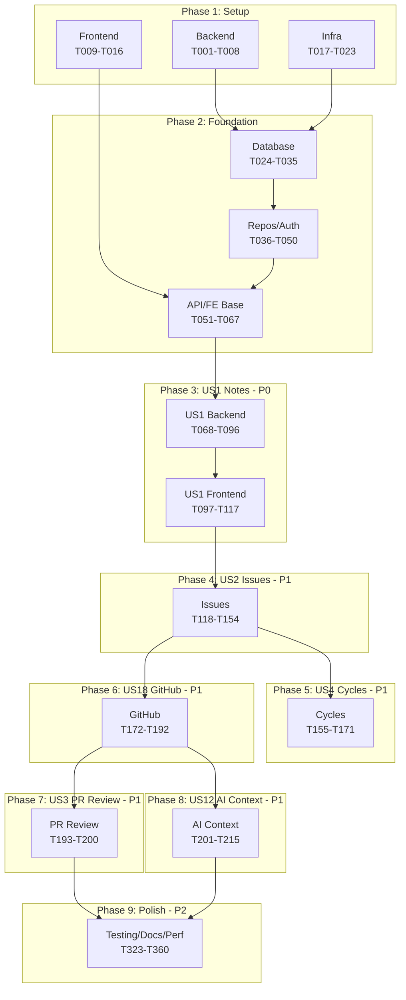

# Task Index: Pilot Space MVP

**Generated**: 2026-01-23 | **Updated**: 2026-01-24 (All MVP Phases Complete)
**Total Tasks**: 399 (277 with details, 122 remaining for P2/P3 stories)
**Progress**: Phase 1 ✅ | Phase 2 ✅ | Phase 3 ✅ | Phase 4 ✅ | Phase 5 ✅ | Phase 6 ✅ | Phase 7 ✅ | Phase 8 ✅ | Phase 9 ✅ (T001-T360 all done - MVP Complete)
**Note**: All 28 missing sub-tasks added + P9 Polish phase (38 tasks). Includes T091a-f, T110a, T112a-c, T117a, T129a-d, T150a-b, T154a-i, T184a, T189a-b, T195a, T200a-e
**Source**: tasks.md
**Feature**: 001-pilot-space-mvp

---

## Quick Links

| Phase | User Story | Tasks | File |
|-------|------------|-------|------|
| 1 | Setup | T001-T023 | [Backend](P1-T001-T008.md) · [Frontend](P1-T009-T016.md) · [Infra](P1-T017-T023.md) |
| 2 | Foundation | T024-T067 | [Database](P2-T024-T035.md) · [Repos/Auth](P2-T036-T050.md) · [API/FE](P2-T051-T067.md) |
| 3 | US1 Notes (P0) | T068-T117a | [Backend](P3-US01-T068-T096.md) · [Frontend](P3-US01-T097-T117.md) |
| 4 | US2 Issues (P1) | T118-T154i | [Full Stack](P4-US02-T118-T154.md) |
| 5 | US4 Cycles (P1) | T155-T171 | [Full Stack](P5-US04-T155-T171.md) |
| 6 | US18 GitHub (P1) | T172-T192 | [Full Stack](P6-US18-T172-T192.md) |
| 7 | US3 PR Review (P1) | T193-T200e | [Full Stack](P7-US03-T193-T200.md) |
| 8 | US12 AI Context (P1) | T201-T215 | [Full Stack](P8-US12-T201-T215.md) |
| 9 | Polish (P2) | T323-T360 | [Testing/Docs/Perf/Security/Infra](P9-Final-T323-T360.md) |

---

## Generated Files Summary

| File | Tasks | Type | Complexity |
|------|-------|------|------------|
| `P1-T001-T008.md` | T001-T008 | Backend Setup | 🟢 24/40 |
| `P1-T009-T016.md` | T009-T016 | Frontend Setup | 🟢 24/40 |
| `P1-T017-T023.md` | T017-T023 | Infrastructure | 🟢 21/35 |
| `P2-T024-T035.md` | T024-T035 | Database Foundation | 🟡 48/60 |
| `P2-T036-T050.md` | T036-T050 | Repos & Auth | 🟡 60/75 |
| `P2-T051-T067.md` | T051-T067 | API & Frontend Base | 🟡 68/85 |
| `P3-US01-T068-T096.md` | T068-T096 | US1 Backend | 🟡 174/145 |
| `P3-US01-T097-T117.md` | T097-T117a | US1 Frontend | 🟡 153/110 |
| `P4-US02-T118-T154.md` | T118-T154i | US2 Full Stack | 🟡 265/210 |
| `P5-US04-T155-T171.md` | T155-T171 | US4 Cycles | 🟡 102/85 |
| `P6-US18-T172-T192.md` | T172-T192 | US18 GitHub | 🟠 147/105 |
| `P7-US03-T193-T200.md` | T193-T200e | US3 PR Review | 🟠 110/65 |
| `P8-US12-T201-T215.md` | T201-T215 | US12 AI Context | 🟠 120/75 |
| `P9-Final-T323-T360.md` | T323-T360 | Polish & Production | 🟡 240/190 |

---

## Complexity Distribution

| Level | Count | Percentage | Description |
|-------|-------|------------|-------------|
| 🟢 Simple (1-5) | ~65 | 30% | Setup, config, basic entities |
| 🟡 Moderate (6-10) | ~100 | 47% | Services, APIs, components |
| 🟠 Complex (11-15) | ~40 | 19% | AI agents, integrations |
| 🔴 Critical (16-20) | ~10 | 4% | Core AI orchestration |

---

## MVP Critical Path



---

## Phase Dependencies

### Phase 1 → Phase 2
- Backend setup (T001-T008) → Database foundation (T024-T035)
- Frontend setup (T009-T016) → Frontend base (T051-T067)
- Infrastructure (T017-T023) → Database (T024)

### Phase 2 → Phase 3
- API foundation (T045-T050) → US1 Backend (T068)
- Frontend base (T057-T064) → US1 Frontend (T097)

### Phase 3 → Phase 4
- US1 complete (T117) → US2 starts (T118)
- Note-to-Issue extraction depends on notes infrastructure

### Phase 4 → Phases 5-8
- Issues complete (T154) → Cycles, GitHub, PR Review, AI Context
- RAG pipeline (T135-T139) → Duplicate detection, AI Context

---

## User Story to Phase Mapping

| Story | Priority | Phase | Tasks | Dependencies |
|-------|----------|-------|-------|--------------|
| US-01 | P0 🎯 | 3 | T068-T117 | Foundation |
| US-02 | P1 | 4 | T118-T154 | US-01 |
| US-03 | P1 | 7 | T193-T200 | US-18 |
| US-04 | P1 | 5 | T155-T171 | US-02 |
| US-12 | P1 | 8 | T201-T215 | US-02, US-18 |
| US-18 | P1 | 6 | T172-T192 | US-02 |

---

## Parallel Opportunities

### Within Phase 1
```
T003-T008 (Backend config) can run in parallel
T011-T016 (Frontend config) can run in parallel
T018-T020 (Dockerfiles, env) can run in parallel
```

### Within Phase 2
```
T028-T030 (User, Workspace, Member) partial parallel
T037-T039 (Repositories) can run in parallel
T058-T060 (Stores) can run in parallel
```

### Within Phase 3 (US1)
```
T074-T077 (Repositories) can run in parallel
T088-T089 (Prompts) can run in parallel
T102-T104 (TipTap extensions) can run in parallel
```

### Within Phase 4 (US2)
```
T122-T124 (Repositories) can run in parallel
T133-T134 (Prompts) can run in parallel
```

---

## Document References by Task Group

Each task file includes a comprehensive **"Document References"** section with:

| Section | Content |
|---------|---------|
| **Architecture Documents** | References to `docs/architect/*.md` with specific sections |
| **Specification Documents** | References to `specs/001-pilot-space-mvp/*.md` |
| **Key Decisions** | Relevant DD-XXX design decisions |
| **Supabase Integration** | Auth, RLS, Storage, Queues, Realtime references |
| **AI Layer References** | Agent specs, RAG pipeline, SSE streaming |
| **Note-First Philosophy** | DD-013, Ghost Text, Margin Annotations |
| **Loading Order** | Recommended document reading sequence |

### Supabase Reference Quick Links

| Task Group | Supabase Components | Primary Document |
|------------|---------------------|------------------|
| P1 (Setup) | Auth, Database, pgvector | `supabase-integration.md` 52-296 |
| P2 (Foundation) | RLS, Auth middleware | `rls-patterns.md` 54-212 |
| P3-US01 (Notes) | Realtime, Embeddings | `supabase-integration.md` 627-730, 731-1656 |
| P4-US02 (Issues) | RLS, Realtime, pgvector | `rls-patterns.md` 86-142 |
| P5-US04 (Cycles) | Realtime | `supabase-integration.md` 627-730 |
| P6-US18 (GitHub) | Queues, Edge Functions | `supabase-integration.md` 382-625 |
| P7-US03 (PR Review) | Queues, Realtime | `supabase-integration.md` 382-625 |
| P8-US12 (AI Context) | pgvector RPC, Embeddings | `supabase-integration.md` 84-185, 1326-1419 |

### AI Layer Reference Quick Links

| Task Group | AI Components | Primary Document |
|------------|---------------|------------------|
| P3-US01 (Notes) | GhostTextAgent, MarginAnnotationAgent | `ai-layer.md` 489-574 |
| P4-US02 (Issues) | IssueEnhancerAgent, DuplicateDetector | `ai-layer.md` 521-650 |
| P6-US18 (GitHub) | CommitLinkerAgent | `ai-layer.md` 468-485 |
| P7-US03 (PR Review) | PRReviewAgent | `ai-layer.md` 576-700 |
| P8-US12 (AI Context) | AIContextAgent, RAG Pipeline | `ai-layer.md` 798-901, 1034-1158 |

### Note-First Reference Quick Links

| Decision | Content | Reference |
|----------|---------|-----------|
| DD-013 | Note-First philosophy, workflow | `DESIGN_DECISIONS.md` 230-250 |
| DD-067 | Ghost Text implementation | `DESIGN_DECISIONS.md` 626-671 |
| DD-022 | Ghost Text UX (Tab/Arrow) | `DESIGN_DECISIONS.md` |
| DD-066 | SSE Streaming architecture | `DESIGN_DECISIONS.md` 596-624 |
| DD-024 | Margin indicator (not inline) | `DESIGN_DECISIONS.md` |

### SDLC Documentation Quick Links

| Document | Section | Lines | Purpose |
|----------|---------|-------|---------|
| `docs/getting-started/CONTRIBUTING.md` | Quality Gates | 129-179 | Pre-commit/merge requirements |
| `docs/getting-started/CONTRIBUTING.md` | Test Pyramid | 539-560 | 70/20/10 unit/integration/E2E |
| `docs/getting-started/CONTRIBUTING.md` | CI/CD Pipeline | 430-438 | GitHub Actions workflow |
| `docs/getting-started/testing-strategy.md` | API Testing | 280-380 | Backend test patterns |
| `docs/getting-started/testing-strategy.md` | Integration Testing | 200-280 | Service layer test patterns |
| `docs/getting-started/deployment-guide.md` | Full Document | - | Deployment procedures |
| `docs/getting-started/nfr-specification.md` | NFR-001-006 | - | Performance, security, reliability SLOs |
| `docs/getting-started/acceptance-criteria-catalog.md` | US-01 to US-18 | - | User story acceptance criteria |
| `docs/getting-started/AI_AGENT_REFERENCE.md` | All Agents | - | AI agent implementation guides |

### TipTap/ProseMirror Quick Links

| Document | Section | Lines | Purpose |
|----------|---------|-------|---------|
| `docs/architect/tiptap-extension-prompt.md` | Ghost Text Extension | 421-448 | 500ms trigger, Tab/Arrow accept |
| `docs/architect/tiptap-extension-prompt.md` | Margin Annotation | 450-473 | CSS Anchor Positioning API |
| `docs/architect/tiptap-extension-prompt.md` | Issue Extraction | 475-499 | Block selection, regex patterns |
| `specs/001-pilot-space-mvp/research.md` | Ghost Text Research | 9-85 | Implementation patterns |
| `specs/001-pilot-space-mvp/research.md` | Margin Positioning | 102-125 | CSS Anchor Positioning |
| `specs/001-pilot-space-mvp/research.md` | Rainbow Border | 176-211 | Selection styling |
| `docs/architect/frontend-architecture.md` | TipTap Config | 527-705 | Extension architecture |
| `docs/architect/frontend-architecture.md` | Editor Components | 625-707 | NoteEditor, EditorToolbar |
| `docs/architect/backend-architecture.md` | Note.content | - | JSONB schema for TipTap |

### Reference Quick Links

| Task Group | Primary Architecture Docs |
|------------|---------------------------|
| P1-T001-T008 (Backend Setup) | backend-architecture.md, infrastructure.md |
| P1-T009-T016 (Frontend Setup) | frontend-architecture.md, feature-story-mapping.md |
| P1-T017-T023 (Infrastructure) | infrastructure.md, supabase-integration.md |
| P2-T024-T035 (Database) | backend-architecture.md, rls-patterns.md, design-patterns.md |
| P2-T036-T050 (Repos/Auth) | backend-architecture.md, supabase-integration.md, rls-patterns.md |
| P2-T051-T067 (API/Frontend) | backend-architecture.md, frontend-architecture.md |
| P3-US01 (Notes Backend) | ai-layer.md (GhostTextAgent, MarginAnnotationAgent), feature-story-mapping.md |
| P3-US01 (Notes Frontend) | frontend-architecture.md, ai-layer.md (SSE Streaming) |
| P4-US02 (Issues) | ai-layer.md (IssueEnhancerAgent, RAG Pipeline), feature-story-mapping.md |
| P5-US04 (Cycles) | feature-story-mapping.md |
| P6-US18 (GitHub) | ai-layer.md (CommitLinkerAgent), infrastructure.md (Webhooks) |
| P7-US03 (PR Review) | ai-layer.md (PRReviewAgent), infrastructure.md (Queues) |
| P8-US12 (AI Context) | ai-layer.md (AIContextAgent, RAG Pipeline), feature-story-mapping.md |

### UI/UX Design Quick Links

| Task Group | UI/UX Focus | Primary Document | Key Lines |
|------------|-------------|------------------|-----------|
| P1-T009-T016 (Frontend Setup) | Design System | `ui-design-spec.md` | 89-180 (colors, typography, spacing) |
| P2-T051-T067 (API/Frontend) | Foundation Patterns | `ui-design-spec.md` | 369-411 (base components) |
| P3-US01 (Notes) | Note Canvas | `ui-design-spec.md` | 415-926 (canvas, ghost text, margins) |
| P4-US02 (Issues) | Issue Panel | `ui-design-spec.md` | 957-1147 (issue modal, AI suggestions) |
| P5-US04 (Cycles) | Cycle Board | `ui-design-spec.md` | 800-900 (Kanban, charts) |
| P6-US18 (GitHub) | Integration Settings | `ui-design-spec.md` | 1180-1250 (GitHub connection) |
| P7-US03 (PR Review) | Status Indicators | `ui-design-spec.md` | 1052-1147 (severity badges) |
| P8-US12 (AI Context) | Context Panel | `ui-design-spec.md` | 1052-1147 (context tab, chat) |

### Infrastructure Patterns Quick Links

| Task Group | Infrastructure Focus | Primary Document | Key Lines |
|------------|----------------------|------------------|-----------|
| P1-T001-T008 (Backend Setup) | FastAPI, Redis | `infrastructure.md` | 95-96, 285-327 |
| P1-T017-T023 (Infrastructure) | Docker, Health | `infrastructure.md` | 60-150, 470-516 |
| P2-T036-T050 (Repos/Auth) | Caching | `44-redis-caching-patterns.md` | 24-73 |
| P3-US01 (Notes Backend) | Queues | `supabase-integration.md` | 382-625 |
| P4-US02 (Issues) | Background Jobs | `supabase-integration.md` | 382-625 |
| P5-US04 (Cycles) | Realtime | `supabase-integration.md` | 627-730 |
| P6-US18 (GitHub) | Webhooks, Edge | `supabase-integration.md` | 382-625, 731-1656 |
| P7-US03 (PR Review) | Queue, Retry | `ai-layer.md` | 1431-1537 |
| P8-US12 (AI Context) | pgvector RPC | `supabase-integration.md` | 84-185, 1326-1419 |

### Data Model Quick Links

| Task Group | Data Entities | Primary Document | Key Lines |
|------------|---------------|------------------|-----------|
| P2-T024-T035 (Database) | User, Workspace, Project | `data-model.md` | 46-220 |
| P2-T036-T050 (Repos/Auth) | Auth, RLS | `rls-patterns.md` | 299-345 |
| P3-US01 (Notes) | Note, NoteAnnotation | `data-model.md` | 224-412 |
| P4-US02 (Issues) | Issue, Activity, Label | `data-model.md` | 416-629 |
| P5-US04 (Cycles) | Cycle | `data-model.md` | 314-362 |
| P6-US18 (GitHub) | Integration, IntegrationLink | `data-model.md` | 1107-1194 |
| P7-US03 (PR Review) | AI Task Queue | `data-model.md` | 877-950 |
| P8-US12 (AI Context) | AIContext, Embedding | `data-model.md` | 708-950 |

### Security Patterns Quick Links

| Task Group | Security Focus | Primary Document | Key Lines |
|------------|----------------|------------------|-----------|
| P1-T001-T008 (Backend) | JWT, CORS | `13-auth-patterns.md` | 78-120 |
| P2-T024-T035 (Database) | RLS Foundations | `rls-patterns.md` | 54-212 |
| P2-T036-T050 (Repos/Auth) | Supabase Auth | `supabase-integration.md` | 187-297 |
| P3-US01 (Notes) | Note RLS | `rls-patterns.md` | 213-248 |
| P4-US02 (Issues) | Issue RLS | `rls-patterns.md` | 86-142 |
| P5-US04 (Cycles) | Workspace Isolation | `rls-patterns.md` | 86-142 |
| P6-US18 (GitHub) | Integration RLS | `rls-patterns.md` | 412-433 |
| P7-US03 (PR Review) | AI Task Queue RLS | `rls-patterns.md` | 394-408 |
| P8-US12 (AI Context) | Embeddings RLS | `rls-patterns.md` | 466-506 |

---

## Dev Pattern Quick Reference

| Pattern | File | Used In |
|---------|------|---------|
| Repository | `docs/dev-pattern/07-repository-pattern.md` | All DB tasks |
| Service Layer | `docs/dev-pattern/08-service-layer-pattern.md` | All service tasks |
| DI Container | `docs/dev-pattern/26-dependency-injection.md` | T049-T050 |
| API Builder | `docs/dev-pattern/27-api-builder-pattern.md` | All router tasks |
| MobX State | `docs/dev-pattern/21c-frontend-mobx-state.md` | All store tasks |
| Table Model | `docs/dev-pattern/38-database-table-model-pattern.md` | All SQLAlchemy models |
| Pilot Space | `docs/dev-pattern/45-pilot-space-patterns.md` | All tasks |

---

## AI Agent Summary

| Agent | User Story | Location | Provider |
|-------|------------|----------|----------|
| GhostTextAgent | US1 | T084 | Gemini Flash |
| MarginAnnotationAgent | US1 | T085 | Claude Sonnet |
| IssueExtractorAgent | US1 | T086 | Claude Sonnet |
| IssueEnhancerAgent | US2 | T130 | Claude Sonnet |
| DuplicateDetectorAgent | US2 | T131 | Claude + OpenAI |
| AssigneeRecommenderAgent | US2 | T132 | Claude Haiku |
| CommitLinkerAgent | US18 | T180 | Claude Haiku |
| PRReviewAgent | US3 | T193 | Claude Opus 4.5 |
| AIContextAgent | US12 | T203 | Claude Opus 4.5 |

---

## Validation Checklist

- [x] 225 MVP tasks (T001-T215 + sub-tasks) have detail files
- [x] All P0/P1 user stories covered
- [x] No circular dependencies in task graph
- [x] Each phase has checkpoint validation
- [x] Task IDs are sequential
- [x] [P] markers identify parallelizable work
- [x] File paths match plan.md project structure
- [x] AI prompts generated for each task group

---

## Execution Commands

```bash
# Phase 1: Setup
./scripts/setup-backend.sh
./scripts/setup-frontend.sh
docker compose up -d

# Quality gates (run after each phase)
cd backend && uv run ruff check && uv run pyright && uv run pytest --cov=.
cd frontend && pnpm lint && pnpm type-check && pnpm test

# Apply migrations
cd backend && uv run alembic upgrade head

# Start development
cd backend && uvicorn pilot_space.main:app --reload &
cd frontend && pnpm dev &
```

---

## Next Steps

✅ **All MVP Phases Complete** (T001-T360)

1. ~~**Phase 1**: Setup (T001-T023)~~ ✅
2. ~~**Phase 2**: Foundation (T024-T067)~~ ✅
3. ~~**Phase 3**: US1 Notes (T068-T117)~~ ✅
4. ~~**Phase 4**: US2 Issues (T118-T154)~~ ✅
5. ~~**Phase 5**: US4 Cycles (T155-T171)~~ ✅
6. ~~**Phase 6**: US18 GitHub (T172-T192)~~ ✅
7. ~~**Phase 7**: US3 PR Review (T193-T200)~~ ✅
8. ~~**Phase 8**: US12 AI Context (T201-T215)~~ ✅
9. ~~**Phase 9**: Polish & Production (T323-T360)~~ ✅

**Next**: Deploy to staging, run quality gates, begin Phase 2 (P2) user stories
