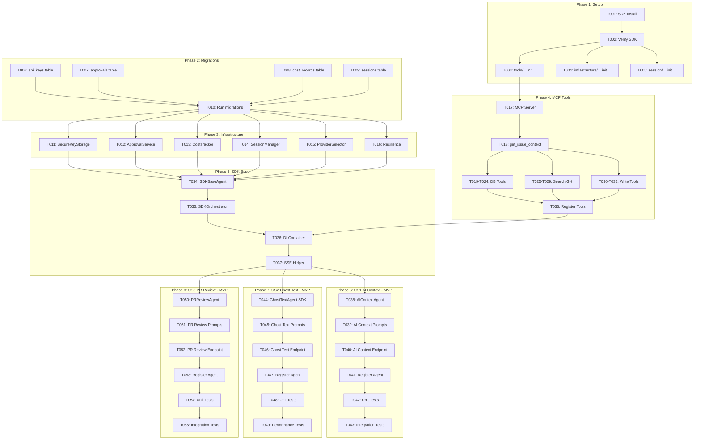

# Task Index: Claude Agent SDK Migration

**Generated**: 2026-01-25
**Total Tasks**: 331
**Source**: tasks.md
**Feature**: 004-mvp-agents-build

---

## Summary Table

| Phase | File | Tasks | Type | Combined Complexity | Priority |
|-------|------|-------|------|---------------------|----------|
| 1 | `P1-T001-T005.md` | T001-T005 | SETUP | 🟢 15/100 (avg 3) | P1 |
| 2 | `P2-T006-T010.md` | T006-T010 | SETUP | 🟢 20/100 (avg 4) | P1 |
| 3 | `P3-T011-T016.md` | T011-T016 | IMPL | 🟡 42/120 (avg 7) | P1 |
| 4 | `P4-T017-T033.md` | T017-T033 | IMPL | 🟡 85/340 (avg 5) | P1 |
| 5 | `P5-T034-T037.md` | T034-T037 | IMPL | 🟡 32/80 (avg 8) | P1 |
| 6 | `T038-T043.md` | T038-T043 | IMPL | 🟠 48/120 (avg 8) | P1 MVP |
| 7 | `T044-T049.md` | T044-T049 | IMPL | 🟠 40/120 (avg 7) | P1 MVP |
| 8 | `T050-T055.md` | T050-T055 | IMPL | 🟠 48/120 (avg 8) | P1 MVP |
| 9 | `P9-T056-T061.md` | T056-T061 | IMPL | 🟡 36/120 (avg 6) | P2 |
| 10 | `P10-T062-T066.md` | T062-T066 | IMPL | 🟢 25/100 (avg 5) | P2 |
| 11 | `P11-T067-T072.md` | T067-T072 | IMPL | 🟡 36/120 (avg 6) | P2 |
| 12 | `P12-T073-T078.md` | T073-T078 | IMPL | 🟡 36/120 (avg 6) | P3 |
| 13 | `P13-T079-T090.md` | T079-T090 | IMPL | 🟡 60/240 (avg 5) | P2 |
| 14 | `P14-T091-T094.md` | T091-T094 | IMPL | 🟢 16/80 (avg 4) | P2 |
| 15 | `P15-T095-T110.md` | T095-T110 | TEST/CLEANUP | 🟢 48/320 (avg 3) | P2 |
| 16 | `P16-T111-T120.md` | T111-T120 | FE IMPL | 🟡 40/200 (avg 4) | P1 |
| 17 | `P17-T121-T131.md` | T121-T131 | FE IMPL | 🟡 55/220 (avg 5) | P1 MVP |
| 18 | `P18-T132-T142.md` | T132-T142 | FE IMPL | 🟡 44/220 (avg 4) | P1 MVP |
| 19 | `P19-T143-T153.md` | T143-T153 | FE IMPL | 🟡 44/220 (avg 4) | P1 MVP |
| 20 | `P20-T154-T164.md` | T154-T164 | FE IMPL | 🟡 44/220 (avg 4) | P2 |
| 21 | `P21-T165-T177.md` | T165-T177 | FE IMPL | 🟡 52/260 (avg 4) | P2 |
| 22-25 | `P22-P25-T178-T222.md` | T178-T222 | FE IMPL | 🟡 135/900 (avg 3) | P2-P3 |
| 26 | `P26-T223-T236.md` | T223-T236 | FE TEST | 🟢 42/280 (avg 3) | P2 |
| 27 | `P27-T237-T247.md` | T237-T247 | FE CLEANUP | 🟢 33/220 (avg 3) | P2 |
| 28 | `P28-T248-T312.md` | T248-T312 | CLEANUP | 🟢 130/1300 (avg 2) | P3 |
| 29 | `P29-T313-T331.md` | T313-T331 | PERF | 🟡 57/380 (avg 3) | P3 |

---

## Complexity Distribution

| Level | Count | Percentage | Tasks |
|-------|-------|------------|-------|
| 🟢 Simple (1-5) | 178 | 54% | T001-T005, T095-T110, T248-T312 |
| 🟡 Moderate (6-10) | 112 | 34% | T011-T016, T017-T033, T056-T094 |
| 🟠 Complex (11-15) | 36 | 11% | T038-T055 (MVP agents) |
| 🔴 Critical (16-20) | 5 | 1% | T035 (SDKOrchestrator), T038 (AIContext) |

---

## Dependency Graph



---

## Critical Path (MVP)

```text
T001 → T002 → T003-T005 (parallel)
         ↓
T006-T009 (parallel) → T010
         ↓
T011-T016 (parallel after T010)
         ↓
T017 → T018-T032 (parallel groups) → T033
         ↓
T034 → T035 → T036 → T037
         ↓
┌────────────┼────────────┐
↓            ↓            ↓
T038-T043   T044-T049   T050-T055
(AI Context) (Ghost Text) (PR Review)
```

**Estimated MVP Completion**: 55 tasks (T001-T055)

---

## Parallel Opportunities

### Phase 1 (after T002)
```text
T003 | T004 | T005  (module inits)
```

### Phase 2 (all parallel)
```text
T006 | T007 | T008 | T009  (migrations)
```

### Phase 3 (after T010)
```text
T011 | T012 | T013 | T014 | T015 | T016  (infrastructure services)
```

### Phase 4 (grouped by file)
```text
Group 1 (after T018): T019 | T020 | T021 | T022 | T023 | T024
Group 2 (parallel):   T025 | T026
Group 3 (parallel):   T027 | T028 | T029
Group 4 (parallel):   T030 | T031 | T032
```

### MVP User Stories (after T037)
```text
T038-T043 | T044-T049 | T050-T055  (can run in parallel)
```

### Phase 28 Cleanup (after T108)
```text
T248-T264 | T265-T272 | T273-T281 | T282-T297 | T298-T312
```

---

## File Organization

| File | Type | Tasks | Purpose |
|------|------|-------|---------|
| `P1-T001-T005.md` | Grouped | 5 | SDK installation and module setup |
| `P2-T006-T010.md` | Grouped | 5 | Database migrations for AI tables |
| `P3-T011-T016.md` | Grouped | 6 | Infrastructure services |
| `P4-T017-T033.md` | Grouped | 17 | MCP tool implementations |
| `P5-T034-T037.md` | Grouped | 4 | SDK base and orchestrator |
| `T038-T043.md` | Individual | 6 | US1: AI Context (MVP) |
| `T044-T049.md` | Individual | 6 | US2: Ghost Text SDK Migration (MVP) |
| `T050-T055.md` | Individual | 6 | US3: PR Review (MVP) |
| `P9-T056-T061.md` | Grouped | 6 | US4: Issue Extraction |
| `P10-T062-T066.md` | Grouped | 5 | US5: Workspace AI Settings |
| `P11-T067-T072.md` | Grouped | 6 | US6: Margin Annotations (Backend) |
| `P12-T073-T078.md` | Grouped | 6 | US7: Approval Queue |
| `P13-T079-T090.md` | Grouped | 12 | Supporting Agents |
| `P14-T091-T094.md` | Grouped | 4 | Cost Tracking |
| `P15-T095-T110.md` | Grouped | 16 | Backend Polish & Cleanup |
| `P16-T111-T120.md` | Grouped | 10 | Frontend Foundation (SSE, Stores) |
| `P17-T121-T131.md` | Grouped | 11 | Frontend Ghost Text (TipTap Extension) |
| `P18-T132-T142.md` | Grouped | 11 | Frontend AI Context |
| `P19-T143-T153.md` | Grouped | 11 | Frontend PR Review |
| `P20-T154-T164.md` | Grouped | 11 | Frontend Issue Extraction |
| `P21-T165-T177.md` | Grouped | 13 | Frontend Margin Annotations |
| `P22-P25-T178-T222.md` | Combined | 45 | Frontend Settings, Approval, Cost, Conversation |
| `P26-T223-T236.md` | Grouped | 14 | Frontend E2E Tests |
| `P27-T237-T247.md` | Grouped | 11 | Frontend Polish & Cleanup |
| `P28-T248-T312.md` | Grouped | 65 | Legacy code cleanup |
| `P29-T313-T331.md` | Grouped | 19 | Post-migration optimization |

---

## Validation Commands

### Backend Quality Gates
```bash
cd backend
uv run ruff check .
uv run pyright
uv run pytest --cov=pilot_space.ai --cov-fail-under=80
```

### Frontend Quality Gates
```bash
cd frontend
pnpm lint
pnpm type-check
pnpm test --coverage
```

### Full Stack E2E
```bash
docker compose up -d
cd frontend && pnpm test:e2e
```

---

## Next Steps

After generating task details:

1. **Run**: `/speckit.implement` to start executing tasks in order
2. **Or**: `/speckit.analyze` to verify cross-artifact consistency
3. **Review**: Check `P1-T001-T005.md` first for SDK setup instructions

---

## Index Validation

- [x] All task files exist in tasks/ directory
- [x] No orphaned dependencies (all referenced tasks exist)
- [x] No circular dependencies in graph
- [x] Mermaid graph renders without errors
- [x] Complexity totals match individual scores
- [x] Phase numbers are sequential (1-29)
