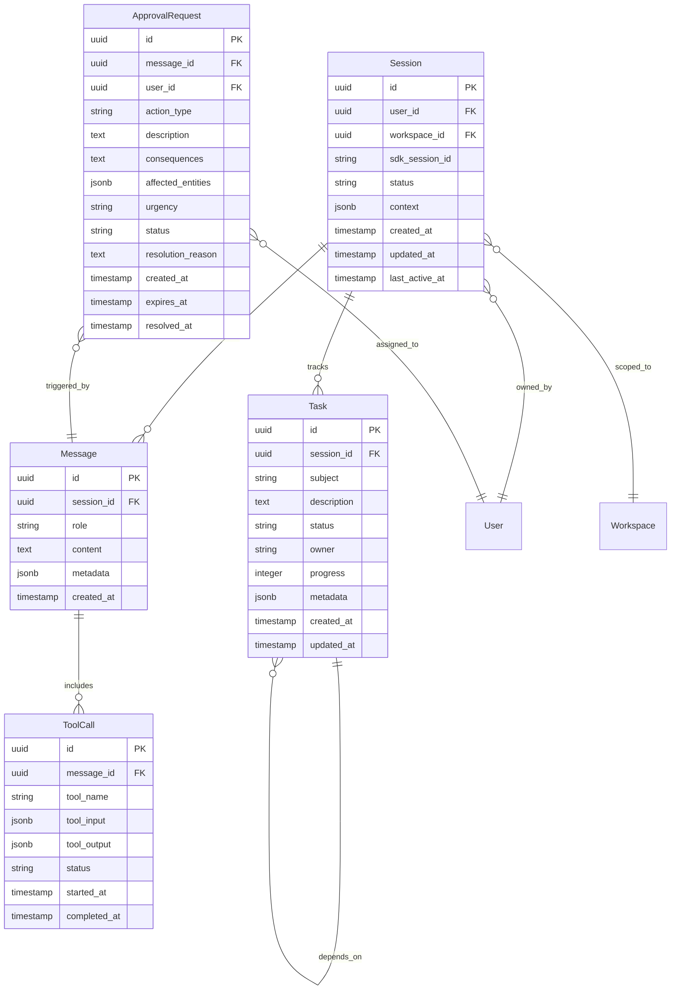

# Data Model: Conversational Agent Architecture Migration

**Branch**: `005-conversational-agent-arch`
**Date**: 2026-01-27
**Status**: Complete

## Overview

This document defines the data entities for the Conversational Agent Architecture, including session management, message persistence, task tracking, and approval workflows.

## Entity Relationship Diagram



## Entity Definitions

### 1. Session

Represents a persistent conversation context between user and AI.

```python
from sqlalchemy import Column, String, ForeignKey, Enum, JSON
from sqlalchemy.dialects.postgresql import UUID, TIMESTAMP
from sqlalchemy.orm import relationship

class SessionStatus(str, Enum):
    ACTIVE = "active"
    PAUSED = "paused"
    EXPIRED = "expired"
    ARCHIVED = "archived"

class Session(Base):
    """Persistent conversation session."""

    __tablename__ = "ai_sessions"

    id = Column(UUID(as_uuid=True), primary_key=True, default=uuid4)
    user_id = Column(UUID(as_uuid=True), ForeignKey("users.id"), nullable=False)
    workspace_id = Column(UUID(as_uuid=True), ForeignKey("workspaces.id"), nullable=False)
    sdk_session_id = Column(String(255), nullable=True, index=True)
    status = Column(String(20), default=SessionStatus.ACTIVE, nullable=False)
    context = Column(JSON, nullable=True)  # {note_id, issue_id, project_id}
    created_at = Column(TIMESTAMP(timezone=True), server_default=func.now())
    updated_at = Column(TIMESTAMP(timezone=True), onupdate=func.now())
    last_active_at = Column(TIMESTAMP(timezone=True), server_default=func.now())

    # Relationships
    user = relationship("User", back_populates="ai_sessions")
    workspace = relationship("Workspace", back_populates="ai_sessions")
    messages = relationship("Message", back_populates="session", cascade="all, delete-orphan")
    tasks = relationship("Task", back_populates="session", cascade="all, delete-orphan")

    # RLS Policy
    __rls__ = {
        "select": "user_id = auth.uid() OR workspace_id IN (SELECT workspace_id FROM workspace_members WHERE user_id = auth.uid())",
        "insert": "user_id = auth.uid()",
        "update": "user_id = auth.uid()",
        "delete": "user_id = auth.uid()",
    }
```

**Key Fields**:
- `sdk_session_id`: Claude Agent SDK session ID for resumption
- `context`: JSON blob with current note/issue/project context
- `last_active_at`: For session expiry and cleanup

**Indexes**:
- `idx_sessions_user_workspace`: (user_id, workspace_id)
- `idx_sessions_sdk_session_id`: (sdk_session_id)
- `idx_sessions_last_active`: (last_active_at)

### 2. Message

A single exchange in the conversation.

```python
class MessageRole(str, Enum):
    USER = "user"
    ASSISTANT = "assistant"
    SYSTEM = "system"

class Message(Base):
    """Single message in a conversation session."""

    __tablename__ = "ai_messages"

    id = Column(UUID(as_uuid=True), primary_key=True, default=uuid4)
    session_id = Column(UUID(as_uuid=True), ForeignKey("ai_sessions.id"), nullable=False)
    role = Column(String(20), nullable=False)
    content = Column(Text, nullable=False)
    metadata = Column(JSON, nullable=True)  # {skill, agent, tokens, model}
    created_at = Column(TIMESTAMP(timezone=True), server_default=func.now())

    # Relationships
    session = relationship("Session", back_populates="messages")
    tool_calls = relationship("ToolCall", back_populates="message", cascade="all, delete-orphan")
    approval_requests = relationship("ApprovalRequest", back_populates="message")

    # RLS via session ownership
    __rls__ = {
        "select": "session_id IN (SELECT id FROM ai_sessions WHERE user_id = auth.uid())",
    }
```

**Key Fields**:
- `role`: user, assistant, or system
- `content`: Message text (may include markdown)
- `metadata`: Skill/agent info, token usage, model used

**Indexes**:
- `idx_messages_session`: (session_id)
- `idx_messages_created`: (session_id, created_at)

### 3. ToolCall

Records tool invocations during AI processing.

```python
class ToolCallStatus(str, Enum):
    PENDING = "pending"
    RUNNING = "running"
    COMPLETED = "completed"
    FAILED = "failed"
    CANCELLED = "cancelled"

class ToolCall(Base):
    """Tool invocation within a message."""

    __tablename__ = "ai_tool_calls"

    id = Column(UUID(as_uuid=True), primary_key=True, default=uuid4)
    message_id = Column(UUID(as_uuid=True), ForeignKey("ai_messages.id"), nullable=False)
    tool_name = Column(String(100), nullable=False)
    tool_input = Column(JSON, nullable=False)
    tool_output = Column(JSON, nullable=True)
    status = Column(String(20), default=ToolCallStatus.PENDING, nullable=False)
    error_message = Column(Text, nullable=True)
    started_at = Column(TIMESTAMP(timezone=True), nullable=True)
    completed_at = Column(TIMESTAMP(timezone=True), nullable=True)

    # Relationships
    message = relationship("Message", back_populates="tool_calls")

    # RLS via message → session ownership
    __rls__ = {
        "select": "message_id IN (SELECT id FROM ai_messages WHERE session_id IN (SELECT id FROM ai_sessions WHERE user_id = auth.uid()))",
    }
```

**Key Fields**:
- `tool_name`: SDK tool or MCP tool name (e.g., "Skill", "Read", "pilotspace_search")
- `tool_input`: Tool arguments as JSON
- `tool_output`: Tool result as JSON (null if failed)
- `status`: Execution status

**Indexes**:
- `idx_tool_calls_message`: (message_id)
- `idx_tool_calls_status`: (status) WHERE status IN ('pending', 'running')

### 4. Task

Tracked unit of work within the AI system.

```python
class TaskStatus(str, Enum):
    PENDING = "pending"
    IN_PROGRESS = "in_progress"
    COMPLETED = "completed"
    FAILED = "failed"
    BLOCKED = "blocked"

class Task(Base):
    """Tracked task in the AI task system."""

    __tablename__ = "ai_tasks"

    id = Column(UUID(as_uuid=True), primary_key=True, default=uuid4)
    session_id = Column(UUID(as_uuid=True), ForeignKey("ai_sessions.id"), nullable=False)
    subject = Column(String(255), nullable=False)
    description = Column(Text, nullable=True)
    status = Column(String(20), default=TaskStatus.PENDING, nullable=False)
    owner = Column(String(100), nullable=True)  # Agent name or "user"
    progress = Column(Integer, default=0)  # 0-100
    metadata = Column(JSON, nullable=True)
    created_at = Column(TIMESTAMP(timezone=True), server_default=func.now())
    updated_at = Column(TIMESTAMP(timezone=True), onupdate=func.now())

    # Self-referential for dependencies
    blocked_by_id = Column(UUID(as_uuid=True), ForeignKey("ai_tasks.id"), nullable=True)

    # Relationships
    session = relationship("Session", back_populates="tasks")
    blocked_by = relationship("Task", remote_side=[id], backref="blocking")

    # RLS via session ownership
    __rls__ = {
        "select": "session_id IN (SELECT id FROM ai_sessions WHERE user_id = auth.uid())",
    }
```

**Key Fields**:
- `subject`: Brief task title (imperative form)
- `status`: Task lifecycle state
- `owner`: Agent handling the task
- `progress`: Completion percentage (0-100)
- `blocked_by_id`: Dependency chain

**Indexes**:
- `idx_tasks_session`: (session_id)
- `idx_tasks_status`: (session_id, status)

### 5. ApprovalRequest

Pending action requiring human confirmation.

```python
class ApprovalUrgency(str, Enum):
    LOW = "low"
    MEDIUM = "medium"
    HIGH = "high"

class ApprovalStatus(str, Enum):
    PENDING = "pending"
    APPROVED = "approved"
    REJECTED = "rejected"
    EXPIRED = "expired"
    MODIFIED = "modified"

class ApprovalRequest(Base):
    """Human approval request for critical AI actions."""

    __tablename__ = "ai_approval_requests"

    id = Column(UUID(as_uuid=True), primary_key=True, default=uuid4)
    message_id = Column(UUID(as_uuid=True), ForeignKey("ai_messages.id"), nullable=False)
    user_id = Column(UUID(as_uuid=True), ForeignKey("users.id"), nullable=False)
    action_type = Column(String(50), nullable=False)  # create_issue, modify_file, etc.
    description = Column(Text, nullable=False)
    consequences = Column(Text, nullable=True)
    affected_entities = Column(JSON, nullable=True)  # [{type, id, name}]
    urgency = Column(String(20), default=ApprovalUrgency.MEDIUM, nullable=False)
    status = Column(String(20), default=ApprovalStatus.PENDING, nullable=False)
    resolution_reason = Column(Text, nullable=True)
    proposed_content = Column(JSON, nullable=True)  # Original AI proposal
    modified_content = Column(JSON, nullable=True)  # User modifications
    created_at = Column(TIMESTAMP(timezone=True), server_default=func.now())
    expires_at = Column(TIMESTAMP(timezone=True), nullable=False)
    resolved_at = Column(TIMESTAMP(timezone=True), nullable=True)

    # Relationships
    message = relationship("Message", back_populates="approval_requests")
    user = relationship("User")

    # RLS
    __rls__ = {
        "select": "user_id = auth.uid()",
        "update": "user_id = auth.uid()",
    }
```

**Key Fields**:
- `action_type`: Classification per DD-003 (create_issue, modify_file, bulk_operation)
- `consequences`: Human-readable impact description
- `affected_entities`: List of entities that will be modified
- `urgency`: Affects UI presentation (badge color, position)
- `expires_at`: 24h expiry timer per FR-015
- `proposed_content` / `modified_content`: For approve-with-modifications flow

**Indexes**:
- `idx_approvals_user_status`: (user_id, status) WHERE status = 'pending'
- `idx_approvals_expires`: (expires_at) WHERE status = 'pending'

## TypeScript Types (Frontend)

```typescript
// Session
interface Session {
  id: string;
  userId: string;
  workspaceId: string;
  sdkSessionId: string | null;
  status: 'active' | 'paused' | 'expired' | 'archived';
  context: ConversationContext | null;
  createdAt: string;
  updatedAt: string;
  lastActiveAt: string;
}

// Message
interface ChatMessage {
  id: string;
  sessionId: string;
  role: 'user' | 'assistant' | 'system';
  content: string;
  metadata: MessageMetadata | null;
  toolCalls: ToolCall[];
  createdAt: string;
}

interface MessageMetadata {
  skill?: string;
  agent?: string;
  tokens?: { input: number; output: number };
  model?: string;
}

// ToolCall
interface ToolCall {
  id: string;
  messageId: string;
  toolName: string;
  toolInput: Record<string, unknown>;
  toolOutput: Record<string, unknown> | null;
  status: 'pending' | 'running' | 'completed' | 'failed' | 'cancelled';
  errorMessage?: string;
  startedAt: string | null;
  completedAt: string | null;
}

// Task
interface AgentTask {
  id: string;
  sessionId: string;
  subject: string;
  description: string | null;
  status: 'pending' | 'in_progress' | 'completed' | 'failed' | 'blocked';
  owner: string | null;
  progress: number;
  metadata: Record<string, unknown> | null;
  blockedById: string | null;
  createdAt: string;
  updatedAt: string;
}

// ApprovalRequest
interface ApprovalRequest {
  id: string;
  messageId: string;
  userId: string;
  actionType: string;
  description: string;
  consequences: string | null;
  affectedEntities: AffectedEntity[];
  urgency: 'low' | 'medium' | 'high';
  status: 'pending' | 'approved' | 'rejected' | 'expired' | 'modified';
  resolutionReason: string | null;
  proposedContent: Record<string, unknown> | null;
  modifiedContent: Record<string, unknown> | null;
  createdAt: string;
  expiresAt: string;
  resolvedAt: string | null;
}

interface AffectedEntity {
  type: 'issue' | 'note' | 'file' | 'project';
  id: string;
  name: string;
}

// Context
interface ConversationContext {
  noteId: string | null;
  issueId: string | null;
  projectId: string | null;
  selectedText: string | null;
  selectedBlockIds: string[];
}
```

## Database Migrations

### Migration: Create AI Tables

```python
"""Create AI conversational tables.

Revision ID: 005_001
Revises: 004_xxx
Create Date: 2026-01-27
"""

from alembic import op
import sqlalchemy as sa
from sqlalchemy.dialects import postgresql

def upgrade():
    # Sessions
    op.create_table(
        'ai_sessions',
        sa.Column('id', postgresql.UUID(as_uuid=True), primary_key=True),
        sa.Column('user_id', postgresql.UUID(as_uuid=True), sa.ForeignKey('users.id'), nullable=False),
        sa.Column('workspace_id', postgresql.UUID(as_uuid=True), sa.ForeignKey('workspaces.id'), nullable=False),
        sa.Column('sdk_session_id', sa.String(255), nullable=True),
        sa.Column('status', sa.String(20), default='active', nullable=False),
        sa.Column('context', postgresql.JSONB, nullable=True),
        sa.Column('created_at', sa.TIMESTAMP(timezone=True), server_default=sa.func.now()),
        sa.Column('updated_at', sa.TIMESTAMP(timezone=True), onupdate=sa.func.now()),
        sa.Column('last_active_at', sa.TIMESTAMP(timezone=True), server_default=sa.func.now()),
    )
    op.create_index('idx_sessions_user_workspace', 'ai_sessions', ['user_id', 'workspace_id'])
    op.create_index('idx_sessions_sdk_session_id', 'ai_sessions', ['sdk_session_id'])
    op.create_index('idx_sessions_last_active', 'ai_sessions', ['last_active_at'])

    # Messages
    op.create_table(
        'ai_messages',
        sa.Column('id', postgresql.UUID(as_uuid=True), primary_key=True),
        sa.Column('session_id', postgresql.UUID(as_uuid=True), sa.ForeignKey('ai_sessions.id'), nullable=False),
        sa.Column('role', sa.String(20), nullable=False),
        sa.Column('content', sa.Text, nullable=False),
        sa.Column('metadata', postgresql.JSONB, nullable=True),
        sa.Column('created_at', sa.TIMESTAMP(timezone=True), server_default=sa.func.now()),
    )
    op.create_index('idx_messages_session', 'ai_messages', ['session_id'])
    op.create_index('idx_messages_created', 'ai_messages', ['session_id', 'created_at'])

    # Tool Calls
    op.create_table(
        'ai_tool_calls',
        sa.Column('id', postgresql.UUID(as_uuid=True), primary_key=True),
        sa.Column('message_id', postgresql.UUID(as_uuid=True), sa.ForeignKey('ai_messages.id'), nullable=False),
        sa.Column('tool_name', sa.String(100), nullable=False),
        sa.Column('tool_input', postgresql.JSONB, nullable=False),
        sa.Column('tool_output', postgresql.JSONB, nullable=True),
        sa.Column('status', sa.String(20), default='pending', nullable=False),
        sa.Column('error_message', sa.Text, nullable=True),
        sa.Column('started_at', sa.TIMESTAMP(timezone=True), nullable=True),
        sa.Column('completed_at', sa.TIMESTAMP(timezone=True), nullable=True),
    )
    op.create_index('idx_tool_calls_message', 'ai_tool_calls', ['message_id'])

    # Tasks
    op.create_table(
        'ai_tasks',
        sa.Column('id', postgresql.UUID(as_uuid=True), primary_key=True),
        sa.Column('session_id', postgresql.UUID(as_uuid=True), sa.ForeignKey('ai_sessions.id'), nullable=False),
        sa.Column('subject', sa.String(255), nullable=False),
        sa.Column('description', sa.Text, nullable=True),
        sa.Column('status', sa.String(20), default='pending', nullable=False),
        sa.Column('owner', sa.String(100), nullable=True),
        sa.Column('progress', sa.Integer, default=0),
        sa.Column('metadata', postgresql.JSONB, nullable=True),
        sa.Column('blocked_by_id', postgresql.UUID(as_uuid=True), sa.ForeignKey('ai_tasks.id'), nullable=True),
        sa.Column('created_at', sa.TIMESTAMP(timezone=True), server_default=sa.func.now()),
        sa.Column('updated_at', sa.TIMESTAMP(timezone=True), onupdate=sa.func.now()),
    )
    op.create_index('idx_tasks_session', 'ai_tasks', ['session_id'])
    op.create_index('idx_tasks_status', 'ai_tasks', ['session_id', 'status'])

    # Approval Requests
    op.create_table(
        'ai_approval_requests',
        sa.Column('id', postgresql.UUID(as_uuid=True), primary_key=True),
        sa.Column('message_id', postgresql.UUID(as_uuid=True), sa.ForeignKey('ai_messages.id'), nullable=False),
        sa.Column('user_id', postgresql.UUID(as_uuid=True), sa.ForeignKey('users.id'), nullable=False),
        sa.Column('action_type', sa.String(50), nullable=False),
        sa.Column('description', sa.Text, nullable=False),
        sa.Column('consequences', sa.Text, nullable=True),
        sa.Column('affected_entities', postgresql.JSONB, nullable=True),
        sa.Column('urgency', sa.String(20), default='medium', nullable=False),
        sa.Column('status', sa.String(20), default='pending', nullable=False),
        sa.Column('resolution_reason', sa.Text, nullable=True),
        sa.Column('proposed_content', postgresql.JSONB, nullable=True),
        sa.Column('modified_content', postgresql.JSONB, nullable=True),
        sa.Column('created_at', sa.TIMESTAMP(timezone=True), server_default=sa.func.now()),
        sa.Column('expires_at', sa.TIMESTAMP(timezone=True), nullable=False),
        sa.Column('resolved_at', sa.TIMESTAMP(timezone=True), nullable=True),
    )
    op.create_index('idx_approvals_user_status', 'ai_approval_requests', ['user_id', 'status'])
    op.create_index('idx_approvals_expires', 'ai_approval_requests', ['expires_at'])


def downgrade():
    op.drop_table('ai_approval_requests')
    op.drop_table('ai_tasks')
    op.drop_table('ai_tool_calls')
    op.drop_table('ai_messages')
    op.drop_table('ai_sessions')
```

## RLS Policies

```sql
-- Sessions: User can access own sessions or workspace member sessions
CREATE POLICY sessions_select ON ai_sessions FOR SELECT
  USING (
    user_id = auth.uid() OR
    workspace_id IN (
      SELECT workspace_id FROM workspace_members WHERE user_id = auth.uid()
    )
  );

CREATE POLICY sessions_insert ON ai_sessions FOR INSERT
  WITH CHECK (user_id = auth.uid());

CREATE POLICY sessions_update ON ai_sessions FOR UPDATE
  USING (user_id = auth.uid());

CREATE POLICY sessions_delete ON ai_sessions FOR DELETE
  USING (user_id = auth.uid());

-- Messages: Access via session ownership
CREATE POLICY messages_select ON ai_messages FOR SELECT
  USING (
    session_id IN (
      SELECT id FROM ai_sessions WHERE user_id = auth.uid()
    )
  );

-- Approval Requests: Only assigned user can view/update
CREATE POLICY approvals_select ON ai_approval_requests FOR SELECT
  USING (user_id = auth.uid());

CREATE POLICY approvals_update ON ai_approval_requests FOR UPDATE
  USING (user_id = auth.uid());
```

## References

- [Feature Specification](./spec.md)
- [Research Document](./research.md)
- [Implementation Plan](./plan.md)
- [Constitution v1.2.1](../../.specify/memory/constitution.md)
