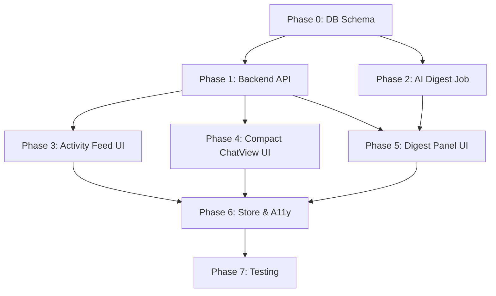

# Implementation Plan: Homepage Hub (US-19)

**Branch**: `012-homepage-note` | **Date**: 2026-02-06 | **Spec**: [spec.md](./spec.md)
**Input**: Feature specification from `specs/012-homepage-note/spec.md`, codebase analysis of existing homepage, ChatView, and card components
**Parent Plan**: `specs/001-pilot-space-mvp/plan.md` (extends MVP infrastructure)

## Summary

Replace the static welcome page (`/[workspaceSlug]`) with a three-zone Homepage Hub that provides immediate productivity: a Compact ChatView for quick AI-assisted idea capture, a day-grouped activity feed showing recent notes and issues with AI annotation previews, and an AI Digest panel with hourly-generated workspace insights and actionable suggestions.

**Core Value**: Reduce time-to-first-action from ~15 seconds (3 navigation clicks) to <3 seconds (start typing). Reinforce Note-First philosophy by making AI-assisted thinking the default entry point.

**Key Technical Decisions**:
- Reuse `PilotSpaceStore` + SSE infrastructure for Compact ChatView (no new AI transport)
- New `homepage_chat` context type instructs agent to be concise and proactively suggest note creation
- TanStack Query for activity feed + digest data (server state); MobX `HomepageUIStore` for panel expand/collapse (UI state)
- Hourly digest generation via existing pgmq + pg_cron infrastructure with Claude Sonnet
- Two new DB tables (`workspace_digests`, `digest_dismissals`), one column addition (`notes.source_chat_session_id`)

## Technical Context

**Language/Version**: Python 3.12+ (Backend), TypeScript 5.3+ (Frontend)

**Existing Infrastructure (Reused)**:

| Component | Location | Reuse |
|-----------|----------|-------|
| PilotSpaceStore | `frontend/src/stores/ai/PilotSpaceStore.ts` | Chat state for Compact ChatView |
| SSE streaming | Backend `StreamingResponse` + Frontend `sse-client.ts` | Chat message streaming |
| ChatView components | `frontend/src/features/ai/ChatView/` | StreamingContent, SuggestionCard, ChatInput patterns |
| NoteGridCard | `frontend/src/app/(workspace)/[workspaceSlug]/notes/page.tsx` | Activity feed note card pattern |
| Supabase Realtime | Existing broadcast channels | Real-time activity updates |
| pgmq + pg_cron | `backend/src/pilot_space/infrastructure/queue/` | Digest background job |
| shadcn/ui primitives | `frontend/src/components/ui/` | Card, Badge, Button, Skeleton, Tooltip |
| AppShell layout | `frontend/src/components/layout/app-shell.tsx` | Sidebar + content area unchanged |

**New Infrastructure**:

| Component | Purpose |
|-----------|---------|
| `workspace_digests` table | Store hourly AI digest results |
| `digest_dismissals` table | Track user-dismissed suggestions |
| `notes.source_chat_session_id` column | Link notes to originating homepage chat |
| `generate-digest` skill | AI skill for workspace analysis |
| `create-note-from-chat` skill | AI skill for chat-to-note conversion |
| Homepage API router | 4 new endpoints under `/api/v1/workspaces/{id}/homepage/` |

**Architecture Patterns**:
- Backend: CQRS-lite (`Service.execute(Payload) -> Result`), Repository pattern, RLS enforcement
- Frontend: Feature-based folder (`features/homepage/`), MobX UI state, TanStack Query server state
- AI: PilotSpaceAgent with `homepage_chat` context type, skill-based invocation
- Jobs: pgmq LOW priority queue, pg_cron hourly schedule, 60s timeout

**Constraints**:

| Constraint | Value |
|------------|-------|
| Homepage load time | <2 seconds (activity + digest combined) |
| Chat first token | <2 seconds |
| Digest generation | <60 seconds |
| File size limit | 700 lines per file |
| Test coverage | >80% |
| Accessibility | WCAG 2.1 Level AA |

---

## Implementation Phases

### Phase 0: Database Schema & Migrations

**Goal**: Establish data layer for digest storage, dismissals, and chat-to-note linking.

#### 0.1 Alembic Migration: `workspace_digests` Table

**File**: `backend/src/pilot_space/infrastructure/database/migrations/versions/xxx_add_workspace_digests.py`

```python
# workspace_digests table
op.create_table(
    "workspace_digests",
    sa.Column("id", sa.dialects.postgresql.UUID, primary_key=True, server_default=sa.text("gen_random_uuid()")),
    sa.Column("workspace_id", sa.dialects.postgresql.UUID, sa.ForeignKey("workspaces.id", ondelete="CASCADE"), nullable=False),
    sa.Column("generated_at", sa.DateTime(timezone=True), nullable=False, server_default=sa.text("now()")),
    sa.Column("generated_by", sa.String(20), nullable=False, server_default="scheduled"),
    sa.Column("suggestions", sa.dialects.postgresql.JSONB, nullable=False, server_default=sa.text("'[]'::jsonb")),
    sa.Column("model_used", sa.String(50), nullable=True),
    sa.Column("token_usage", sa.dialects.postgresql.JSONB, nullable=True),
    sa.Column("created_at", sa.DateTime(timezone=True), nullable=False, server_default=sa.text("now()")),
)
op.create_index("idx_workspace_digests_workspace_generated", "workspace_digests", ["workspace_id", "generated_at"])
```

RLS policy: workspace members can read their workspace's digests; service role can insert.

#### 0.2 Alembic Migration: `digest_dismissals` Table

```python
# digest_dismissals table
op.create_table(
    "digest_dismissals",
    sa.Column("id", sa.dialects.postgresql.UUID, primary_key=True, server_default=sa.text("gen_random_uuid()")),
    sa.Column("workspace_id", sa.dialects.postgresql.UUID, sa.ForeignKey("workspaces.id", ondelete="CASCADE"), nullable=False),
    sa.Column("user_id", sa.dialects.postgresql.UUID, sa.ForeignKey("users.id", ondelete="CASCADE"), nullable=False),
    sa.Column("suggestion_category", sa.String(30), nullable=False),
    sa.Column("entity_id", sa.dialects.postgresql.UUID, nullable=False),
    sa.Column("entity_type", sa.String(20), nullable=False),
    sa.Column("dismissed_at", sa.DateTime(timezone=True), nullable=False, server_default=sa.text("now()")),
)
op.create_index("idx_digest_dismissals_user", "digest_dismissals", ["workspace_id", "user_id", "entity_id"])
```

RLS policy: users can read/write their own dismissals.

#### 0.3 Alembic Migration: Extend `notes` Table

```python
# Add source_chat_session_id to notes
op.add_column("notes", sa.Column("source_chat_session_id", sa.dialects.postgresql.UUID, nullable=True))
```

#### 0.4 SQLAlchemy Models

**File**: `backend/src/pilot_space/infrastructure/database/models/workspace_digest.py`

```python
class WorkspaceDigest(WorkspaceScopedModel):
    __tablename__ = "workspace_digests"

    generated_at: Mapped[datetime] = mapped_column(DateTime(timezone=True), nullable=False)
    generated_by: Mapped[str] = mapped_column(String(20), nullable=False, default="scheduled")
    suggestions: Mapped[list[dict]] = mapped_column(JSONBCompat, nullable=False, default=list)
    model_used: Mapped[str | None] = mapped_column(String(50), nullable=True)
    token_usage: Mapped[dict | None] = mapped_column(JSONBCompat, nullable=True)
```

**File**: `backend/src/pilot_space/infrastructure/database/models/digest_dismissal.py`

```python
class DigestDismissal(WorkspaceScopedModel):
    __tablename__ = "digest_dismissals"

    user_id: Mapped[UUID] = mapped_column(ForeignKey("users.id", ondelete="CASCADE"), nullable=False)
    suggestion_category: Mapped[str] = mapped_column(String(30), nullable=False)
    entity_id: Mapped[UUID] = mapped_column(nullable=False)
    entity_type: Mapped[str] = mapped_column(String(20), nullable=False)
    dismissed_at: Mapped[datetime] = mapped_column(DateTime(timezone=True), nullable=False)
```

**Update**: `backend/src/pilot_space/infrastructure/database/models/note.py` -- add `source_chat_session_id` field.

---

### Phase 1: Backend API Layer

**Goal**: Implement the 4 homepage API endpoints + chat-to-note endpoint.

#### 1.1 Homepage Router

**File**: `backend/src/pilot_space/api/v1/routers/homepage.py`

```python
router = APIRouter(prefix="/homepage", tags=["Homepage"])

@router.get("/activity", response_model=HomepageActivityResponse)
async def get_homepage_activity(
    workspace_id: UUID,
    cursor: str | None = None,
    limit: int = Query(default=20, le=50),
    current_user_id: CurrentUserId,
    session: DbSession,
) -> HomepageActivityResponse:
    """Recent notes and issues grouped by day."""

@router.get("/digest", response_model=DigestResponse)
async def get_workspace_digest(
    workspace_id: UUID,
    current_user_id: CurrentUserId,
    session: DbSession,
) -> DigestResponse:
    """Latest AI digest suggestions for current user."""

@router.post("/digest/refresh", response_model=DigestRefreshResponse)
async def refresh_workspace_digest(
    workspace_id: UUID,
    current_user_id: CurrentUserId,
    session: DbSession,
) -> DigestRefreshResponse:
    """Trigger on-demand digest generation."""

@router.post("/digest/dismiss", status_code=status.HTTP_204_NO_CONTENT)
async def dismiss_digest_suggestion(
    workspace_id: UUID,
    payload: DigestDismissPayload,
    current_user_id: CurrentUserId,
    session: DbSession,
) -> None:
    """Dismiss a digest suggestion for current user."""
```

#### 1.2 Pydantic Schemas

**File**: `backend/src/pilot_space/api/v1/schemas/homepage.py`

Key schemas:
- `HomepageActivityResponse` -- `{data: {today: [], yesterday: [], this_week: []}, meta: {total, cursor, has_more}}`
- `ActivityCardNote` -- note card with latest annotation
- `ActivityCardIssue` -- issue card with last activity
- `DigestResponse` -- `{data: {generated_at, generated_by, suggestions: [], suggestion_count}}`
- `DigestSuggestion` -- category, icon, title, description, entity ref, action type, relevance score
- `DigestDismissPayload` -- suggestion_id, entity_id, entity_type, category
- `DigestRefreshResponse` -- `{data: {status, estimated_seconds}}`

#### 1.3 Homepage Service (CQRS-lite)

**File**: `backend/src/pilot_space/application/services/homepage/get_activity_service.py`

```python
@dataclass(frozen=True, slots=True)
class GetActivityPayload:
    workspace_id: UUID
    user_id: UUID
    cursor: str | None = None
    limit: int = 20

@dataclass(frozen=True, slots=True)
class GetActivityResult:
    today: list[ActivityCard]
    yesterday: list[ActivityCard]
    this_week: list[ActivityCard]
    total: int
    cursor: str | None
    has_more: bool
```

Query logic:
1. Fetch recent notes (last 7 days) with latest annotation via lateral join
2. Fetch recent issues (last 7 days) with last activity via lateral join
3. Union and sort by `updated_at` DESC
4. Group into day buckets (today, yesterday, this_week) using Python
5. Apply cursor pagination

**File**: `backend/src/pilot_space/application/services/homepage/get_digest_service.py`

Query logic:
1. Fetch latest `workspace_digests` row for workspace
2. Fetch user's `digest_dismissals`
3. Filter out dismissed suggestions
4. Rank by relevance to current user (is assignee, is creator, access frequency)
5. Return sorted suggestions

**File**: `backend/src/pilot_space/application/services/homepage/dismiss_suggestion_service.py`

Insert into `digest_dismissals` table.

#### 1.4 Chat-to-Note Endpoint

**File**: `backend/src/pilot_space/api/v1/routers/notes.py` (extend existing)

Add endpoint:
```python
@router.post("/from-chat", response_model=NoteResponse, status_code=status.HTTP_201_CREATED)
async def create_note_from_chat(
    workspace_id: UUID,
    payload: CreateNoteFromChatPayload,
    current_user_id: CurrentUserId,
    session: DbSession,
) -> NoteResponse:
    """Create a note from a homepage chat conversation."""
```

**File**: `backend/src/pilot_space/application/services/note/create_note_from_chat_service.py`

Logic:
1. Fetch chat session messages
2. Extract key points via Claude Sonnet (one-shot query)
3. Structure as TipTap content blocks (heading + paragraphs)
4. Create note with `source_chat_session_id` set
5. Return note with linked session reference

#### 1.5 Repositories

**File**: `backend/src/pilot_space/infrastructure/database/repositories/homepage_repository.py`

```python
class HomepageRepository:
    """Aggregate queries for homepage data."""

    async def get_recent_notes_with_annotations(
        self, workspace_id: UUID, since: datetime, limit: int
    ) -> list[NoteWithAnnotation]: ...

    async def get_recent_issues_with_activity(
        self, workspace_id: UUID, since: datetime, limit: int
    ) -> list[IssueWithActivity]: ...

class DigestRepository:
    """CRUD for workspace digests and dismissals."""

    async def get_latest_digest(self, workspace_id: UUID) -> WorkspaceDigest | None: ...
    async def save_digest(self, digest: WorkspaceDigest) -> WorkspaceDigest: ...
    async def get_user_dismissals(self, workspace_id: UUID, user_id: UUID) -> list[DigestDismissal]: ...
    async def add_dismissal(self, dismissal: DigestDismissal) -> DigestDismissal: ...
```

---

### Phase 2: AI Digest Background Job

**Goal**: Implement the hourly digest generation job using existing pgmq infrastructure.

#### 2.1 Digest Skill

**File**: `backend/src/pilot_space/ai/templates/skills/generate-digest/SKILL.md`

```yaml
---
name: generate-digest
description: Analyzes workspace state and generates actionable insights
trigger: scheduled
model: claude-sonnet
timeout: 60s
---
```

Prompt structure:
- System: "You are a workspace analyst. Analyze the provided workspace data and generate actionable suggestions."
- Context: Issues (state, assignee, updated_at, cycle), notes (annotations, extraction status), cycles (progress, end date), PRs (review status)
- Output format: JSON array of `DigestSuggestion` objects with category, title, description, entity reference, action type, relevance score

Categories to analyze (12 total):
1. **Stale Issues**: `WHERE state IN ('in_progress', 'in_review') AND updated_at < now() - interval '7 days'`
2. **Missing Documentation**: `WHERE state = 'done' AND NOT EXISTS (SELECT 1 FROM note_issue_links WHERE issue_id = issues.id)`
3. **Inconsistent Status**: Issues in 'in_progress' with no recent commits or activity
4. **Blocked Dependencies**: Issues blocked by stale blockers
5. **Unassigned Work**: High/urgent priority issues without assignee
6. **Overdue Cycle Items**: Active cycle ending within 2 days with incomplete items
7. **PR Review Pending**: Open PRs >4 hours without AI review
8. **Duplicate Candidates**: Recent issues with >70% embedding similarity
9. **Note Refinement**: Notes with undismissed/unaccepted annotations
10. **Project Health**: Velocity trend comparison (current vs previous cycle)
11. **Knowledge Gaps**: Topics referenced in 5+ issues without linked notes
12. **Release Readiness**: Cycle completion % with critical item count

#### 2.2 Digest Job Handler

**File**: `backend/src/pilot_space/infrastructure/queue/handlers/digest_handler.py`

```python
class DigestJobHandler:
    """Processes workspace digest generation jobs."""

    async def handle(self, payload: DigestJobPayload) -> None:
        # 1. Query workspace data (SQL aggregates, not full entity loads)
        context = await self._build_context(payload.workspace_id)

        # 2. Call Claude Sonnet via one-shot query
        suggestions = await self._generate_suggestions(context)

        # 3. Store in workspace_digests
        await self._store_digest(payload.workspace_id, suggestions, payload.trigger)

        # 4. Broadcast via Supabase Realtime
        await self._notify_clients(payload.workspace_id)
```

**Context Building** (SQL-first, minimize token usage):
- Use aggregate queries to summarize workspace state
- Cap at 500 entities per category (issues, notes)
- Target <4000 tokens input context
- Return structured JSON, not natural language

#### 2.3 pg_cron Schedule

**File**: Alembic migration for pg_cron setup

```sql
-- Schedule hourly digest generation for all active workspaces
SELECT cron.schedule(
    'generate-workspace-digests',
    '0 * * * *',
    $$
    SELECT pgmq.send(
        'ai_low',
        json_build_object(
            'operation', 'generate_digest',
            'workspace_id', w.id::text,
            'trigger', 'scheduled'
        )::jsonb
    )
    FROM workspaces w
    WHERE w.is_deleted = false
    AND EXISTS (
        SELECT 1 FROM ai_configurations ac
        WHERE ac.workspace_id = w.id AND ac.is_valid = true
    )
    $$
);
```

**Deduplication**: Before processing, check if a digest was generated in the last 30 minutes for the same workspace. Skip if so.

---

### Phase 3: Frontend - Homepage Layout & Activity Feed

**Goal**: Build the homepage layout structure and the Recent Activity Feed (Zone 2).

#### 3.1 Feature Module Setup

```
frontend/src/features/homepage/
  index.ts                           # Barrel export
  components/
    HomepageHub.tsx                   # Main 3-zone layout
  hooks/
    useHomepageActivity.ts            # TanStack Query + infinite scroll
  stores/
    HomepageUIStore.ts               # MobX: chatExpanded, activeZone
  types.ts                           # ActivityCard, DigestSuggestion types
  constants.ts                       # ITEMS_PER_PAGE, STALE_TIME, etc.
  api/
    homepage-api.ts                   # API client functions
```

#### 3.2 HomepageHub Layout

**File**: `frontend/src/features/homepage/components/HomepageHub.tsx`

```tsx
export const HomepageHub = observer(function HomepageHub() {
  return (
    <div className="flex flex-col gap-6 p-6 max-w-[1400px] mx-auto">
      {/* Zone 1: Compact ChatView */}
      <section role="region" aria-label="Quick capture">
        <CompactChatView />
      </section>

      {/* Zone 2 + 3: Activity Feed + Digest */}
      <div className="flex flex-col lg:flex-row gap-6">
        <section role="region" aria-label="Recent activity" className="flex-[3] min-w-0">
          <ActivityFeed />
        </section>
        <section role="region" aria-label="AI workspace insights" className="flex-[2] min-w-0">
          <DigestPanel />
        </section>
      </div>
    </div>
  );
});
```

#### 3.3 Homepage Page Route

**File**: `frontend/src/app/(workspace)/[workspaceSlug]/page.tsx` (replace existing)

Replace the current static welcome page with `<HomepageHub />`. Keep `OnboardingChecklist` integration if onboarding is incomplete.

#### 3.4 Activity Feed Components

**File**: `frontend/src/features/homepage/components/ActivityFeed/ActivityFeed.tsx`

- Uses `useHomepageActivity()` TanStack Query hook with infinite scroll
- Groups cards by day using `date-fns` (`isToday`, `isYesterday`, `isThisWeek`)
- Renders `ActivityDayGroup` with header + card list

**File**: `frontend/src/features/homepage/components/ActivityFeed/NoteActivityCard.tsx`

Adapted from existing `NoteGridCard` pattern:
- Title + FileText icon
- Project badge (colored pill)
- Topic tags (max 3, muted pills)
- Word count
- AI annotation preview line (80 char truncated, `--ai-muted` background)
- Relative timestamp via `formatDistanceToNow`
- Hover: translateY(-2px), shadow elevation
- Click: navigate to `/[workspaceSlug]/notes/[noteId]`

**File**: `frontend/src/features/homepage/components/ActivityFeed/IssueActivityCard.tsx`

- State dot (colored circle) + identifier (PS-123)
- Title
- Project badge
- State badge (colored pill)
- Priority indicator (4px left border in priority color)
- Assignee avatar (24px)
- Last activity summary (1 line)
- Relative timestamp
- Click: navigate to `/[workspaceSlug]/issues/[issueId]`

**File**: `frontend/src/features/homepage/hooks/useHomepageActivity.ts`

```typescript
export function useHomepageActivity(workspaceId: string) {
  return useInfiniteQuery({
    queryKey: ['homepage', 'activity', workspaceId],
    queryFn: ({ pageParam }) => homepageApi.getActivity(workspaceId, pageParam),
    getNextPageParam: (lastPage) => lastPage.meta.has_more ? lastPage.meta.cursor : undefined,
    staleTime: 30_000, // 30s - homepage data refreshes frequently
  });
}
```

#### 3.5 Real-Time Activity Updates

Subscribe to Supabase Realtime channel `workspace:{workspace_id}` for broadcast events:
- `note_updated` -> invalidate activity query
- `issue_updated` -> invalidate activity query

Use `queryClient.invalidateQueries(['homepage', 'activity'])` on broadcast event.

---

### Phase 4: Frontend - Compact ChatView (Zone 1)

**Goal**: Build the expand-on-focus chat widget that reuses PilotSpaceStore.

#### 4.1 CompactChatView Component

**File**: `frontend/src/features/homepage/components/CompactChatView/CompactChatView.tsx`

State machine:
```
idle (collapsed, 48px)
  --[click/tab/slash]--> expanded (max 400px)

expanded
  --[escape/outside-click]--> idle (preserve messages)
  --[note-creation-accepted]--> navigating (create note, redirect)
```

**Collapsed state**:
- `--background-subtle` bar with AI avatar, placeholder input, `[/]` hint badge
- `rounded-lg` (14px), 48px height
- Click/focus expands

**Expanded state**:
- `--card` background, `shadow-warm-md`, `rounded-lg`
- Header: "PilotSpace AI" + ChevronDown minimize button
- Message list: reuse `StreamingContent` from existing ChatView
- Input: auto-expanding textarea, Enter to send, Shift+Enter newline
- NoteCreationSuggestion card appears after AI suggests note creation

#### 4.2 Compact Chat Integration with PilotSpaceStore

Reuse the existing `PilotSpaceStore` with a new session context:

```typescript
// In CompactChatView mount
const store = usePilotSpaceStore();

useEffect(() => {
  // Initialize homepage chat session
  store.startSession({ contextType: 'homepage' });
  return () => store.pauseSession(); // Don't destroy - preserve for return
}, []);
```

The `contextType: 'homepage'` instructs the backend PilotSpaceAgent to:
1. Keep responses concise (system prompt adjustment)
2. After 2+ substantive messages, check if note creation should be suggested

#### 4.3 Note Creation Flow

**File**: `frontend/src/features/homepage/components/CompactChatView/NoteCreationSuggestion.tsx`

When AI suggests note creation, render a `SuggestionCard` variant:
- Title: "Create a note from this conversation"
- Description: AI-suggested note title
- Project selector (optional)
- "Create Note" primary button + "Not now" ghost button

On accept:
1. Call `POST /api/v1/workspaces/{id}/notes/from-chat` with `chat_session_id`
2. Navigate to `/[workspaceSlug]/notes/[noteId]`

#### 4.4 Keyboard Shortcut

Register `/` global shortcut on homepage to focus the Compact ChatView input:

```typescript
// In HomepageHub
useEffect(() => {
  const handler = (e: KeyboardEvent) => {
    if (e.key === '/' && !isTextInput(e.target)) {
      e.preventDefault();
      compactChatInputRef.current?.focus();
    }
  };
  document.addEventListener('keydown', handler);
  return () => document.removeEventListener('keydown', handler);
}, []);
```

#### 4.5 Mobile Bottom Sheet

On mobile (<768px), expanded state renders as a bottom sheet:
- Full width, 60vh height
- Swipe-down gesture to dismiss (using touch events)
- Backdrop overlay (40% black)

---

### Phase 5: Frontend - AI Digest Panel (Zone 3)

**Goal**: Build the AI insights panel with actionable suggestion cards.

#### 5.1 DigestPanel Component

**File**: `frontend/src/features/homepage/components/DigestPanel/DigestPanel.tsx`

```tsx
export const DigestPanel = observer(function DigestPanel() {
  const { data, isLoading } = useWorkspaceDigest(workspaceId);
  const dismissMutation = useDigestDismiss(workspaceId);

  if (!hasAIProvider) return <DigestEmptyState />;
  if (isLoading) return <DigestSkeleton />;

  return (
    <div className="space-y-4">
      <DigestHeader generatedAt={data.generated_at} onRefresh={handleRefresh} />
      {groupByCategory(data.suggestions).map(([category, suggestions]) => (
        <DigestCategoryGroup key={category} category={category} suggestions={suggestions} onDismiss={dismissMutation.mutate} />
      ))}
    </div>
  );
});
```

#### 5.2 DigestSuggestionCard

**File**: `frontend/src/features/homepage/components/DigestPanel/DigestSuggestionCard.tsx`

- Category icon (lucide-react icon matching category)
- Title (bold, 1 line)
- Description (muted, 1-2 lines)
- Project name label
- Action button: `ghost` variant for navigation actions, `outline` for quick actions
- Dismiss button: `ghost` icon button (X), top-right
- Background: `--background-subtle`, 10px border-radius

**Quick actions** (inline, no navigation):
- "Create Issue" -> opens issue creation modal pre-filled
- "Assign" -> opens assignee selection popover
- "Trigger Review" -> calls PR review endpoint

**Navigation actions**:
- "View Issue" -> navigate to issue detail
- "View Note" -> navigate to note editor
- "View Cycle" -> navigate to cycle detail

#### 5.3 Digest Hooks

**File**: `frontend/src/features/homepage/hooks/useWorkspaceDigest.ts`

```typescript
export function useWorkspaceDigest(workspaceId: string) {
  return useQuery({
    queryKey: ['homepage', 'digest', workspaceId],
    queryFn: () => homepageApi.getDigest(workspaceId),
    staleTime: 5 * 60_000, // 5 minutes - digest updates hourly
    refetchOnWindowFocus: true,
  });
}
```

**File**: `frontend/src/features/homepage/hooks/useDigestDismiss.ts`

```typescript
export function useDigestDismiss(workspaceId: string) {
  const queryClient = useQueryClient();
  return useMutation({
    mutationFn: (payload: DigestDismissPayload) => homepageApi.dismissSuggestion(workspaceId, payload),
    onMutate: async (payload) => {
      // Optimistic removal from cache
      await queryClient.cancelQueries(['homepage', 'digest', workspaceId]);
      const previous = queryClient.getQueryData(['homepage', 'digest', workspaceId]);
      queryClient.setQueryData(['homepage', 'digest', workspaceId], (old) =>
        filterOutSuggestion(old, payload.suggestion_id)
      );
      return { previous };
    },
    onError: (err, payload, context) => {
      queryClient.setQueryData(['homepage', 'digest', workspaceId], context?.previous);
    },
  });
}
```

#### 5.4 Digest Refresh

On manual refresh click:
1. Call `POST /api/v1/workspaces/{id}/homepage/digest/refresh`
2. Show loading skeleton in digest panel
3. Poll for completion or subscribe to Realtime broadcast
4. On completion, invalidate digest query

#### 5.5 Empty State

**File**: `frontend/src/features/homepage/components/DigestPanel/DigestEmptyState.tsx`

When no AI provider configured:
- Illustration (simple SVG)
- "Configure an AI provider in Settings to enable workspace insights"
- Link button to `/[workspaceSlug]/settings/ai-providers`

---

### Phase 6: HomepageUIStore & Accessibility

**Goal**: MobX store for UI state + keyboard navigation + ARIA compliance.

#### 6.1 HomepageUIStore

**File**: `frontend/src/features/homepage/stores/HomepageUIStore.ts`

```typescript
class HomepageUIStore {
  chatExpanded = false;
  activeZone: 'chat' | 'activity' | 'digest' = 'chat';

  constructor() {
    makeAutoObservable(this);
  }

  expandChat() { this.chatExpanded = true; }
  collapseChat() { this.chatExpanded = false; }
  setActiveZone(zone: 'chat' | 'activity' | 'digest') { this.activeZone = zone; }
}
```

#### 6.2 F6 Zone Cycling

Implement F6 keyboard shortcut to cycle between zones:

```typescript
// Zone focus order: Chat -> Activity -> Digest -> Chat
const zones = ['chat', 'activity', 'digest'] as const;
const zoneRefs = { chat: chatRef, activity: activityRef, digest: digestRef };

useEffect(() => {
  const handler = (e: KeyboardEvent) => {
    if (e.key === 'F6') {
      e.preventDefault();
      const currentIndex = zones.indexOf(store.activeZone);
      const nextIndex = (currentIndex + 1) % zones.length;
      store.setActiveZone(zones[nextIndex]);
      zoneRefs[zones[nextIndex]].current?.focus();
    }
  };
  document.addEventListener('keydown', handler);
  return () => document.removeEventListener('keydown', handler);
}, []);
```

#### 6.3 ARIA Landmarks

Each zone uses `role="region"` with descriptive `aria-label`:
- Zone 1: `aria-label="Quick capture - Chat with PilotSpace AI"`
- Zone 2: `aria-label="Recent activity - Notes and issues"`
- Zone 3: `aria-label="AI workspace insights"`

Card components include:
- `role="article"` for each card
- `aria-label` with full card description for screen readers
- Focus visible indicators (3px primary ring)

#### 6.4 Reduced Motion

All animations wrapped in `motion-safe:` Tailwind variant:
```tsx
className="motion-safe:transition-all motion-safe:duration-200"
```

Expand/collapse uses CSS transitions that respect `prefers-reduced-motion`:
```css
@media (prefers-reduced-motion: reduce) {
  .compact-chat-panel { transition: none; }
}
```

---

### Phase 7: Testing

**Goal**: >80% coverage across backend and frontend.

#### 7.1 Backend Tests

**File**: `backend/tests/unit/services/test_get_activity_service.py`
- Test day grouping logic (today, yesterday, this_week)
- Test cursor pagination
- Test empty workspace
- Test annotation preview truncation

**File**: `backend/tests/unit/services/test_digest_service.py`
- Test digest retrieval with dismissal filtering
- Test relevance ranking (user assignments ranked higher)
- Test empty digest (no AI provider)

**File**: `backend/tests/unit/services/test_create_note_from_chat.py`
- Test note creation with chat session link
- Test content structuring from messages
- Test missing chat session error

**File**: `backend/tests/integration/test_homepage_router.py`
- Test GET /activity returns grouped data
- Test GET /digest returns latest digest
- Test POST /digest/refresh triggers job
- Test POST /digest/dismiss creates dismissal
- Test POST /notes/from-chat creates note
- Test RLS: users cannot access other workspace's data

**File**: `backend/tests/unit/queue/test_digest_handler.py`
- Test context building (SQL aggregate queries)
- Test AI response parsing
- Test deduplication (skip if recent digest exists)
- Test timeout handling

#### 7.2 Frontend Tests

**File**: `frontend/src/features/homepage/__tests__/HomepageHub.test.tsx`
- Test 3-zone layout renders
- Test responsive stacking on tablet
- Test F6 zone cycling
- Test `/` shortcut focuses chat input

**File**: `frontend/src/features/homepage/__tests__/CompactChatView.test.tsx`
- Test collapsed state renders input bar
- Test expand on focus
- Test collapse on Escape
- Test collapse on outside click
- Test message sending (mock SSE)
- Test note creation suggestion appears
- Test note creation navigation

**File**: `frontend/src/features/homepage/__tests__/ActivityFeed.test.tsx`
- Test day grouping headers
- Test note card renders metadata
- Test issue card renders state/priority
- Test infinite scroll triggers
- Test empty state
- Test annotation hover tooltip

**File**: `frontend/src/features/homepage/__tests__/DigestPanel.test.tsx`
- Test suggestion cards render
- Test category grouping
- Test dismiss removes card (optimistic)
- Test refresh triggers loading state
- Test empty state when no AI provider
- Test quick action buttons

---

## Component Mapping (Spec -> Implementation)

| Spec Requirement | Backend | Frontend |
|------------------|---------|----------|
| FR-200: Replace welcome page | -- | `HomepageHub.tsx` replaces `page.tsx` |
| FR-201: Three zones | -- | `HomepageHub.tsx` layout |
| FR-204: Expand-on-focus chat | SSE streaming (existing) | `CompactChatView/` components |
| FR-205: SSE streaming | PilotSpaceAgent (existing) | PilotSpaceStore (existing) |
| FR-206: Note creation suggestion | `homepage_chat` context type | `NoteCreationSuggestion.tsx` |
| FR-207: Chat-to-note | `create_note_from_chat_service.py` | Note creation flow |
| FR-211: Day-grouped activity | `get_activity_service.py` | `ActivityFeed/` components |
| FR-214: Infinite scroll | Cursor pagination | `useHomepageActivity.ts` |
| FR-215: Real-time updates | Supabase Realtime (existing) | Query invalidation |
| FR-217: Hourly digest | `digest_handler.py` + pg_cron | -- |
| FR-218: Relevance ranking | `get_digest_service.py` | -- |
| FR-219: Quick actions | Action-type routing | `DigestSuggestionCard.tsx` |
| FR-220: Dismissals | `dismiss_suggestion_service.py` | `useDigestDismiss.ts` |
| FR-225: `/` shortcut | -- | `HomepageHub.tsx` keydown handler |
| FR-226: F6 zone cycling | -- | `HomepageHub.tsx` keydown handler |
| FR-227: ARIA landmarks | -- | `role="region"` + `aria-label` |
| FR-229: Reduced motion | -- | `motion-safe:` variants |

---

## Dependency Graph



**Critical Path**: Phase 0 -> Phase 1 -> Phase 3/4/5 (parallel) -> Phase 6 -> Phase 7

**Parallelization Opportunities**:
- Phase 3, 4, 5 can be developed in parallel after Phase 1 is complete
- Phase 2 can be developed in parallel with Phase 3/4/5 (only Phase 5 depends on it for real data)
- Backend tests (7.1) can start as soon as Phase 1 is complete
- Frontend tests (7.2) can be written alongside each Phase 3-6

---

## Risk Register

| ID | Risk | Probability | Impact | Score | Response | Trigger |
|----|------|-------------|--------|-------|----------|---------|
| R-01 | Digest job exceeds 60s timeout for large workspaces | 3 | 2 | 6 | **Mitigate**: Sample max 500 entities, use SQL aggregates not full loads | Job execution >45s in staging |
| R-02 | Compact ChatView conflicts with existing `/` shortcut in sidebar search | 2 | 3 | 6 | **Avoid**: Only bind `/` when not in text input and on homepage route | User reports shortcut conflict |
| R-03 | Activity feed query becomes slow with 50K+ issues | 2 | 3 | 6 | **Mitigate**: Index on `(workspace_id, updated_at)`, limit to 7-day window | Query p95 >500ms |
| R-04 | PilotSpaceStore session conflicts between homepage chat and note editor chat | 3 | 4 | 12 | **Mitigate**: Use separate session IDs per context_type, store manages multiple sessions | Messages appear in wrong context |
| R-05 | pg_cron scheduling for all workspaces creates thundering herd | 2 | 3 | 6 | **Mitigate**: Add random jitter (0-300s) to scheduled job start time | Queue depth spikes hourly |

---

## Rollback Strategy

| Phase | Rollback Trigger | Procedure |
|-------|------------------|-----------|
| Phase 0 | Migration failure | `alembic downgrade -1` reverts schema changes |
| Phase 1 | API regression | Revert router registration; existing endpoints unaffected |
| Phase 3-5 | Frontend regression | Restore previous `page.tsx` (static welcome page) |
| Phase 2 | Digest job failures | Disable pg_cron schedule; digest panel shows "unavailable" |
| Full | Feature gate | Add `FEATURE_HOMEPAGE_HUB=false` env var to revert to static page |

---

## Estimated File Count

| Category | New Files | Modified Files |
|----------|-----------|----------------|
| Migrations | 3 | 0 |
| SQLAlchemy Models | 2 | 1 (note.py) |
| Backend Services | 4 | 0 |
| Backend Router | 1 | 1 (notes.py) |
| Backend Schemas | 1 | 0 |
| Backend Repository | 1 | 0 |
| Queue Handler | 1 | 0 |
| AI Skills | 2 | 0 |
| Frontend Components | 15 | 1 (page.tsx) |
| Frontend Hooks | 4 | 0 |
| Frontend Stores | 1 | 0 |
| Frontend Types/API | 3 | 0 |
| Backend Tests | 5 | 0 |
| Frontend Tests | 4 | 0 |
| **Total** | **47** | **3** |

---

## Related Documentation

- [Feature Specification](./spec.md) -- US-19 Homepage Hub
- [MVP Plan](../001-pilot-space-mvp/plan.md) -- Parent implementation plan
- [UI Design Spec](../001-pilot-space-mvp/ui-design-spec.md) -- Design system reference
- [Data Model](../001-pilot-space-mvp/data-model.md) -- Entity definitions
- [Agent Architecture](../../docs/architect/pilotspace-agent-architecture.md) -- PilotSpaceAgent design
