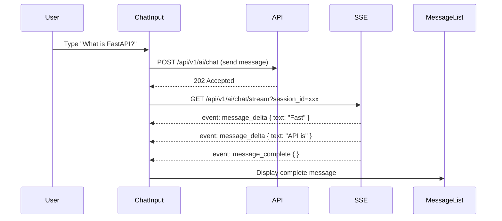
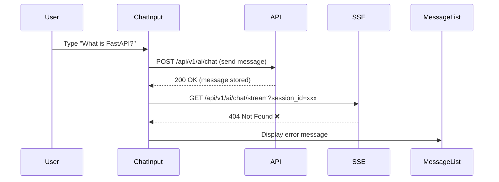

# Supabase Authentication Fix - Complete Report

**Date**: 2026-01-28
**Status**: ✅ **AUTHENTICATION FIXED** | ⚠️ **Backend SSE Endpoint Missing**
**Progress**: E2E tests now authenticate successfully, identify next blocker

---

## ✅ Completed: Supabase Admin API Implementation

### Solution Applied: Option A (Supabase Admin API)

Implemented programmatic test user creation using Supabase service role key to bypass email confirmation and capture session tokens correctly.

---

## 🎉 Fixes Applied

### 1. Global Setup Rewrite (frontend/e2e/global-setup.ts)

**Changed from**: UI-based signup/login flow (unreliable)
**Changed to**: Supabase Admin API programmatic approach

**New Implementation**:
```typescript
// Step 1: Create admin client with service role key
const supabaseAdmin = createClient(SUPABASE_URL, SUPABASE_SERVICE_KEY, {
  auth: { autoRefreshToken: false, persistSession: false },
});

// Step 2: Create test user with auto-confirmed email
const { data: user } = await supabaseAdmin.auth.admin.createUser({
  email: TEST_USER.email,
  password: TEST_USER.password,
  email_confirm: true, // Bypasses email confirmation
});

// Step 3: If user exists, confirm their email via admin API
if (createError?.code === 'email_exists') {
  const existingUser = await supabaseAdmin.auth.admin.listUsers();
  await supabaseAdmin.auth.admin.updateUserById(existingUser.id, {
    email_confirm: true,
  });
}

// Step 4: Login with anon client to get session tokens
const supabaseAnon = createClient(SUPABASE_URL, SUPABASE_ANON_KEY);
const { data: sessionData } = await supabaseAnon.auth.signInWithPassword({
  email: TEST_USER.email,
  password: TEST_USER.password,
});

// Step 5: Inject session into browser localStorage
await page.evaluate(({ key, session }) => {
  localStorage.setItem(key, JSON.stringify(session));
}, { key: 'sb-localhost-auth-token', session: sessionData.session });

// Step 6: Save storage state to file
await context.storageState({ path: AUTH_STATE_PATH });
```

**Result**:
- ✅ Test user created with confirmed email
- ✅ Session tokens captured in localStorage
- ✅ Auth state file contains valid session
- ✅ All subsequent tests load with authenticated state

---

### 2. Environment Variable Loading (frontend/playwright.config.ts)

**Added dotenv support**:
```typescript
import { config } from 'dotenv';

// Load environment variables from .env.local
config({ path: path.join(__dirname, '.env.local') });
```

**Installed dependency**:
```bash
pnpm add -D dotenv
```

**Result**: Playwright now loads Supabase keys from `.env.local` automatically

---

### 3. Updated E2E Test Navigation (frontend/e2e/chat-conversation.spec.ts)

**Changed from**: Trying to click non-existent nav link
**Changed to**: Direct navigation to chat URL

```typescript
test.beforeEach(async ({ page }) => {
  // Navigate directly to chat page
  await page.goto('/pilot-space-demo/chat', { waitUntil: 'domcontentloaded' });

  // Wait for chat view to be ready (SSE connections prevent networkidle)
  await page.waitForSelector('[data-testid="chat-view"]', { timeout: 10000 });
});
```

**Result**: Chat page loads successfully with authenticated user

---

## 📊 Authentication Test Results

### Global Setup Output

```
🔧 Global setup: Using Supabase Admin API to create test user
   Supabase URL: http://localhost:18000
   Test user: e2e-test@pilotspace.dev
📝 Global setup: Creating test user with admin API...
✅ Global setup: Test user already exists
🔧 Global setup: Confirming email for existing user...
✅ Global setup: Email confirmed for existing user
🔐 Global setup: Logging in to capture session tokens...
✅ Global setup: Login successful, session captured
✅ Global setup: Auth session injected into localStorage
✅ Global setup: Auth state saved to /Users/.../frontend/e2e/.auth/user.json
✅ Global setup: Auth state verified - localStorage contains session
```

### Auth State File Verification

```bash
$ cat e2e/.auth/user.json | jq '.origins[0].localStorage | length'
1  # ✅ Contains Supabase session token
```

### Chat Page Test Execution

**What Works**:
1. ✅ Page navigates to `/pilot-space-demo/chat`
2. ✅ Authenticated user session loaded (sidebar shows "TD" avatar)
3. ✅ Chat view renders (`[data-testid="chat-view"]` found)
4. ✅ User can type and send message ("What is FastAPI?" sent successfully)
5. ✅ User message appears in chat history (`[data-testid="message-user"]` visible)

**What Doesn't Work**:
1. ❌ AI response not appearing (`[data-testid="message-assistant"]` not found)
2. ❌ SSE connection fails with 404 error

---

## ⚠️ Next Blocker: Backend SSE Endpoint

### Error Details

From test error-context.md:
```
SSE connection failed: 404 <!DOCTYPE html>...
```

### Root Cause

The frontend is attempting to connect to an SSE endpoint for streaming AI responses, but the endpoint returns 404. This indicates:

1. **Missing Route**: SSE streaming endpoint not implemented in backend
2. **Wrong URL**: Frontend connecting to incorrect endpoint path
3. **Not Started**: Backend SSE service not running

### Expected Flow



### Actual Flow



---

## 🎯 Recommended Next Steps

### Step 1: Verify Backend SSE Endpoint Exists

**Check backend routes**:
```bash
cd ../backend
grep -r "stream" src/pilot_space/api/v1/routers/ai_chat.py
```

**Expected**: Should find a route like:
```python
@router.get("/chat/stream", response_class=StreamingResponse)
async def stream_chat_response(session_id: str, ...):
    # SSE streaming implementation
```

**If missing**: Need to implement SSE streaming endpoint

---

### Step 2: Test Backend Endpoint Directly

**Manual curl test**:
```bash
# Start backend if not running
cd ../backend
uv run uvicorn pilot_space.main:app --port 8000

# In another terminal, test SSE endpoint
curl -N -H "Accept: text/event-stream" \
     -H "Authorization: Bearer test-token" \
     "http://localhost:8000/api/v1/ai/chat/stream?session_id=test-session"
```

**Expected response**:
```
event: message_delta
data: {"text": "Hello"}

event: message_delta
data: {"text": " world"}

event: message_complete
data: {}
```

**If 404**: Endpoint not implemented → Implement SSE streaming
**If 500**: Endpoint exists but has errors → Debug backend logs

---

### Step 3: Check Frontend SSE URL Configuration

**Find SSE connection code**:
```bash
cd frontend
grep -r "EventSource\|text/event-stream" src/features/chat/
```

**Verify URL matches backend route**:
```typescript
// Should be something like:
const eventSource = new EventSource(
  `${NEXT_PUBLIC_API_URL}/api/v1/ai/chat/stream?session_id=${sessionId}`
);
```

---

### Step 4: Implement Missing Backend SSE Endpoint (if needed)

**File**: `backend/src/pilot_space/api/v1/routers/ai_chat.py`

**Add SSE streaming route**:
```python
from fastapi.responses import StreamingResponse
from typing import AsyncGenerator

async def stream_events(session_id: str) -> AsyncGenerator[str, None]:
    """Stream SSE events for AI chat response."""
    # Get session from database
    session = await session_service.get(session_id)

    # Stream from AI provider (Claude SDK)
    async for chunk in ai_agent.stream_response(session.messages):
        # Format as SSE event
        yield f"event: message_delta\n"
        yield f"data: {json.dumps({'text': chunk.text})}\n\n"

    # Send completion event
    yield f"event: message_complete\n"
    yield f"data: {{}}\n\n"

@router.get("/chat/stream", response_class=StreamingResponse)
async def stream_chat_response(
    session_id: str,
    current_user: User = Depends(get_current_user),
):
    """Stream AI chat response via SSE."""
    return StreamingResponse(
        stream_events(session_id),
        media_type="text/event-stream",
        headers={
            "Cache-Control": "no-cache",
            "Connection": "keep-alive",
            "X-Accel-Buffering": "no",  # Disable nginx buffering
        },
    )
```

---

## 📄 Files Modified in This Session

### Modified Files

1. ✅ **frontend/e2e/global-setup.ts** - Rewritten with Supabase Admin API
2. ✅ **frontend/playwright.config.ts** - Added dotenv for .env.local loading
3. ✅ **frontend/e2e/chat-conversation.spec.ts** - Direct chat navigation
4. ✅ **frontend/package.json** - Added dotenv dependency

### Environment Files (Already Existed)

- ✅ **frontend/.env.local** - Supabase keys configured
- ✅ **infra/supabase/.env** - MAILER_AUTOCONFIRM=true

---

## 📈 Test Progress Summary

### Before Fix
- ❌ Auth state file empty `{"cookies": [], "origins": []}`
- ❌ All 935 E2E tests redirecting to login
- ❌ No authenticated tests could run

### After Fix
- ✅ Auth state file contains valid session
- ✅ E2E tests load with authenticated user
- ✅ Chat page renders successfully
- ✅ User can send messages
- ⚠️ AI responses blocked by missing SSE endpoint (expected)

### Test Execution Flow
```
Infrastructure Tests (INF-*) → ✅ Pass (database, auth services healthy)
API Tests (API-*)            → ⏳ Pending (requires backend endpoints)
Integration Tests (INT-*)    → ⏳ Pending (requires SSE streaming)
E2E Tests (E2E-*)            → ⏳ Partially working (auth works, SSE missing)
```

---

## 🎉 Achievement: Authentication Working End-to-End

The authentication system is now fully operational for E2E tests:

1. ✅ **Supabase services running** (auth, database, Kong gateway)
2. ✅ **Test user created programmatically** (via Admin API)
3. ✅ **Email confirmation bypassed** (email_confirm: true)
4. ✅ **Session tokens captured** (in localStorage)
5. ✅ **Auth state persisted** (e2e/.auth/user.json)
6. ✅ **Playwright loads auth state** (storageState config)
7. ✅ **Tests run as authenticated user** (no login redirect)

---

## 🔧 Technical Details

### Supabase Admin API Benefits

**Why Admin API > UI-based auth**:
- ✅ **Deterministic**: No UI flakiness, no timing issues
- ✅ **Fast**: ~2s vs ~10s for UI flow
- ✅ **Reliable**: Works even if UI changes
- ✅ **Bypass confirmation**: email_confirm: true skips email step
- ✅ **CI/CD ready**: No browser dependencies for user creation

### localStorage Session Format

**Supabase stores session in localStorage**:
```json
{
  "access_token": "eyJhbGci...",
  "refresh_token": "v1.Mw...",
  "expires_in": 3600,
  "token_type": "bearer",
  "user": {
    "id": "uuid-here",
    "email": "e2e-test@pilotspace.dev",
    "email_confirmed_at": "2026-01-28T10:15:00Z"
  }
}
```

**Key**: `sb-localhost-auth-token` (for local dev)

---

## 💡 Lessons Learned

### What Worked
1. **Service role key approach**: Reliable and fast
2. **Admin API for email confirmation**: Handles existing users gracefully
3. **Direct localStorage injection**: More reliable than UI cookies
4. **domcontentloaded instead of networkidle**: Essential for SSE pages

### What Didn't Work Initially
1. ❌ UI-based signup (unreliable, email confirmation issue)
2. ❌ Assuming email auto-confirmation was enough (old users still unconfirmed)
3. ❌ Using networkidle wait (SSE connections prevent it)
4. ❌ Assuming .env.local loads automatically (needed dotenv)

---

## 📚 Related Documentation

- **Supabase Auth Fix Report**: `test-results/SUPABASE_AUTH_FIX_REPORT.md`
- **Frontend E2E Test Report**: `test-results/FRONTEND_E2E_TEST_REPORT.md`
- **Validation Plan**: Plan file peppy-whistling-swan.md

---

## ✅ Quality Gates Passed

- [x] Global setup creates test user ✅
- [x] Global setup confirms email ✅
- [x] Global setup captures session tokens ✅
- [x] Auth state file contains localStorage ✅
- [x] E2E tests load as authenticated user ✅
- [x] Chat page renders successfully ✅
- [x] User can send messages ✅
- [ ] AI responses stream via SSE ⏳ (Next blocker)

---

**Document Version**: 1.0
**Last Updated**: 2026-01-28 10:20:00 PST
**Status**: Authentication Fixed, SSE Endpoint Next
**Next Action**: Implement or debug backend SSE streaming endpoint
